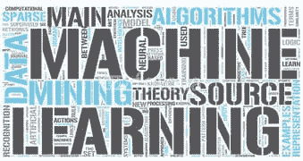
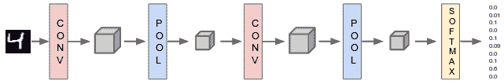
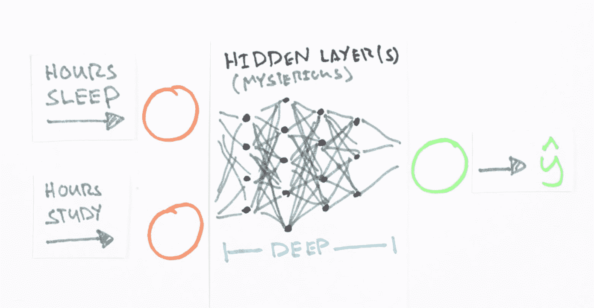

# 顶级 Javascript 机器学习库

> 原文：[`www.kdnuggets.com/2016/06/top-machine-learning-libraries-javascript.html`](https://www.kdnuggets.com/2016/06/top-machine-learning-libraries-javascript.html)

目前确实存在一个成熟的机器学习生态系统，或者更准确地说，是一小部分成熟的机器学习生态系统。对于研究而言，无可争议的机器学习生态系统冠军是围绕 Python 及其众多支持数据准备和后续机器学习过程的库展开的，无论是通过 scikit-learn、众多可用的深度学习库，还是自制的、针对特定目标的高度专业化工具。这还没有提到那些在生态系统边缘逐渐成长起来的优秀支持工具，其中一些变得足够完善和有用，以便开辟 自己的最终利基市场。

正如行业人士首先会告诉我的那样，Python 并不是唯一的选择。还有基于 Java 的工具（Deeplearning4j，Weka）、与 Apache Spark 和/或 Hadoop 集成的工具（MLlib，Mahout）、C++ 解决方案（TensorFlow 是用 C++ 编写的，Python 生态系统中的许多其他工具也是如此），甚至还有针对 Clojure、F#、Rust 及其他各种语言、环境和生态系统的工具。

然而，谈到对机器学习友好的编程语言时，Javascript 通常不会被提及。鉴于其强大的 [市场份额](http://www.tiobe.com/tiobe_index) 和 [Atwood 法则](https://blog.codinghorror.com/the-principle-of-least-power/)，即任何可以用 JavaScript 编写的应用程序，最终都会用 JavaScript 编写，这似乎表明这里可能存在更多的因素。Atwood 法则可能不再像以前那样被视为不争的结论（至少在许多人看来是这样），但可以像争论它在机器学习方面的有效性一样容易地争论它在其他方面的有效性。

那么，为什么不使用 Javascript 呢？[这里有一些原因](https://www.quora.com/Why-doesnt-anyone-recommend-JavaScript-Node-js-as-a-language-for-machine-learning-or-data-analysis)。其中很多原因并不是特定于 Javascript，而是适用于任何非 Python（或非成熟生态系统）的语言。换句话说，*这就是现实情况*。其他原因涉及速度、代码的易读性和编写难度，以及环境的复杂性等技术问题。

但让我们明确一下：不讨论图灵机、理论计算机科学或统计过程，机器学习可以通过 Javascript 完成。选择？自己编码，或者看看以下内容，这些是 Javascript 中通用机器学习和神经网络库的小样本。有些库实际上也使用了[Node.js](https://nodejs.org/en/)，要明确一点；如果你不熟悉，请查阅一下。

选择 Javascript“顶级”库的过程更像是艺术而非科学；鉴于该语言选项相对较少，加上寻找使用良好、支持**和**维护（三者兼备）的项目的挑战，一些主观性是必要的，以得出一个值得关注的列表。

所以，这里是 Javascript 的“顶级”机器学习库。鉴于上述段落，编号不是非常重要，但编号确实使引用项目更容易……而且我喜欢编号。如果你觉得这个列表不能代表该领域的当前产品，欢迎随时[给我发推特 **@mattmayo13**](https://twitter.com/mattmayo13)提出建议；我很乐意进行更新或分享有效的意见。

**1\. [机器学习工具](https://github.com/mljs/ml)**

我们的第一个产品可能没有很多仓库星标，但它是一个通用的机器学习套件，包含大量工具，并且正在积极开发（几小时前更新，非常感谢）。直接来自开发者：

> 这个库是由 mljs 组织开发的工具的汇编。

[mljs](https://github.com/mljs)组织关注于：

> Node.js 和浏览器的机器学习和数值分析工具！

机器学习工具提供了一组包含共享工具和结构的根包；它继续支持各种机器学习功能，包括支持向量机、朴素贝叶斯、K 近邻、PCA、K 均值聚类、神经网络等。这将是那些可以在合适情况下作为通用经典机器学习工作马的套件之一，是 Javascript 对 Scikit-learn 的回答的一部分。

**2\. [机器学习](https://github.com/junku901/machine_learning)**

这个仓库已经有几年没有更新了，但在当时获得了不少星标。直接来自仓库的 README：

> 适用于 node.js 的机器学习库。你也可以在浏览器中使用这个库。

替代上述第 1 项的这个潜在选项是另一个通用套件，由 Joon-Ku Kang 编写。它包含了逻辑回归、多层感知机、支持向量机（SVM）、K 近邻算法、决策树等功能。它的 README 中包含了每种算法的示例代码，这意味着你应该能够立即尝试一些东西。你可以在[这里查看浏览器中的演示](http://joonku.com/project/machine_learning)。

**3\. [ConvNetJS](https://github.com/karpathy/convnetjs)**

许多人在想到 Javascript 和深度学习时，想到的是斯坦福大学的 Andrej Karpathy，[这是有原因的](https://github.com/karpathy)。ConvNetJS 起初是他的一个项目，自我描述为：

> JavaScript 中的深度学习。在浏览器中训练卷积神经网络（或普通的神经网络）。

它有[很好的文档](http://cs.stanford.edu/people/karpathy/convnetjs/docs.html)，以及[浏览器中的示例](http://cs.stanford.edu/people/karpathy/convnetjs/demo/mnist.html)。Karpathy 还写了一篇备受尊敬且广泛阅读的文章，标题为[黑客的神经网络指南](http://karpathy.github.io/neuralnets/)，可能对考虑使用这些库的人感兴趣。

Karpathy 在 Github 仓库中指出，由于时间不足，该项目不再维护，最近的更新大约是在 10 个月前。我已经有几个月没有使用 ConvNetJS，但上次尝试时运气不错。我推测有经验的 JavaScript 开发者如果有兴趣使用 JavaScript 进行深度学习，仍然能够利用这个代码库，不管它今天是否可以直接使用。

**4\. [Synaptic](https://github.com/cazala/synaptic)**

软件工程师[Juan Cazala](http://synaptic.juancazala.com/)负责 Synaptic，它自我描述为“一个不依赖架构的神经网络库，适用于 node.js 和浏览器。”因此，Synaptic 可以用于构建各种神经网络架构。

它的[文档](https://github.com/cazala/synaptic/wiki)非常好，并且 Github README 中的"入门"示例代码展示了少量代码或麻烦下实现几种网络类型。最近的一篇 KDnuggets 教程包括了一个关于使用 Synaptic 构建简单神经网络的详细概述。它也在积极开发中。

**5\. [Mind](https://github.com/stevenmiller888/mind)**

Mind 由软件工程师[Steven Miller](http://stevenmiller888.github.io/)编写。它自我描述为"[Javascript 中的灵活神经网络](http://www.mindjs.net/)"。

Steven 编写了一个关于使用 Mind 构建神经网络的两部分教程（[第一部分](http://stevenmiller888.github.io/mind-how-to-build-a-neural-network), [第二部分](http://stevenmiller888.github.io/mind-how-to-build-a-neural-network-part-2)），提供了比仅仅使用 Mind 更为详细的信息。

Mind 似乎正在积极开发，因为其最近的更新仅仅是 4 个月前，并且它获得了相当多的星标。总体来看，它似乎是一个为 Javascript 机器学习社区提供的成熟产品。

**相关**：

+   5 个你不再能忽视的机器学习项目

+   Github 上的前 10 个数据可视化项目

+   在 Javascript 中实现神经网络

* * *

## 我们的前三个课程推荐

 1\. [Google 网络安全证书](https://www.kdnuggets.com/google-cybersecurity) - 快速进入网络安全职业。

 2\. [Google 数据分析专业证书](https://www.kdnuggets.com/google-data-analytics) - 提升您的数据分析能力

 3\. [Google IT 支持专业证书](https://www.kdnuggets.com/google-itsupport) - 支持您的组织进行 IT 工作

* * *

### 更多相关话题

+   [数据科学、数据可视化及…的前 38 个 Python 库](https://www.kdnuggets.com/2020/11/top-python-libraries-data-science-data-visualization-machine-learning.html)

+   [7 个最佳机器学习库解析](https://www.kdnuggets.com/2023/01/7-best-libraries-machine-learning-explained.html)

+   [超参数优化：10 个顶级 Python 库](https://www.kdnuggets.com/2023/01/hyperparameter-optimization-10-top-python-libraries.html)

+   [顶级自然语言处理库指南](https://www.kdnuggets.com/2023/04/guide-top-natural-language-processing-libraries.html)

+   [深度学习库介绍：PyTorch 和 Lightning AI](https://www.kdnuggets.com/introduction-to-deep-learning-libraries-pytorch-and-lightning-ai)

+   [2022 年数据科学家应该了解的 Python 库](https://www.kdnuggets.com/2022/04/python-libraries-data-scientists-know-2022.html)
