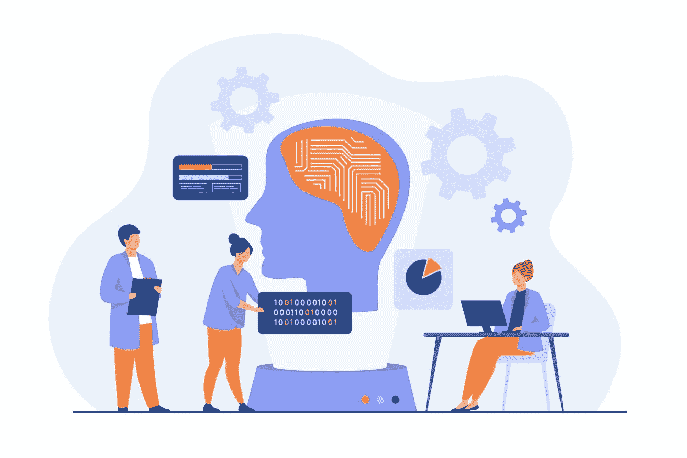

# 2023 年值得阅读的顶级机器学习论文

> 原文：[`www.kdnuggets.com/2023/03/top-machine-learning-papers-read-2023.html`](https://www.kdnuggets.com/2023/03/top-machine-learning-papers-read-2023.html)

图片由[pch.vector](https://www.freepik.com/free-vector/scientists-studying-neural-connections-programmers-writing-codes-machine-brain_12291267.htm#query=machine%20learning&position=0&from_view=search&track=ais)提供，来源于[Freepik](https://www.freepik.com/)

机器学习是一个领域广泛的领域，新的研究不断涌现。这是一个热门领域，学术界和工业界不断尝试新事物，以改善我们的日常生活。

* * *

## 我们的三大课程推荐

 1\. [Google 网络安全证书](https://www.kdnuggets.com/google-cybersecurity) - 快速进入网络安全职业生涯。

 2\. [Google 数据分析专业证书](https://www.kdnuggets.com/google-data-analytics) - 提升你的数据分析技能

 3\. [Google IT 支持专业证书](https://www.kdnuggets.com/google-itsupport) - 支持你的组织的 IT 需求

* * *

近年来，生成式人工智能因机器学习的应用而改变了世界。例如，ChatGPT 和 Stable Diffusion。即便 2023 年生成式人工智能占主导地位，我们仍应关注更多的机器学习突破。

这里是 2023 年值得阅读的顶级机器学习论文，以确保你不会错过即将出现的趋势。

## 1) 学习歌曲中的美：神经唱歌声音美化器

唱歌声音美化（SVB）是生成式人工智能中的一项新任务，旨在将业余歌唱声音改善为优美的声音。这正是[Liu et al. (2022)](https://arxiv.org/pdf/2202.13277v2.pdf)研究的目标，他们提出了一种名为神经唱歌声音美化器（NSVB）的新生成模型。

NSVB 是一种使用潜在映射算法的半监督学习模型，作为音高修正器并改善声音音质。这项工作有望改善音乐行业，值得关注。

## 2) 优化算法的符号发现

深度神经网络模型变得比以往任何时候都大，许多研究已经进行了以简化训练过程。谷歌团队的最新研究（[Chen et al. (2023)](https://arxiv.org/pdf/2302.06675v2.pdf)）提出了一种名为 Lion（EvoLved Sign Momentum）的神经网络优化方法。该方法表明，该算法比 Adam 更节省内存，并且需要更小的学习率。这是一项非常出色的研究，展现了许多不容错过的潜力。

## 3) TimesNet：用于通用时间序列分析的时间 2D 变异建模

时间序列分析在许多业务中是一个常见的应用场景；例如，价格预测、异常检测等。然而，仅基于当前数据（1D 数据）分析时间数据面临许多挑战。这就是为什么[Wu 等 (2023)](https://arxiv.org/pdf/2210.02186v2.pdf)提出了一种新方法，称为 TimesNet，将 1D 数据转化为 2D 数据，在实验中表现出色。你应该阅读这篇论文，以更好地理解这种新方法，它将对未来的时间序列分析大有帮助。

## 4) OPT：开放预训练变压器语言模型

目前，我们正处于生成 AI 时代，许多大型语言模型被公司密集开发。通常，这类研究不会发布其模型或仅以商业形式提供。然而，Meta AI 研究小组（[Zhang 等 (2022)](https://arxiv.org/pdf/2205.01068v4.pdf)）尝试做出相反的做法，公开发布了可与 GPT-3 相媲美的开放预训练变压器（OPT）模型。本文是理解 OPT 模型及其研究细节的绝佳起点，因为该小组在论文中记录了所有细节。

## 5) REaLTabFormer：使用变压器生成逼真的关系型和表格数据

生成模型不仅限于生成文本或图片，还可以生成表格数据。这些生成的数据通常称为合成数据。虽然已经开发了许多模型来生成合成表格数据，但几乎没有模型能生成关系型合成表格数据。这正是[Solatorio 和 Dupriez (2023)](https://arxiv.org/pdf/2302.02041v1.pdf)研究的目标；即创建一个名为 REaLTabFormer 的模型用于合成关系型数据。实验表明，结果与现有的合成模型非常接近，可以扩展到许多应用中。

## 6) 强化学习（不）适用于自然语言处理？：自然语言政策优化的基准、基线和构建块

强化学习从概念上讲是自然语言处理任务的一个优秀选择，但事实真的如此吗？这是[Ramamurthy 等 (2022)](https://arxiv.org/pdf/2210.01241v2.pdf)尝试回答的问题。研究人员介绍了各种库和算法，展示了强化学习技术在 NLP 任务中相对于监督方法的优势。如果你想为你的技能集寻找替代方案，这篇论文是值得阅读的。

## 7) Tune-A-Video：一次性调整图像扩散模型用于文本到视频生成

2022 年文本到图像生成非常流行，而 2023 年则预计会关注文本到视频 (T2V) 能力。研究 [Wu et al. (2022)](https://arxiv.org/pdf/2212.11565v1.pdf) 展示了 T2V 如何在许多方法上扩展。该研究提出了一种新的 Tune-a-Video 方法，支持 T2V 任务，如主体和对象变化、风格迁移、属性编辑等。如果你对文本到视频的研究感兴趣，这是一篇值得阅读的好论文。

## 8) PyGlove: 高效交换机器学习想法的代码

高效的协作是任何团队成功的关键，尤其是在机器学习领域复杂性日益增加的情况下。为了培养效率，[Peng et al. (2023)](https://arxiv.org/pdf/2302.01918v1.pdf) 提出了一个 PyGlove 库，以便轻松分享机器学习想法。PyGlove 的概念是通过一系列补丁规则来捕捉机器学习研究的过程。这些规则可以在任何实验场景中重复使用，从而提高团队的效率。这项研究尝试解决许多尚未解决的机器学习问题，因此值得阅读。

## 8) ChatGPT 与人类专家的接近程度？比较语料库、评估和检测

ChatGPT 已经改变了世界。可以肯定地说，随着公众越来越倾向于使用 ChatGPT，趋势将从这里开始上升。然而，ChatGPT 当前的结果与人类专家相比如何？正是这个问题 [Guo et al. (2023)](https://arxiv.org/pdf/2301.07597v1.pdf) 试图回答。该团队尝试收集专家和 ChatGPT 提示结果的数据，并进行了比较。结果显示 ChatGPT 和专家之间存在隐含差异。这项研究是我认为未来会不断被提问的问题，因为生成式 AI 模型会随着时间的推移不断发展，因此值得阅读。

# 结论

2023 年是机器学习研究的伟大一年，这从当前的趋势中可以看出，特别是生成式 AI，如 ChatGPT 和 Stable Diffusion。我感到有许多有前途的研究不应错过，因为它们显示出可能改变当前标准的有希望的结果。在这篇文章中，我向你展示了 9 篇值得阅读的顶级机器学习论文，涵盖了生成模型、时间序列模型到工作流效率等方面。希望对你有所帮助。

**[Cornellius Yudha Wijaya](https://www.linkedin.com/in/cornellius-yudha-wijaya/)** 是一名数据科学助理经理和数据撰稿人。在全职工作于印尼安联保险期间，他喜欢通过社交媒体和写作媒体分享 Python 和数据技巧。

### 更多相关主题

+   [KDnuggets 新闻，4 月 27 日：关于 Papers With Code 的简要介绍；…](https://www.kdnuggets.com/2022/n17.html)

+   [2024 年必读的 5 篇机器学习论文](https://www.kdnuggets.com/5-machine-learning-papers-to-read-in-2024)

+   [过去 12 个月必读的 NLP 论文](https://www.kdnuggets.com/2023/03/must-read-nlp-papers-last-12-months.html)

+   [你应该阅读的生成式代理研究论文](https://www.kdnuggets.com/generative-agent-research-papers-you-should-read)

+   [2023 年你必须阅读的 5 本免费数据科学书籍](https://www.kdnuggets.com/2023/01/5-free-data-science-books-must-read-2023.html)

+   [2023 年可读的 5 本免费自然语言处理书籍](https://www.kdnuggets.com/2023/06/5-free-books-natural-language-processing-read-2023.html)
