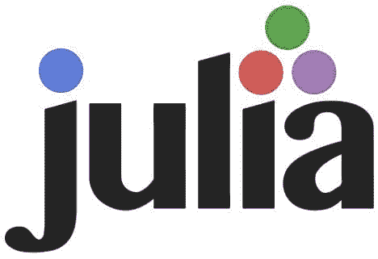
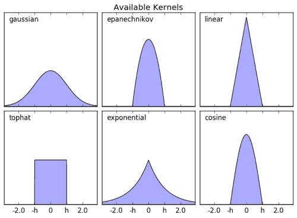
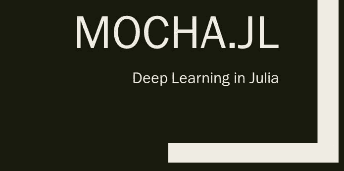

# Julia 的顶级机器学习项目

> 原文：[`www.kdnuggets.com/2016/08/top-machine-learning-projects-julia.html`](https://www.kdnuggets.com/2016/08/top-machine-learning-projects-julia.html)

如果你不知道，[Julia](http://julialang.org/) 是“一个高水平、高性能的动态编程语言，用于技术计算，其语法对其他技术计算环境的用户来说很熟悉。”

* * *

## 我们的前三个课程推荐

 1\. [Google 网络安全证书](https://www.kdnuggets.com/google-cybersecurity) - 快速进入网络安全职业生涯。

 2\. [Google 数据分析专业证书](https://www.kdnuggets.com/google-data-analytics) - 提升您的数据分析技能

 3\. [Google IT 支持专业证书](https://www.kdnuggets.com/google-itsupport) - 支持您的组织在 IT 领域

* * *

Julia 快速，并且得到了 [Jupyter notebook 环境](https://github.com/JuliaLang/IJulia.jl) 的支持和集成。Julia 可以直接调用 C 而无需包装器，将顶级开源 C 和 Fortran 代码集成到其基础库中，并且可以轻松调用 Python。Julia 为并行和云计算而生，受到了分析和科学计算社区的特别关注。根据 KDnuggets 最近的 分析软件调查，Julia 在最常用编程语言的列表中排名第 8。虽然这并未完全击败竞争对手，但 JavaScript 连榜单都没有进入，而 [最近的一项](https://www.kdnuggets.com/2016/06/top-machine-learning-libraries-javascript.html)关于该语言的顶级机器学习项目却非常受欢迎。

我最初来自计算机科学的背景，之后转向机器学习专门化，因此我选择的工具一直是 Python。当我逼迫自己学习另一种语言时，Julia 成为了我的重点，于是我们来到了这里。

以下是 Julia 的机器学习项目合集。这些项目并不全是机器学习库；其中一个项目是实现机器学习算法的支持功能集合。不幸的是，这些项目的选择并不客观；我发现试图量化和排名不同的项目往往没有什么有趣的结果，并且会削弱这种列表的整体使用价值。因此，所选的项目是我自己决定用于学习 Julia 的冒险中的项目。

一如既往，项目按顺序编号以便于查阅和娱乐。我主观挑选的前五大机器学习项目如下（如有不满，请随意[推特联系我](https://twitter.com/mattmayo13)）：

**1\. [MLBase.jl](https://github.com/JuliaStats/MLBase.jl)**

这似乎是一个不错的起点。MLBase 自称是“机器学习的瑞士军刀”。MLBase 并不实现任何机器学习算法；它是一个支持工具的集合，例如用于预处理、基于评分的分类、性能评估指标、模型调优等。

MLBase 的文档很好，并附有多个工具的代码示例。

**2\. [ScikitLearn.jl](https://github.com/cstjean/ScikitLearn.jl)**

对于我们这些来自 Python 的人来说，这可能是一个潜在的救星。

来自其仓库：

> ScikitLearn.jl 实现了流行的 scikit-learn 接口和算法在 Julia 中。它支持 Julia 生态系统中的模型以及 scikit-learn 库中的模型（通过 PyCall.jl）。

ScikitLearn.jl 迅速指出它不是 scikit-learn 的官方移植；然而，它实现了令人放心的接口，并结合了 Python 和 Julia 模型，这使得它成为一个有吸引力的库。

该项目有一个很好的[快速入门指南](http://scikitlearnjl.readthedocs.io/en/latest/quickstart/)以及多个[精彩示例](https://github.com/cstjean/ScikitLearn.jl/blob/master/docs/examples.md)，以 Jupyter 笔记本形式提供。

**3\. [MachineLearning.jl](https://github.com/benhamner/MachineLearning.jl)**

现在，Julia 本身的机器学习算法。MachineLearning.jl 已经一年没有更新了；然而，考虑到它旨在成为一个通用的 Julia 机器学习库，包含多个算法和支持工具，对于那些在语言中探索机器学习的人来说，它是一个不错的中转站。

项目目标，来自其仓库：

> 最初，该包将针对在单台机器上内存中适合的数据集的机器学习实践者。长期而言，我希望它不仅能针对更大的数据集，还能对最先进的机器学习研究有价值。

该库目前包含以下算法：决策树分类器、随机森林分类器、基本神经网络和贝叶斯加性回归树。它还包括将数据集拆分为训练集和测试集的功能，以及执行交叉验证。

MachineLearning.jl 的未来可能不明确，但该项目提供了一些基本功能用于实验，并且为在 Julia 中学习机器学习提供了一个环境。

**4\. [Mocha.jl](https://github.com/pluskid/Mocha.jl)**

Mocha 确实满足了你对现代深度学习库的诸多期望。来自其仓库的信息：

> Mocha 是一个为 Julia 设计的深度学习框架，灵感来源于 C++ 框架 Caffe。Mocha 中对一般随机梯度求解器和常见层的高效实现可以用于训练深度/浅层（卷积）神经网络，支持（可选的）通过（堆叠）自编码器进行无监督预训练。

[Mocha 的文档](http://mochajl.readthedocs.io/en/latest/)包含了一系列教程和详尽的用户指南；Mocha 绝对不是一个文档不足的深度学习项目。

**5\. [TextAnalysis.jl](https://github.com/johnmyleswhite/TextAnalysis.jl)**

TextAnalysis.jl 是一个积极开发的 Julia 文本分析库。它提供了文档预处理、语料库创建、文档词矩阵、TF-IDF、潜在语义分析、潜在狄利克雷分配等功能。如果你对使用 Julia 进行文本分析感兴趣，它似乎是一个不错的起点。

如果你对学习 Julia 感兴趣，[这是一个很好的起点](http://samuelcolvin.github.io/JuliaByExample/)。

如果你想找到更多针对 Julia 的特定算法机器学习项目，[请点击这里](https://github.com/josephmisiti/awesome-machine-learning#julia)。

**相关内容：**

+   JavaScript 的顶级机器学习库

+   你不能再忽视的 5 个机器学习项目

+   你不能再忽视的 5 个机器学习项目

### 更多相关内容

+   [我应该学习 Julia 吗？](https://www.kdnuggets.com/2022/11/learn-julia.html)

+   [如何在 Jupyter Notebook 上设置 Julia](https://www.kdnuggets.com/2022/11/setup-julia-jupyter-notebook.html)

+   [3 个用于数据可视化的 Julia 包](https://www.kdnuggets.com/2023/02/3-julia-packages-data-visualization.html)

+   [用 Julia 学习数据分析](https://www.kdnuggets.com/learn-data-analysis-with-julia)

+   [5 本免费的 Julia 数据科学书籍](https://www.kdnuggets.com/2023/06/5-free-julia-books-data-science.html)

+   [2024 年成为数据科学家的 Kaggle 机器学习项目前 10 名](https://www.kdnuggets.com/top-10-kaggle-machine-learning-projects-to-become-data-scientist-in-2024)
