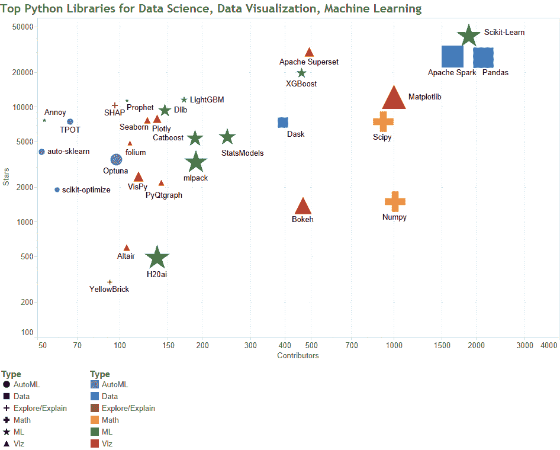

# 顶级 38 个 Python 数据科学、数据可视化和机器学习库

> 原文：[`www.kdnuggets.com/2020/11/top-python-libraries-data-science-data-visualization-machine-learning.html`](https://www.kdnuggets.com/2020/11/top-python-libraries-data-science-data-visualization-machine-learning.html)

自上次我们进行 Python 库汇总以来已经有一段时间了，因此我们借此机会在十一月开始时提供了这样一个新的列表。

# 我们如何构建这份包含 38 个 Python 数据科学库的列表

* * *

## 我们的前三大课程推荐

 1\. [Google 网络安全证书](https://www.kdnuggets.com/google-cybersecurity) - 快速进入网络安全职业轨道。

 2\. [Google 数据分析专业证书](https://www.kdnuggets.com/google-data-analytics) - 提升你的数据分析能力

 3\. [Google IT 支持专业证书](https://www.kdnuggets.com/google-itsupport) - 支持你的组织 IT 工作

* * *

上次我们在 KDnuggets 做这个时，编辑和作者 Dan Clark 将广泛的 Python 数据科学相关库分成了几个较小的集合，包括数据科学库、机器学习库和深度学习库。虽然将库分成类别本质上是任意的，但在之前的发布时这是合理的。

不过这次，我们将收集到的开源 Python 数据科学库分成了两部分。这篇文章（本篇）涵盖了“数据科学、数据可视化和机器学习”，可以看作是涵盖常见任务的“传统”数据科学工具。第二篇文章，将于下周发布，将覆盖用于构建神经网络的库，以及用于执行自然语言处理和计算机视觉任务的库。

再次强调，这种分离和分类是任意的，有些情况比其他情况更是如此，但我们已尽力将工具按预期用途进行分组，希望这对读者最有帮助。

### **我们将 Python 数据科学库组织为 6 个类别：**

本文所包含的类别，我们认为涵盖了常见的数据科学库——那些可能被数据科学领域的从业者用于通用的、非神经网络、非研究工作的库——包括：

+   **数据** - 用于数据管理、操作和其他处理的库

+   **数学** - 尽管许多库执行数学任务，但这一小集合专门用于此

+   **机器学习** - 不言而喻；不包括主要用于构建神经网络或自动化机器学习过程的库

+   **自动化机器学习** - 主要用于自动化机器学习相关过程的库

+   **数据可视化** - 主要用于数据可视化功能的库，而非建模、预处理等。

+   **解释与探索** - 主要用于探索和解释模型或数据的库

我们的列表由团队一致决定的、代表常用和广泛使用的 Python 数据科学库组成。此外，库必须有一个 Github 仓库才能被纳入。类别没有特定顺序，每个库也没有特定顺序。我们曾考虑按星标或其他指标构建排序，但决定不这样做，以免对库的价值或重要性进行显著的偏颇。它们在此的排列因此完全是随机的。库的描述直接来自 Github 仓库，以某种形式或另一种形式呈现。

感谢 Ahmed Anis 对数据收集的贡献，以及 KDnuggets 其他员工的意见、见解和建议。

请注意，下面的可视化由 Gregory Piatetsky 展示了每个库的类型，通过星标和贡献者进行绘制，其符号大小反映了库在 Github 上的相对提交次数。

图 1：顶级 Python 数据科学、数据可视化和机器学习库

根据星标数量和贡献者数量进行绘制；相对大小按贡献者数量确定

那么，不再废话，以下是 KDnuggets 员工确定的 38 个顶级 Python 数据科学、数据可视化和机器学习库。

# 最佳 Python 库：数据

**1\. [Apache Spark](https://github.com/apache/spark)**

星标：27600，提交次数：28197，贡献者：1638

> Apache Spark - 一个统一的大规模数据处理分析引擎

**2\. [Pandas](https://github.com/pandas-dev/pandas)**

星标：26800，提交次数：24300，贡献者：2126

> Pandas 是一个 Python 包，提供快速、灵活和表达力强的数据结构，旨在使处理“关系型”或“标签化”数据变得既简单又直观。它的目标是成为在 Python 中进行实际、现实世界数据分析的基础高层构建块。

**3\. [Dask](https://github.com/dask/dask)**

星标：7300，提交次数：6149，贡献者：393

> 任务调度的并行计算

# 最佳 Python 库：数学

**4\. [Scipy](https://github.com/scipy/scipy)**

星标：7500，提交次数：24247，贡献者：914

> SciPy（发音为“塞派”）是用于数学、科学和工程的开源软件。它包括统计、优化、积分、线性代数、傅里叶变换、信号和图像处理、常微分方程求解器等模块。

**5\. [Numpy](https://github.com/numpy/numpy)**

Stars: 1500, Commits: 24266, Contributors: 1010

> Python 科学计算的基础包。

# 适用于：机器学习的最佳 Python 库

**6\. [Scikit-Learn](https://github.com/scikit-learn/scikit-learn)**

Stars: 42500, Commits: 26162, Contributors: 1881

> Scikit-learn 是一个基于 SciPy 的 Python 机器学习模块，采用 3-Clause BSD 许可协议分发。

**7\. [XGBoost](https://github.com/dmlc/xgboost)**

Stars: 19900, Commits: 5015, Contributors: 461

> 可扩展、可移植和分布式的梯度提升 (GBDT, GBRT 或 GBM) 库，支持 Python、R、Java、Scala、C++ 等。可在单机、Hadoop、Spark、Flink 和 DataFlow 上运行

**8\. [LightGBM](https://github.com/microsoft/LightGBM)**

Stars: 11600, Commits: 2066, Contributors: 172

> 基于决策树算法的快速、分布式、高性能梯度提升 (GBT, GBDT, GBRT, GBM 或 MART) 框架，用于排序、分类以及许多其他机器学习任务。

**9\. [Catboost](https://github.com/catboost/catboost)**

Stars: 5400, Commits: 12936, Contributors: 188

> 一个快速、可扩展、高性能的决策树梯度提升库，用于排名、分类、回归和其他机器学习任务，支持 Python、R、Java、C++。支持 CPU 和 GPU 计算。

**10\. [Dlib](https://github.com/davisking/dlib)**

Stars: 9500, Commits: 7868, Contributors: 146

> Dlib 是一个现代 C++ 工具包，包含机器学习算法和用于创建复杂 C++ 软件的工具，解决实际问题。可以通过 dlib API 与 Python 配合使用

**11\. [Annoy](https://github.com/spotify/annoy)**

Stars: 7700, Commits: 778, Contributors: 53

> 用于内存使用和磁盘读写优化的 C++/Python 近似最近邻算法

**12\. [H20ai](https://github.com/h2oai/h2o-3)**

Stars: 500, Commits: 27894, Contributors: 137

> 开源的快速可扩展机器学习平台，用于更智能的应用：深度学习、梯度提升与 XGBoost、随机森林、广义线性建模（逻辑回归、弹性网）、K-Means、PCA、堆叠集成、自动机器学习 (AutoML) 等。

**13\. [StatsModels](https://github.com/statsmodels/statsmodels)**

Stars: 5600, Commits: 13446, Contributors: 247

> Statsmodels: Python 中的统计建模与计量经济学

**14\. [mlpack](https://github.com/mlpack/mlpack)**

Stars: 3400, Commits: 24575, Contributors: 190

> mlpack 是一个直观、快速且灵活的 C++ 机器学习库，具有其他语言的绑定

**15\. [Pattern](https://github.com/clips/pattern)**

Stars: 7600, Commits: 1434, Contributors: 20

> Python 的网络挖掘模块，包含抓取、自然语言处理、机器学习、网络分析和可视化工具。

**16\. [Prophet](https://github.com/facebook/prophet)**

Stars: 11500, Commits: 595, Contributors: 106

> 用于生成高质量的时间序列数据预测工具，支持线性或非线性增长和多重季节性。

# 最佳 Python 库：自动化机器学习

**17\. [TPOT](https://github.com/EpistasisLab/tpot)**

星标数：7500，提交次数：2282，贡献者数：66

> 一个 Python 自动化机器学习工具，通过遗传编程优化机器学习管道。

**18\. [auto-sklearn](https://github.com/automl/auto-sklearn)**

星标数：4100，提交次数：2343，贡献者数：52

> auto-sklearn 是一个自动化机器学习工具包，可替代 scikit-learn 的估计器。

**19\. [Hyperopt-sklearn](https://github.com/hyperopt/hyperopt-sklearn)**

星标数：1100，提交次数：188，贡献者数：18

> Hyperopt-sklearn 是一个基于 Hyperopt 的模型选择工具，用于在 scikit-learn 中选择机器学习算法。

**20\. [SMAC-3](https://github.com/automl/SMAC3)**

星标数：529，提交次数：1882，贡献者数：29

> 顺序模型基础的算法配置

**21\. [scikit-optimize](https://github.com/scikit-optimize/scikit-optimize)**

星标数：1900，提交次数：1540，贡献者数：59

> Scikit-Optimize，或 skopt，是一个简单高效的库，用于最小化（非常）昂贵和嘈杂的黑箱函数。它实现了几种顺序模型优化的方法。

**22\. [Nevergrad](https://github.com/facebookresearch/nevergrad)**

星标数：2700，提交次数：663，贡献者数：38

> 一个用于执行无梯度优化的 Python 工具箱

**23\. [Optuna](https://github.com/optuna/optuna)**

星标数：3500，提交次数：7749，贡献者数：97

> Optuna 是一个自动超参数优化软件框架，特别为机器学习设计。

# 最佳 Python 库：数据可视化

**24\. [Apache Superset](https://github.com/apache/incubator-superset)**

星标数：30300，提交次数：5833，贡献者数：492

> Apache Superset 是一个数据可视化和数据探索平台

**25\. [Matplotlib](https://github.com/matplotlib/matplotlib)**

星标数：12300，提交次数：36716，贡献者数：1002

> Matplotlib 是一个全面的库，用于在 Python 中创建静态、动画和交互式可视化。

**26\. [Plotly](https://github.com/plotly/plotly.py)**

星标数：7900，提交次数：4604，贡献者数：137

> Plotly.py 是一个交互式、开源的、基于浏览器的 Python 图形库

**27\. [Seaborn](https://github.com/mwaskom/seaborn)**

星标数：7700，提交次数：2702，贡献者数：126

> Seaborn 是一个基于 matplotlib 的 Python 可视化库。它提供了一个高级接口，用于绘制吸引人的统计图形。

**28\. [folium](https://github.com/python-visualization/folium)**

星标数：4900，提交次数：1443，贡献者数：109

> Folium 基于 Python 生态系统的数据处理优势和 Leaflet.js 库的地图绘制优势。你可以在 Python 中处理数据，然后通过 folium 在 Leaflet 地图中进行可视化。

**29\. [Bqplot](https://github.com/bqplot/bqplot)**

星标数：2900，提交次数：3178，贡献者数：45

> Bqplot 是一个基于图形语法构造的 Jupyter 2-D 可视化系统。

**30\. [VisPy](https://github.com/vispy/vispy)**

星数：2500，提交次数：6352，贡献者：117

> VisPy 是一个高性能的 2D/3D 数据可视化库。VisPy 通过 OpenGL 库利用现代图形处理单元（GPU）的计算能力来显示非常大的数据集。VisPy 的应用包括：

**31\. [PyQtgraph](https://github.com/pyqtgraph/pyqtgraph)**

星数：2200，提交次数：2200，贡献者：142

> 快速数据可视化和 GUI 工具，适用于科学/工程应用

**32\. [Bokeh](https://github.com/bokeh/bokeh)**

星数：1400，提交次数：18726，贡献者：467

> Bokeh 是一个用于现代网页浏览器的交互式可视化库。它提供了优雅、简洁的多功能图形构建，并对大规模或流式数据集提供高性能的交互性。

**33\. [Altair](https://github.com/altair-viz/altair)**

星数：600，提交次数：3031，贡献者：106

> Altair 是一个用于 Python 的声明性统计可视化库。使用 Altair，你可以花更多时间理解数据及其意义。

# 最佳 Python 库：解释与探索

**34\. [eli5](https://github.com/TeamHG-Memex/eli5)**

星数：2200，提交次数：1198，贡献者：15

> 一个用于调试/检查机器学习分类器并解释其预测的库

**35\. [LIME](https://github.com/marcotcr/lime)**

星数：800，提交次数：501，贡献者：41

> Lime：解释任何机器学习分类器的预测

**36\. [SHAP](https://github.com/slundberg/shap)**

星数：10400，提交次数：1376，贡献者：96

> 一种博弈论方法，用于解释任何机器学习模型的输出。

**37\. [YellowBrick](https://github.com/DistrictDataLabs/yellowbrick)**

星数：300，提交次数：825，贡献者：92

> 可视化分析和诊断工具，方便机器学习模型选择。

**38\. [pandas-profiling](https://github.com/pandas-profiling/pandas-profiling)**

星数：6200，提交次数：704，贡献者：47

> 从 pandas DataFrame 对象创建 HTML 个人报告

### 更多相关话题

+   [超参数优化：10 个顶级 Python 库](https://www.kdnuggets.com/2023/01/hyperparameter-optimization-10-top-python-libraries.html)

+   [7 个最佳机器学习库解析](https://www.kdnuggets.com/2023/01/7-best-libraries-machine-learning-explained.html)

+   [KDnuggets 新闻 22:n16，4 月 20 日：学习的顶级 YouTube 频道…](https://www.kdnuggets.com/2022/n16.html)

+   [2022 年数据科学家应了解的 Python 库](https://www.kdnuggets.com/2022/04/python-libraries-data-scientists-know-2022.html)

+   [数据清洗的 Python 库介绍](https://www.kdnuggets.com/2023/03/introduction-python-libraries-data-cleaning.html)

+   [Level 50 数据科学家：需了解的 Python 库](https://www.kdnuggets.com/level-50-data-scientist-python-libraries-to-know)
