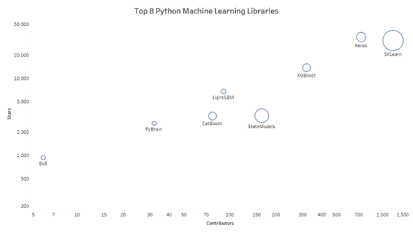

# 顶级 8 个 Python 机器学习库

> 原文：[`www.kdnuggets.com/2018/10/top-python-machine-learning-libraries.html`](https://www.kdnuggets.com/2018/10/top-python-machine-learning-libraries.html)

 评论

Python 在机器学习、AI、深度学习和数据科学任务中继续领先。根据 builtwith.com，45% 的科技公司更愿意使用 Python 实现 AI 和机器学习。

因此，我们决定启动一系列调查各类顶级 Python 库的活动：

* * *

## 我们的顶级 3 门课程推荐

 1\. [Google 网络安全证书](https://www.kdnuggets.com/google-cybersecurity) - 快速进入网络安全职业生涯。

 2\. [Google 数据分析专业证书](https://www.kdnuggets.com/google-data-analytics) - 提升你的数据分析技能

 3\. [Google IT 支持专业证书](https://www.kdnuggets.com/google-itsupport) - 支持你的组织 IT

* * *

**顶级 8 个 Python 机器学习库 ✅**

顶级 Python AI 库 – 敬请期待！

顶级 X 个 Python 深度学习库 -  敬请期待！

顶级 Python 数据科学库 – 敬请期待！

当然，这些列表完全是主观的，因为许多库可以轻松地放入多个类别。例如，Keras 被包括在这个列表中，但 TensorFlow 被省略，并且出现在深度学习库集合中。这是因为 Keras 更像是一个‘终端用户’库，如同 SKLearn，而 TensorFlow 更吸引研究人员和机器学习工程师。

一如既往，请随时在下面的评论区表达你的挫折/不同意见/烦恼！

*顶级 8 个 Python 机器学习库按 GitHub 贡献者、星标和提交数量排序（圆圈的大小）*

现在，让我们进入列表（GitHub 数据截至 2018 年 10 月 3 日）：

**1\. [scikit-learn](https://github.com/scikit-learn/scikit-learn) (贡献者 – 1175, 提交 – 23301, 星标 – 30867)**

“scikit-learn 是一个用于机器学习的 Python 模块，基于 NumPy、SciPy 和 matplotlib。它提供了简单而高效的数据挖掘和数据分析工具。SKLearn 对每个人都可用，并且可以在各种环境中重复使用。

**2\. [Keras](https://github.com/keras-team/keras) (贡献者 – 726, 提交 – 4818, 星标 – 34066)**

“Keras 是一个高级神经网络 API，用 Python 编写，能够运行在 [TensorFlow](https://github.com/tensorflow/tensorflow)、[CNTK](https://github.com/Microsoft/cntk) 或 [Theano](https://github.com/Theano/Theano) 之上。它的开发重点是实现快速实验。*能够在最短时间内从想法到结果是做好研究的关键。*”

**3\. [XGBoost](https://github.com/dmlc/xgboost) (贡献者 – 319, 提交记录 – 3454, 星标 – 13630)**

“XGBoost 是一个优化的分布式梯度提升库，旨在具有极高的***效率***、***灵活性***和***可移植性***。它在[梯度提升](https://en.wikipedia.org/wiki/Gradient_boosting)框架下实现机器学习算法。XGBoost 提供并行树提升（也称为 GBDT、GBM），以快速且准确的方式解决许多数据科学问题。相同的代码可在主要的分布式环境（Hadoop、SGE、MPI）上运行，并能解决超出数十亿个样本的问题。”

**4\. [StatsModels](https://github.com/statsmodels/statsmodels) (贡献者 – 162, 提交记录 – 10837, 星标 – 3275)**

“Statsmodels 是一个 Python 包，为统计计算提供对 scipy 的补充，包括描述性统计和统计模型的估计与推断。”

**5\. [LightGBM](https://github.com/Microsoft/LightGBM) (贡献者 – 91, 提交记录 – 1272, 星标 – 6736)**

“一个快速、分布式、高性能的梯度提升（GBDT、GBRT、GBM 或 MART）框架，基于决策树算法，用于排序、分类和许多其他机器学习任务。它隶属于微软的 DMTK([`github.com/microsoft/dmtk`](https://github.com/microsoft/dmtk)) 项目。”

**6\. [CatBoost](https://github.com/catboost/catboost) (贡献者 – 77, 提交记录 – 3304, 星标 – 3241)**

“CatBoost 是一种基于[梯度提升](https://en.wikipedia.org/wiki/Gradient_boosting)的机器学习方法，采用决策树。CatBoost 的一些主要优势包括：与其他 GBDT 库相比质量更高，推理速度最佳，支持数值特征和类别特征以及包含数据可视化工具。”

**7\. [PyBrain](https://github.com/pybrain/pybrain) (贡献者 – 32, 提交记录 – 992, 星标 – 2598)**

“PyBrain 是一个用于 Python 的模块化机器学习库。它的目标是提供灵活、易于使用但仍然强大的机器学习任务算法以及各种预定义的环境来测试和比较你的算法。”

**8\. [Eli5](https://github.com/TeamHG-Memex/eli5) (贡献者 – 6, 提交记录 – 929, 星标 – 932)**

“ELI5 是一个 Python 包，帮助调试机器学习分类器并解释其预测。它支持以下框架和包：scikit-learn、XGBoost、LightGBM、lightning 和 sklearn-crfsuite。”

留意接下来几周内发布的系列文章！

**相关内容：**

+   [使用 Mitchell 范式对学习算法的简明解释](https://www.kdnuggets.com/2018/10/mitchell-paradigm-concise-explanation-learning-algorithms.html)

+   [让 Python 在你的数据上更快](https://www.kdnuggets.com/2018/10/intel-unleash-faster-python-data.html)

+   [如何在 Python 中创建一个简单的神经网络](https://www.kdnuggets.com/2018/10/simple-neural-network-python.html)

### 更多主题内容

+   [每个数据科学家都应该知道的三个 R 语言库（即使你使用 Python）](https://www.kdnuggets.com/2021/12/three-r-libraries-every-data-scientist-know-even-python.html)

+   [学习数据科学统计的最佳资源](https://www.kdnuggets.com/2021/12/springboard-top-resources-learn-data-science-statistics.html)

+   [是什么使 Python 成为初创公司的理想编程语言](https://www.kdnuggets.com/2021/12/makes-python-ideal-programming-language-startups.html)

+   [停止学习数据科学以寻找目标，并以目标去…](https://www.kdnuggets.com/2021/12/stop-learning-data-science-find-purpose.html)

+   [一个 90 亿美元的 AI 失败案例分析](https://www.kdnuggets.com/2021/12/9b-ai-failure-examined.html)

+   [成功数据科学家的 5 个特征](https://www.kdnuggets.com/2021/12/5-characteristics-successful-data-scientist.html)
