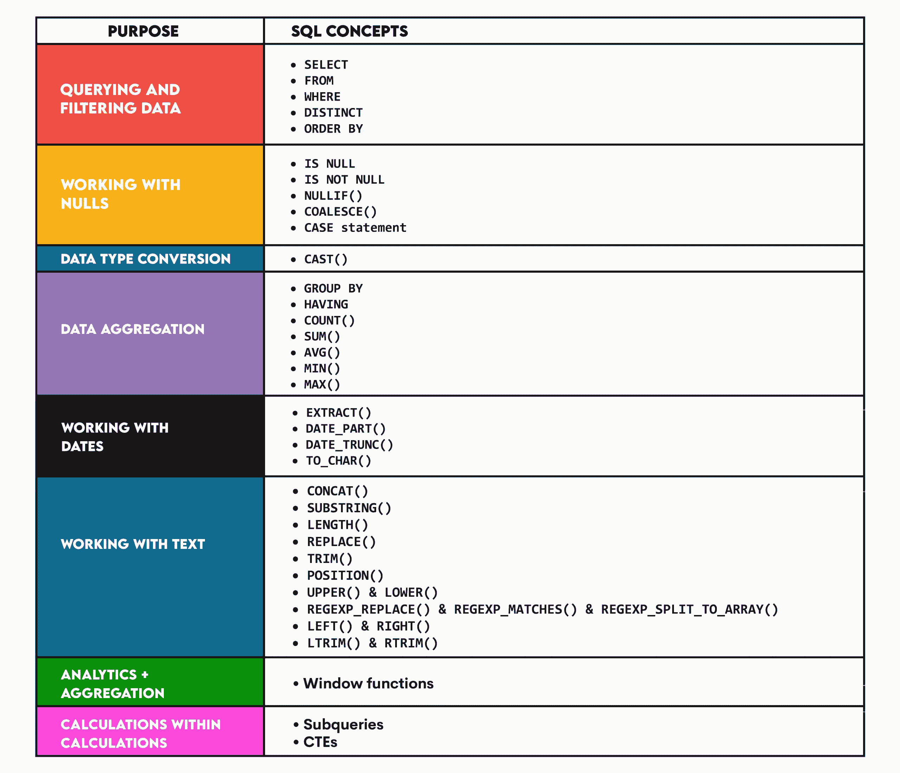

# 数据科学家使用的顶级 SQL 查询

> 原文：[`www.kdnuggets.com/top-sql-queries-for-data-scientists`](https://www.kdnuggets.com/top-sql-queries-for-data-scientists)


*作者提供的图片*

* * *

## 我们的前三个课程推荐

 1\. [谷歌网络安全证书](https://www.kdnuggets.com/google-cybersecurity) - 快速进入网络安全职业的快车道。

 2\. [谷歌数据分析专业证书](https://www.kdnuggets.com/google-data-analytics) - 提升你的数据分析技能

 3\. [谷歌 IT 支持专业证书](https://www.kdnuggets.com/google-itsupport) - 支持你的组织的 IT

* * *

我知道“Python”这个词在数据科学的背景下可能是被使用得最多的词。在某种程度上，这有其原因。然而，在这篇文章中，我想专注于 SQL，它在*谈论*数据科学时常被忽视。我强调谈论，因为在实际应用中，SQL 并没有被忽视。相反，它是数据科学中编程语言的圣三位一体之一：SQL、Python 和 R。

SQL 用于数据查询和操作，但也具有相当可观的数据分析和报告能力。我将展示一些你作为数据科学家需要了解的主要 SQL 概念以及来自 StrataScratch 和 LeetCode 的一些简单示例。

然后，我将提供两个常见的业务场景，其中所有或大部分 SQL 概念必须应用。

## **数据科学家主要 SQL 概念**

这是我将讨论的概念概述。



### **1\. 查询和过滤数据**

这是作为数据科学家的实际工作通常开始的地方：查询数据库并提取你任务所需的数据。

这通常涉及相对简单的 SELECT 语句，包含 FROM 和 WHERE 子句。要获取唯一值，使用 DISTINCT。如果需要使用多个表，还要添加 JOIN。

你通常需要使用 ORDER BY 来使数据集更加有序。

[**结合两个表的示例**](https://leetcode.com/problems/combine-two-tables/description/)**：** 你可能需要通过连接两个表并按姓氏排序来列出人员的姓名以及他们所在的城市和州。

```py
SELECT FirstName,
       LastName, 
       City, 
       State
FROM Person p LEFT JOIN Address a
ON p.PersonId = a.PersonId
ORDER BY LastName ASC; 
```

### **2\. 处理 NULL**

NULL 是数据科学家通常不会无动于衷的值——他们要么只要 NULL，要么想要删除它们，或者将它们替换为其他值。

你可以使用 IS NULL 或 IS NOT NULL 在 WHERE 子句中选择有或没有 NULL 的数据。

使用 [条件表达式](https://www.postgresql.org/docs/current/functions-conditional.html) 通常可以用其他值替换 NULL：

+   NULLIF()

+   COALESCE()

+   CASE 语句

[**IS NULL 示例**](https://leetcode.com/problems/find-customer-referee/description/)**:** 通过此查询，你可以找到所有没有被 ID = 2 的客户推荐的客户。

```py
SELECT name 
FROM customer 
WHERE referee_id IS NULL OR referee_id <> 2; 
```

[**COALESCE() 示例**](https://platform.stratascratch.com/coding/9620-find-searches-with-no-data-for-the-host_response_rate-column?code_type=1&utm_source=blog&utm_medium=click&utm_campaign=kdn+sql+queries+for+ds)：我可以通过这个示例重新编写，说我想查询所有数据，但也添加一列，显示 0% 作为主机响应率，而不是 NULL。

```py
SELECT *,
       COALESCE(host_response_rate, '0%') AS edited_host_response_rate
FROM airbnb_search_details; 
```

### **3\. 数据类型转换**

作为数据科学家，你会频繁地转换数据。数据通常不会以所需的格式出现，因此你必须将其调整为满足你的需求。这通常使用 CAST() 完成，但也有一些替代方法，具体取决于你的 SQL 版本。

[**数据类型转换示例**](https://platform.stratascratch.com/coding/10056-cast-stars-column-values-to-integer-and-return-with-all-other-column-values?code_type=1&utm_source=blog&utm_medium=click&utm_campaign=kdn+sql+queries+for+ds)**:** 该查询将星级数据从 VARCHAR 转换为 INTEGER，并移除具有非整数值的值。

```py
SELECT business_name,
       review_id,
       user_id,
       CAST(stars AS INTEGER) AS cast_stars,
       review_date,
       review_text,
       funny,
       useful,
       cool
FROM yelp_reviews
WHERE stars  '?'; 
```

### **4\. 数据聚合**

为了更好地理解他们正在处理的数据（或者仅仅因为他们需要生成一些报告），数据科学家经常需要对数据进行聚合。

在大多数情况下，你必须使用 [聚合函数](https://www.postgresql.org/docs/9.5/functions-aggregate.html) 和 GROUP BY。一些常见的聚合函数包括：

+   COUNT()

+   SUM()

+   AVG()

+   MIN()

+   MAX()

如果你想要过滤聚合数据，使用 HAVING 而不是 WHERE。

[**求和示例**](https://leetcode.com/problems/bank-account-summary-ii/description/)**:** 你可以使用此查询对每个用户的银行账户进行求和，并只显示余额超过 1,000 的用户。

```py
SELECT u.name, 
       SUM(t.amount) AS balance
FROM Users u
JOIN Transactions t
ON u.account = t.account
GROUP BY u.name
HAVING SUM(t.amount) > 10000; 
```

### **5\. 处理日期**

对于数据科学家来说，处理日期是很常见的。再说一遍，这些日期格式有时并不符合你的口味或需求。为了最大化日期的灵活性，你有时需要提取日期的部分或重新格式化它们。在 PostgreSQL 中，你最常用这些 [日期/时间函数](https://www.postgresql.org/docs/current/functions-datetime.html)：

+   EXTRACT()

+   DATE_PART()

+   DATE_TRUNC()

+   TO_CHAR()

处理日期的常见操作之一是找出日期之间的差异或添加日期。你可以通过简单地减去或添加这两个值，或者使用专门的函数来完成这项操作，具体取决于你使用的数据库。

[**提取年份示例**](https://platform.stratascratch.com/coding/9728-inspections-that-resulted-in-violations?code_type=1&utm_source=blog&utm_medium=click&utm_campaign=kdn+sql+queries+for+ds)**:** 以下查询从 DATETIME 类型的列中提取年份，以显示 Roxanne Cafe 每年的违规次数。

```py
SELECT EXTRACT(YEAR FROM inspection_date) AS year_of_violation,
       COUNT(*) AS n_violations
FROM sf_restaurant_health_violations
WHERE business_name = 'Roxanne Cafe' AND violation_id IS NOT NULL
GROUP BY year_of_violation
ORDER BY year_of_violation ASC; 
```

[**日期格式化示例**](https://platform.stratascratch.com/coding/2126-account-registrations?code_type=1&utm_source=blog&utm_medium=click&utm_campaign=kdn+sql+queries+for+ds)：通过以下查询，你可以使用 TO_CHAR() 将开始日期格式化为 'YYYY-MM'。

```py
SELECT TO_CHAR(started_at, 'YYYY-MM'),
       COUNT(*) AS n_registrations
FROM noom_signups
GROUP BY 1; 
```

### **6\. 处理文本**

除了日期和数字数据外，数据库中经常包含文本值。有时，这些值需要被清理、重新格式化、统一、拆分和合并。由于这些需求，每个数据库都有许多文本函数。在 [PostgreSQL](https://www.postgresql.org/docs/9.1/functions-string.html) 中，一些比较流行的函数有：

+   CONCAT() 或 ||

+   SUBSTRING()

+   LENGTH()

+   REPLACE()

+   TRIM()

+   POSITION()

+   UPPER() & LOWER()

+   REGEXP_REPLACE() & REGEXP_MATCHES() & REGEXP_SPLIT_TO_ARRAY()

+   LEFT() & RIGHT()

+   LTRIM() & RTRIM()

所有数据库中通常都有一些重叠的字符串函数，但每种数据库都有一些独特的函数。

[**文本长度示例**](https://leetcode.com/problems/invalid-tweets/description/)**:** 此查询使用 LENGTH() 函数根据长度查找无效的推文。

```py
SELECT tweet_id 
FROM Tweets 
WHERE LENGTH(content) > 15; 
```

### **7\. 排名数据**

排名数据是数据科学中常见的任务之一。例如，它可以用来查找最畅销或最滞销的产品、收入最高的季度、按流媒体次数排名的歌曲以及薪水最高和最低的员工。

排名是通过窗口函数完成的（我们将在下一部分详细讨论）：

+   ROW_NUMBER()

+   RANK()

+   DENSE_RANK()

[**排名示例**](https://platform.stratascratch.com/coding/10161-ranking-hosts-by-beds?code_type=1&utm_source=blog&utm_medium=click&utm_campaign=kdn+sql+queries+for+ds)：此查询使用 DENSE_RANK() 函数根据列出的床位数量对房东进行排名。

```py
SELECT host_id, 
       SUM(n_beds) AS number_of_beds,
       DENSE_RANK() OVER(ORDER BY SUM(n_beds) DESC) AS rank
FROM airbnb_apartments
GROUP BY host_id
ORDER BY number_of_beds DESC; 
```

### **8\. 窗口函数**

SQL 中的窗口函数允许你计算与当前行相关的行。这种特性不仅用于排名数据。根据窗口函数的类别，它们可以有许多不同的用途。你可以在[窗口函数](https://www.stratascratch.com/blog/the-ultimate-guide-to-sql-window-functions/?utm_source=blog&utm_medium=click&utm_campaign=kdn+sql+queries+for+ds)文章中阅读更多信息。然而，它们的主要特性是可以同时显示分析和聚合数据。换句话说，在执行计算时，它们不会合并单独的行。

[**FIRST_VALUE() 窗口函数示例**](https://leetcode.com/problems/the-latest-login-in-2020/description/)**:** 一个窗口函数示例是显示特定年份的最新用户登录。FIRST_VALUE() 窗口函数使这一任务变得更容易。

```py
SELECT DISTINCT user_id,
       FIRST_VALUE(time_stamp) OVER (PARTITION BY user_id ORDER BY time_stamp DESC) AS last_stamp
FROM Logins
WHERE EXTRACT(YEAR FROM time_stamp) = 2020; 
```

### **9\. 子查询与 CTE**

子查询和 CTE（称为更整洁的子查询）允许你达到更高级的计算水平。通过了解子查询和 CTE，你可以编写[复杂的 SQL 查询](https://www.stratascratch.com/blog/how-to-simplify-complex-sql-queries-with-examples/?utm_source=blog&utm_medium=click&utm_campaign=kdn+sql+queries+for+ds)，在主查询中引用子查询或 CTE 用于子计算。

[**子查询和 CTE 示例**](https://leetcode.com/problems/product-sales-analysis-iii/description/)**：** 以下查询使用子查询找到产品销售的第一年。这些数据然后在主查询的 WHERE 子句中用于过滤数据。

```py
SELECT product_id, 
       year AS first_year, 
       quantity, 
       price 
FROM Sales 
WHERE (product_id, year) IN (
    SELECT product_id, 
           MIN(year) AS year 
    FROM Sales 
    GROUP BY product_id
); 
```

代码可以使用 CTE 代替子查询来编写。

```py
WITH first_year_sales AS (
    SELECT product_id, 
           MIN(year) AS first_year 
    FROM Sales 
    GROUP BY product_id
)

SELECT s.product_id, 
       s.year AS first_year, 
       s.quantity, 
       s.price 
FROM Sales s
JOIN first_year_sales AS fys 
ON s.product_id = fys.product_id AND s.year = fys.first_year; 
```

## **使用 SQL 的业务示例**

现在让我们来看几个业务案例，数据科学家可以使用 SQL 并应用我们之前讨论的所有（或大部分）概念。

### **寻找最佳销售产品**

[在这个示例中](https://platform.stratascratch.com/coding/10172-best-selling-item?code_type=1&utm_source=blog&utm_medium=click&utm_campaign=kdn+sql+queries+for+ds)，你必须了解子查询、数据汇总、处理日期、使用窗口函数排名数据以及过滤输出。

子查询计算每个产品每个月的销售额，并按销售额排序。主查询则简单地选择所需的列，仅保留排名第一的产品，即畅销产品。

```py
SELECT sale_month,
       description,
       total_paid
FROM
  (SELECT DATE_PART('MONTH', invoicedate) AS sale_month,
          description,
          SUM(unitprice * quantity) AS total_paid,
          RANK() OVER (PARTITION BY DATE_PART('MONTH', invoicedate) ORDER BY SUM(unitprice * quantity) DESC) AS sale_rank
   FROM online_retail
   GROUP BY sale_month,
            description) AS ranking_sales
WHERE sale_rank = 1; 
```

### **计算移动平均**

滚动或移动平均是一个常见的业务计算，数据科学家可以应用他们广泛的 SQL 知识，如[这个示例](https://platform.stratascratch.com/coding/10314-revenue-over-time?code_type=1&utm_source=blog&utm_medium=click&utm_campaign=kdn+sql+queries+for+ds)所示。

以下代码中的子查询按月份计算收入。主查询然后使用 AVG() 窗口函数计算 3 个月的滚动平均收入。

```py
SELECT t.month,
       AVG(t.monthly_revenue) OVER(ORDER BY t.month ROWS BETWEEN 2 PRECEDING AND CURRENT ROW) AS avg_revenue
FROM
  (SELECT TO_CHAR(created_at::DATE, 'YYYY-MM') AS month,
          SUM(purchase_amt) AS monthly_revenue
   FROM amazon_purchases
   WHERE purchase_amt>0
   GROUP BY 1
   ORDER BY 1) AS t
ORDER BY t.month ASC; 
```

## **结论**

所有这些 SQL 查询展示了如何在数据科学任务中使用 SQL。虽然 SQL 不适用于复杂的统计分析或机器学习，但它非常适合查询、操控、汇总数据和进行计算。

这些示例查询应该能帮助你在工作中。如果你没有数据科学工作，其中许多查询将在你的[SQL 面试问题](https://www.stratascratch.com/blog/sql-interview-questions-you-must-prepare-the-ultimate-guide/?utm_source=blog&utm_medium=click&utm_campaign=kdn+sql+queries+for+ds)中出现。

[](https://twitter.com/StrataScratch)****[内特·罗西迪](https://twitter.com/StrataScratch)**** 是一位数据科学家及产品策略专家。他还是一名兼职教授，教授分析学，是 StrataScratch 的创始人，该平台帮助数据科学家通过来自顶级公司的真实面试问题来准备面试。内特撰写了有关职业市场的最新趋势，提供面试建议，分享数据科学项目，并涵盖所有 SQL 相关内容。

### 更多相关内容

+   [KDnuggets 新闻，12 月 7 日：揭示数据科学中的 10 大神话 • 4…](https://www.kdnuggets.com/2022/n47.html)

+   [4 个实用的中级 SQL 查询用于数据科学](https://www.kdnuggets.com/2022/12/4-useful-intermediate-sql-queries-data-science.html)

+   [如何优化 SQL 查询以实现更快的数据检索](https://www.kdnuggets.com/2023/06/optimize-sql-queries-faster-data-retrieval.html)

+   [解决 5 个棘手的 SQL 查询](https://www.kdnuggets.com/2020/11/5-tricky-sql-queries-solved.html)

+   [解决 5 个复杂的 SQL 问题：棘手查询解析](https://www.kdnuggets.com/2022/07/5-hardest-things-sql.html)

+   [如何使用索引加速 SQL 查询 [Python 版]](https://www.kdnuggets.com/2023/08/speed-sql-queries-indexes-python-edition.html)
