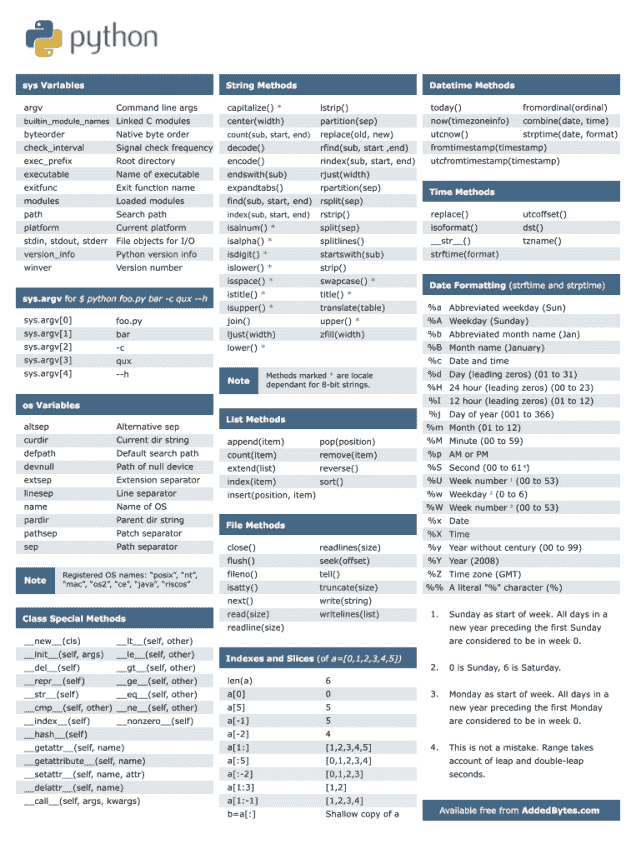
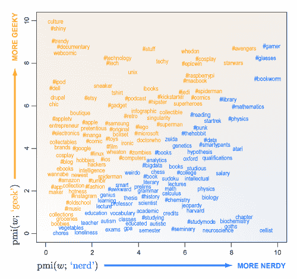

# KDnuggets 顶级推文，11 月 17-18 日：在学习#Python 时随手备份此秘籍；#BigData 是否是最被炒作的技术？

> 原文：[`www.kdnuggets.com/2014/11/top-tweets-nov17-18.html`](https://www.kdnuggets.com/2014/11/top-tweets-nov17-18.html)

11 月 17-18 日最受欢迎的 [**@KDnuggets**](https://twitter.com/KDnuggets) 推文有

**转发最多：**

> [#BigData](https://twitter.com/hashtag/BigData?src=hash) 是有史以来最被炒作的技术吗？不是（至少目前还不是） [`t.co/lzZIFs4FNs`](http://t.co/lzZIFs4FNs) [pic.twitter.com/RaiurvM7h5](http://t.co/RaiurvM7h5)&mdash; Gregory Piatetsky (@kdnuggets) [2014 年 11 月 17 日](https://twitter.com/kdnuggets/status/534379719064821761)

**最受喜爱：**

在学习编程时随时备份此#Python 秘籍 [t.co/IIGLXJjzjq](http://t.co/IIGLXJjzjq) [t.co/lEPdSvuX8A](http://t.co/lEPdSvuX8A) 

**最受关注：**

#BigData 是否是最被炒作的技术？不是（至少目前还不是） [t.co/lzZIFs4FNs](http://t.co/lzZIFs4FNs) http://t.co/RaiurvM7h5

**点击最多：**

在学习编程时随时备份此#Python 秘籍 [t.co/IIGLXJjzjq](http://t.co/IIGLXJjzjq) http://t.co/lEPdSvuX8A

**前 10 条最具吸引力的推文**

1.  在学习编程时随时备份此#Python 秘籍 [t.co/IIGLXJjzjq](http://t.co/IIGLXJjzjq) [t.co/lEPdSvuX8A](http://t.co/lEPdSvuX8A)

1.  #BigData 是否是最被炒作的技术？不是（至少目前还不是） [t.co/lzZIFs4FNs](http://t.co/lzZIFs4FNs) [t.co/RaiurvM7h5](http://t.co/RaiurvM7h5)

1.  如何在 8 个（不那么）简单的步骤中成为数据科学家 - 精美信息图 #BigData [t.co/ebZPRjLH1p](http://t.co/ebZPRjLH1p) [t.co/GRPZyZw3EX](http://t.co/GRPZyZw3EX)

1.  R 和 Hadoop 使得机器学习对每个人都可能 [t.co/ROA33LiUvP](http://t.co/ROA33LiUvP)

1.  同意！数据可视化需要展示结论，而非艺术杰作 [t.co/lPmV24r70n](http://t.co/lPmV24r70n) [t.co/qmdLoVs7CK](http://t.co/qmdLoVs7CK)

1.  极客与书呆子：文化，#apple，#etsy - 极客；神经科学，哈佛，书呆子；#bigdata 既是极客又是书呆子 [t.co/Ok0R3hu3Oo](http://t.co/Ok0R3hu3Oo) [t.co/uaR092QwaX](http://t.co/uaR092QwaX) 

1.  《数据科学与商业》，作者 [**@FakeFoster**](https://twitter.com/FakeFoster)，Fawcett，优秀的书籍 & MBA 必读书单之一 [t.co/kVGVbnTD9V](http://t.co/kVGVbnTD9V) [t.co/UJmqGQjLeb](http://t.co/UJmqGQjLeb)

1.  唯一需要关注的技能：解决问题 [t.co/qFi238ncQf](http://t.co/qFi238ncQf)

1.  为什么 Azure ML 是机器学习的下一个大趋势？ [t.co/qc1711ChWZ](http://t.co/qc1711ChWZ)

1.  Bing Predicts 超越行业专家，准确预测美国中期选举的准确率超过 95% [t.co/hrPNCrQuYe](http://t.co/hrPNCrQuYe) [t.co/cHxLK5yZOw](http://t.co/cHxLK5yZOw)

* * *

## 我们的前三课程推荐

 1\. [谷歌网络安全证书](https://www.kdnuggets.com/google-cybersecurity) - 快速进入网络安全职业生涯的捷径。

 2\. [谷歌数据分析专业证书](https://www.kdnuggets.com/google-data-analytics) - 提升你的数据分析技能

 3\. [谷歌 IT 支持专业证书](https://www.kdnuggets.com/google-itsupport) - 支持组织的 IT 部门。

* * *

### 相关话题

+   [KDnuggets 新闻，7 月 5 日：一个糟糕的数据科学项目 • 10 个 AI…](https://www.kdnuggets.com/2023/n24.html)

+   [KDnuggets 2023 年备忘单合集](https://www.kdnuggets.com/the-kdnuggets-2023-cheat-sheet-collection)

+   [使用 Python 进行数据清洗的备忘单](https://www.kdnuggets.com/2023/02/data-cleaning-python-cheat-sheet.html)

+   [构建生成式 AI 应用程序的最佳 Python 工具备忘单](https://www.kdnuggets.com/2023/08/best-python-tools-generative-ai-cheat-sheet.html)

+   [Python 控制流备忘单](https://www.kdnuggets.com/2022/11/python-control-flow-cheatsheet.html)

+   [选择下一个数据科学职位前需要考虑的 5 件事](https://www.kdnuggets.com/2022/01/5-things-keep-mind-selecting-next-job.html)
