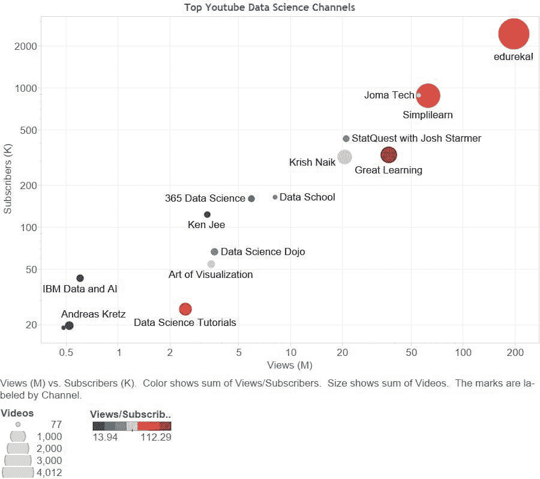

# 数据科学的顶级 YouTube 频道

> 原文：[`www.kdnuggets.com/2021/03/top-youtube-channels-data-science.html`](https://www.kdnuggets.com/2021/03/top-youtube-channels-data-science.html)

评论

视频是一个很好的学习工具，YouTube 上有大量的数据科学资料等着被消费。然而，发现平台上的优质内容可能很困难，我们往往珍视那些优秀频道的发现。

我并不是告诉你什么你不知道的事情，但我在这里（希望能）帮助缓解在 YouTube 上寻找优质数据科学视频内容的麻烦。这里的想法是采取定性的方法来识别平台上有价值的频道。我们的方法是从直觉出发，认为优质内容应该会导致频道的受欢迎程度，这可以通过订阅者数量来衡量。

不幸的是，按订阅者数量搜索频道并不那么简单，并且由于没有权威的列表来确定哪些频道的内容是或不是“数据科学”，我们还不得不依赖关键词搜索。确定哪些频道最终进入我们的列表的方法如下，首先是我们的 YouTube 搜索标准：

+   搜索词：“**数据科学**”

+   搜索类型：**频道**

+   排序依据：**观看次数**

[这些是搜索结果](https://www.youtube.com/results?search_query=data+science&sp=CAMSAhAC)。需要注意的是，这个过程的一个主要警告是，我们必须依赖关键词搜索来识别相关的数据科学内容。

在执行上述搜索后，我们按照这些步骤来最终得到订阅者数量最多的频道列表：

+   我们抓取了前 100 个频道的结果

+   我们排除了任何没有公开订阅者数量的频道

+   我们重新按订阅者数量对列表进行了排序

我们得到的是按订阅者数量排序的前 15 个数据科学内容的 YouTube 频道列表，这是通过我们的关键词搜索词识别的。由于超过 15 个的频道变得不那么有趣，我们在此阈值后中断了列表，以避免淹没读者于过多的视频时长中。

我们还收集了每个频道的总观看次数以及每位订阅者的观看次数，并利用所有这些数据创建了下面的可视化图表，以帮助快速传达这 15 个频道的故事。

**图 1\. 数据科学的顶级 YouTube 频道**

按观看次数和订阅者数量绘制；相对大小按视频数量确定；

按观看次数/订阅者数量的颜色强度

所以这里是按订阅者数量排序的前 15 个数据科学 YouTube 频道，以及来自这些频道本身的简短描述。

**1\. [edureka!](https://www.youtube.com/user/edurekaIN)**

订阅者：2,440 K，视频：4012，观看次数：197 M，开始日期：2012 年 6 月 29 日

> 我们是一个实时互动的电子学习平台，使命是让每个人都能轻松学习。我们提供由讲师主导的课程，以及 24/7 随时随地的支持，以实现业内最高的课程完成率！我们的实际项目、24*7 支持、个人学习经理确保你的学习目标得以实现！

**2\. [Joma Tech](https://www.youtube.com/channel/UCV0qA-eDDICsRR9rPcnG7tw)**

订阅者：889 K，视频：83，观看次数：55 M，开始日期：2016 年 8 月 31 日

> 我谈论硅谷生活、大型科技公司、数据科学和软件工程。

**3\. [Simplilearn](https://www.youtube.com/user/Simplilearn)**

订阅者：883 K，视频：2468，观看次数：63 M，开始日期：2009 年 10 月 29 日

> Simplilearn 是全球排名第一的在线训练营，致力于帮助人们获得在数字经济中成功所需的技能。

**4\. [StatQuest with Josh Starmer](https://www.youtube.com/user/joshstarmer)**

订阅者：434 K，视频：192，观看次数：21 M，开始日期：2011 年 5 月 23 日

> 统计学、机器学习和数据科学有时可能看起来非常可怕，但由于每种技术实际上只是由小而简单的步骤组合而成，它们实际上非常简单。我的目标是将主要方法论分解为易于理解的部分。也就是说，我不会简化材料。相反，我会提升你的理解，以使你变得更加聪明。

**5\. [Great Learning](https://www.youtube.com/user/beaconelearning)**

订阅者：330 K，视频：1129，观看次数：37 M，开始日期：2013 年 4 月 3 日

> Great Learning 致力于让任何想要学习的人都能获得优质教育。Great Learning Academy（http://greatlearning.in/academy）致力于支持免费学习，提供 200 多个完全免费的热门职业领域课程。除了视频，你还可以获得完成证书，做作业和项目，参加实时课程，与顶级教师和行业专家互动。所有这些都是免费的。

**6\. [Krish Naik](https://www.youtube.com/user/krishnaik06)**

订阅者：321 K，视频：895，观看次数：21 M，开始日期：2012 年 2 月 10 日

> 我担任首席数据科学家，开创机器学习、深度学习和计算机视觉领域的工作，同时也是一名教育者和导师，拥有超过 8 年的行业经验。这是我的 YouTube 频道，在这里我用许多实际问题场景讲解机器学习、深度学习和人工智能的各种主题。我已在各种聚会、技术机构和社区组织的论坛上进行了 30 多场关于数据科学、机器学习和人工智能的技术讲座。我的主要目标是让每个人都熟悉机器学习和人工智能。请订阅并支持这个频道。由于我喜欢新技术，这些视频都是免费的，我承诺将来会制作更多有趣的内容。

**7\. [数据学院](https://www.youtube.com/user/dataschool)**

订阅者：165 K，视频：100，观看次数：8.1 M，开始日期：2014 年 4 月 30 日

> 你是否在学习数据科学，以便获得第一份数据科学工作？你可能对自己“应该”学习的内容感到困惑，并且很难找到你能理解的课程！Data School 让你专注于首先需要掌握的主题，并提供你可以理解的深入教程，无论你的教育背景如何。

**8\. [365 数据科学](https://www.youtube.com/channel/UCEBpSZhI1X8WaP-kY_2LLcg)**

订阅者：161 K，视频：188，观看次数：5.9 M，开始日期：2017 年 8 月 7 日

> 在 365 数据科学公司，我们每天上班的原因是我们想解决数据科学中最大的难题——教育。

**9\. [Ken Jee](https://www.youtube.com/channel/UCiT9RITQ9PW6BhXK0y2jaeg)**

订阅者：123 K，视频：178，观看次数：3.3 M，开始日期：2014 年 2 月 28 日

> 数据科学和体育分析是我的热情所在。我叫 Ken Jee，过去 5 年里，我一直在数据科学领域从事体育分析工作。我曾在从初创企业到财富 100 强的公司中担任数据科学职位。我从商业和咨询背景转型进入数据科学领域。当我刚开始我的数据科学之旅时，我感到非常迷茫；当时几乎没有资源可以让我学习这个领域。我决定开始制作 YouTube 视频，分享我的经历，并希望帮助其他人进入数据科学和体育分析领域。

**10\. [数据科学道场](https://www.youtube.com/user/DataScienceDojo)**

订阅者：67.1 K，视频：246，观看次数：3.6 M，开始日期：2014 年 8 月 6 日

> 在数据科学道场，我们相信数据科学适合每个人。我们的面对面数据科学训练营已吸引来自全球超过 1,500 家公司的 4,000 多名专业人士参加。我们的频道是展示我们致力于教授各种技能水平数据科学的完美平台！你会发现数据科学和数据工程的教程、社区讨论和课程。

**11\. [可视化艺术](https://www.youtube.com/channel/UCHBWJGoZMkhJyElgvuN1U1w)**

订阅者：54.7 K，视频：252，观看次数：3.5 M，开始日期：2016 年 8 月 15 日

> 欢迎来到 ArtofVisualization 频道，这里有最好的 Tableau 和 BI 教程！我们以始终与您分享最新、最前沿的 Tableau 可视化、仪表板及大量提高数据可视化技能的技巧和窍门而自豪！

**12\. [IBM 数据与人工智能](https://www.youtube.com/user/ibmbigdata)**

订阅者：43.2 K，视频：229，观看次数：0.6 M，开始日期：2011 年 7 月 18 日

> 作为认知战略的一部分，组织可以通过数据转变其行业和职业。IBM Analytics 使任何人都能与数据互动，以回答最棘手的业务问题，发现模式并追求突破性的想法。在 IBM，我们提供全面的数据分析方法，包括在影响点提供即时业务价值的专业知识。在这里，你可以找到演示、示例、访谈、技术教程等。

**13\. [数据科学教程](https://www.youtube.com/channel/UCk5tiFqPvdjsl7yT4mmokmg)**

订阅者: 25.9 K，视频数量: 659，观看次数: 2.5 M，开始日期: 2015 年 11 月 1 日

> 在这个频道中，我的目标是讲解 R 语言及其编程和统计分析技术。R 语言由于其易于学习的编程语法和丰富的分析包，成为统计学家和研究人员的首选编程语言。

**14\. [Andreas Kretz](https://www.youtube.com/channel/UCY8mzqqGwl5_bTpBY9qLMAA)**

订阅者: 19.8 K，视频数量: 306，观看次数: 0.5 M，开始日期: 2017 年 4 月 18 日

> 我帮助你进入数据工程领域，这是数据科学的基础工作。建立大数据平台。数据科学播客《数据科学的水管工》的主办者，探索如何摄取、处理和存储数据，以使数据科学家能够为客户做出出色的工作。使用像 Hadoop、Spark 和 Kafka 这样的工具。这就是数据工程——数据科学的基础工作。我已经从事这个令人兴奋的工作快八年了 :)

**15\. [数据科学学院](https://www.youtube.com/channel/UCyoi9yYaQRQ2F34wDLosr2A)**

订阅者: 19.0 K，视频数量: 77，观看次数: 0.5 M，开始日期: 2016 年 2 月 26 日

> 这是 Data Science Academy Brasil 的官方 YouTube 频道：[www.datascienceacademy.com.br](http://www.datascienceacademy.com.br)

以下是按订阅者数量排序的前 15 个数据科学 YouTube 频道，以及一些额外的数据，帮助你决定这些频道是否可能有你感兴趣的视频内容。祝你观影愉快！

**相关**:

+   10 分钟内最佳机器学习 YouTube 视频

+   数据科学、数据可视化和机器学习的顶级 Python 库

+   深度学习、自然语言处理和计算机视觉的顶级 Python 库

### 更多相关主题

+   [建立一个强大的数据团队](https://www.kdnuggets.com/2021/12/build-solid-data-team.html)

+   [使用管道编写干净的 Python 代码](https://www.kdnuggets.com/2021/12/write-clean-python-code-pipes.html)

+   [KDnuggets 新闻 22:n16，4 月 20 日：学习的顶级 YouTube 频道…](https://www.kdnuggets.com/2022/n16.html)

+   [学习数据科学的顶级 YouTube 频道](https://www.kdnuggets.com/2022/04/top-youtube-channels-learning-data-science.html)

+   [提升机器学习技能的 15 个顶级 YouTube 频道](https://www.kdnuggets.com/2023/03/top-15-youtube-channels-level-machine-learning-skills.html)

+   [学习人工智能的 6 个 YouTube 频道](https://www.kdnuggets.com/6-youtube-channels-to-learn-about-ai)
