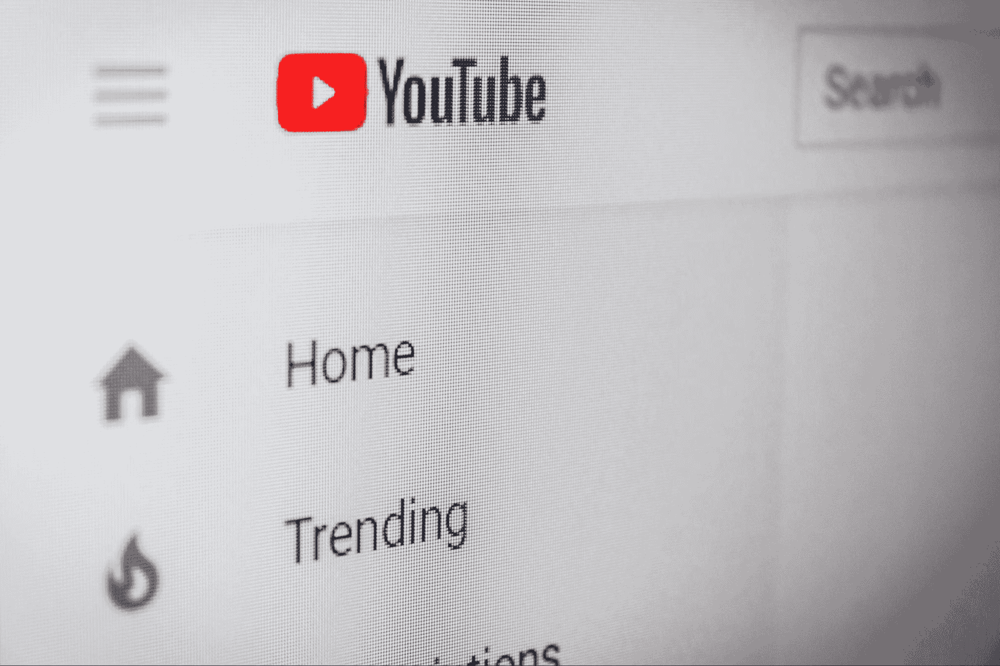

# 学习数据科学的顶级 YouTube 频道

> 原文：[`www.kdnuggets.com/2022/04/top-youtube-channels-learning-data-science.html`](https://www.kdnuggets.com/2022/04/top-youtube-channels-learning-data-science.html)

[Christian Wiediger](https://unsplash.com/@christianw) 通过 Unsplash

随着数据使用的普及，数据科学家的需求也在增加。每天都有新的公司提供训练营，大学也在策划新的课程以满足这种需求。然而，选择合适的内容和最佳资源可能很困难。

* * *

## 我们的前三名课程推荐

 1\. [Google 网络安全证书](https://www.kdnuggets.com/google-cybersecurity) - 快速进入网络安全职业生涯。

 2\. [Google 数据分析专业证书](https://www.kdnuggets.com/google-data-analytics) - 提升你的数据分析能力

 3\. [Google IT 支持专业证书](https://www.kdnuggets.com/google-itsupport) - 支持您的组织的 IT 工作

* * *

由于疫情迫使世界各地的人们在家工作，很多人都在远程学习。我们越来越倾向于通过 Zoom 会议或视频观看讲座。

这是 YouTube 成为人们自我发展和知识增加的重要元素的地方。

以下是提供数据科学学习的 YouTube 频道列表。

# 1\. [StatQuest With John Starmer](https://www.youtube.com/c/joshstarmer/featured)

如果你是数据科学新手，理解统计学和机器学习的概念可能会很困难。John Starmer 于 2011 年 5 月 24 日加入 YouTube，目前有 680K 订阅者。

Starmer 使用图像概念帮助你理解复杂的主题，并逐渐提高你的理解能力。我在第一次接触数据科学时使用了 StatQuest，那时我意识到理解统计概念是多么重要。

他开始他的视频时会有一个简短的吸引人的介绍，唱歌来打破僵局，并让你对学习复杂的理论感到轻松。

# 2\. [Krish Naik](https://www.youtube.com/user/krishnaik06)

Krish Naik 是 iNeuron 的联合创始人，拥有超过 10 年的机器学习、深度学习和计算机视觉经验。Krish Naik 于 2012 年 2 月 11 日加入 YouTube，目前有 542K 订阅者。

Naik 不仅讲解数据科学、机器学习、深度学习等理论和应用，还提供有关进入和在该领域发展的建议和指导。

他在他的 YouTube 频道上还有三种不同类型的会员；数据科学材料、数据科学指导和项目实时数据科学。

# 3\. [Simplilearn](https://www.youtube.com/c/SimplilearnOfficial)

Simplilearn 于 2009 年 10 月 29 日加入 YouTube，目前拥有 187 万订阅者。他们旨在帮助人们获得在数字经济中取得成功所需的技能。

他们提供课程和全面的认证程序，并与世界著名大学建立了合作伙伴关系。他们的做法使 85% 的学员获得了晋升或找到了新工作。

他们不仅提供全面的理论和应用数字相关内容的教程；还制作了关于当前市场趋势的视频以及自我发展方面的最佳书籍推荐。

# 4\. [freeCodeCamp.org](https://www.youtube.com/c/Freecodecamp)

freeCodeCamp.org 是一个允许你免费学习编程的组织。他们于 2014 年 12 月 16 日加入 YouTube，目前拥有 523 万订阅者。

该频道由 Quincy Larson 创建，他制作了数千个编程教程和视频，并在全球拥有数千个 freeCodeCamp 学习小组。

如果你不确定编程是否适合你，并且想先了解一下，freeCodeCamp.org 是一个不错的起点，因为你不用担心经济压力。

# 5\. [Edureka!](https://www.youtube.com/c/edurekaIN/featured)

Edureka! 是一个实时互动的电子学习平台，于 2012 年 6 月 29 日加入 YouTube，目前拥有 322 万订阅者。

他们提供由讲师主导的课程，这些课程具有全天候的随需支持，并且包含实际项目，以确保学员的学习目标能够实现。

他们涵盖的主题范围广泛，如数据科学、人工智能、大数据、DevOps、区块链、Python、Selenium、Tableau、Android、AWS 架构师、数字营销等。他们还提供关于热门公司、最高薪资职位、编程语言和证书的信息，以帮助你为相关领域做好准备。

# 6\. [Corey Schafer](https://www.youtube.com/c/Coreyms/featured)

Corey Schafer 专注于为软件开发人员、程序员和工程师创建教程和演练。Schafer 于 2006 年 5 月 31 日加入 YouTube，目前拥有 90.1 万订阅者。

Schafer 的内容并不针对特定的技能水平，他面向初学者到有多年经验的人。Schafer 涵盖了各种主题，如 Python、Git、终端命令、SQL、JavaScript、计算机科学基础等。

# 7\. [sentdex](https://www.youtube.com/user/sentdex)

Sentdex 提供从基础到复杂的 Python 编程教程。Sentdex 于 2012 年 12 月 16 日加入 YouTube，目前拥有 111 万订阅者。

Sentdex 涵盖了各种主题的教程，如机器学习、金融、数据分析、机器人技术、网络开发、游戏开发等。

Sentdex 的视频相比其他 YouTube 频道时间较短，但他仍提供了理解主题所需的所有信息，这使得他的视频对那些需要信息且容易因长视频而感到失望的人非常有用。

# 8\. [Joma Tech](https://www.youtube.com/c/JomaOppa/featured)

如果你已经在进行数据科学之旅，但需要一些关于该领域和市场趋势的建议，Joma Tech 就是你需要的人。

Joma Tech 谈论硅谷的生活和主要科技公司。Joma Tech 于 2016 年 8 月 31 日加入 YouTube，目前有 165 万订阅者。

他告诉你作为数据科学家、工程师等你将要做的真实情况，以及有关招聘过程的信息。

**[Nisha Arya](https://www.linkedin.com/in/nisha-arya-ahmed/)** 是一名数据科学家和自由职业技术作家。她特别感兴趣于提供数据科学职业建议或教程以及理论基础知识。她还希望探索人工智能如何有助于人类寿命的不同方式。她是一名热衷学习者，寻求拓宽技术知识和写作技能，同时帮助指导他人。

### 更多相关主题

+   [KDnuggets 新闻 22:n16, 4 月 20 日:学习的最佳 YouTube 频道…](https://www.kdnuggets.com/2022/n16.html)

+   [提升你的机器学习技能的前 15 个 YouTube 频道](https://www.kdnuggets.com/2023/03/top-15-youtube-channels-level-machine-learning-skills.html)

+   [了解 AI 的 6 个 YouTube 频道](https://www.kdnuggets.com/6-youtube-channels-to-learn-about-ai)

+   [适合数据科学初学者的前 6 个 YouTube 系列](https://www.kdnuggets.com/top-6-youtube-series-for-data-science-beginners)

+   [关于数据分析的前 7 个 YouTube 课程](https://www.kdnuggets.com/2022/02/top-7-youtube-courses-data-analytics.html)

+   [来自大学的最佳 AI 课程及 YouTube 播放列表](https://www.kdnuggets.com/2023/08/best-courses-ai-universities-youtube-playlists.html)
