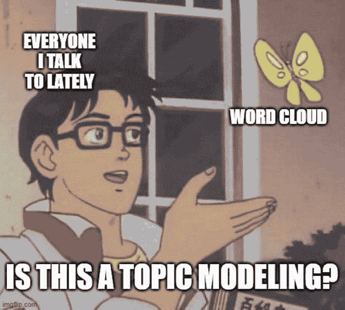
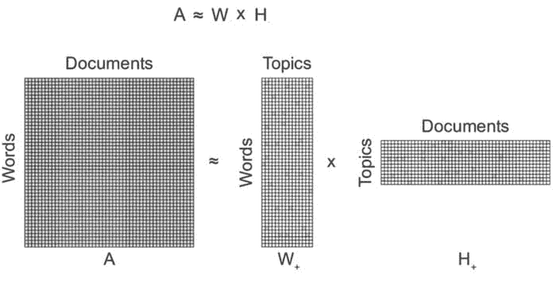
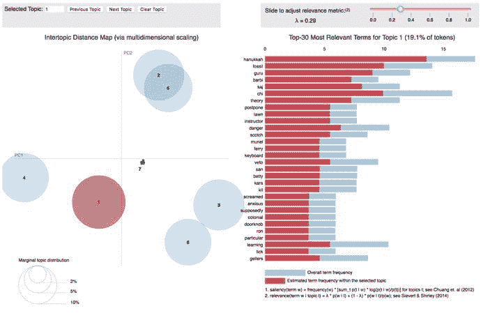
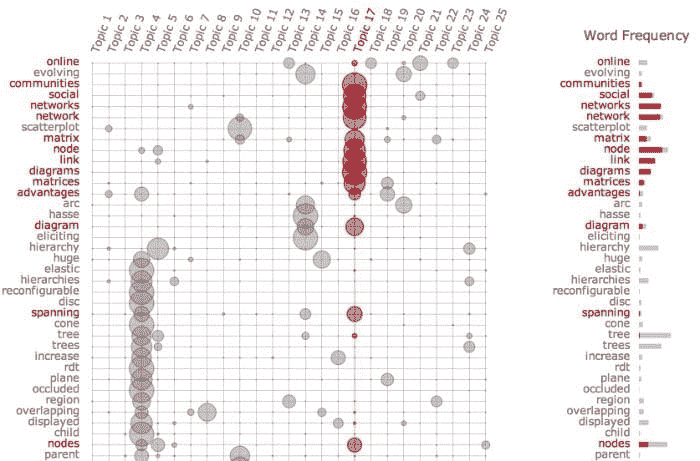
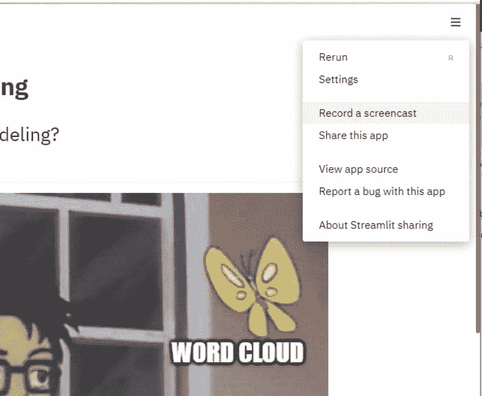
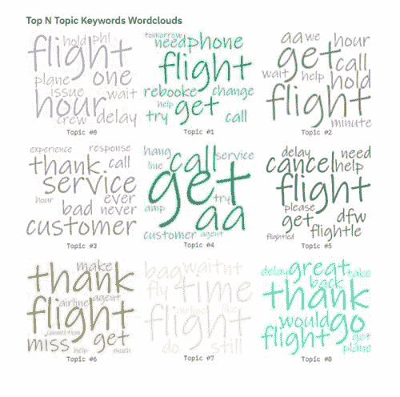

# 使用 Streamlit 进行话题建模

> 原文：[`www.kdnuggets.com/2021/05/topic-modeling-streamlit.html`](https://www.kdnuggets.com/2021/05/topic-modeling-streamlit.html)

评论

**由 [Bryan Patrick Wood](https://www.linkedin.com/in/bpw1621/)，高级数据科学家**

创建和部署一个话题建模网页应用程序需要什么？我努力通过使用 Python NLP 包进行话题建模、使用 Streamlit 作为网页应用框架以及使用 Streamlit Sharing 进行部署来找到答案。

* * *

## 我们的前三个课程推荐

 1\. [Google 网络安全证书](https://www.kdnuggets.com/google-cybersecurity) - 快速进入网络安全职业生涯。

 2\. [Google 数据分析专业证书](https://www.kdnuggets.com/google-data-analytics) - 提升你的数据分析水平

 3\. [Google IT 支持专业证书](https://www.kdnuggets.com/google-itsupport) - 支持你的组织 IT

* * *

我曾被指示在一个项目中使用话题建模，因此我已经在一个具有挑战性的实际问题上有了相关技术的直接经验。然而，我遇到了几个意想不到的困难，特别是在与非技术观众分享话题建模结果时。



不久之后，我被咨询在一个大规模运行的产品系统中实施话题建模功能。在这里，我试图帮助的团队在理解话题建模的预期效果以及保持监督学习、半监督学习和无监督学习方法之间的重要区别方面遇到了困难⁸。

这激励我做一些东西来*展示，不要告诉*，可以这么说。我希望给我接触的人一个可以实际操作的东西。这也是一个很好的借口来使用 Streamlit 并尝试 Streamlit Sharing。我在专业领域中已经宣传了 Streamlit 的一些用例，但实际上我只玩过几个玩具示例。通过 Streamlit Sharing 部署是新的，并引起了我的好奇。

### 免责声明

首先，应用程序仍然是一个进行中的工作/原型。存在一些尚未实现的功能占位符（例如，使用非负矩阵分解¹）。代码也需要从一个长达 250 行的脚本中重构出来。重点是使足够的部分能够正常工作，以暗示可以实现的强大功能，并且拥有足够的完整应用程序来激发讨论。其次，Streamlit 对文档编程²的支持很好。因此，一些叙述在应用程序中重复出现。因此，如果你已经访问了应用程序，你可以略过接下来的部分。

### 话题建模

正如我发现的那样，*主题建模* 对不同的人来说可能意味着不同的东西。*主题* 和 *模型* 这两个词足够常见，大多数人可以通过它们来形成对该技术成功所需完成内容的看法。

在没有额外限定的情况下，*主题建模* 通常指的是用于发现*抽象主题* 的统计模型类型，这些主题出现在文档集合中。这些技术几乎总是完全无监督的，尽管也存在半监督和监督的变体。在最常用的技术中，且在应用程序中完全实现的技术是潜在狄利克雷分配（LDA）。

从表面上看，LDA 只是将词汇文档关系矩阵（如下图所示）分解为两个关系矩阵：词汇到主题和主题到文档。理论上假设词汇在主题中的分布和主题在文档中的分布，但这更多是对希望理解基础理论的人感兴趣的内容，该理论在其他地方已经有很好的阐述。



这里不深入探讨 LDA 理论：这是一个值得单独撰写博客文章的话题。

我在专业项目中进行了大量实验。那些实验在其上下文之外并不直接有用，我无法分享。我将突出一些代码片段，这些代码片段可能对有志于进行主题建模的人有所帮助。

预处理在所有机器学习问题中至关重要。在 NLP 问题中，相比其他领域，通常有更多的选择。对于主题建模，通常希望在应用建模之前删除各种类型的命名实体。以下函数用于*去噪* 文本文件。

```py
import pandas as pd
import regex
from gensim.utils import simple_preprocess
from nltk.corpus import stopwords
EMAIL_REGEX_STR = '\S*@\S*'
MENTION_REGEX_STR = '@\S*'
HASHTAG_REGEX_STR = '#\S+'
URL_REGEX_STR = r'((http|https)\:\/\/)?[a-zA-Z0-9\.\/\?\:@\-_=#]+\.([a-zA-Z]){2,6}([a-zA-Z0-9\.\&\/\?\:@\-_=#])*'
def denoise_docs(texts_df: pd.DataFrame, text_column: str):
    texts = texts_df[text_column].values.tolist()
    remove_regex = regex.compile(f'({EMAIL_REGEX_STR}|{MENTION_REGEX_STR}|{HASHTAG_REGEX_STR}|{URL_REGEX_STR})')
    texts = [regex.sub(remove_regex, '', text) for text in texts]
    docs = [[w for w in simple_preprocess(doc, deacc=True) if w not in stopwords.words('english')] for doc in texts]
    return docs 
```

我还尝试了通过 `gensim.models.Phrases` 和 `gensim.models.phrases.Phraser` 使用二元组和三元组短语，但没有看到显著提升。将二元组和三元组本身而不是作为预处理步骤使用可能会更有影响。文档预处理的最后一步是使用 [spaCy](https://spacy.io/) 进行词形还原。

```py
import pandas as pd
import spacy
def generate_docs(texts_df: pd.DataFrame, text_column: str, ngrams: str = None):
    docs = denoise_docs(texts_df, text_column)

    # bigram / trigam preprocessing ...

    lemmantized_docs = []
    nlp = spacy.load('en_core_web_sm', disable=['parser', 'ner'])
    for doc in docs:
        doc = nlp(' '.join(doc))
        lemmantized_docs.append([token.lemma_ for token in doc])

    return lemmantized_docs 
```

建模代码是 `gensim` 的标准做法。

```py
import gensim
from gensim import corpora
def prepare_training_data(docs):
    id2word = corpora.Dictionary(docs)
    corpus = [id2word.doc2bow(doc) for doc in docs]
    return id2word, corpus
def train_model(docs, num_topics: int = 10, per_word_topics: bool = True):
    id2word, corpus = prepare_training_data(docs)
    model = gensim.models.LdaModel(corpus=corpus, id2word=id2word, num_topics=num_topics, per_word_topics=per_word_topics)
    return model 
```

我本打算添加更多建模选项，但时间不够。至少，我将来会添加一个使用 NMF 的选项。根据经验，NMF 可以根据所研究的数据集产生更好的主题。添加任何非无监督的方法将是一个更大的挑战。





在可视化方面，我大量借鉴了 [Topic modeling visualization – How to present the results of LDA models?](https://www.machinelearningplus.com/nlp/topic-modeling-visualization-how-to-present-results-lda-models)，特别是用于模型结果可视化：这是一个很好的参考，用于可视化主题模型结果。

pyLDAvis⁹ 也是一个很好的主题建模可视化工具，但与嵌入应用程序的兼容性不是很好。Termite plots¹⁰ 是另一种有趣的主题建模可视化工具，使用 [textaCy 包](https://textacy.readthedocs.io/en/stable/api_reference/viz.html) 可以在 Python 中实现。

我有时间做的最复杂的可视化是词云，由于已有一个 Python 包可以做到这一点，因此任务非常简单。

```py
from wordcloud import WordCloud
WORDCLOUD_FONT_PATH = r'./data/Inkfree.ttf'
def generate_wordcloud(docs, collocations: bool = False):
    wordcloud_text = (' '.join(' '.join(doc) for doc in docs))
    wordcloud = WordCloud(font_path=WORDCLOUD_FONT_PATH, width=700, height=600, background_color='white', collocations=collocations).generate(wordcloud_text)
    return wordcloud 
```


设置需要稍微调整才能得到看起来不错的效果。添加额外的可视化是我感觉时间不够的主要部分，可能会在以后重新考虑。

### Streamlit

Streamlit 是一个开源的 Python 库，它使得创建和共享美观的、定制的机器学习和数据科学 Web 应用变得简单。我将重点讲解*创建*部分，稍后会讲解*共享*部分，尽管在受信任的本地网络上共享非常简单。

主要的价值主张是将数据科学或机器学习成果迅速转化为 Web 应用，目的是与那些对 Jupyter notebook 不太舒适的人共享。在这方面它表现出色。我从脚本到 Web 应用只用了几个小时。这使我能够与一群决策者共享一个 Web 应用，他们试图弄清楚主题建模的意义。我对提供方的表现非常满意，接收方也给出了相同的反馈。

另一个好处是它纯粹的 Python 性质（即不涉及 HTML、CSS、JS 等），因此无需要求数据科学家学习他们不感兴趣的复杂 Web 技术。与 Plotly Dash 的比较可能需要单独写一篇博客，但 Dash 的方法更倾向于让 React 在 Python 中更易于实现。它非常专注于

对于大多数考虑使用这项技术的人来说，这可能不是一个大问题，但对于那些有传统 GUI 应用程序框架经验的人来说，值得注意的是 Streamlit 更像是一种立即模式用户界面¹¹。也就是说，每次执行 UI 操作（例如，点击按钮）时，它都会从头到尾重新运行脚本。通过 `@cache` 装饰器进行的激进缓存允许高效执行：只重新运行每次更改所需的代码。这要求用户做出这些决策，并且参数必须是可哈希的。

它甚至原生支持屏幕录制！有助于向他人展示如何使用你所共享的内容。



这个视频展示了 `st.sidebar` 上下文管理器的使用：这是应用程序文档、设置甚至导航的基本组件。

<https://bpw1621.com/images/streamlit-topic-modeling/streamlit-sidebar.webm>

下一个视频展示了如何使用新的`st.beta.expander`上下文管理器：它非常棒，尤其适合添加用户在阅读后希望折叠的文献展示部分，以便重新获得屏幕空间。

<https://bpw1621.com/images/streamlit-topic-modeling/streamlit-expander.webm>

我将在应用程序中重点介绍的最后一件事是使用新的`st.beta.columns`上下文管理器，它用于为每个主题创建一个词云网格。



这是代码

```py
st.subheader('Top N Topic Keywords Wordclouds')
topics = model.show_topics(formatted=False, num_topics=num_topics)
cols = st.beta_columns(3)
colors = random.sample(COLORS, k=len(topics))
for index, topic in enumerate(topics):
    wc = WordCloud(font_path=WORDCLOUD_FONT_PATH, width=700, height=600, background_color='white', collocations=collocations, prefer_horizontal=1.0, color_func=lambda *args, **kwargs: colors[index])
    with cols[index % 3]:
        wc.generate_from_frequencies(dict(topic[1]))
        st.image(wc.to_image(), caption=f'Topic #{index}', use_column_width=True) 
```

这里还有大量内容可以深入探讨，但没有什么是不通过自己动手尝试就无法掌握的。

### Streamlit Sharing

Streamlit Sharing 的标语相当不错：*从 Streamlit 直接免费部署、管理和分享你的应用到全世界*。

共享机器学习应用原型的便利性是*令人愉快的*。我最初在 Amazon AWS EC2 实例上部署，以满足截止日期（如下面所示）。鉴于我在 AWS 的背景和经验，我不会说以这种方式部署过于困难，但我知道一些才华横溢的机器学习专业人士可能在这里遇到过困难。此外，大多数人不愿意将时间花费在角色访问、安全设置、设置 DNS 记录等上面。是的，他们的时间确实更应该花在他们擅长的事情上。

要使用此服务，你需要请求并获得一个帐户。你可以在[这里](https://streamlit.io/sharing)进行操作。你会收到一封事务性电子邮件，让你知道你在等待访问的队列中，但邀请尚未到来。我建议，如果你认为你会很快想要尝试这个，最好立即注册。

一旦获得访问权限，按照上面的 gif 或[这里](https://docs.streamlit.io/en/stable/deploy_streamlit_app.html#)的指示操作是相当简单的。有几件事情需要我在我的 GitHub 仓库上进行迭代，以使一切正常工作，包括

+   正确使用 setup.py / setup.cfg 意味着你不需要 requirements.txt 文件，但服务要求提供一个。

+   机器学习包通常会下载数据和模型

    +   在[spaCy](https://spacy.io/)的情况下，他们转向将模型作为 Python 包提供，所以只需将我需要的模型添加到 requirements.txt 中即可。

    +   在使用[NLTK](https://www.nltk.org/)的情况下，我不得不在我的主应用程序脚本中添加调用`nltk.download`以获取停用词。

否则，一切都很直接，几次点击就完成了。有关 Streamlit 应用程序部署的官方指导可以在[这里](https://docs.streamlit.io/en/stable/deploy_streamlit_app.html#)找到。

同样重要的是要注意，这绝对不能替代生产部署。每个用户限制为 3 个应用程序。单个应用程序的运行环境限制为最多 1 个 CPU、800 MB 的 RAM 和 800 MB 的专用存储空间。因此，这里并不适合你下一个初创公司的 web 应用，但对于共享快速原型来说是一个极具价值的提案。

### 总结

如果你读到这里，我想感谢你抽出时间。如果阅读后你对使用该应用程序感兴趣并有反馈，我很乐意听到你的意见。

原型应用程序可以在 Streamlit Sharing⁴上访问，代码可在 Github⁵上找到。计划根据时间安排增强和改进现有功能。计划将我的改进和扩展想法记录在 Github 问题中，以便在有时间时处理。

1.  [非负矩阵分解 维基百科](https://en.wikipedia.org/wiki/Non-negative_matrix_factorization)

1.  [文献编程 维基百科](https://en.wikipedia.org/wiki/Literate_programming)

1.  [Streamlit Sharing 资源限制](https://docs.streamlit.io/en/stable/deploy_streamlit_app.html#:~:text=of%20the%20app.-,Resource%20limits,in%20a%20shared%20execution%20environment.)

1.  [Streamlit 主题建模应用](https://share.streamlit.io/bpw1621/streamlit-topic-modeling/streamlit_topic_modeling/app.py)

1.  [Streamlit 主题建模应用 Github 仓库](https://github.com/bpw1621/streamlit-topic-modeling)

1.  [主题模型 维基百科](https://en.wikipedia.org/wiki/Topic_model)

1.  [潜在狄利克雷分配 维基百科](https://en.wikipedia.org/wiki/Latent_Dirichlet_allocation)

1.  [无监督、监督和半监督学习 交叉验证问题](https://stats.stackexchange.com/questions/517/unsupervised-supervised-and-semi-supervised-learning)

1.  [pyLDAvis Github](https://github.com/bmabey/pyLDAvis)

1.  [Termite: 评估文本主题模型的可视化技术](http://vis.stanford.edu/papers/termite)

1.  [即时模式 GUI 维基百科](https://en.wikipedia.org/wiki/Immediate_mode_GUI)

**简介: [布莱恩·帕特里克·伍德](https://www.linkedin.com/in/bpw1621/)** ([**@bpw1621**](https://twitter.com/bpw1621))是一位高级数据科学家，领导着一个数据科学团队，解决国家面临的一些最重要的挑战。请访问他的[个人网站](https://bpw1621.com/)了解更多信息。

[原文](https://bpw1621.com/archive/streamlit-topic-modeling/)。经许可转载。

**相关:**

+   生产就绪的机器学习 NLP API，使用 FastAPI 和 spaCy

+   现在学习自然语言处理的神经网络

+   使用 Streamlit 的新布局选项构建更好的数据应用

### 相关主题

+   [主题建模方法：Top2Vec 与 BERTopic](https://www.kdnuggets.com/2023/01/topic-modeling-approaches-top2vec-bertopic.html)

+   [使用 HuggingFace Pipelines 和 Streamlit 回答问题](https://www.kdnuggets.com/2021/10/simple-question-answering-web-app-hugging-face-pipelines.html)

+   [使用 Streamlit 的 DIY 自动化机器学习](https://www.kdnuggets.com/2021/11/diy-automated-machine-learning-app.html)

+   [LangChain + Streamlit + Llama：将对话式 AI 带到你的本地机器](https://www.kdnuggets.com/2023/08/langchain-streamlit-llama-bringing-conversational-ai-local-machine.html)

+   [通过 DAGsHub 将 Streamlit WebApp 部署到 Heroku](https://www.kdnuggets.com/2022/02/deploying-streamlit-webapp-heroku-dagshub.html)

+   [Streamlit 的 12 个必备命令](https://www.kdnuggets.com/2023/01/12-essential-commands-streamlit.html)
