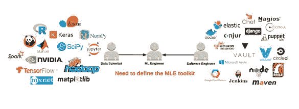
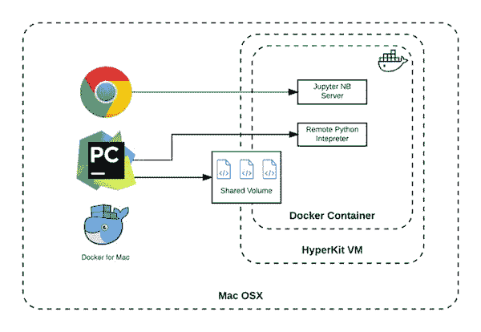

# 针对 Docker 优先的数据科学的 Torus

> 原文：[`www.kdnuggets.com/2018/05/torus-docker-first-data-science.html`](https://www.kdnuggets.com/2018/05/torus-docker-first-data-science.html)

 评论

**由 [Alexander Ng](https://www.linkedin.com/in/alexander-b-ng/), Manifold.ai 提供**

随着对人工智能（AI）特别是机器学习（ML）的兴趣增长，越来越多的工程师进入这一热门领域，缺乏事实上的工作标准和框架的问题变得越来越明显。现在，优化 ML 交付流程的新关注点开始获得动力。

* * *

## 我们的前三大课程推荐

 1\. [Google 网络安全证书](https://www.kdnuggets.com/google-cybersecurity) - 快速进入网络安全职业轨道。

 2\. [Google 数据分析专业证书](https://www.kdnuggets.com/google-data-analytics) - 提升你的数据分析技能

 3\. [Google IT 支持专业证书](https://www.kdnuggets.com/google-itsupport) - 支持你的组织的 IT 工作

* * *

数据科学家在产品交付流程中的参与越来越多，确保他们的工作能在交付过程中存活下来是一个不容忽视的任务。当然，这并不是一个新问题：过去，传统的软件开发团队会将他们的工作“抛过墙”给运营团队，以很少或没有上下文的方式提供生产服务。解决这一不可避免的混乱的社区努力导致了我们现在所称的 DevOps，它打破了开发与运营之间的壁垒，以提高效率和改善产品质量。现在，帮助团队实施精简交付流程的新工具和流程有助于保证开发/生产的一致性。

现在，机器学习领域出现了同样的问题，并且随着对 AI 产品需求的增长而变得越来越严重。一个新的壁垒正在扼杀生产力。随着数据科学团队在工程组织中的崛起，DevOps 将如何变化？我们今天在社区中看到的痛点感觉很熟悉，但在 ML 开发中也有独特的方面。

### 机器学习工程师的崛起

简单来说，DevOps 领域的解决方案为那些在开发与运营交汇点工作的人员提供了工具。同样，需要一个工具包来帮助那些在数据科学与软件工程交汇点工作的人员。我们称这样的人员为机器学习工程师（MLE）。从高层次来看，MLE 面临的挑战与任何产品开发团队中的软件工程师是一样的：

1.  标准化的本地开发环境

1.  开发与生产环境的统一

1.  标准化的打包和部署流程

此外，ML 开发工作流的某些方面对 MLE 提供了一组不同的挑战：

1.  轻松共享开发环境和中间结果，以进行可重复的实验

1.  协调运行多个笔记本服务器的隔离项目环境

1.  轻松实现垂直和水平扩展，以处理大型数据集或利用额外的计算资源（*例如*，用于深度学习、优化等）

通过用 DevOps 思维方式来看待 ML 开发，我们可以识别出交付路径上需要改进的几个新领域。这是一个机会，可以构建新的工具和最佳实践，专门赋能 MLE 社区，以便在更短的时间内交付更强健的解决方案。

无论 MLE 工具包最终包含什么，我们非常确定的一点是：Docker 将在 ML 开发生命周期标准中发挥重要作用。

Docker 优先的数据科学

通过转向以 Docker 为优先的工作流，MLE 可以在开发生命周期中受益于许多显著的下游优势，这些优势包括在大数据集上运行工作负载时的易于垂直和水平扩展，以及模型和预测引擎的部署和交付的便捷。运行在容器中的 Docker 镜像提供了一种简单的方法，以确保在不同的开发者笔记本、远程计算集群和生产环境中保证一致的运行时环境。

尽管通过谨慎使用虚拟环境和有序的系统级配置管理也可以实现这种一致性，但容器在新环境的启动/关闭时间和开发者生产力方面仍提供了显著的优势。然而，我们从数据科学社区反复听到的是：我知道 Docker 会让这变得更简单，但我没有时间或资源来设置和弄清楚这一切。

在 Manifold，我们开发了内部工具，以便轻松启动基于 Docker 的机器学习项目开发环境。为了帮助其他数据科学团队采用 Docker，并应用 DevOps 最佳实践来简化机器学习交付管道，我们将不断发展的工具包开源了。我们希望使团队能够轻松地启动新的即用开发环境，并转向 Docker 优先的工作流。

Torus 如何工作？

Torus 1.0 包含一个 Docker 化的 Cookiecutter for Data Science（这是流行的 cookiecutter-data-science 的一个分支）和一个 ML 开发基础 Docker 镜像。通过将项目 cookiecutter 和 Docker 镜像一起使用，你可以在不到五分钟内从冷启动到一个在 Jupyter Notebook 中运行的新项目，并且无需安装任何东西。

在用 cookiecutter 模板实例化一个新项目并运行单个启动命令后，你的本地开发环境将如下所示：

完全配置好的开箱即用 Docker 本地开发设置，适用于数据科学项目。

让我们深入了解一下这里发生了什么：

1. 从 Docker Hub 拉取的 ML 基础开发镜像被下载到本地机器。这包括许多常用的数据科学和 ML 库，预安装了 Jupyter Notebook 服务器，并配置了有用的扩展。

2. 一个容器被启动并使用基础镜像配置，将你的顶级项目目录挂载为容器上的共享卷。这让你可以在主机机器上使用你喜欢的 IDE 修改代码，并立即在运行时环境中反映更改。

3. 已设置端口转发，以便你可以在主机机器上的浏览器中使用运行在容器内的 Notebook 服务器。一个合适的主机端口会动态选择，因此不必担心端口冲突（例如，其他 Notebook 服务器、数据库或笔记本电脑上的其他任何东西）。

4. 该项目使用了自己的 Dockerfile 进行搭建，因此你可以安装任何项目特定的包或库，并通过源代码管理与团队共享你的环境。

你可以像平常一样在本地使用你喜欢的浏览器和 IDE 来完成工作，同时你的运行时环境在团队中是 100% 一致的。如果你在机器上处理多个项目，请放心，每个项目都在其自己干净隔离的容器中运行。

打下基础

在 MLE 工具包领域有很多令人兴奋的活动，很容易忘记，在考虑更高阶的平台或框架之前，你需要确保你的团队已做好成功的准备。我们需要 DevOps 运动在 ML 交付管道中为软件工程做出的贡献。转向 Docker 优先的开发工作流是让所有参与交付管道的人——包括你的客户——生活更轻松的第一步。

**简介：** [亚历山大·吴](https://www.linkedin.com/in/alexander-b-ng/) 是 Manifold（一家 AI 产品工作室）的高级数据工程师。他之前曾在 Kyruus 担任工程师和技术负责人，负责 DevOps 相关工作，还从事过海军的工程工作。他拥有波士顿大学电气工程学士学位。

**相关：**

+   [Docker 如何帮助你成为更有效的数据科学家](https://www.kdnuggets.com/2018/01/docker-help-become-more-effective-data-scientist.html)

+   [数据科学的 Docker](https://www.kdnuggets.com/2018/01/docker-data-science.html)

+   [操作性机器学习：成功 MLOps 的七个考虑因素](https://www.kdnuggets.com/2018/04/operational-machine-learning-successful-mlops.html)

### 更多相关主题

+   [停止学习数据科学以寻找目的，并通过寻找目的…](https://www.kdnuggets.com/2021/12/stop-learning-data-science-find-purpose.html)

+   [数据科学基础：开始所需了解的 10 项关键技能](https://www.kdnuggets.com/2020/10/data-science-minimum-10-essential-skills.html)

+   [KDnuggets™ 新闻 22:n06，2 月 9 日：数据科学编程…](https://www.kdnuggets.com/2022/n06.html)

+   [数据科学定义幽默：奇趣名言汇编…](https://www.kdnuggets.com/2022/02/data-science-definition-humor.html)

+   [5 个数据科学项目，学习 5 项关键数据科学技能](https://www.kdnuggets.com/2022/03/5-data-science-projects-learn-5-critical-data-science-skills.html)

+   [KDnuggets 新闻，11 月 30 日：什么是切比雪夫定理及其应用…](https://www.kdnuggets.com/2022/n46.html)
