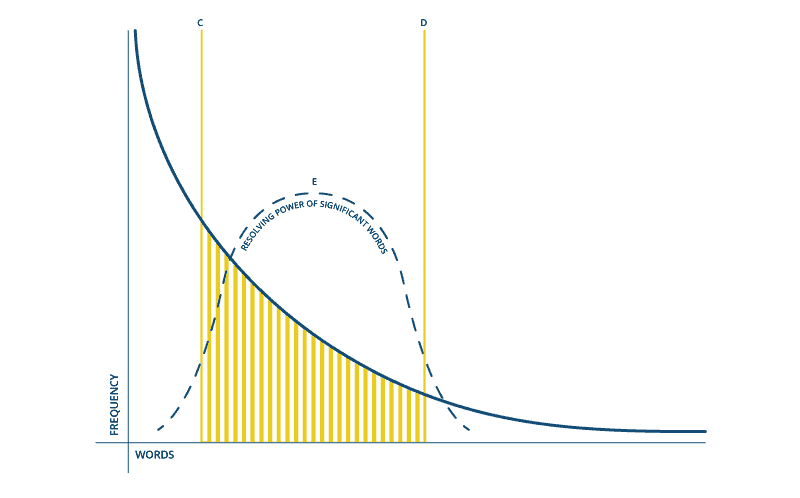
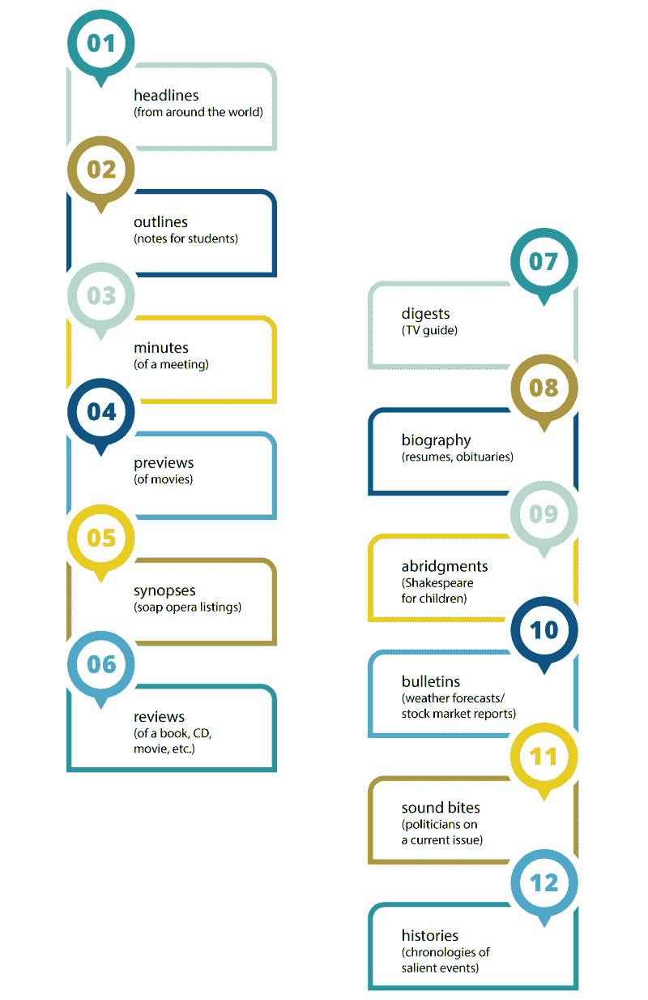
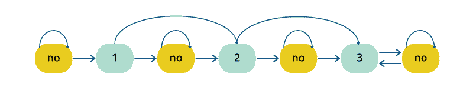
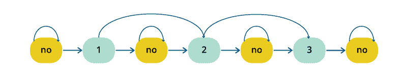

# 自动文本摘要：提取方法

> 原文：[`www.kdnuggets.com/2019/03/towards-automatic-text-summarization.html`](https://www.kdnuggets.com/2019/03/towards-automatic-text-summarization.html)

 评论

**由[Sciforce](https://sciforce.solutions/)**。

对于那些进行学术写作的人来说，总结——*在保持关键信息内容和整体意义的同时，生成简明流畅的摘要的任务*——如果不是噩梦，那就是一个近乎猜测的常规挑战，以确定教授认为重要的内容。尽管基本思路看似简单：找出要点，去除所有意见和细节，然后写几句完美的句子，但任务不可避免地陷入了艰辛与混乱。

另一方面，在现实生活中，我们是完美的总结者：我们可以用一个词描述整部《战争与和平》，无论是“杰作”还是“废话”。我们可以阅读大量关于尖端技术的新闻，并将其总结为“马斯克把特斯拉送上了月球”。

我们期望计算机能够做得更好。人类不完美的地方，情感和意见缺失的人工智能将能够完成这项工作。

故事始于 1950 年代。那时的一项重要研究介绍了一种从文本中提取显著句子的办法，使用[*单词和短语频率*](http://courses.ischool.berkeley.edu/i256/f06/papers/luhn58.pdf)等特征。在这项工作中，Luhl 提议根据高频词的函数加权文档中的句子，忽略非常高频的常见词——这一方法成为了 NLP 的基石之一。

**词频图。横坐标表示按频率排序的单个单词**

目前，专注于摘要的自然语言处理分支已经出现，涵盖了[各种任务](https://www.amazon.com/Advances-Automatic-Text-Summarization-Press/dp/0262133598/ref=as_li_ss_tl?ie=UTF8&qid=1503872626&sr=8-1&keywords=text+summarization&linkCode=sl1&tag=inspiredalgor-20&linkId=75d9f8d62261d17bdddf5c5c0f43881a)：

+   头条（全球新闻）；

+   大纲（学生笔记）；

+   会议记录；

+   预告片（电影）；

+   大纲（肥皂剧列表）；

+   书评（书籍、CD、电影等）；

+   摘要（电视指南）；

+   传记（简历、讣告）；

+   摘要（儿童莎士比亚）；

+   公告（天气预报/股票市场报告）；

+   声音片段（政客对时事的评论）；

+   历史（重要事件的年表）。

文本摘要的方法因输入文档的数量（单个或多个）、目的（通用、特定领域或基于查询）和输出（提取式或抽象式）而异。

**抽取式总结** 指的是识别文本中的重要部分，并逐字生成这些部分，从而产生原文的句子子集；而 **抽象总结** 则是在对文本进行解释和审查后，以一种新的方式再现重要材料，使用先进的自然语言技术生成一个更短的新文本，从中传达原文的最关键信息。

显然，抽象总结更为先进，并且更接近于人类式的解释。尽管它具有更大的潜力（通常也更吸引研究人员和开发者），但到目前为止，传统方法已被证明能够产生更好的结果。

这就是为什么在这篇博客文章中，我们将简要概述这些传统方法，它们为先进的深度学习技术铺平了道路。

到现在为止，所有抽取式总结的核心包括三个独立的任务：

**1) 输入文本的中间表示构建**

表示基础的方法有两种类型：主题表示和指示符表示。主题表示将文本转换为中间表示，并解释文本中讨论的主题。用于这一过程的技术在复杂性上有所不同，分为频率驱动的方法、主题词方法、潜在语义分析和贝叶斯主题模型。指示符表示将每个句子描述为重要形式特征（指示符）的列表，如句子长度、在文档中的位置、包含特定短语等。

2) **基于表示的句子评分**

当生成中间表示后，会为每个句子分配一个重要性评分。在主题表示方法中，句子的评分表示句子解释文本中一些最重要主题的能力。在指示符表示中，评分是通过聚合来自不同加权指示符的证据来计算的。

**3) 选择包含若干句子的摘要**

总结系统选择最重要的 *k* 个句子来生成摘要。一些方法使用贪婪算法来选择重要句子，而有些方法则可能将句子的选择转换为一个优化问题，在考虑到应该最大化整体重要性和连贯性，并最小化冗余的约束下，选择一组句子。

让我们更详细地查看我们提到的方法，并概述它们之间的差异：

### 主题表示方法

### 主题词

这种常见技术旨在识别描述输入文档主题的词。对最初 Luhn 思路的改进是使用对数似然比检验来识别称为[“主题签名”](http://aclweb.org/anthology/J93-1003)的解释性词。一般来说，有两种计算句子重要性的方法：作为其包含的主题签名数量的函数，或作为句子中主题签名的比例。第一种方法给包含更多词的较长句子更高的分数，而第二种方法则测量主题词的密度。

### 基于频率的方法

这种方法使用词频作为重要性的指标。这一类别中最常见的两种技术是：词概率和 TF-IDF（词频逆文档频率）。词 w 的概率是通过将词的出现次数 f (w) 除以输入中所有词的总数来确定的（输入可以是单个文档或多个文档）。概率最高的词被认为代表了文档的主题，并被包含在摘要中。TF-IDF 是一种更复杂的技术，它评估词的重要性，并通过给出现于大多数文档中的词以低权重来识别非常常见的词（这些词应被排除在考虑之外）。TF-IDF 让位于[基于质心的方法](https://dl.acm.org/citation.cfm?id=1036121)，这种方法通过计算一组特征的显著性来对句子进行排序。在创建文档的 TF-IDF 向量表示后，描述相同主题的文档被聚类在一起，并计算质心——这些伪文档由 TF-IDF 分数高于某个阈值的词组成，并形成聚类。之后，质心被用来识别每个聚类中与主题相关的句子。

### 潜在语义分析

[潜在语义分析 (LSA)](http://lsa.colorado.edu/papers/JASIS.lsi.90.pdf)是一种基于观察到的词提取文本语义表示的无监督方法。第一步是建立一个词-句子矩阵，其中每一行对应输入中的一个词（n 个词），每一列对应一个句子。矩阵的每个条目是通过 TF-IDF 技术计算的词 i 在句子 j 中的权重。然后对矩阵进行奇异值分解（SVD），将初始矩阵转换为三个矩阵：一个词-主题矩阵，包含词的权重，一个对角矩阵，每一行对应一个主题的权重，以及一个主题-句子矩阵。如果将带权重的对角矩阵与主题-句子矩阵相乘，结果将描述一个句子代表一个主题的程度，换句话说，就是主题 i 在句子 j 中的权重。

### 话语基础方法

语义分析的逻辑发展是进行话语分析，找到文本单元之间的语义关系，以形成摘要。跨文档关系的研究由 Radev 发起，他提出了[跨文档结构理论 (CST) 模型](http://www.aclweb.org/anthology/W00-1009)。在他的模型中，词语、短语或句子可以互相连接，如果它们在语义上是相关的。CST 确实对文档摘要有用，可以确定句子的相关性以及处理不同数据源之间的重复、互补和不一致性。然而，这种方法的一个显著限制是 CST 关系必须由人工明确确定。

### 贝叶斯主题模型

虽然其他方法没有很清晰的概率解释，但贝叶斯主题模型是概率模型，因其能够更详细地描述主题，能够表示在其他方法中丢失的信息。在文本文档的主题建模中，目标是根据对文档语料库的先验分析，推断与某个主题相关的词汇和某个文档中讨论的主题。这可以通过贝叶斯推理来实现，该推理计算事件的概率，基于常识假设的组合以及之前相关事件的结果。该模型通过多次迭代不断改进，其中先验概率会随着观测证据的增加而更新，以产生新的后验概率。

### 指示符表示方法

第二大类技术旨在基于一组特征来表示文本，并使用这些特征直接对句子进行排名，而不表示输入文本的主题。

### 图方法

受[PageRank 算法](https://web.eecs.umich.edu/~mihalcea/papers/mihalcea.emnlp04.pdf)的影响，这些方法将文档表示为一个连通图，其中句子形成顶点，句子之间的边表示这两个句子的相似程度。两个句子的相似度通过使用 TF-IDF 权重的余弦相似度来测量，如果相似度大于某个阈值，这些句子就会被连接起来。这种图表示的结果有两个：图中包含的子图创建了文档中涉及的主题，并且重要的句子被识别出来。那些在子图中与许多其他句子连接的句子可能是图的中心，并将被包含在摘要中。由于这种方法不需要特定语言的语言学处理，它可以应用于各种语言[43]。与此同时，这种仅仅测量句子结构的形式而没有语法和语义信息的方式限制了该方法的应用。

### 机器学习

目前广泛使用的机器学习方法将摘要视为分类问题，尝试应用朴素贝叶斯、决策树、支持向量机、隐马尔可夫模型和条件随机场来获得真实的摘要。事实证明，明确假设句子之间依赖关系的方法（[隐马尔可夫模型](https://pdfs.semanticscholar.org/1213/3cfc6688cc2cdea57595b045a28b94d98f1d.pdf) 和 [条件随机场](https://pdfs.semanticscholar.org/8ddf/5baeeab2e2fd401c0959a2d70e4c2ba68a33.pdf)）通常优于其他技术。

**图 1：摘要提取马尔可夫模型以提取 2 个主要句子和额外支持句子**

**图 2：摘要提取马尔可夫模型以提取 3 个句子**

然而，分类器的问题在于，如果我们使用监督学习方法进行摘要生成，我们需要一组标记文档来训练分类器，这意味着需要开发一个语料库。一个可能的解决方法是应用半监督方法，将少量标记数据与大量未标记数据结合进行训练。

总体而言，机器学习方法在单文档和多文档摘要生成中都被证明是非常有效和成功的，特别是在特定领域的摘要生成，例如撰写科学论文摘要或传记摘要。

尽管方法丰富，但我们提到的所有摘要方法仍无法生成与人类创建的摘要类似的结果。在许多情况下，生成的摘要在准确性和可读性方面不尽如人意，因为它们未能以有效的方式覆盖数据中的所有语义相关方面，并且之后未能自然地连接句子。

[原文](https://medium.com/sciforce/towards-automatic-text-summarization-extractive-methods-e8439cd54715)。已获得许可转载。

**简介**：[Sciforce](https://sciforce.solutions/) 是一家总部位于乌克兰的 IT 公司，专注于基于科学驱动的信息技术开发软件解决方案。我们在许多关键的人工智能技术领域拥有广泛的专业知识，包括数据挖掘、数字信号处理、自然语言处理、机器学习、图像处理和计算机视觉。

**资源：**

+   [在线和基于网络的：分析、数据挖掘、数据科学、机器学习教育](https://www.kdnuggets.com/education/online.html)

+   [用于分析、数据科学、数据挖掘和机器学习的软件](https://www.kdnuggets.com/software/index.html)

**相关：**

+   [PDF 数据提取：你需要了解的事项](https://www.kdnuggets.com/2019/02/datalogics-pdf-data-extraction.html)

+   [关于 NLP 和文本分析的十大书籍](https://www.kdnuggets.com/2019/01/top-10-books-nlp-text-analysis.html)

+   [Python 中文本预处理：步骤、工具和示例](https://www.kdnuggets.com/2018/11/text-preprocessing-python.html)

* * *

## 我们的前三个课程推荐

 1\. [谷歌网络安全证书](https://www.kdnuggets.com/google-cybersecurity) - 快速开启网络安全职业生涯。

 2\. [谷歌数据分析专业证书](https://www.kdnuggets.com/google-data-analytics) - 提升你的数据分析技能

 3\. [谷歌 IT 支持专业证书](https://www.kdnuggets.com/google-itsupport) - 支持组织的 IT 工作。

* * *

### 更多相关话题

+   [使用 BERT 的提取式摘要](https://www.kdnuggets.com/extractive-summarization-with-llm-using-bert)

+   [深度神经网络不会引领我们走向 AGI](https://www.kdnuggets.com/2021/12/deep-neural-networks-not-toward-agi.html)

+   [规划你的 SAS 认证之旅](https://www.kdnuggets.com/2022/11/sas-map-journey-towards-sas-certification.html)

+   [文本摘要方法概述](https://www.kdnuggets.com/2019/01/approaches-text-summarization-overview.html)

+   [入门自动化文本摘要](https://www.kdnuggets.com/2019/11/getting-started-automated-text-summarization.html)

+   [文本摘要开发：一个基于 GPT-3.5 的 Python 教程](https://www.kdnuggets.com/2023/04/text-summarization-development-python-tutorial-gpt35.html)
