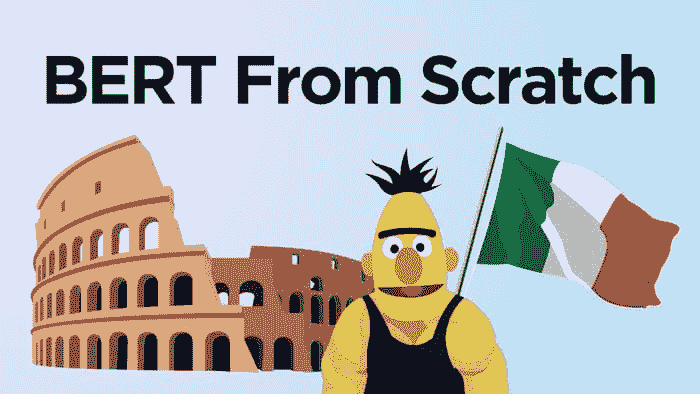
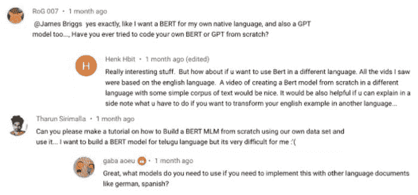
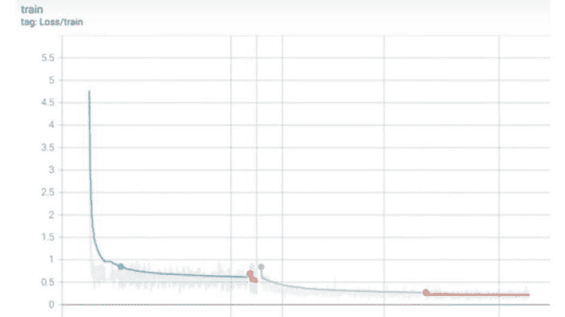

# 如何从零开始训练 BERT 模型

> 原文：[`www.kdnuggets.com/2021/08/train-bert-model-scratch.html`](https://www.kdnuggets.com/2021/08/train-bert-model-scratch.html)

评论

**由[James Briggs](https://youtube.com/c/JamesBriggs)，数据科学家**



BERT，但在意大利——作者提供的图片

我的许多文章集中在 BERT——这一模型的出现主导了自然语言处理（NLP）领域，并为语言模型标志着一个新的时代。

对于那些之前可能没有使用过变换器模型（例如 BERT 是什么）的人，过程看起来有点像这样：

+   `pip install transformers`

+   初始化一个预训练的变换器模型——`from_pretrained`。

+   在一些数据上进行测试。

+   *也许*微调模型（再训练一些）。

现在，这是一种很好的方法，但如果我们只做这个，我们就缺乏创建自己变换器模型的理解。

而且，如果我们不能创建自己的变换器模型——我们必须依赖于有一个适合我们问题的预训练模型，但这并不总是可能的：



一些关于非英语 BERT 模型的评论

所以在这篇文章中，我们将探讨构建自己的变换器模型——特别是 BERT 的进一步发展版本，称为 RoBERTa 的步骤。

## 概述

这个过程有几个步骤，所以在我们深入之前，让我们首先总结一下我们需要做什么。总共有四个关键部分：

+   获取数据

+   构建一个标记器

+   创建输入管道

+   训练模型

一旦我们完成了这些部分，我们将使用我们构建的标记器和模型——并保存它们，以便我们可以像平常一样使用`from_pretrained`。

## 获取数据

和任何机器学习项目一样，我们需要数据。在训练变换器模型的数据方面，我们真的有很多选择——我们几乎可以使用任何文本数据。

使用 HuggingFace 的 datasets 库下载 OSCAR 数据集的视频讲解

而且，如果有一件事我们在互联网上有很多——那就是非结构化文本数据。

领域中最大的互联网文本抓取数据集之一是 OSCAR 数据集。

OSCAR 数据集拥有大量不同的语言——从零开始训练的一个最明确的用例是，我们可以将 BERT 应用于一些不太常用的语言，如泰卢固语或纳瓦荷语。

不幸的是，我唯一可以熟练使用的语言是英语——但我的女朋友是意大利人，她——劳拉，将评估我们意大利语 BERT 模型——FiliBERTo 的结果。

因此，要下载 OSCAR 数据集的意大利语部分，我们将使用 HuggingFace 的`datasets`库——我们可以通过`pip install datasets`安装它。然后我们用以下命令下载 OSCAR_IT：

让我们来看看`dataset`对象。

很好，现在让我们将数据存储为在构建分词器时可以使用的格式。我们需要创建一组仅包含数据集中的`text`特征的纯文本文件，并且我们将使用换行符`\n`拆分每个*样本*。

在我们的`data/text/oscar_it`目录下，我们将找到：


包含我们纯文本 OSCAR 文件的目录

## 构建分词器

接下来是分词器！使用 transformers 时，我们通常加载一个分词器，和相应的 transformer 模型——分词器是过程中的关键组件。

自定义分词器构建的视频演示

在构建我们的分词器时，我们将输入所有的 OSCAR 数据，指定词汇表大小（分词器中的令牌数）和任何特殊令牌。

现在，RoBERTa 的特殊令牌看起来像这样：

因此，我们确保在分词器的`train`方法调用中的`special_tokens`参数中包含它们。

我们的分词器现在准备好了，我们可以将其保存以备后用：

现在我们有两个文件定义了我们新的*FiliBERTo*分词器：

+   *merges.txt* — 执行文本到令牌的初始映射

+   *vocab.json* — 将令牌映射到令牌 ID

有了这些，我们可以继续初始化我们的分词器，以便像使用任何其他`from_pretrained`分词器一样使用它。

## 初始化分词器

我们首先使用之前构建的两个文件初始化分词器——使用简单的`from_pretrained`：

现在我们的分词器准备好了，我们可以尝试使用它编码一些文本。编码时，我们使用通常使用的两种方法，`encode`和`encode_batch`。

从编码对象`tokens`中，我们将提取`input_ids`和`attention_mask`张量，以便与 FiliBERTo 一起使用。

## 创建输入管道

我们训练过程的输入管道是整个过程中的复杂部分。它包括我们处理原始的 OSCAR 训练数据，将其转换，并加载到`DataLoader`中以备训练。

MLM 输入管道的视频演示

## 准备数据

我们将从一个样本开始，并处理准备逻辑。

首先，我们需要打开文件——之前保存为*.txt*文件的相同文件。我们根据换行符`\n`拆分每个文件，因为这标识了单独的样本。

然后我们使用`tokenizer`对数据进行编码——确保包括像`max_length`、`padding`和`truncation`这样的关键参数。

现在我们可以继续创建张量——我们将通过掩码语言建模（MLM）训练我们的模型。因此，我们需要三个张量：

+   ***input_ids*** — 我们的*token_ids*，其中~15%的令牌被掩码令牌`<mask>`遮蔽。

+   ***attention_mask*** — 一个**1**和**0**的张量，标记‘真实’令牌/填充令牌的位置——用于注意力计算。

+   ***labels*** — 我们的*token_ids*，**没有**遮蔽。

如果你不熟悉 MLM，我已经在[这里](https://towardsdatascience.com/masked-language-modelling-with-bert-7d49793e5d2c)解释过了。

我们的`attention_mask`和`labels`张量直接从我们的`batch`中提取。然而，`input_ids`张量需要更多关注，对于这个张量，我们将约 15%的标记进行掩码处理——为它们分配标记 ID `3`。

在最终输出中，我们可以看到部分编码的`input_ids`张量。第一个标记 ID 是`1`——`[CLS]`标记。张量中点缀着几个`3`标记 ID——这些是我们新添加的`[MASK]`标记。

## 构建 DataLoader

接下来，我们定义我们的`Dataset`类——我们用它来初始化我们三个编码的张量作为 PyTorch `torch.utils.data.Dataset`对象。

最终，我们的`dataset`被加载到一个 PyTorch `DataLoader`对象中——我们在训练期间用来将数据加载到模型中。

## 训练模型

我们训练所需的两个东西是我们的`DataLoader`和一个模型。我们有`DataLoader`——但没有模型。

## 初始化模型

对于训练，我们需要一个原始（未预训练的）`BERTLMHeadModel`。为了创建它，我们首先需要创建一个 RoBERTa 配置对象来描述我们希望用来初始化 FiliBERTo 的参数。

然后，我们导入并初始化我们的 RoBERTa 模型，附带语言建模（LM）头。

## 训练准备

在进入训练循环之前，我们需要设置一些东西。首先，我们设置 GPU/CPU 使用情况。然后，我们激活模型的训练模式——最后，初始化我们的优化器。

## 训练

最后——训练时间！我们就像平常训练 PyTorch 时那样训练。

如果我们前往 Tensorboard，我们会发现我们的损失随时间的变化——看起来很有希望。



损失/时间——图表中显示了多个训练会话的综合情况

## 实际测试

现在是时候进行真正的测试了。我们设置一个 MLM 管道——并请 Laura 评估结果。你可以在这里 22:44 观看视频评论：

我们首先初始化一个`pipeline`对象，使用`'fill-mask'`参数。然后开始这样测试我们的模型：

*“ciao ****come**** va?”*是正确的答案！这就是我的意大利语水平——所以，让我们交给 Laura 吧。

我们从*“buongiorno, come va?”*——或*“早安，你好吗？”*开始：

第一个答案，“buongiorno, chi va?”意思是“早安，谁在那？”——即毫无意义。但我们的第二个答案是正确的！

接下来是一个稍微复杂一点的短语，*“ciao, dove ci incontriamo oggi pomeriggio?”*——或*“你好，我们今天下午在哪里见面？”*：

我们得到了一些更积极的结果：

```py
✅ "hi, where do we see each other this afternoon?"
✅ "hi, where do we meet this afternoon?"
❌ "hi, where here we are this afternoon?"
✅ "hi, where are we meeting this afternoon?"
✅ "hi, where do we meet this afternoon?"
```

最后，再来一个更复杂的句子，*“cosa sarebbe successo se avessimo scelto un altro giorno?”*——或“如果我们选择了另一天，会发生什么？”：

我们在这里也返回了几个好的答案：

```py
✅ "what would have happened if we had chosen another day?"
✅ "what would have happened if I had chosen another day?"
✅ "what would have happened if they had chosen another day?"
✅ "what would have happened if you had chosen another day?"
❌ "what would have happened if another day was chosen?"
```

总体来看，我们的模型通过了 Laura 的测试——现在我们有了一个称为 FiliBERTo 的意大利语模型！

这就是从头开始训练 BERT 模型的流程！

我们已经涵盖了大量内容，从获取和格式化数据开始，一直到使用语言建模训练我们的原始 BERT 模型。

希望您喜欢这篇文章！如果您有任何问题，请通过 [Twitter](https://twitter.com/jamescalam) 或在下方评论中告诉我。如果您希望获得更多类似的内容，我也会在 [YouTube](https://www.youtube.com/c/jamesbriggs) 上发布。

感谢阅读！

### 70% 折扣！自然语言处理：Python 中的 NLP 与 Transformers

Transformer 模型是现代 NLP 的事实标准。它们已经证明自己是最具表现力的…

**除非另有说明，所有图片均由作者提供**

**简介：[詹姆斯·布里格斯](https://youtube.com/c/JamesBriggs)** 是一位数据科学家，专注于自然语言处理，工作于金融行业，总部设在英国伦敦。他还是一名自由职业的导师、作家和内容创作者。您可以通过电子邮件联系作者（jamescalam94@gmail.com）。

[原文](https://towardsdatascience.com/how-to-train-a-bert-model-from-scratch-72cfce554fc6)。经许可转载。

**相关：**

+   如何将 Transformers 应用于任意长度文本

+   使用 Hugging Face 理解 BERT

+   使用 BERT 进行主题建模

* * *

## 我们的前三大课程推荐

 1\. [谷歌网络安全证书](https://www.kdnuggets.com/google-cybersecurity) - 快速进入网络安全职业的捷径。

 2\. [谷歌数据分析专业证书](https://www.kdnuggets.com/google-data-analytics) - 提升您的数据分析能力

 3\. [谷歌 IT 支持专业证书](https://www.kdnuggets.com/google-itsupport) - 支持您的组织的 IT 部门

* * *

### 相关主题

+   [如何从头开始使用 Hugging Face Transformers 构建和训练 Transformer 模型](https://www.kdnuggets.com/how-to-build-and-train-a-transformer-model-from-scratch-with-hugging-face-transformers)

+   [使用 Tensorflow 训练图像分类模型指南](https://www.kdnuggets.com/2022/12/guide-train-image-classification-model-tensorflow.html)

+   [使用 HuggingFace 微调 BERT 进行推文分类](https://www.kdnuggets.com/2022/01/finetuning-bert-tweets-classification-ft-hugging-face.html)

+   [使用 BERT 对长文本进行分类](https://www.kdnuggets.com/2022/02/classifying-long-text-documents-bert.html)

+   [BERT 在稀疏性条件下能多快？](https://www.kdnuggets.com/2022/04/fast-bert-go-sparsity.html)

+   [8 篇创新的 BERT 知识蒸馏论文，它们改变了…](https://www.kdnuggets.com/2022/09/eight-innovative-bert-knowledge-distillation-papers-changed-nlp-landscape.html)
