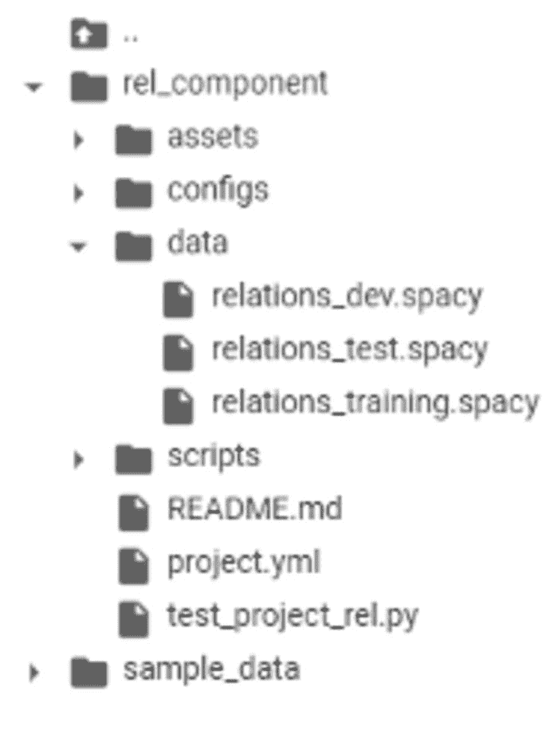
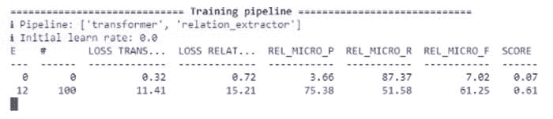
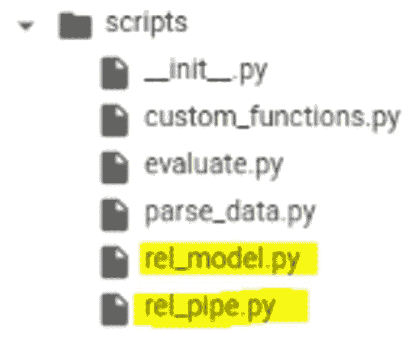

# 如何使用 BERT Transformer 和 spaCy 3 训练联合实体和关系提取分类器

> 原文：[`www.kdnuggets.com/2021/06/train-joint-entities-relation-extraction-classifier-bert-spacy.html`](https://www.kdnuggets.com/2021/06/train-joint-entities-relation-extraction-classifier-bert-spacy.html)

评论

**作者 [Walid Amamou](https://www.linkedin.com/in/walid-amamou-b65105b9/)，UBIAI 创始人**


图片由[JJ Ying](https://unsplash.com/@jjying?utm_source=unsplash&utm_medium=referral&utm_content=creditCopyText)提供，来自[Unsplash](https://unsplash.com/s/photos/science?utm_source=unsplash&utm_medium=referral&utm_content=creditCopyText)

### **介绍**

自然语言处理技术最有用的应用之一是从非结构化文本中提取信息——合同、财务文件、医疗记录等——这使得自动数据查询成为可能，以得出新的见解。传统上，命名实体识别被广泛用于识别文本中的实体，并存储数据以进行高级查询和过滤。然而，如果我们想从语义上理解非结构化文本，**仅仅依靠 NER 是不够的，因为我们不知道实体之间的关系**。进行联合 NER 和关系提取将开启通过知识图谱进行信息检索的全新方式，你可以在不同节点之间导航，发现隐藏的关系。因此，联合执行这些任务将是有益的。

基于我之前的[文章](https://towardsdatascience.com/how-to-fine-tune-bert-transformer-with-spacy-3-6a90bfe57647)，我们微调了一个 BERT 模型用于 NER，现在我们将使用 spaCy 的新 Thinc 库在管道中添加关系提取。我们按照[spaCy 的文档](https://spacy.io/usage/layers-architectures#component-rel)中概述的步骤训练关系提取模型。我们将比较使用 transformers 和 tok2vec 算法的关系分类器的性能。最后，我们将在网上找到的职位描述上测试模型。

### **关系分类：**

从本质上讲，关系提取模型是一个分类器，用于预测给定实体对**{e1, e2}**的关系**r**。在 transformers 的情况下，这个分类器被添加到输出的隐藏状态之上。有关关系提取的更多信息，请阅读这篇出色的[文章](https://towardsdatascience.com/bert-s-for-relation-extraction-in-nlp-2c7c3ab487c4)，概述了微调 transformer 模型进行关系分类的理论。

我们将微调的预训练模型是 roberta-base 模型，但你可以使用 huggingface 库中任何可用的预训练模型，只需在配置文件中输入模型名称即可（见下文）。

在本教程中，我们将提取两个实体{Experience, Skills}之间的关系作为**Experience_in**，以及{Diploma, Diploma_major}之间的关系作为**Degree_in**。目标是提取特定技能所需的经验年限和与所需文凭相关的文凭专业。你当然可以训练自己的关系分类器以适应自己的用例，例如在健康记录中查找症状的因果关系或在财务文档中查找公司收购。可能性是无限的……

在本教程中，我们将仅涵盖实体关系抽取部分。有关使用 spaCy 3 对 BERT NER 进行微调的详细信息，请参考我的[上一篇文章](https://towardsdatascience.com/how-to-fine-tune-bert-transformer-with-spacy-3-6a90bfe57647)。

### **数据标注：**

如在我的[上一篇文章](https://towardsdatascience.com/how-to-fine-tune-bert-transformer-with-spacy-3-6a90bfe57647)中所述，我们使用[UBIAI](https://ubiai.tools/)文本标注工具进行联合实体和关系标注，因为它的多功能接口允许我们轻松切换实体和关系标注（见下图）：


UBIAI 的联合实体和关系标注接口

对于本教程，我仅标注了大约 100 个包含实体和关系的文档。对于生产环境，我们肯定需要更多的标注数据。

### **数据准备：**

在训练模型之前，我们需要将标注数据转换为二进制 spacy 文件。我们首先将 UBIAI 生成的标注拆分为训练/开发/测试，并分别保存。我们修改了[代码](https://github.com/explosion/projects/blob/v3/tutorials/rel_component/scripts/parse_data.py/)来创建适用于我们标注的二进制文件（[转换代码](https://github.com/walidamamou/relation_extraction_transformer)）。

我们对训练、开发和测试数据集重复此步骤，以生成三个二进制的 spacy 文件（[文件可在 GitHub 上获取](https://github.com/walidamamou/relation_extraction_transformer)）。

### **关系抽取模型训练：**

对于训练，我们将提供来自黄金语料库的实体，并在这些实体上训练分类器。

+   打开一个新的 Google Colab 项目，并确保在笔记本设置中选择 GPU 作为硬件加速器。通过运行：!nvidia-smi 来确保启用 GPU。

+   安装 spacy-nightly：

```py
!pip install -U spacy-nightly --pre
```

+   安装 wheel 包并克隆 spacy 的关系抽取仓库：

```py
!pip install -U pip setuptools wheel
!python -m spacy project clone tutorials/rel_component
```

+   安装 transformer 管道和 spacy transformers 库：

```py
!python -m spacy download en_core_web_trf
!pip install -U spacy transformers
```

+   切换到 rel_component 文件夹：cd rel_component

+   在 rel_component 中创建一个名为“data”的文件夹，并将训练、开发和测试的二进制文件上传到其中：



训练文件夹

+   打开 project.yml 文件并更新训练、开发和测试路径：

```py
train_file: "data/relations_training.spacy"dev_file: "data/relations_dev.spacy"test_file: "data/relations_test.spacy"
```

+   如果你想使用不同的语言，可以通过进入 configs/rel_trf.cfg 并输入模型名称来更改预训练的 Transformer 模型：

```py
[components.transformer.model]@architectures = "spacy-transformers.TransformerModel.v1"name = "roberta-base" # Transformer model from huggingfacetokenizer_config = {"use_fast": true}
```

+   在开始训练之前，我们将 configs/rel_trf.cfg 中的 max_length 从默认的 100 个标记减少到 20，以提高模型的效率。max_length 对应于 **最大距离**，超出此距离的两个实体将不会被考虑进行关系分类。因此，同一文档中的两个实体将被分类，只要它们之间的最大距离（以标记数量计）在范围内。

```py
[components.relation_extractor.model.create_instance_tensor.get_instances]@misc = "rel_instance_generator.v1"max_length = 20
```

+   我们终于准备好训练和评估关系提取模型；只需运行以下命令：

```py
!spacy project run train_gpu # command to train train transformers
!spacy project run evaluate # command to evaluate on test dataset
```

你应该开始看到 P、R 和 F 分数开始更新：



模型训练进行中

模型训练完成后，测试数据集的评估将立即开始，并显示预测标签与实际标签的对比。模型将保存在名为“training”的文件夹中，并附带模型的评分。

要训练非 Transformer 模型 tok2vec，请运行以下命令：

```py
!spacy project run train_cpu # command to train train tok2vec
!spacy project run evaluate
```

我们可以比较这两种模型的性能：

```py
# Transformer model
"performance":{"rel_micro_p":0.8476190476,"rel_micro_r":0.9468085106,"rel_micro_f":0.8944723618,}
# Tok2vec model
  "performance":{"rel_micro_p":0.8604651163,"rel_micro_r":0.7872340426,"rel_micro_f":0.8222222222,}
```

基于 Transformer 的模型在精度和召回率方面显著优于 tok2vec，展示了在处理少量标注数据时 Transformer 的有效性。

### **联合实体和关系提取管道：**

假设我们已经训练了一个 Transformer NER 模型，如我的 [上一篇文章](https://towardsdatascience.com/how-to-fine-tune-bert-transformer-with-spacy-3-6a90bfe57647) 中所述，我们将从在线找到的工作描述中提取实体（这些数据既不属于训练集也不属于开发集），并将其输入到关系提取模型中进行分类。

+   安装 spacy transformers 和 transformer pipeline

+   加载 NER 模型并提取实体：

```py
import spacynlp = spacy.load("NER Model Repo/model-best")Text=['''2+ years of non-internship professional software development experience
Programming experience with at least one modern language such as Java, C++, or C# including object-oriented design.1+ years of experience contributing to the architecture and design (architecture, design patterns, reliability and scaling) of new and current systems.Bachelor / MS Degree in Computer Science. Preferably a PhD in data science.8+ years of professional experience in software development. 2+ years of experience in project management.Experience in mentoring junior software engineers to improve their skills, and make them more effective, product software engineers.Experience in data structures, algorithm design, complexity analysis, object-oriented design.3+ years experience in at least one modern programming language such as Java, Scala, Python, C++, C#Experience in professional software engineering practices & best practices for the full software development life cycle, including coding standards, code reviews, source control management, build processes, testing, and operationsExperience in communicating with users, other technical teams, and management to collect requirements, describe software product features, and technical designs.Experience with building complex software systems that have been successfully delivered to customersProven ability to take a project from scoping requirements through actual launch of the project, with experience in the subsequent operation of the system in production''']for doc in nlp.pipe(text, disable=["tagger"]):   print(f"spans: {[(e.start, e.text, e.label_) for e in doc.ents]}")
```

+   我们打印提取的实体：

```py
spans: [(0, '2+ years', 'EXPERIENCE'), (7, 'professional software development', 'SKILLS'), (12, 'Programming', 'SKILLS'), (22, 'Java', 'SKILLS'), (24, 'C++', 'SKILLS'), (27, 'C#', 'SKILLS'), (30, 'object-oriented design', 'SKILLS'), (36, '1+ years', 'EXPERIENCE'), (41, 'contributing to the', 'SKILLS'), (46, 'design', 'SKILLS'), (48, 'architecture', 'SKILLS'), (50, 'design patterns', 'SKILLS'), (55, 'scaling', 'SKILLS'), (60, 'current systems', 'SKILLS'), (64, 'Bachelor', 'DIPLOMA'), (68, 'Computer Science', 'DIPLOMA_MAJOR'), (75, '8+ years', 'EXPERIENCE'), (82, 'software development', 'SKILLS'), (88, 'mentoring junior software engineers', 'SKILLS'), (103, 'product software engineers', 'SKILLS'), (110, 'data structures', 'SKILLS'), (113, 'algorithm design', 'SKILLS'), (116, 'complexity analysis', 'SKILLS'), (119, 'object-oriented design', 'SKILLS'), (135, 'Java', 'SKILLS'), (137, 'Scala', 'SKILLS'), (139, 'Python', 'SKILLS'), (141, 'C++', 'SKILLS'), (143, 'C#', 'SKILLS'), (148, 'professional software engineering', 'SKILLS'), (151, 'practices', 'SKILLS'), (153, 'best practices', 'SKILLS'), (158, 'software development', 'SKILLS'), (164, 'coding', 'SKILLS'), (167, 'code reviews', 'SKILLS'), (170, 'source control management', 'SKILLS'), (174, 'build processes', 'SKILLS'), (177, 'testing', 'SKILLS'), (180, 'operations', 'SKILLS'), (184, 'communicating', 'SKILLS'), (193, 'management', 'SKILLS'), (199, 'software product', 'SKILLS'), (204, 'technical designs', 'SKILLS'), (210, 'building complex software systems', 'SKILLS'), (229, 'scoping requirements', 'SKILLS')]
```

我们成功提取了所有的技能、工作经验年限、文凭和文凭专业！接下来我们加载关系提取模型，并分类实体之间的关系。

注意：确保从脚本文件夹中复制 `rel_pipe` 和 `rel_model` 到你的主文件夹：



脚本文件夹

```py
import randomimport typerfrom pathlib import Pathimport spacyfrom spacy.tokens import DocBin, Docfrom spacy.training.example import Examplefrom rel_pipe import make_relation_extractor, score_relationsfrom rel_model import create_relation_model, create_classification_layer, create_instances, create_tensors# We load the relation extraction (REL) modelnlp2 = spacy.load("training/model-best")# We take the entities generated from the NER pipeline and input them to the REL pipelinefor name, proc in nlp2.pipeline:
          doc = proc(doc)# Here, we split the paragraph into sentences and apply the relation extraction for each pair of entities found in each sentence.for value, rel_dict in doc._.rel.items():
        for sent in doc.sents:
          for e in sent.ents:
            for b in sent.ents:
              if e.start == value[0] and b.start == value[1]:
                if rel_dict['EXPERIENCE_IN'] >=0.9 :
                  print(f" entities: {e.text, b.text} --> predicted relation: {rel_dict}")
```

在这里，我们显示所有具有关系 **Experience_in** 且置信度高于 90% 的实体：

```py
"entities":("2+ years", "professional software development"") --> **predicted relation**":
{"DEGREE_IN":1.2778723e-07,"EXPERIENCE_IN":0.9694631}"entities":"(""1+ years", "contributing to the"") -->
**predicted relation**":
{"DEGREE_IN":1.4581254e-07,"EXPERIENCE_IN":0.9205434}"entities":"(""1+ years","design"") --> 
**predicted relation**":
{"DEGREE_IN":1.8895419e-07,"EXPERIENCE_IN":0.94121873}"entities":"(""1+ years","architecture"") --> 
**predicted relation**":
{"DEGREE_IN":1.9635708e-07,"EXPERIENCE_IN":0.9399484}"entities":"(""1+ years","design patterns"") --> 
**predicted relation**":
{"DEGREE_IN":1.9823732e-07,"EXPERIENCE_IN":0.9423302}"entities":"(""1+ years", "scaling"") --> 
**predicted relation**":
{"DEGREE_IN":1.892173e-07,"EXPERIENCE_IN":0.96628445}entities: ('2+ years', 'project management') --> 
**predicted relation**:
{'DEGREE_IN': 5.175297e-07, 'EXPERIENCE_IN': 0.9911635}"entities":"(""8+ years","software development"") -->
**predicted relation**":
{"DEGREE_IN":4.914319e-08,"EXPERIENCE_IN":0.994812}"entities":"(""3+ years","Java"") -->
**predicted relation**":
{"DEGREE_IN":9.288566e-08,"EXPERIENCE_IN":0.99975795}"entities":"(""3+ years","Scala"") --> 
**predicted relation**":
{"DEGREE_IN":2.8477e-07,"EXPERIENCE_IN":0.99982494}"entities":"(""3+ years","Python"") -->
**predicted relation**":
{"DEGREE_IN":3.3149718e-07,"EXPERIENCE_IN":0.9998517}"entities":"(""3+ years","C++"") -->
**predicted relation**":
{"DEGREE_IN":2.2569053e-07,"EXPERIENCE_IN":0.99986637}
```

值得注意的是，我们几乎能够正确提取所有的经验年限及其相应的技能，没有假阳性或假阴性！

让我们查看具有关系 **Degree_in** 的实体：

```py
entities: ('Bachelor / MS', 'Computer Science') -->
predicted relation: 
{'DEGREE_IN': 0.9943974, 'EXPERIENCE_IN':1.8361954e-09} entities: ('PhD', 'data science') --> predicted relation: {'DEGREE_IN': 0.98883855, 'EXPERIENCE_IN': 5.2092592e-09}
```

再次，我们成功提取了所有文凭和文凭专业之间的关系！

这再次展示了如何利用少量标注数据将 Transformer 模型微调到你特定的领域，无论是用于 NER 还是关系提取。

仅用一百份注释文档，我们就能够训练出表现良好的关系分类器。此外，我们可以利用这个初始模型自动注释更多的未标记数据，并进行最小的修正。这可以显著加快注释过程并提升模型表现。

### **结论：**

Transformer 确实改变了 NLP 领域，我特别期待它们在信息提取中的应用。我要感谢 explosion AI（spaCy 开发者）和 huggingface 提供的开源解决方案，促进了 Transformer 的采用。

如果你需要为项目进行数据注释，不要犹豫尝试 [UBIAI](https://ubiai.tools/) 注释工具。我们提供多种可编程标签解决方案（如 ML 自动注释、正则表达式、字典等），以减少人工注释。

最后，查看 [这篇文章](https://walidamamou.medium.com/building-a-knowledge-graph-for-job-search-using-bert-transformer-8677c8b3a2e7) 以学习如何利用 NER 和关系提取模型构建知识图谱并提取新见解。

如果你有任何评论，请在下方留言或发送邮件至 admin@ubiai.tools！

**简历： [Walid Amamou](https://www.linkedin.com/in/walid-amamou-b65105b9/)** 是 UBIAI 的创始人，该工具用于 NLP 应用注释，并拥有物理学博士学位。

[原始文章](https://towardsdatascience.com/how-to-train-a-joint-entities-and-relation-extraction-classifier-using-bert-transformer-with-spacy-49eb08d91b5c)。转载许可。

**相关：**

+   如何使用 spaCy 3 微调 BERT Transformer

+   使用 BERT 构建求职知识图谱

+   微调 Transformer 模型以识别发票

* * *

## 我们的前三个课程推荐

 1\. [Google 网络安全证书](https://www.kdnuggets.com/google-cybersecurity) - 快速进入网络安全职业。

 2\. [Google 数据分析专业证书](https://www.kdnuggets.com/google-data-analytics) - 提升你的数据分析技能

 3\. [Google IT 支持专业证书](https://www.kdnuggets.com/google-itsupport) - 支持你的组织在 IT 方面

* * *

### 更多相关话题

+   [如何从头开始构建和训练 Transformer 模型…](https://www.kdnuggets.com/how-to-build-and-train-a-transformer-model-from-scratch-with-hugging-face-transformers)

+   [使用 spaCy 进行 NLP 入门](https://www.kdnuggets.com/2022/11/getting-started-spacy-nlp.html)

+   [使用 spaCy 进行自然语言处理](https://www.kdnuggets.com/2023/01/natural-language-processing-spacy.html)

+   [从理论到实践：构建 k-最近邻分类器](https://www.kdnuggets.com/2023/06/theory-practice-building-knearest-neighbors-classifier.html)

+   [使用 BERT 对长文本进行分类](https://www.kdnuggets.com/2022/02/classifying-long-text-documents-bert.html)

+   [使用 BERT 的提取式摘要生成](https://www.kdnuggets.com/extractive-summarization-with-llm-using-bert)
