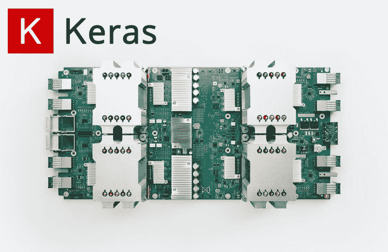
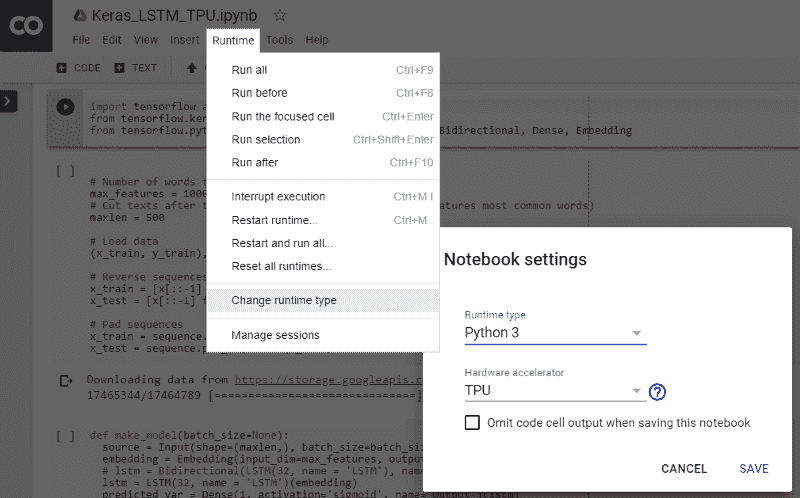

# 如何利用 TPU 免费将 Keras 模型训练速度提高 20 倍

> 原文：[`www.kdnuggets.com/2019/03/train-keras-model-20x-faster-tpu-free.html`](https://www.kdnuggets.com/2019/03/train-keras-model-20x-faster-tpu-free.html)

 评论

**作者：[Chengwei Zhang](https://www.dlology.com/)，上海工业技术研究院 / 程序员 / 创客**



有段时间，我一直很满足于在一张 GTX 1070 显卡上训练我的模型，该显卡单精度约为 8.18 TFlops，然后谷歌在 Colab 上开放了他们的免费 Tesla K80 GPU，具有 12GB RAM，速度略快，为 8.73 TFlops。直到最近，Cloud TPU 选项以 180 TFlops 出现在 Colab 的运行时类型选择器中。在这个快速教程中，你将学习如何将现有的 Keras 模型转换为 TPU 模型，并在 Colab 上以免费方式训练，速度比我的 GTX1070 快 20 倍。

我们将构建一个易于理解但足够复杂的 Keras 模型，以便稍微热身 Cloud TPU。在 IMDB 情感分类任务上训练 LSTM 模型是一个很好的例子，因为 LSTM 的训练计算开销可能比 Dense 和卷积等其他层更大。

工作流程概述，

+   构建一个用于训练的 Keras 模型，在功能性 API 中使用静态输入`batch_size`。

+   将 Keras 模型转换为 TPU 模型。

+   使用静态`batch_size * 8`训练 TPU 模型，并将权重保存到文件中。

+   构建一个用于推断的 Keras 模型，保持相同的结构，但批量输入大小可变。

+   加载模型权重。

+   使用推断模型进行预测。

**你可以在阅读的同时玩转 Colab Jupyter 笔记本——[Keras_LSTM_TPU.ipynb](https://colab.research.google.com/drive/1QZf1WeX3EQqBLeFeT4utFKBqq-ogG1FN)。**

首先，按照下图中的说明激活 Colab 运行时中的 TPU。

激活 TPU

### 静态输入批量大小

在 CPU 和 GPU 上运行的输入管道大多不受静态形状要求的限制，而在 XLA/TPU 环境中，静态形状和批量大小是强制要求的。

Cloud TPU 包含 8 个 TPU 核心，这些核心作为独立的处理单元进行操作。除非使用所有八个核心，否则 TPU 不会被充分利用。为了通过矢量化完全加速训练，我们可以选择比在单个 GPU 上训练相同模型时更大的批量大小。总批量大小为 1024（每核心 128）通常是一个不错的起点。

如果你打算训练一个较大的模型，批量大小过大时，尝试逐渐减少批量大小，直到它适合 TPU 内存，同时确保总批量大小是 64 的倍数（每核心的批量大小应为 8 的倍数）。

还值得提到的是，当使用更大的批次大小进行训练时，通常可以安全地增加优化器的学习率，以实现更快的收敛。你可以在这篇论文中找到参考——“[准确的大规模小批量 SGD: 1 小时内训练 ImageNet](https://arxiv.org/pdf/1706.02677.pdf)”。

在 Keras 中，为了定义一个静态的批次大小，我们使用其函数式 API 然后为 Input 层指定`batch_size`参数。注意，模型在一个函数中构建，该函数接受一个`batch_size`参数，因此我们可以稍后返回以创建另一个模型，用于在 CPU 或 GPU 上运行的推理，这需要接受可变批次大小的输入。

```py

import tensorflow as tf
from tensorflow.python.keras.layers import Input, LSTM, Bidirectional, Dense, Embedding

def make_model(batch_size=None):
    source = Input(shape=(maxlen,), batch_size=batch_size,
                   dtype=tf.int32, name='Input')
    embedding = Embedding(input_dim=max_features,
                          output_dim=128, name='Embedding')(source)
    lstm = LSTM(32, name='LSTM')(embedding)
    predicted_var = Dense(1, activation='sigmoid', name='Output')(lstm)
    model = tf.keras.Model(inputs=[source], outputs=[predicted_var])
    model.compile(
        optimizer=tf.train.RMSPropOptimizer(learning_rate=0.01),
        loss='binary_crossentropy',
        metrics=['acc'])
    return model

training_model = make_model(batch_size=128)

```

此外，使用 `tf.train.Optimizer` 而不是标准的 Keras 优化器，因为 Keras 优化器对 TPU 的支持仍在实验阶段。

### 将 Keras 模型转换为 TPU 模型

`tf.contrib.tpu.keras_to_tpu_model` 函数将 `tf.keras` 模型转换为等效的 TPU 版本。

```py

import os
import tensorflow as tf
# This address identifies the TPU we'll use when configuring TensorFlow.
TPU_WORKER = 'grpc://' + os.environ['COLAB_TPU_ADDR']
tf.logging.set_verbosity(tf.logging.INFO)

tpu_model = tf.contrib.tpu.keras_to_tpu_model(
    training_model,
    strategy=tf.contrib.tpu.TPUDistributionStrategy(
        tf.contrib.cluster_resolver.TPUClusterResolver(TPU_WORKER)))

```

然后我们使用标准的 Keras 方法来训练、保存权重和评估模型。注意，由于输入样本均匀分布在 8 个 TPU 核心上，`batch_size` 设置为模型输入 `batch_size` 的八倍。

```py

history = tpu_model.fit(x_train, y_train,
                        epochs=20,
                        batch_size=128 * 8,
                        validation_split=0.2)
tpu_model.save_weights('./tpu_model.h5', overwrite=True)
tpu_model.evaluate(x_test, y_test, batch_size=128 * 8)

```

我设置了一个实验来比较在我的 Windows PC 上本地运行的单个 GTX1070 和 Colab 上的 TPU 之间的训练速度，结果如下。

GPU 和 TPU 都接受 128 的输入批次大小，

GPU: **每个 epoch 179 秒**。20 个 epoch 达到 76.9% 的验证准确率，总共 3600 秒。

TPU: **每个 epoch 5 秒**，除了第一个 epoch 需要 49 秒。20 个 epoch 达到 95.2% 的验证准确率，总共 150 秒。

TPU 在 20 个 epoch 后的验证准确率高于 GPU，这可能是由于一次训练 8 批次每批次 128 个样本所致。

### 在 CPU 上进行推理

一旦我们有了模型权重，我们可以像往常一样加载它，并在另一个设备如 CPU 或 GPU 上进行预测。我们还希望推理模型能够接受灵活的输入批次大小，这可以通过之前的`make_model()`函数来实现。

```py

inferencing_model = make_model(batch_size=None)
inferencing_model.load_weights('./tpu_model.h5')
inferencing_model.summary()

```

你可以看到推理模型现在接受可变的输入样本，

```py
_________________________________________________________________
Layer (type) Output Shape Param #
=================================================================
Input (InputLayer) (None, 500) 0
_________________________________________________________________
Embedding (Embedding) (None, 500, 128) 1280000
_________________________________________________________________
LSTM (LSTM) (None, 32) 20608
_________________________________________________________________
Output (Dense) (None, 1) 33
=================================================================
```

然后你可以使用标准的 `fit()`、`evaluate()` 函数与推理模型一起使用。

### 结论和进一步阅读

本快速教程展示了如何利用 Google Colab 上免费的 Cloud TPU 资源更快地训练 Keras 模型。

[Cloud TPU 文档](https://cloud.google.com/tpu/docs/)

[Cloud TPU 性能指南](https://cloud.google.com/tpu/docs/performance-guide)

[Cloud TPU 故障排除指南](https://cloud.google.com/tpu/docs/troubleshooting)

[XLA 概述](https://www.tensorflow.org/performance/xla/)

[在 Twitter 上分享](https://twitter.com/intent/tweet?url=https%3A//www.dlology.com/blog/how-to-train-keras-model-x20-times-faster-with-tpu-for-free/&text=How%20to%20train%20Keras%20model%20x20%20times%20faster%20with%20TPU%20for%20free) [在 Facebook 上分享](https://www.facebook.com/sharer/sharer.php?u=https://www.dlology.com/blog/how-to-train-keras-model-x20-times-faster-with-tpu-for-free/)

**简介：[Chengwei Zhang](https://www.dlology.com/)** 是一名对深度学习和自然语言处理领域感兴趣的程序员。

[原文](https://medium.com/swlh/how-to-train-keras-model-x20-times-faster-with-tpu-for-free-cac6cf5089cb)。经许可转载。

**相关：**

+   在 Google Colab 中使用 Hyperas 调整 Keras 超参数

+   使用 Keras 长短期记忆（LSTM）模型预测股票价格

+   3 个必备的 Google Colaboratory 提示和技巧

* * *

## 我们的三大课程推荐

 1\. [谷歌网络安全证书](https://www.kdnuggets.com/google-cybersecurity) - 快速进入网络安全职业。

 2\. [谷歌数据分析专业证书](https://www.kdnuggets.com/google-data-analytics) - 提升你的数据分析能力

 3\. [谷歌 IT 支持专业证书](https://www.kdnuggets.com/google-itsupport) - 支持你所在的组织的 IT

* * *

### 更多相关主题

+   [推出 TPU v4：谷歌领先的超级计算机，用于大规模…](https://www.kdnuggets.com/2023/04/introducing-tpu-v4-googles-cutting-edge-supercomputer-large-language-models.html)

+   [使用 Tensorflow 训练图像分类模型的指南](https://www.kdnuggets.com/2022/12/guide-train-image-classification-model-tensorflow.html)

+   [如何从头开始构建和训练 Transformer 模型…](https://www.kdnuggets.com/how-to-build-and-train-a-transformer-model-from-scratch-with-hugging-face-transformers)

+   [使用 TensorFlow 和 Keras 构建和训练你的第一个神经网络](https://www.kdnuggets.com/2023/05/building-training-first-neural-network-tensorflow-keras.html)

+   [Keras 3.0：你需要知道的一切](https://www.kdnuggets.com/2023/07/keras-30-everything-need-know.html)

+   [为什么我们总是需要人类来训练 AI —— 有时是实时的](https://www.kdnuggets.com/2021/12/why-we-need-humans-training-ai.html)
