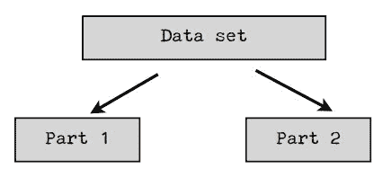
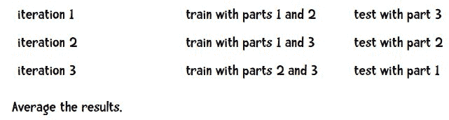
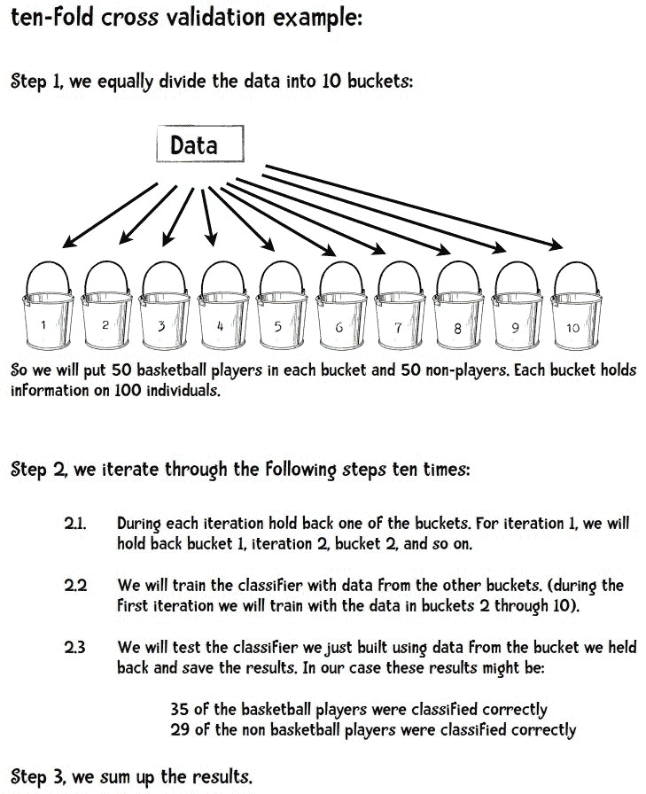
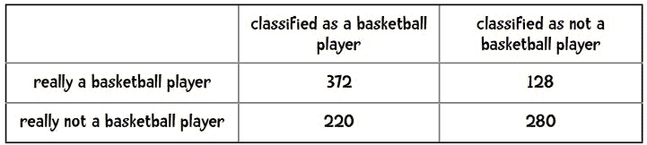
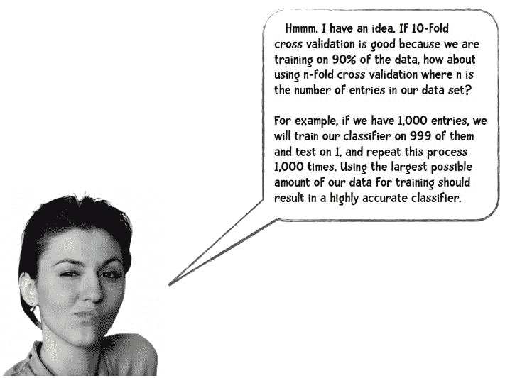

# 训练集、测试集和 10 折交叉验证

> 原文：[`www.kdnuggets.com/2018/01/training-test-sets-cross-validation.html`](https://www.kdnuggets.com/2018/01/training-test-sets-cross-validation.html)

 评论

**由[Ron Zacharski](http://zacharski.org/)，[数据挖掘程序员指南](http://guidetodatamining.com/)的作者**

> * * *
> 
> ## 我们的前三个课程推荐
> ## 
>  1\. [谷歌网络安全证书](https://www.kdnuggets.com/google-cybersecurity) - 快速进入网络安全职业生涯。
> 
>  2\. [谷歌数据分析专业证书](https://www.kdnuggets.com/google-data-analytics) - 提升你的数据分析技能
> 
>  3\. [谷歌 IT 支持专业证书](https://www.kdnuggets.com/google-itsupport) - 支持你的组织的 IT 工作
> 
> * * *
> 
> **编辑注释：** 这是 Ron Zacharski 的免费在线书籍摘录，标题为[数据挖掘程序员指南：古老的数字艺术](http://guidetodatamining.com/)。

在上一章的结尾，我们处理了三个不同的数据集：女性运动员数据集、鸢尾花数据集和汽车每加仑行驶里程数据集。我们将这些数据集分别分成了两个子集。一个子集用于构建分类器，这个数据集称为训练集。另一个子集用于评估分类器，这个数据称为测试集。训练集和测试集是数据挖掘中常见的术语。

### 数据挖掘中的人们从不使用用于训练系统的数据进行测试。

如果我们考虑最近邻算法，就可以理解为什么我们不使用训练数据进行测试。如果上述例子中的篮球运动员 Marissa Coleman 在我们的训练数据中，她身高 6 英尺 1 寸，体重 160 磅，那么她自己将是最近的邻居。因此，在评估最近邻算法时，如果我们的测试集是训练数据的一个子集，我们的准确率将始终接近 100%。更一般地说，在评估任何数据挖掘算法时，如果我们的测试集是训练数据的子集，结果将会是乐观的，并且往往过于乐观。所以，这似乎不是一个好主意。

我们在上一章使用的想法怎么样？我们将数据分成两部分。较大的部分用于训练，较小的部分用于评估。事实证明，这种方法也有其问题。我们可能在数据分割时非常不幸。例如，我们的测试集中的所有篮球运动员可能都很矮（像 Debbie Black 一样，她只有 5 英尺 3 英寸高，体重 124 磅），可能会被分类为马拉松运动员。而测试集中的所有田径运动员可能也都很矮且体重较轻（像 Tatyana Petrova 一样，她只有 5 英尺 3 英寸高，体重 108 磅），可能会被分类为体操运动员。像这样的测试集会导致我们的准确率很低。另一方面，我们也可能在测试集的选择中非常幸运。测试集中的每个人都是其运动项目的典型身高和体重，我们的准确率接近 100%。无论哪种情况，基于单个测试集的准确率可能无法反映我们分类器在处理新数据时的真实准确率。

解决这个问题的一种方法可能是重复该过程若干次并取平均结果。例如，我们可以将数据分成两部分。我们称这些部分为第一部分和第二部分：

我们可以使用第一部分的数据来训练我们的分类器，而使用第二部分的数据来测试它。然后我们将重复这个过程，这次用第二部分进行训练，用第一部分进行测试。最后我们对结果取平均。然而，这样做的一个问题是我们在每次迭代中只使用了 1/2 的数据来进行训练。但我们可以通过增加部分数量来解决这个问题。例如，我们可以将数据分成三部分，每次迭代时，我们将在 2/3 的数据上进行训练，并在 1/3 的数据上进行测试。因此，它可能看起来像这样：

在数据挖掘中，最常见的部分数量是 10，这种方法被称为...

### 10 折交叉验证

使用这种方法，我们有一个数据集，将其随机分成 10 部分。我们使用其中的 9 部分进行训练，并保留十分之一用于测试。我们重复这个过程 10 次，每次保留不同的十分之一用于测试。

我们来看一个例子。假设我想建立一个分类器来回答问题*这个人是职业篮球运动员吗？* 我的数据包括 500 名篮球运动员和 500 名非篮球运动员的信息。

通常，我们会将最终结果放在如下表格中：

在 500 名篮球运动员中，有 372 人被正确分类。我们可以把它们加起来，说明在 1,000 人中我们正确分类了 652 人（372 + 280）。所以我们的准确率是 65.2%。通过十折交叉验证获得的测量值相比于二折或三折交叉验证，更可能真正代表分类器的性能。这是因为每次训练分类器时，我们使用了 90%的数据，而二折交叉验证只使用了 50%。

要阅读更多关于这一讨论的内容，请参见 Ron Zacharski 的[《程序员的数据挖掘指南：古老的 Numerati 艺术》第五章](http://guidetodatamining.com/chapter5/)。

**个人简介： [Ron Zacharski](http://zacharski.org/)** 是一位禅宗僧侣和计算语言学家，居住在新墨西哥州拉斯克鲁塞斯，他是《程序员的数据挖掘指南：古老的 Numerati 艺术》的作者。他的 Erdõs 数是 3。他的科学生产力 h 指数为 14，g 指数为 41。

**相关内容：**

+   可视化交叉验证代码

+   如何（以及为什么）创建一个好的验证集

+   数据挖掘技术，免费章节：派生变量——让数据更有意义

### 更多相关主题

+   [将 AI 应用于小数据集的 5 种方法](https://www.kdnuggets.com/2022/02/5-ways-apply-ai-small-data-sets.html)

+   [通过使用自动 EDA 工具在数据科学评估测试中获胜的方法](https://www.kdnuggets.com/2022/04/ace-data-science-assessment-test-automatic-eda-tools.html)

+   [在 Python 中执行 T 检验](https://www.kdnuggets.com/2023/01/performing-ttest-python.html)

+   [超越准确性：使用 NLP 测试库评估和改进模型](https://www.kdnuggets.com/2023/04/john-snow-beyond-accuracy-nlp-test-library.html)

+   [使用 TensorFlow 和 Keras 构建和训练你的第一个神经网络](https://www.kdnuggets.com/2023/05/building-training-first-neural-network-tensorflow-keras.html)

+   [与 Nvidia 的在线培训和研讨会](https://www.kdnuggets.com/2022/07/online-training-workshops-nvidia.html)
