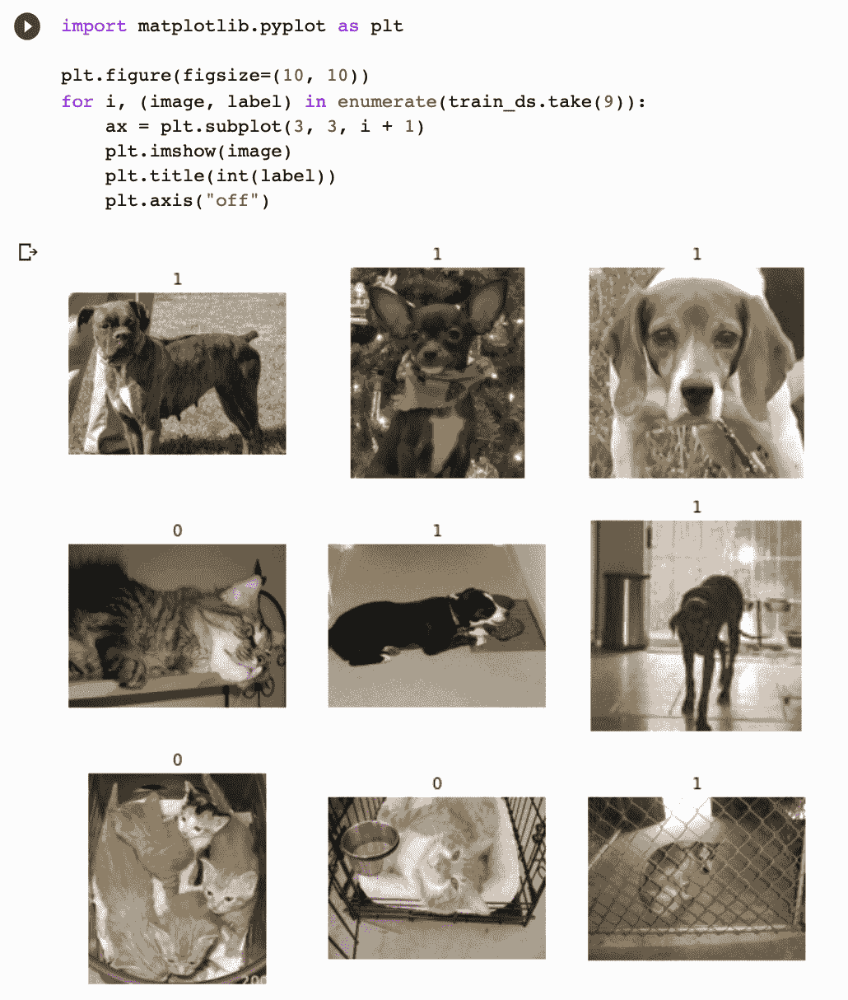
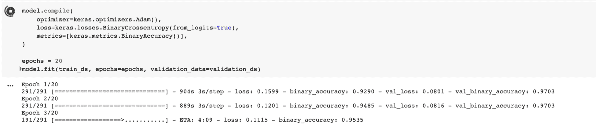
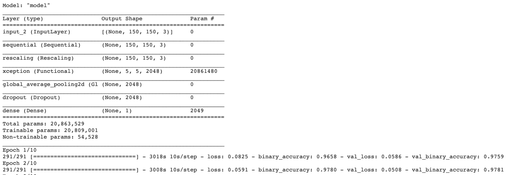
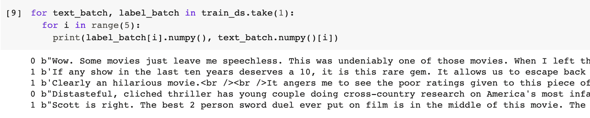
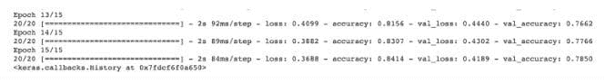
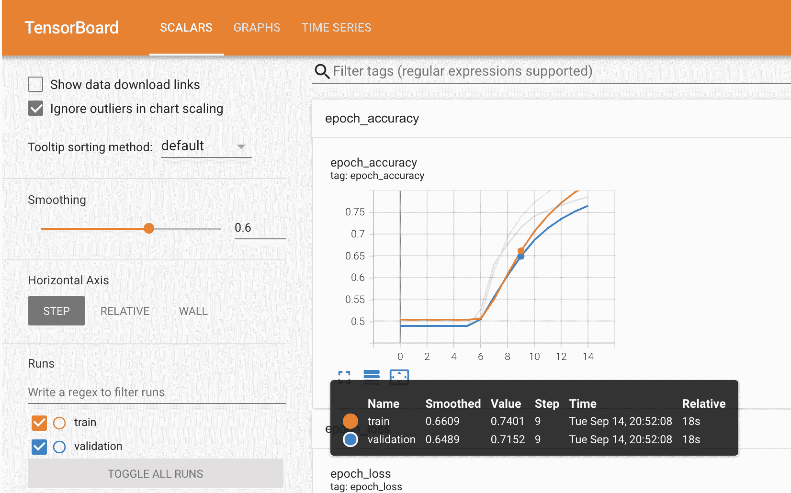

# 转移学习用于图像识别和自然语言处理

> 原文：[`www.kdnuggets.com/2022/01/transfer-learning-image-recognition-natural-language-processing.html`](https://www.kdnuggets.com/2022/01/transfer-learning-image-recognition-natural-language-processing.html)

如果你有机会阅读了本文的第一部分，你会记得转移学习是一种机器学习方法，其中从一个任务中获得的模型的知识应用可以作为另一个任务的基础点被重用。

如果你没有机会深入了解转移学习，读一读它将帮助你更好地理解这篇文章。

* * *

## 我们的前三个课程推荐

 1\. [谷歌网络安全证书](https://www.kdnuggets.com/google-cybersecurity) - 快速进入网络安全职业的快车道。

 2\. [谷歌数据分析专业证书](https://www.kdnuggets.com/google-data-analytics) - 提升你的数据分析技能

 3\. [谷歌 IT 支持专业证书](https://www.kdnuggets.com/google-itsupport) - 支持你的组织在 IT 方面

* * *

## 图像识别

首先让我们了解一下什么是图像识别。图像识别是指计算机技术能够检测和分析图像或视频中的物体或特征的任务。这是深度神经网络施展魔力的主要领域，因为它们被设计用来识别模式。

如果你想了解神经网络如何分析和掌握图像的理解，请查看[这里](https://distill.pub/2017/feature-visualization/)。这将向你展示低层次的层如何集中学习低级特征，以及高层次的层如何适应学习高级特征。

我们在本文第一部分中模糊地谈到了训练网络识别猫和狗的内容，让我们更详细地讨论一下。人脑可以识别和区分物体。图像识别也旨在拥有类似于人脑的能力，能够识别和检测图像中物体之间的差异。

图像识别所使用的算法是一个图像分类器，它接收输入图像并输出图像包含的内容。这个算法必须经过训练，以学习它检测的对象之间的差异。为了让图像分类器识别猫和狗，需要用成千上万的猫和狗的图像，以及不包含猫和狗的图像来训练图像分类器。因此，从这个图像分类器获得的数据可以在其他任务中用于猫和狗的检测。

## 那么你可以在哪里找到预训练的图像模型呢？

目前有很多预训练模型，因此找到合适的模型来解决你的问题需要一些研究。我将为你做一点研究。我将首先讨论 [Keras](https://keras.io/about/)。Keras 提供了广泛的预训练模型，可用于迁移学习、特征提取、微调和预测。你可以在 [这里](https://keras.io/api/applications/) 找到它们的列表。

一个 Keras 应用的例子是 Xception 架构，我在上面简要提到过。以下是如何在 ImageNet 上初始化 Xception。

```py
tf.keras.applications.Xception(
    include_top=True,
    weights="imagenet",
    input_tensor=None,
    input_shape=None,
    pooling=None,
    classes=1000,
    classifier_activation="softmax",
)
```

说到 Keras，我们也不要忘记 TensorFlow Hub。TensorFlow 是一个由 Google 开发的开源库，支持机器学习和深度学习。TensorFlow Hub 提供了多种预训练的、可部署的模型，如图像、文本、视频和音频分类。

序列模型适合用于简单的层叠堆叠，这意味着每一层都有一个输入和一个输出张量。

**示例 1：**

```py
model = tf.keras.Sequential([
    embed,
    tf.keras.layers.Dense(16, activation="relu"),
    tf.keras.layers.Dense(1, activation="sigmoid"),
])
```

**示例 2：**

```py
m = tf.keras.Sequential([
    hub.KerasLayer("https://tfhub.dev/google/imagenet/inception_v1/classification/5")
])
m.build([None, 224, 224, 3])  # Batch input shape.
```

在深度学习中，一些策略可以使我们最大限度地利用预训练模型。

## 特征提取

我将讨论的第一个策略是特征提取。你基本上是将预训练模型作为固定的特征提取器来运行，使用所需的特征来训练新的分类器。接近模型输入层的卷积层学习低级特征，如图像识别中的边缘和线条。随着层次的增加，它们开始学习更复杂的特征，最终能够解释接近输出的特定特征，即当前的分类任务。我们可以通过使用模型的不同层级作为单独的特征提取整合来分类我们的任务。

例如，如果任务与对图像中物体的分类不同（这是预训练模型所做的），那么使用预训练模型经过几层处理后的输出会更为合适。因此，所需层的新输出将作为输入提供给新模型，新模型已经获得了必要的特征，可以传递给新的分类器，并能够解决当前任务。

总的来说，这个想法是利用特征提取来利用预训练模型，以确定哪些特征对解决你的任务有用，但你不会使用网络的输出，因为它过于特定于任务。然后你将需要构建模型的最后部分，以适应你的任务。

## 微调

第二种策略是微调，或者我喜欢称之为网络手术。我们在上面讨论过微调，它基于对过程进行“精细”调整，以获得所需的输出，从而进一步提高性能。微调也被视为特征提取的进一步步骤。在微调中，我们冻结某些层并选择性地重新训练一些层，以提高其准确性，从而在较低的学习率下获得更高的性能，并减少训练时间。

如果你希望从基本模型中获得有效的特征表示，微调是至关重要的，这样可以更好地适应你的任务。

## 示例：如何在 Keras 中使用预训练的图像模型

现在让我们看一个例子。由于我们一直在讨论猫和狗，让我们对它们做一个图像识别的示例。

### 加载数据

所以首先让我们确保导入所需的库并加载数据。

```py
import numpy as np
import tensorflow as tf
from tensorflow import keras
import tensorflow_datasets as tfds
```

打印出训练和测试的样本量总是好的，以了解你正在处理的数据量，并查看图像，这样你可以了解你正在处理的数据。



由于图像大小各异，将图像标准化为固定大小是一种良好的方法，因为这是神经网络的一个一致输入。

## 数据预处理

现在让我们进入数据增强的部分。当处理较小的数据集时，应用随机变换到训练图像上是一个好的做法，例如水平翻转。翻转意味着在垂直或水平轴上旋转图像。这将帮助模型接触到训练数据的不同角度和方面，从而减少过拟合。

```py
from tensorflow import keras
from tensorflow.keras import layers
data_augmentation = keras.Sequential(
   [layers.RandomFlip("horizontal"), layers.RandomRotation(0.1),]
)
```

## 从选择的架构（Xception）创建一个基本模型

下一步是创建模型。我们首先将实例化一个基本模型，[Xception](https://keras.io/api/applications/xception/)，并将预训练的权重加载到其中。在这个例子中，我们使用的是 ImageNet。然后，我们冻结基本模型中的所有层。冻结有助于防止在训练过程中更新权重。

```py
base_model = keras.applications.Xception(
   weights="imagenet",  # Weights pre-trained on ImageNet.
   input_shape=(150, 150, 3),
   include_top=False,
)

base_model.trainable = False
```

## 训练顶层

下一步是在冻结的层上创建一个新层，该层将学习旧特征的知识并利用这些知识对新数据集进行预测。正如前面迁移学习步骤中进一步解释的那样，预训练模型的当前输出与模型希望得到的输出之间的差异可能很大，因此添加新层将整体上提高模型的性能。

```py
# Create a new model on top
inputs = keras.Input(shape=(150, 150, 3))
x = data_augmentation(inputs)  # Apply random data augmentation
```



## 微调

因此，在我们用冻结的层运行模型之后，我们需要用未冻结的基础模型运行模型，这样可以本质上提高模型性能，并且学习率较低。你需要减少过拟合的程度，所以让我们慢慢来，逐步解冻基础模型。

```py
base_model.trainable = True
```

现在是时候再次编译模型了。

```py
model.compile(
   optimizer=keras.optimizers.Adam(1e-5),  # Low learning rate
   loss=keras.losses.BinaryCrossentropy(from_logits=True),
   metrics=[keras.metrics.BinaryAccuracy()],
)
epochs = 10
model.fit(train_ds, epochs=epochs, validation_data=validation_ds)
```



如果你想进一步了解，可以点击[这里](https://colab.research.google.com/drive/10WqNas4nwDeBqpWzDgC098Fkzu8sbzLB?usp=sharing)查看 Colab 笔记本。

## 自然语言处理

我们已经讨论了很多关于图像分类的内容，现在让我们来看看自然语言处理（NLP）。那么，NLP 是什么呢？NLP 是计算机通过语音和文本检测和理解人类语言的能力，就像我们人类一样。

人类语言包含许多歧义，这使得创建能够准确检测语音和文本的软件变得困难。例如，讽刺、语法和同音词，然而，这些只是学习人类语言过程中遇到的一些小障碍。

NLP 的例子包括语音识别和情感分析。NLP 的应用场景包括垃圾邮件检测。我知道，你可能从未想到过 NLP 会被应用于垃圾邮件检测，但确实如此。NLP 的文本分类功能能够扫描电子邮件并检测出可能是垃圾邮件或钓鱼邮件的语言。它通过分析语法错误、威胁、金融术语的过度使用等来实现这一点。

那么，迁移学习在 NLP 中是如何工作的呢？其实，它与图像识别的工作方式基本相同。训练一个自然语言模型可能会非常昂贵，它需要大量的数据，并且需要在高端硬件上耗费大量的训练时间。但好消息是，和图像识别一样，你可以免费下载这些预训练模型，并对其进行微调以适应你的特定数据集。

## 你可能会问，在哪里可以找到这些预训练模型？

Keras 不仅提供图像识别的预训练模型，还提供 NLP 的架构。你可以[在这里](https://keras.io/examples/nlp/)查看。

## HuggingFace

让我们来看看[HuggingFace](https://huggingface.co/)。HuggingFace 是一个开源的自然语言处理（NLP）提供者，它在让工具易于使用方面做得非常出色。

他们的 Transformers 库是一个基于 Python 的库，提供了如 BERT 等架构，用于执行如文本分类和问答等 NLP 任务。你只需用几行代码加载他们的预训练模型，就可以开始实验。要开始使用 Transformers，你需要先安装它。

以下是使用情感分析的示例，它能够识别文本中表达的意见。

```py
! pip install transformers

from transformers import pipeline

classifier = pipeline('sentiment-analysis')

classifier('I am finding the article about Transfer learning very useful.')
```

输出：

```py
[{'label': 'POSITIVE', 'score': 0.9968850016593933}]
```

使用 HuggingFace 对预训练模型进行微调是一种选择，可以使用 Trainer API。Transformers 提供了一个 Trainer 类来帮助微调你的预训练模型。这一步骤在处理数据之后进行，并且需要导入 TrainingArguments。

```py
from transformers import TrainingArguments
```

要了解更多关于 HuggingFace 的信息，你可以访问这个[链接](https://huggingface.co/course/chapter3/3?fw=pt)。

## 词嵌入

词嵌入是什么呢？词嵌入是一种表示方式，其中相似的词具有相似的编码。它可以在文档中检测到一个词，并将其与其他词的关系联系起来。

其中一个例子是 Word2Vec，它是一个通过向量编码处理文本的两层神经网络。

Word2Vec 使用了两种方法来学习词的表示：

1.  **连续词袋模型（Continuous Bag-of-Words）** - 是一种模型架构，它试图基于源词（邻近词）预测目标词（中间词）。上下文中的词的顺序不一定重要，因此这个架构被称为“词袋模型”。

1.  **连续跳字模型（Continuous Skip-gram）** - 是一种模型架构，本质上是词袋模型的对立面。它试图给定目标词（中间词）来预测源词（邻近词）。

特征提取是一种在词嵌入中使用的策略，它检测并生成对你正在处理的 NLP 任务有用的特征表示。在特征提取中，将部分（句子或词）提取到一个矩阵中，该矩阵包含每个词的表示。权重不会改变，仅使用模型的顶层。

然而，微调会调整预训练模型的权重，这可能会带来不利影响，因为该方法在调整阶段可能导致词汇的丢失，原因在于权重被更改，曾经学到的内容不再存在于记忆中。这被称为“灾难性遗忘”。

## 示例：如何在 Keras 中使用预训练的 NLP 模型

我们刚刚讨论了词嵌入（Word Embedding），让我们看一个例子。快速回顾一下词嵌入的定义：它是一种表示方式，其中相似的词具有相似的编码。它可以在文档中检测到一个词，并将其与其他词的关系联系起来。那么我们来看看它是如何工作的吧。

## 加载数据

在这个例子中，我们将查看电影评论。如果你还记得我们之前做的例子，使用情感分析得出了一个结果来确定其积极性。对于这些电影评论，我们有积极和消极的，因此这是二元分类。

```py
url = "https://ai.stanford.edu/~amaas/data/sentiment/aclImdb_v1.tar.gz"

dataset = tf.keras.utils.get_file("aclImdb_v1.tar.gz", url,
                                 untar=True, cache_dir='.',
                                 cache_subdir='')

dataset_dir = os.path.join(os.path.dirname(dataset), 'aclImdb')
os.listdir(dataset_dir)
```

你可以在下面的图像中看到区别，0 表示负面，1 表示正面。



然后，我转向使用 Keras 的 Embedding Layer，将正整数转换为固定大小的稠密向量。嵌入的权重是随机初始化的，并在反向传播过程中进行调整。一旦知识学会了，词嵌入将编码它们所学过的词与之前学过的词之间的相似性。

```py
# Embed a 1,000-word vocabulary into 5 dimensions.

embedding_layer = tf.keras.layers.Embedding(1000, 5)
```

## 文本预处理

在文本预处理阶段，我们将初始化一个 TextVectorization 层，以期望的参数对电影评论进行向量化。文本向量化层将帮助拆分和映射来自电影评论的字符串到整数。

```py
# text vectorization layer to split, and map strings to integers.

vectorize_layer = TextVectorization(
   standardize=custom_standardization,
   max_tokens=vocab_size,
   output_mode='int',
   output_sequence_length=sequence_length)
```

## 创建模型

上述预处理中的 vectorize_layer 将作为模型的第一层实现，因为它已经将字符串转换为词汇索引。它将把转换后的字符串输入到 Embedding 层中。

然后，Embedding 层会接受这些词汇索引，并扫描每个词索引的向量，在模型训练时进行学习。

```py
model = Sequential([
 vectorize_layer,
 Embedding(vocab_size, embedding_dim, name="embedding"),
 GlobalAveragePooling1D(),
 Dense(16, activation='relu'),
 Dense(1)
])
```

在这个示例中，我们将使用[TensorBoard](https://www.tensorflow.org/tensorboard/get_started)，这是一个提供机器学习工作流可视化的工具，例如损失和准确率。

## 编译模型

我们将使用 Adam 优化器和 BinaryCrossentropy 损失函数来编译模型。

```py
model.compile(optimizer='adam',
             loss=tf.keras.losses.BinaryCrossentropy(from_logits=True),
             metrics=['accuracy'])
```



我提到了 TensorBoard，它可视化模型指标，你可以在下面看到。



你已经了解了如何使用预训练的词嵌入模型训练和测试 NLP 模型。如果你想进一步查看 Colab 笔记本，你可以[在这里](https://colab.research.google.com/drive/1Du5GMWWh8-a5UEXtdbaaDgHy71joSG-K?usp=sharing)查看。

## 迁移学习的最佳实践是什么？

1.  **预训练模型** - 利用这些预训练的开源模型，它们可以帮助你解决目标任务，因为它们涵盖了不同的领域。这可以节省你从头开始构建模型的大量时间。

1.  **源模型** - 找到一个与源任务和目标任务都兼容的模型是很重要的。如果源模型与你的目标差距过大，并且知识转移有限，目标模型将需要更长的时间来实现。

1.  **过拟合** - 如果目标任务的数据样本很小，且源任务与目标任务过于相似，这可能会导致过拟合。冻结层并调整课程模型中的学习率可以帮助你减少模型的过拟合。

我希望这篇文章让你对如何通过机器学习的不同类型实现迁移学习有了更好的理解。试试看吧！

**[尼莎·阿雅](https://www.linkedin.com/in/nisha-arya-ahmed/)** 是一名数据科学家和自由技术撰稿人。她特别感兴趣于提供数据科学职业建议或教程以及围绕数据科学的理论知识。她还希望探讨人工智能如何以及如何能够提升人类生命的持久性。她是一个热衷学习者，寻求拓宽自己的技术知识和写作技能，同时帮助指导他人。

### 相关主题

+   [自然语言处理中的 N-gram 语言建模](https://www.kdnuggets.com/2022/06/ngram-language-modeling-natural-language-processing.html)

+   [25 本免费书籍掌握 SQL、Python、数据科学、机器学习…](https://www.kdnuggets.com/25-free-books-to-master-sql-python-data-science-machine-learning-and-natural-language-processing)

+   [自然语言处理关键术语解析](https://www.kdnuggets.com/2017/02/natural-language-processing-key-terms-explained.html)

+   [自然语言处理任务的数据表示](https://www.kdnuggets.com/2018/11/data-representation-natural-language-processing.html)

+   [如何开始使用 PyTorch 进行自然语言处理](https://www.kdnuggets.com/2022/04/start-natural-language-processing-pytorch.html)

+   [自然语言处理的温和入门](https://www.kdnuggets.com/2022/06/gentle-introduction-natural-language-processing.html)
