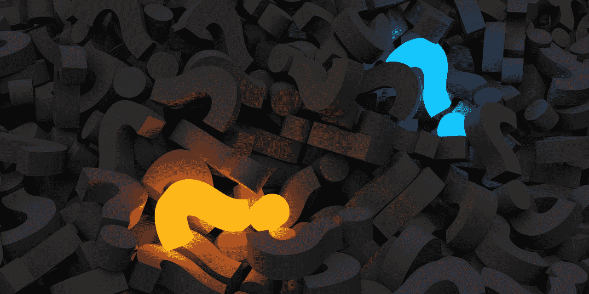

# 什么是迁移学习？

> 原文：[`www.kdnuggets.com/2022/01/transfer-learning.html`](https://www.kdnuggets.com/2022/01/transfer-learning.html)



图片由 [qimono on Pixabary](https://pixabay.com/users/qimono-1962238/) 提供

迁移学习是一种机器学习方法，其中一个任务中获得的模型知识可以作为另一个任务的基础点进行重用。

* * *

## 我们的三大课程推荐

 1\. [Google 网络安全证书](https://www.kdnuggets.com/google-cybersecurity) - 快速进入网络安全职业轨道

 2\. [Google 数据分析专业证书](https://www.kdnuggets.com/google-data-analytics) - 提升你的数据分析水平

 3\. [Google IT 支持专业证书](https://www.kdnuggets.com/google-itsupport) - 支持你所在组织的 IT

* * *

机器学习算法使用历史数据作为输入来进行预测并产生新的输出值。它们通常被设计用于执行孤立的任务。源任务是指将知识转移到目标任务的任务。目标任务是指由于从源任务转移知识而发生的改进学习。

在迁移学习过程中，利用从源任务中获得的知识和快速进展来改善对新目标任务的学习和发展。知识的应用是使用源任务的属性和特征，这些属性和特征将被应用并映射到目标任务上。

然而，如果转移方法导致新目标任务性能下降，则称为负迁移。在使用迁移学习方法时，主要挑战之一是能够提供并确保相关任务之间的正迁移，同时避免与不相关任务之间的负迁移。

## 迁移学习的什么、何时和如何

1.  迁移什么？要理解转移哪些学习到的知识，我们需要弄清楚哪些知识部分最能反映源任务和目标任务。总体而言，提高目标任务的性能和准确性。

1.  何时进行迁移？了解何时进行迁移非常重要，因为我们不希望转移的知识可能使情况变得更糟，导致负迁移。我们的目标是提高目标任务的性能，而不是使其变得更差。

1.  如何进行迁移？现在我们对想要迁移的内容和何时迁移有了更清楚的了解，我们可以继续研究不同的技术，以高效地转移知识。我们将在文章后面进一步讨论。

在我们深入探讨迁移学习背后的方法论之前，了解迁移学习的不同形式是很有帮助的。我们将讨论三种不同类型的迁移学习场景，这些场景是根据源任务和目标任务之间的关系来区分的。以下是不同类型的迁移学习概述：

## 迁移学习的不同类型

**归纳迁移学习**：在这种迁移学习类型中，源任务和目标任务相同，但它们之间仍然存在差异。模型将利用源任务中的归纳偏差来帮助提高目标任务的性能。源任务可能包含或不包含标记数据，这进一步导致模型使用多任务学习和自学学习。

**无监督迁移学习**：我假设你知道什么是无监督学习，不过，如果你不知道，无监督学习是指算法能够识别未标记或未分类的数据集中的模式。在这种情况下，源任务和目标任务是相似的，但任务是不同的，源任务和目标任务中的数据都是未标记的。降维和聚类等技术在无监督学习中是非常著名的。

**转导迁移学习**：在这种最后的迁移学习类型中，源任务和目标任务有相似之处，但领域是不同的。源领域包含大量的标记数据，而目标领域则缺乏标记数据，这进一步导致模型使用领域适应技术。

## 迁移学习与微调

微调是迁移学习中的一个可选步骤，主要用于提高模型的性能。迁移学习和微调之间的区别完全体现在名称上。

迁移学习基于从一个任务中学习到的特征，并将这些知识“转移”到新的任务上。迁移学习通常用于数据集过小，无法从头训练一个完整模型的任务。微调则是对过程进行“微小”的调整，以获得所需的输出，从而进一步提高性能。在微调过程中，经过训练的模型的参数会被精确和特定地调整，同时尝试验证模型以实现所需的输出。

## 为什么使用迁移学习？

使用迁移学习的原因：

**无需大量数据** - 获取数据总是一个障碍，因为数据的可用性不足。使用不足量的数据可能导致性能较低。这正是迁移学习的优势所在，因为机器学习模型可以通过少量的训练数据集进行构建，因为它已经经过预训练。

**节省训练时间** - 机器学习模型训练起来很困难且耗时，导致效率低下。训练一个深度神经网络从头开始处理复杂任务需要很长时间，因此使用预训练模型可以节省建立新模型的时间。

## 转移学习的优点

**更好的基础**：在转移学习中使用预训练模型为你提供了更好的基础和起点，使你能够在不进行训练的情况下完成一些任务。

**更高的学习率**：由于模型已经在类似任务上进行过训练，因此具有更高的学习率。

**更高的准确率**：凭借更好的基础和更高的学习率，模型在更高的性能下运行，产生更准确的输出。

## 转移学习*不*有效时？

当源任务的训练权重与目标任务不同的时候，应避免使用转移学习。例如，如果你之前的网络是用来分类猫和狗的，而你新的网络试图检测鞋子和袜子，那么会出现问题，因为从源任务到目标任务转移的权重无法提供最佳结果。因此，初始化一个与期望输出相似的预训练权重的网络比使用没有相关性的权重更好。

从预训练模型中移除层会对模型的架构造成问题。如果你移除前几层，模型的学习率会很低，因为它必须处理低级特征。移除层会减少可训练的参数数量，这可能导致过拟合。使用正确数量的层对于减少过拟合至关重要，但这也是一个耗时的过程。

## 转移学习的缺点

**负迁移学习**：如上所述，负迁移学习是指以前的学习方法阻碍了新任务。这仅在源任务和目标任务不够相似时发生，导致第一次训练偏差过大。算法不一定总是与我们认为的相似一致，这使得理解什么类型的训练是足够的基础和标准变得困难。

## 转移学习的 6 个步骤

让我们深入了解转移学习的实现方式及其步骤。转移学习一般包括 6 个步骤，我们将逐一介绍这些步骤。

1.  选择源任务：第一步是选择一个拥有大量数据的预训练模型，该模型的输入和输出数据与您选择的目标任务有关系。

1.  创建基础模型：实例化一个带有预训练权重的基础模型。预训练权重可以通过像 Xception 这样的架构获取。这是在开发你的源模型，使其比我们最初开始时的简单模型更好，确保学习率有所提升。

1.  冻结层：为了避免再次初始化权重，冻结预训练模型的层是必要的。这将保留已经学到的知识，避免从头开始训练模型。

```py
base_model.trainable = False
```

1.  添加新的可训练层：在冻结层的顶部添加新的可训练层，将把旧特征转化为新数据集上的预测。

1.  训练新层：预训练模型已经包含了最终的输出层。预训练模型的当前输出和你期望的模型输出之间存在较大差异的可能性很高。因此，你需要用新的输出层来训练模型。因此，添加新的密集层和最终密集层以符合你期望的模型，将提升学习率并产生你期望的输出。

1.  微调：你可以通过微调来提升模型的性能，这包括解冻基础模型的全部或部分内容，然后用非常低的学习率重新训练模型。在这个阶段使用低学习率至关重要，因为你正在训练的模型比最初的第一轮大得多，并且数据集也很小。因此，如果应用较大的权重更新，你有过拟合的风险，因此你需要以增量的方式进行微调。由于你改变了模型的行为，需要重新编译模型，然后再次训练模型，监控任何过拟合的反馈。

我希望这篇文章为你提供了迁移学习的良好介绍和理解。敬请期待，我的下一篇文章将会介绍我如何实施迁移学习用于图像识别和自然语言处理。

**[Nisha Arya](https://www.linkedin.com/in/nisha-arya-ahmed/)** 是一名数据科学家和自由职业技术作家。她特别关注提供数据科学职业建议或教程以及数据科学相关理论知识。她还希望探索人工智能如何有助于人类寿命的不同方式。作为一个热衷学习者，她寻求拓宽自己的技术知识和写作技能，同时帮助指导他人。

### 更多相关话题

+   [TensorFlow 用于计算机视觉 - 轻松实现迁移学习](https://www.kdnuggets.com/2022/01/tensorflow-computer-vision-transfer-learning-made-easy.html)

+   [图像识别和自然语言处理的迁移学习](https://www.kdnuggets.com/2022/01/transfer-learning-image-recognition-natural-language-processing.html)

+   [使用 PyTorch 进行迁移学习的实用指南](https://www.kdnuggets.com/2023/06/practical-guide-transfer-learning-pytorch.html)

+   [探索迁移学习在小数据场景中的潜力](https://www.kdnuggets.com/exploring-the-potential-of-transfer-learning-in-small-data-scenarios)

+   [使用迁移学习提升模型性能](https://www.kdnuggets.com/using-transfer-learning-to-boost-model-performance)

+   [学习数据科学、机器学习和深度学习的稳固计划](https://www.kdnuggets.com/2023/01/mwiti-solid-plan-learning-data-science-machine-learning-deep-learning.html)
