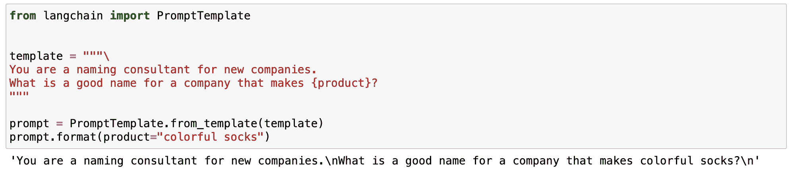
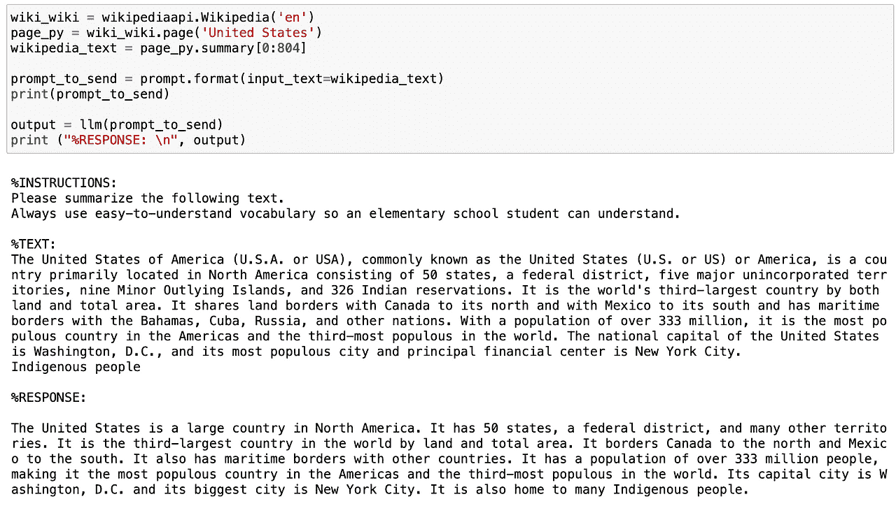
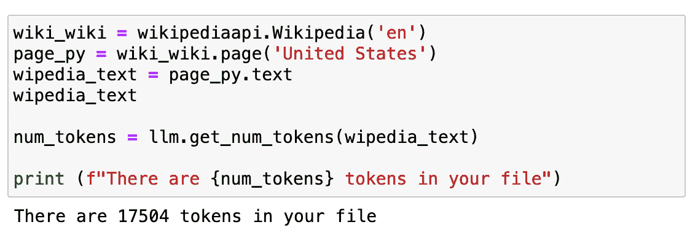
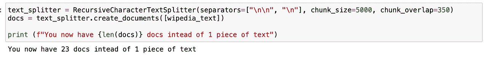
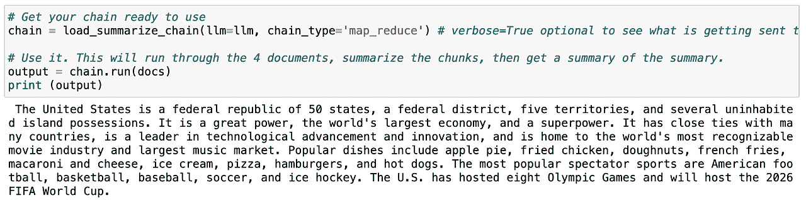
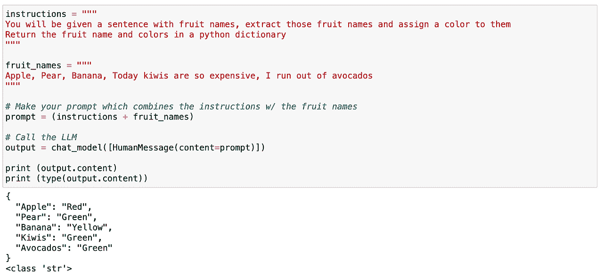
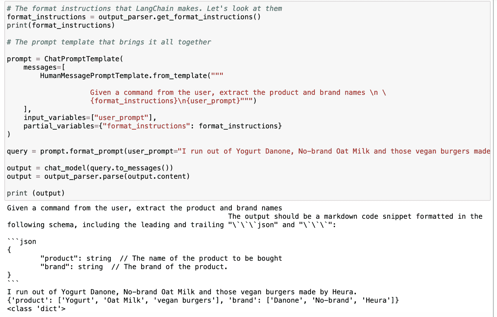

# 用 LangChain 变革 AI：文本数据的游戏改变者

> 原文：[`www.kdnuggets.com/2023/08/transforming-ai-langchain-text-data-game-changer.html`](https://www.kdnuggets.com/2023/08/transforming-ai-langchain-text-data-game-changer.html)


图片来源：作者

在过去几年中，大型语言模型——或者说是朋友们的 LLM——**以其风靡的姿态席卷了人工智能领域。**

* * *

## 我们的前 3 大课程推荐

 1\. [谷歌网络安全证书](https://www.kdnuggets.com/google-cybersecurity) - 快速进入网络安全职业生涯。

 2\. [谷歌数据分析专业证书](https://www.kdnuggets.com/google-data-analytics) - 提升你的数据分析技能

 3\. [谷歌 IT 支持专业证书](https://www.kdnuggets.com/google-itsupport) - 支持你组织的 IT

* * *

随着 2020 年 OpenAI 发布 GPT-3 的突破性进展，我们见证了 LLM 的流行稳步上升，最近该领域的进步更是加剧了这一趋势。

**这些强大的 AI 模型为自然语言处理应用开辟了新的可能性**，使开发者能够创建更复杂、更像人类的互动。

***不是吗？***

然而，在处理这种 AI 技术时，很难扩展和生成可靠的算法。

在这个快速发展的环境中，**LangChain 作为一个多功能框架应运而生，旨在帮助开发者充分利用 LLM 的潜力，应用于各种场景。其中最重要的用例之一就是处理大量** **的文本数据。**

让我们深入了解并开始利用 LLM 的力量吧！

LangChain 可以用于聊天机器人、问答系统、总结工具等。**然而，LangChain 最有用且最常用的应用之一就是处理文本。**

当今世界充斥着数据。而最臭名昭著的一种数据是文本数据。

所有网站和应用每天都被大量文字轰炸。没有人能处理这么多信息……

**但计算机能做到吗？**

LLM 技术与 LangChain 结合，是减少文本量同时保留信息核心的好方法。这就是为什么今天我们将探讨 LangChain 的两个基本但非常实用的文本处理用例。

+   **总结：** 表达一段文本或聊天互动中最重要的事实。它可以减少数据量，同时保留最重要的部分。

+   **提取：** 从一段文本或用户查询中提取结构化数据。它可以在文本中检测并提取关键词。

无论你是对 LLM 世界感到陌生还是希望将你的语言生成项目提升到一个新水平，本指南将为你提供宝贵的见解和动手示例，帮助你充分发挥 LangChain 处理文本的潜力。

⚠️ 如果你想了解一些基础知识，可以查看 ????????

**LangChain 101：构建你自己的 GPT 驱动应用程序 — KDnuggets**

请始终记住，要使用 OpenAI 和 GPT 模型，我们需要在本地计算机上安装 OpenAI 库，并拥有一个有效的 OpenAI 密钥。如果你不知道如何操作，可以查看[这里](https://medium.com/@rfeers/openai-a-step-by-step-guide-to-getting-your-api-key-gpt-usage-control-artificial-intelligence-2a0917c70f3f)。

# 1\. 总结

ChatGPT 结合 LangChain**可以快速且非常可靠地总结信息。**

LLM 总结技术是一种减少文本量同时保留消息最重要部分的好方法。这就是为什么 LLM 可以成为任何需要处理和分析大量文本数据的数字公司的最佳盟友。

执行以下示例所需的库有：

```py
# LangChain & LLM
from langchain.llms import OpenAI
from langchain import PromptTemplate
from langchain.chains.summarize import load_summarize_chain
from langchain.text_splitter import RecursiveCharacterTextSplitter

#Wikipedia API
import wikipediaapi
```

## 1.1\. 简短文本总结

对于短文本的总结，这种方法很简单，实际上，你只需要简单地进行提示并附上指令即可。

这基本上意味着生成一个带有输入变量的模板。

我知道你可能在想……**什么是提示模板？**

提示模板指的是一种可重复生成提示的方式。它包含一个文本字符串——模板——可以接受来自最终用户的一组参数并生成提示。

提示模板包含：

+   **对语言模型的指令** - 允许我们标准化一些步骤，以便于我们的 LLM。

+   **输入变量** - 允许我们将先前的指令应用于任何输入文本。

让我们在一个简单的例子中看看。我可以标准化一个生成特定产品品牌名称的提示。



我 Jupyter Notebook 的截图。

正如你在之前的例子中看到的，LangChain 的魔力在于我们可以定义一个带有变化的输入变量的标准化提示。

+   生成品牌名称的指令始终保持不变。

+   产品变量作为一个可以改变的输入。

这使我们能够定义多功能的提示，可在不同的场景中使用。

*所以现在我们知道什么是提示模板了……*

让我们设想一下我们想要定义一个总结任何文本的提示，该提示使用超级易懂的词汇。我们可以定义一个包含一些具体指令和一个根据输入变量定义而变化的文本变量的提示模板。

```py
# Create our prompt string.
template = """
%INSTRUCTIONS:
Please summarize the following text.
Always use easy-to-understand vocabulary so an elementary school student can understand.

%TEXT:
{input_text}
"""

Now we define the LLM we want to work with - OpenAI’s GPT in my case -  and the prompt template. 

# The default model is already 'text-davinci-003', but it can be changed.
llm = OpenAI(temperature=0, model_name='text-davinci-003', openai_api_key=openai_api_key)

# Create a LangChain prompt template that we can insert values to later
prompt = PromptTemplate(
   input_variables=["input_text"],
   template=template,
) 
```

所以让我们尝试这个提示模板。使用维基百科 API，我将获取美国的摘要，并以一种非常易于理解的语气进一步总结。



我在 Jupyter Notebook 中的截图。

既然我们知道如何总结短文本……我可以稍微增加一些内容吗？

*当然可以……*

## 1.2. 长文本总结

在处理长文本时，主要的问题是我们无法通过提示直接将它们传达给我们的 AI 模型，因为它们包含了太多的 tokens。

*现在你可能会想……什么是 token？*

Tokens 是模型如何查看输入的方式——单个字符、单词、单词的部分或文本片段。如你所见，定义并不是很精确，这取决于每个模型。例如，OpenAI 的 GPT 中 1000 tokens 大约是 750 个单词。

但最重要的是，我们的费用取决于 tokens 的数量，而且我们不能在单个提示中发送过多的 tokens。为了处理更长的文本，我们将重复之前的示例，但使用整个维基百科页面的文本。



我在 Jupyter Notebook 中的截图。

如果我们检查它有多长……大约是 17K tokens。

这实际上是非常多的，不能直接发送到我们的 API。

*那现在怎么办？*

首先，我们需要将其拆分。这一过程称为**chunking**或**splitting**你的文本为更小的片段。我通常使用[RecursiveCharacterTextSplitter](https://python.langchain.com/en/latest/modules/indexes/text_splitters/examples/recursive_text_splitter.html)，因为它易于控制，但你可以尝试很多其他的[工具](https://python.langchain.com/en/latest/modules/indexes/text_splitters.html)。

使用它之后，我们不再只有一段文本，而是得到了 23 段，这有助于我们 GPT 模型的工作。

接下来我们需要加载一个链，它会为我们进行连续调用 LLM。

LangChain 为此类**链式**应用提供了 Chain 接口。我们非常泛泛地定义一个 Chain 为对组件的调用序列，这些组件可以包括其他链。基本接口很简单：

```py
class Chain(BaseModel, ABC):
    """Base interface that all chains should implement."""
    memory: BaseMemory
    callbacks: Callbacks
    def __call__(
        self,
        inputs: Any,
        return_only_outputs: bool = False,
        callbacks: Callbacks = None,
    ) -> Dict[str, Any]:
        ... 
```

如果你想了解更多关于链的信息，可以直接查看[LangChain 文档。](https://python.langchain.com/docs/get_started/introduction.html)

所以如果我们再次重复相同的程序，使用被拆分的文本——称为 docs——LLM 可以轻松生成整个页面的摘要。



我在 Jupyter Notebook 中的截图。

*有用吧？*

既然我们知道如何总结文本，我们可以进入第二个用例了！

# 2. 提取

提取是从文本片段中解析数据的过程。这通常与输出解析一起使用，以*结构化*我们的数据。

提取关键信息对于识别和解析文本中的关键词非常有用。 常见的用例包括从句子中提取结构化的行以插入数据库，或从长文档中提取多行以插入数据库。

假设我们正在运营一个数字电子商务公司，需要处理我们网站上所有的评论。

**我可以逐一查看所有内容……这将是疯狂的。**

*或者我可以简单地提取我需要的信息，并分析所有数据。*

听起来很简单……对吧？

让我们从一个非常简单的示例开始。首先，我们需要导入以下库：

```py
# To help construct our Chat Messages
from langchain.schema import HumanMessage
from langchain.prompts import PromptTemplate, ChatPromptTemplate, HumanMessagePromptTemplate

# We will be using a chat model, defaults to gpt-3.5-turbo
from langchain.chat_models import ChatOpenAI

# To parse outputs and get structured data back
from langchain.output_parsers import StructuredOutputParser, ResponseSchema

chat_model = ChatOpenAI(temperature=0, model_name='gpt-3.5-turbo', openai_api_key=openai_api_key)
```

## 2.1\. 提取特定词汇

我可以尝试在文本中查找特定的词汇。在这种情况下，我想解析文本中包含的所有水果。再次，这非常直接。我们可以轻松定义一个提示，给出明确的指令，让我们的 LLM 识别文本中包含的所有水果，并返回一个包含这些水果及其对应颜色的类似 JSON 的结构。



我的 Jupyter Notebook 截图。

正如我们之前所见，这效果很好！

现在……让我们再玩一下。虽然这次效果很好，但对于更高级的用例，它不是一种长期可靠的方法。这时，一个出色的 LangChain 概念就派上用场了……

## 2.2\. 使用 LangChain 的响应模式

LangChain 的响应模式将为我们做两件主要的事情：

1.  **生成一个带有真实格式指令的提示。** 这很好，因为我不需要担心提示工程方面的事情，我会把它留给 LangChain！

1.  **从 LLM 读取输出并将其转化为合适的 Python 对象。** 这意味着，总是生成一个有用的结构，以便我的系统可以解析。

**为了做到这一点，我只需要定义我期望从模型中获得的响应。**

那么，假设我想确定用户评论中提到的产品和品牌。我可以像以前一样使用简单的提示 - 利用 LangChain 生成更可靠的方法。

首先，我需要定义一个 `response_schema`，在其中定义我想解析的每一个关键字的名称和描述。

```py
# The schema I want out
response_schemas = [
   ResponseSchema(name="product", description="The name of the product to be bought"),
   ResponseSchema(name="brand", description=  "The brand of the product.")
]
And then I generate an output_parser object that takes as an input my response_schema. 
# The parser that will look for the LLM output in my schema and return it back to me
output_parser = StructuredOutputParser.from_response_schemas(response_schemas) 
```

在定义我们的解析器之后，我们使用 LangChain 的 .get_format_instructions() 命令生成指令格式，并使用 ChatPromptTemplate 定义最终提示。现在，只需使用这个 output_parser 对象和我想到的任何输入查询，它就会自动生成包含我所需关键字的输出。



我的 Jupyter Notebook 截图。

如下面的示例所示，输入为“我用完了 Danone 酸奶、无品牌燕麦奶以及 Heura 制造的那些素食汉堡”，LLM 给出的输出如下：



我的 Jupyter Notebook 截图。

# 主要要点

LangChain 是一个多功能的 Python 库，帮助开发者充分利用 LLMs，特别是在处理大量文本数据时。它在处理文本方面表现出色。LLMs 使开发者能够在自然语言处理应用中创建更复杂和类人化的交互。

1.  总结：**LangChain 可以快速而可靠地总结信息**，减少文本量，同时保留信息中最重要的部分。

1.  提取：**该库可以解析文本中的数据，允许结构化输出**，并支持将数据插入数据库或根据提取的参数进行 API 调用等任务。

1.  LangChain 促进了提示工程，这是一项关键技术，用于最大化像 ChatGPT 这样的 AI 模型的性能。通过提示工程，开发者可以设计可以在不同用例中重复使用的标准化提示，从而使 AI 应用更加多功能和高效。

总体而言，LangChain 作为一个强大的工具，可以增强 AI 的使用，尤其是在处理文本数据时，而提示工程是有效利用像 ChatGPT 这样的 AI 模型在各种应用中的关键技能。

**[Josep Ferrer](https://www.linkedin.com/in/josep-ferrer-sanchez)** 是一位来自巴塞罗那的分析工程师。他毕业于物理工程专业，目前在应用于人类流动性的 Data Science 领域工作。他是一名兼职内容创作者，专注于数据科学和技术。你可以通过[LinkedIn](https://www.linkedin.com/in/josep-ferrer-sanchez/)、[Twitter](https://twitter.com/rfeers)或[Medium](https://medium.com/@rfeers)与他联系。

### 更多相关主题

+   [打破数据壁垒：零样本、单样本和少样本…](https://www.kdnuggets.com/2023/08/breaking-data-barrier-zeroshot-oneshot-fewshot-learning-transforming-machine-learning.html)

+   [AIoT 革命：AI 和 IoT 如何改变我们的世界](https://www.kdnuggets.com/2022/07/aiot-revolution-ai-iot-transforming-world.html)

+   [KDnuggets 新闻，7 月 27 日：AIoT 革命：AI 和 IoT 如何…](https://www.kdnuggets.com/2022/n30.html)

+   [AI 如何改变零售行业](https://www.kdnuggets.com/how-ai-is-transforming-the-retail-industry)

+   [未来-proof 你的数据技能：2023 年每个数据科学家需要的顶级技能](https://www.kdnuggets.com/futureproof-your-data-game-top-skills-every-data-scientist-needs-in-2023)

+   [通过《数据科学的快速 Python》提升你的 Python 技能！](https://www.kdnuggets.com/2022/06/manning-step-python-game-fast-python-data-science.html)
