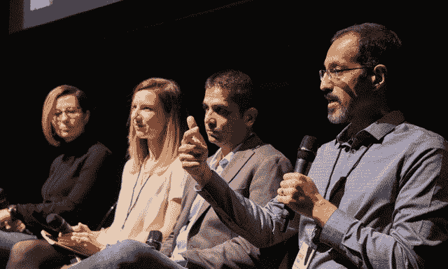

# 转型为数据科学：如何成为数据科学家，以及如何创建数据科学团队

> 原文：[`www.kdnuggets.com/2017/12/transitioning-data-science-become-data-scientist-data-science-team.html`](https://www.kdnuggets.com/2017/12/transitioning-data-science-become-data-scientist-data-science-team.html)

 评论

**由 [Amir Feizpour](https://www.linkedin.com/in/amirfz/)**, 加拿大皇家银行

现在很难定义数据科学：每家公司都声称自己在做数据科学，每个人都声称自己是数据科学家。实践者对模糊的工作描述感到困惑，而试图成为数据科学家的人则对缺乏标准定义感到沮丧。在 2017 年多伦多机器学习峰会的讨论中，我们尝试揭示数据科学的奥秘，并澄清成为数据科学家的含义。

* * *

## 我们的三大课程推荐

 1\. [谷歌网络安全证书](https://www.kdnuggets.com/google-cybersecurity) - 快速通道进入网络安全职业。

 2\. [谷歌数据分析专业证书](https://www.kdnuggets.com/google-data-analytics) - 提升您的数据分析技能

 3\. [谷歌 IT 支持专业证书](https://www.kdnuggets.com/google-itsupport) - 支持您的组织的 IT 工作

* * *

数据科学是应用科学方法理解数据以解决业务问题。*“在我看来，一个优秀的数据科学家是一个非常重视数据科学中科学部分的人；能够通过统计、机器学习和分布式计算发现并解决问题的人。”* 说的是 Thomson Reuters Labs 的研究总监 Amir Hajian。换句话说，数据科学家是能够*“通过推理推断数据，用概率思考，保持科学和系统化，并利用软件工程最佳实践使数据大规模工作”*的人，Aviva 的分析副总裁 Baiju Devani 说。他还补充说，重要的是要认识到，*“你所解决的问题或找到的解决方案没有确定的路径，因此你必须接受模糊性，”* 他说，您还需要“拥有那种实验性的思维方式，使您能够处理模糊的问题和解决方案定义。” 从某种意义上说，Lindsay Farber，MoneyKey 的高级数据科学家认为，最好的数据科学家是具有“*良好的统计知识、编程和技术技能以及行业经验*”的人。

微软加拿大首席数据科学家 Ozge Yeloglu 还提醒我们，在商业中需要**“退后一步，了解数据科学真正是什么。它是利用数据来解决商业问题，这有时意味着没有必要使用机器学习或人工智能。”** 关于数据科学的部分误解源于存在的炒作。每个企业都急于进入数据科学，而没有花时间了解为什么以及如何做。大公司在激烈竞争中争取雇佣尽可能多的数据科学家，而没有采取必要的基础步骤。**“如果你有 100-200 名数据科学家（相比之下，比如 Facebook 有 500-600 名数据科学家），那么你可能在错误的行业中，”** Baiju Devani 说。他补充说**“虽然这些组织有很大的问题需要通过数据科学或机器学习来解决，但他们没有考虑如何将这些解决方案规模化。”** 另一方面，一些初创公司过于急于通过机器学习解决所有问题，而没有考虑问题的适当规模。**“如果你是一个拥有一千个客户的初创公司，你不应该进行情感分析，而是应该给每个客户打电话并与他们交谈，”** Baiju Devani 说。从业者也在急于成为数据科学家，而没有真正理解这意味着什么。**“每一个参加过几门在线课程的人都认为自己已经转行了，而实际上他们几乎没有投入足够的时间和精力，”** Ozge Yeloglu 说。

然而，这种炒作并非完全毫无理由。确实有一些有趣的商业用例在业内引起了兴奋。**“当我们的客户带着真正的数据业务问题找上我们，而我们可以利用我们的资源并结合他们的领域知识来帮助他们时，我真的感到非常高兴；这让我乐观地认为，炒作可以让我们比预期更快地实现现实，”** Ozge Yeloglu 说。**“组织希望找到一种新的商业方式，朝着以前不可能的方向发展，”** Amir Hajian 说。他补充说，从业者想成为数据科学家，因为**“他们希望找到那些不会结束的工作，并且不是每天重复同样的事情。”** 他还表示**“现在正是那些不是计算机科学家但希望进入这个行业并做一些有意义的事情的人的最佳时机。”** 毕竟，这是一个不那么刻板的领域；**“它在变化，它在找到自己的道路，并且在不断发展，所以你必须为此做好准备，你必须找到你喜欢的东西和你的细分领域，并且不断前进。”**

鉴于存在的所有不确定性，有些事情可以做以增加作为数据驱动业务成功的可能性。**Baiju Devani**表示，其中一个最重要的步骤是：“*问一下目标是什么，为什么需要数据科学，你需要不断问为什么，直到得到一个好的答案，然后其他的就自然会就位，*” 下一步是建立一个高效的数据科学团队。团队的核心应该来自于业务本身，而不是任何新员工。**Ozge Yeloglu**说：“*如果你能找到团队中已经是领域专家并理解数据的人，并且他们很可能已经在做传统的商业智能工作，如果他们想成为数据科学家，就让他们去做，并对他们进行投资，*” 一旦形成了核心团队，根据优先级、时间框架和问题的复杂性，你可能会雇佣具有各种技能的人。大多数时候，最佳解决方案是让数据工程师来构建基础设施，然后在其上再加一个数据科学家，以及业务领域专家。事实上，**Amir Hajian**指出：“*每个数据科学家都需要其他角色：数据可视化专家、开发人员和 UI/UX 设计师，*”

数据团队的组成和文化确实非常重要。不同背景和思维方式的多样性提供了成功的关键因素。**Baiju Devani**说道：“*我们谈了很多数据科学作为一种科学，但我认为它同样具有艺术性，需要大量的创造力，研究表明多样性会导致创造力，*”**Lindsay Farber**说：“*在我的公司，我必须与团队中的其他数据科学家合作，以提出更好的答案，*”**Amir Hajian**补充道：“*这是一项超越算法的艰巨工作：你必须清理数据，与客户沟通，构建整个模型，然后向利益相关者展示，并且要耐心，想出不同的方法来呈现给客户并解释给他们；这就是为什么拥有不同技术背景的人能够产生巨大影响，因为他们以不同的方式看待问题，并且具备专业知识，*”**Ozge Yeloglu**表示：“*我最近听到的一个故事是关于一个团队建立了一个检测疾病的模型，在训练中表现良好，但在实际测试中失败了；他们的训练数据完全是白人，这在拉丁裔人群、非裔美国人和亚洲人群中都失败了；这对有社会影响的公司来说是一个警示，如果你的团队看起来一样，那么他们的思维也会一样，*” 

创建数据科学团队时存在许多细微差别，草率处理必然会导致失败。目前，应该明确不同技术角色和专业知识以及软技能如何交织在一起，形成一个能够在数据科学领域实现伟大目标的团队。选择加入这样一个团队的个体是一个巨大的挑战，需要谨慎进行。**“对我而言，团队文化是最重要的方面之一，因此我会寻找适合我团队和客户的成员。在我的团队中，数据科学家是具备非常高沟通技能的技术人员，他们能够与从数据科学家到副总裁和首席信息官的人员交谈。我在面试中通常会提出一个非常开放的案例研究，看看候选人是否能够提出正确的问题，找出正确的技术解决方案，并观察整个思考过程。”** 奥兹格·耶洛格鲁说。她补充道**“显然，技术技能很重要，但只要他们懂得 Python 或 R，我相信他们会继续学习和提升。这很重要，因为数据科学是一个不断发展的领域，所以你不能停滞不前。”** 招聘经理在面试中还应关注候选人的头脑风暴能力和与团队合作的能力。**“我会试图进行对话，看看你是否能够围绕数据科学进行讨论，而不仅仅是你技术上擅长的领域。如果我们超越这一点，我会倾向于拿起一篇论文并将其发送给候选人，要求他们来进行论文评审。我认为这样做效果很好，就像口试一样，比起在时间压力下让你写排序算法要好。”** 拜祖·德瓦尼说。寻找擅长团队合作的人也至关重要。**“我想强调的是，与市场营销主管、运营主管以及公司其他所有人沟通的技能真的很重要。你需要与他们交谈，以了解他们的数据需求，并向他们展示他们需要看到的内容，即使他们可能无法准确描述出来。”** 林赛·法伯说。测试许多重要技能的一个好方法是要求候选人向面试官介绍他们最有趣的项目之一。**“我发现通过这种方式找到最佳候选人，这从未失败过，因为这样可以立即让候选人展示他们能做什么、了解什么技术、如何思考问题以及如何沟通。你可以看到，有些人做不到这一点，而有些人则准备好并打开他们的笔记本电脑，向你展示他们所构建的东西。”** 阿米尔·哈吉安说。

这些特征有些来自于个性，但经验也非常重要。这导致了一个大矛盾，因为市场上几乎没有经验丰富的数据科学家。大多数寻找数据科学职位的人都是刚刚毕业，因此没有所需的商业经验。“*如果你缺乏行业经验，我认为参加 Andrew Ng 的课程、学习 Python 或者使用 Kaggle 上那些非常干净的不现实的数据集是一个方法，但为了进一步发展，你需要走出去，参加聚会和峰会，与其他数据科学家交谈，了解他们的工作，并参加面对面的课程。这将帮助你了解不同类型的数据科学家的工作内容*，”Lindsay Farber 说道。她还认为，第一份工作不应设定过高的目标；“*首先进入公司担任初级职位，逐步提升。当你表现出兴趣并努力工作时，你将拥有数据分析和数据科学的背景以及商业洞察力，最终为自己创造一个职位*。”此外，告诉别人你与众不同的地方也很重要，超越那些每个人都能做的事情，比如参加在线课程。一种好的方法是“*选择一个你感兴趣的问题，并围绕它开始构建一些东西。自学解决该问题所需的一切。这使学习过程变得有趣，你将开始学习作为数据科学家所需的所有技术和科学*，”Amir Hajian 说道。无论你是来自学术界，还是已经在行业中工作并希望转行到数据科学领域，你都可以这样做。“*你应该找到一个不在你工作描述中的扩展项目，但它将推动你进入数据科学领域。你可以实际使用公司的数据、现实世界的数据，通过这种方式获得经验，然后你可以展示你的潜力和愿望*，”Ozge Yeloglu 说道。如果你有一个 Kaggle 竞赛的数据集，尽管大胆地发挥创意，想想你还能用它做些什么。甚至可以与许多现有的开源数据集结合，希望能从中得到一些有趣的结果。

我们之前讨论过候选人与公司文化匹配的问题，以及公司如何监控这一点。另一方面，考虑职位和公司的人应该在面试时或甚至在面试前收集关于公司的信息时提出问题。**“我在寻找数据科学职位时听到的最有趣的事情是，当面试官在面试你时，你也在面试面试官。这是你了解这个角色生活将会是什么样子的机会。重要的问题包括：‘我将与谁合作？’，‘团队是什么样的’，以及‘你们正在解决哪些问题’。让他们给你讲讲他们最近做过的最令人兴奋的项目，并仔细倾听，对它提出很多问题，因为这会向你展示关于公司和团队的一切。”** 说到阿米尔·哈吉安。奥兹格·耶洛格鲁指出，**“在这样的对话中要记住一个重要的点是，人们是为经理工作，而不一定是为公司工作。你的经理实际上是你每天都要打交道的人，他们会决定你在公司里的成功与否。所以我认为与招聘经理沟通真的很重要。即使你没有安排那次通话，也要要求招聘人员安排。然后从那个人那里实际了解一下，看你是否能和他们建立联系。”** 她还补充道，**“我真的很喜欢有人问我关于成长机会的问题，因为这让我知道他们意识到这份工作并不轻松，他们必须每天不断学习。”** 对于想要加入的公司和团队，提前做研究也很重要。**“上 YouTube 看看是否有数据科学家最近做过演讲，观看所有这些演讲；看看他们是否发表过论文，阅读这些论文，这样你可以在面试中提到这些内容，而不是让他们告诉你，然后你可以展示你的知识。”** 说到林赛·法伯。巴伊朱·德瓦尼建议，**“这可能会稍微困难一点，但你也应该尝试找出是否可以与数据科学团队紧密合作的人交流，不论是业务方面还是更有可能的工程方面。弄清楚工程和数据科学团队的合作情况以及有什么样的动态。”**

最后，对于从业者来说，了解作为数据科学家的生活实际情况是很重要的。**“如果你来自学术背景，要记住公司并不是在寻找一个知道一切并能谈论其哲学的学者。面试你的公司有问题，他们面试你是有原因的。他们很可能希望你能帮助他们解决那个特定的问题。如果你能找出问题并说服他们你能帮助解决这个问题，你就能得到这份工作。所以要自信，找出问题，并告诉他们你打算如何解决它，”** 阿米尔·哈吉安说道。林赛·法伯补充说**“你需要意识到，你不能仅凭机器学习就解决所有问题。70%的工作是清理数据和预处理。你还需要意识到，仅仅做常规报告和基础统计分析也可以产生巨大影响。你可以将公司推进到 80%的进度，然后使用硬核数据科学和自定义模型将其提升到下一个层次。”** 从某种意义上说，**“你大多数时间只是一个被美化的 SQL 编码员或商业智能报告员。然而，你必须对数据充满热情，并记住任何周期中总会有起伏，但如果你真的对数据充满热情并感到兴奋，你将拥有一个非常有趣和令人满意的职业，”** 巴伊朱·德瓦尼说道。

数据科学家之间有着巨大的互动和学习机会。找到最佳的下一份工作机会或招聘的最佳方法之一就是与志同道合的人建立网络。保持开放的心态，对每个人都要尊重，尽可能地帮助他人，他们也会在有机会的时候回过来帮助你。建立并维护良好的职业关系是非常重要的。**“这对一些人来说可能显而易见，但不要断绝联系！例如，如果你正在面试，如果你意识到面试进展不如预期，不要感到沮丧或防御，而是请他们提出你可以改进的建议，”** 奥兹格·耶洛格鲁说道。这是一个由知识分子组成的小社区，他们努力提升集体智慧并取得伟大成就。

点击这里查看有关[**讨论小组成员**](https://docs.google.com/presentation/d/157WUZDUV5RySKItkRIWoh4KTVGEwB3BJ5802SdItHxA/edit?usp=sharing)的详细信息。

点击这里查看[**讨论小组的视频**](https://youtu.be/6sJNiymB7Dk)。

**个人简介：[阿米尔·费兹普尔](https://www.linkedin.com/in/amirfz/)** 是加拿大皇家银行的数据科学家，拥有物理学、分析学和数据科学的丰富研究经验。

**相关内容：**

+   数据科学家的一天

+   数据科学家的一天（续）

+   [数据科学团队的情商](https://www.kdnuggets.com/2017/07/emotional-intelligence-data-science-teams.html)

### 更多相关内容

+   [成功数据科学家的 5 个特征](https://www.kdnuggets.com/2021/12/5-characteristics-successful-data-scientist.html)

+   [每个数据科学家都应该知道的三个 R 库（即使你使用 Python）](https://www.kdnuggets.com/2021/12/three-r-libraries-every-data-scientist-know-even-python.html)

+   [建立一个强大的数据团队](https://www.kdnuggets.com/2021/12/build-solid-data-team.html)

+   [停止学习数据科学以寻找目标，并以目标来…](https://www.kdnuggets.com/2021/12/stop-learning-data-science-find-purpose.html)

+   [成为优秀数据科学家需要的 5 项关键技能](https://www.kdnuggets.com/2021/12/5-key-skills-needed-become-great-data-scientist.html)

+   [学习数据科学统计的顶级资源](https://www.kdnuggets.com/2021/12/springboard-top-resources-learn-data-science-statistics.html)
