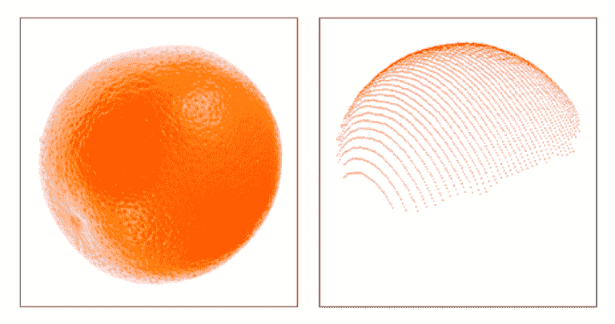
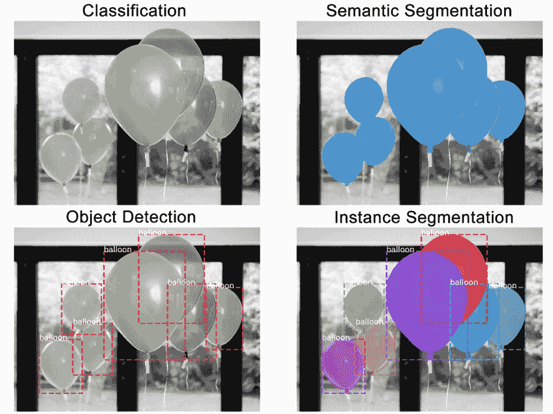

# 计算机视觉技术和应用的最新趋势

> 原文：[`www.kdnuggets.com/2018/11/trends-computer-vision-technology-applications.html`](https://www.kdnuggets.com/2018/11/trends-computer-vision-technology-applications.html)

 评论

**由 [Valeryia Shchutskaya](https://www.linkedin.com/in/lersh/)、[InData Labs](https://indatalabs.com/)**。

计算机视觉软件正在改变各个行业，使消费者的生活不仅变得更加轻松，还变得更加有趣。作为一个领域，计算机视觉得到了大量宣传和相当数量的投资。北美市场的计算机视觉软件总投资达到了 1.2 亿美元，而中国市场则猛增至 39 亿美元。让我们深入了解一下那些最有前景和最令人兴奋的技术，它们使计算机视觉软件开发市场增长如此迅速。

### **深度学习的进展**

* * *

## 我们的三大课程推荐

 1\. [谷歌网络安全证书](https://www.kdnuggets.com/google-cybersecurity) - 快速开启网络安全职业生涯。

 2\. [谷歌数据分析专业证书](https://www.kdnuggets.com/google-data-analytics) - 提升你的数据分析技能

 3\. [谷歌 IT 支持专业证书](https://www.kdnuggets.com/google-itsupport) - 支持你的组织的 IT 工作

* * *

深度学习因其在提供准确结果方面的优势而获得了广泛的关注。

传统的机器学习算法，尽管它们可能很复杂，但其核心仍然非常简单。它们的训练需要大量的领域专业知识（这很昂贵），当出现错误时需要人工干预，最终它们只擅长于它们所训练的任务。

深度学习算法则通过一个神经网络来了解当前任务，将任务映射为一系列概念的层次结构。每个复杂的概念都由一系列简单的概念定义。这一切算法都可以自行完成。在计算机视觉的背景下，这意味着首先识别光暗区域，然后分类线条、形状，最后才进行完整的图像识别。

深度学习算法在数据更多时表现更好，而这在机器学习算法中并不常见。

**[来源](https://towardsdatascience.com/why-deep-learning-is-needed-over-traditional-machine-learning-1b6a99177063)**

对于计算机视觉来说，这无疑是个好消息。它不仅使得训练深度学习算法时可以使用更多的图片和视频，还减轻了与数据标注和标签相关的工作量。

零售行业在计算机视觉软件的应用上一直处于先锋地位。ASOS 在 2017 年为其应用增加了按照片搜索选项，随后许多零售商也效仿。有些甚至更进一步，利用计算机视觉软件将在线和离线体验更紧密地结合在一起。

一家名为 Lolli & Pops 的美食糖果零售商使用面部识别技术来识别进店的常客。因此，店内员工能够通过提供个性化的产品推荐和偶尔的忠诚折扣来个性化购物体验。

特殊待遇培养了品牌忠诚度，并将偶尔的顾客转变为常客，这对业务都是有益的。

### **边缘计算的兴起**

连接到互联网和云端的机器能够从网络收集的数据中学习并进行相应调整，从而优化系统性能。然而，连接互联网和云端并不总是有保障。这就是边缘计算发挥作用的地方。

边缘计算指的是附加在物理机器上的技术，如燃气涡轮机、喷气发动机或 MRI 扫描仪。它允许数据在收集地点进行处理和分析，而不是在云端或数据中心完成。

边缘计算并不会取代云计算。它只是让机器在需要时根据新的数据洞察单独行动。换句话说，边缘设备上的机器可以根据自身经验学习和调整，独立于更大的网络。

边缘计算解决了网络可达性和延迟的问题。现在，设备可以放置在网络连接差或不存在的区域，而不会影响分析结果。此外，边缘计算还可以抵消部分数据共享云计算的使用和维护成本。

对于计算机视觉软件来说，这意味着可以更好地实时响应，并且只将相关洞察转移到云端进行进一步分析。这个功能对于自动驾驶汽车尤其有用。

为了安全操作，这些车辆需要收集和分析大量关于周围环境、方向和天气条件的数据，更不用说还要与路上的其他车辆进行实时通讯。依赖云解决方案分析数据可能是危险的，因为延迟可能导致事故。

### **使用点云进行物体识别**

最近在物体识别和跟踪中使用频率更高的技术是点云。简单来说，点云是定义在三维坐标系统中的数据点集合。

这项技术通常用于一个空间内（例如一个房间或容器），其中每个物体的位置和形状由一组坐标（X、Y 和 Z）表示。这个坐标列表被称为“点云”。

此技术提供了物体在空间中的准确表示，并且任何运动都可以被准确跟踪。

**[来源](https://www.hermary.com/learning/3d-vision-data-look-like/)**

点云的应用几乎是无尽的。以下是一些行业及其从此技术中获益的例子：

+   文档：资产监控、建筑工地跟踪、破坏检测。

+   分类：城市规划、用于更简便分析的审计工具、必要的公用事业工作映射。

+   变化检测：资产管理、货物跟踪、自然灾害管理。

+   预测性维护：对资产和基础设施进行持续监控，以预测何时需要维修。

### **融合现实：增强的 VR 和 AR**

今天，任何 VR 或 AR 系统都可以创建沉浸式 3D 环境，但与用户所在的真实环境几乎无关。大多数 AR 设备可以执行简单的环境扫描（例如，Google ARCore 可以检测平面表面和光照条件的变化），而 VR 系统可以通过头部跟踪、控制器等检测用户的动作，但它们的能力仅此而已。

计算机视觉软件正在将 VR 和 AR 推向被称为融合现实（MR）的下一个发展阶段。

借助外部摄像头和传感器来绘制环境地图，以及眼动追踪解决方案和陀螺仪来定位用户，VR 和 AR 系统能够：

+   感知环境并引导用户避开如墙壁、物品或其他用户等障碍物。

+   检测用户的眼动和身体动作，并相应地调整 VR 环境。

+   提供室内环境、公共空间、地下等的指导和方向。

硬件商店 Lowe’s 已经在他们的商店中使用了这项技术。每位购物者可以借用一个 AR 设备，在设备上制定购物清单并获取商店中每件物品的方向。该 AR 设备实时使用楼层图、库存信息和环境映射来提供准确的方向。

Sephora 更新了他们的虚拟艺术家应用程序，提供实时 3D 面部识别，让顾客可以看到不同化妆品在他们脸上以及不同光照条件下的效果。

### **语义实例分割**

要理解语义实例分割是什么，首先我们将这一概念拆分为两个部分：语义分割和实例分割。

实例分割在像素级别识别物体轮廓，而语义分割则只是将像素分组到特定的物体组。让我们用气球的图像来说明这两种技术与其他技术的比较。

**[来源](https://engineering.matterport.com/splash-of-color-instance-segmentation-with-mask-r-cnn-and-tensorflow-7c761e238b46)**

+   分类：此图像中有一个气球。

+   语义分割：这些是所有的气球像素。

+   物体检测：此图像中的这些位置有 7 个气球。我们开始考虑重叠的物体。

+   实例分割：这些位置有 7 个气球，这些是属于每个气球的像素。

将语义分割和实例分割方法结合起来，成为一种强大的工具。这不仅可以检测出图像中属于物体的所有像素，还可以确定这些像素属于哪个物体以及物体在图像中的位置。

语义实例分割是用于土地覆盖分类的有用工具，具有多种应用。通过卫星图像进行土地映射可以帮助政府机构监测森林砍伐（特别是非法砍伐）、城市化、交通等。

许多建筑公司也在使用这些数据进行城市规划和建筑开发。有些公司甚至更进一步，将其与 AR 设备结合，以了解他们的设计在现实生活中的样子。

**简历**：[Valeryia Shchutskaya](https://www.linkedin.com/in/lersh/) 是[InData Labs](https://indatalabs.com/)的市场经理——一家提供 AI 驱动的软件和技术解决方案的专业服务公司，致力于帮助公司利用数据和机器学习算法创造业务价值。

[原创](https://indatalabs.com/blog/data-science/trends-computer-vision-software-market?cli_action=1540045586.641)。经许可转载。

**相关：**

+   [使用 USB 摄像头和无线连接的树莓派构建监控系统](https://www.kdnuggets.com/2018/11/building-surveillance-system-usb-camera-wireless-connected-raspberry-pi.html)

+   [使用 Python 的基础图像数据分析 – 第四部分](https://www.kdnuggets.com/2018/10/basic-image-analysis-python-p4.html)

+   [如何在 Kaggle 比赛中获胜，如果你不是 NLP 专家](https://www.kdnuggets.com/2017/09/win-kaggle-nlp-not-expert.html)

### 更多相关主题

+   [探索计算机视觉的世界：介绍 MLM 的最新…](https://www.kdnuggets.com/2024/01/mlm-discover-the-world-of-computer-vision-ebook)

+   [计算机视觉的 5 个应用](https://www.kdnuggets.com/2022/03/5-applications-computer-vision.html)

+   [KDnuggets 新闻 2022 年 3 月 9 日：在 5 分钟内构建机器学习 Web 应用程序…](https://www.kdnuggets.com/2022/n10.html)

+   [关于数据管理的 6 件事及其重要性…](https://www.kdnuggets.com/2022/05/6-things-need-know-data-management-matters-computer-vision.html)

+   [DINOv2：Meta AI 的自监督计算机视觉模型](https://www.kdnuggets.com/2023/05/dinov2-selfsupervised-computer-vision-models-meta-ai.html)

+   [TensorFlow 用于计算机视觉——简化迁移学习](https://www.kdnuggets.com/2022/01/tensorflow-computer-vision-transfer-learning-made-easy.html)
