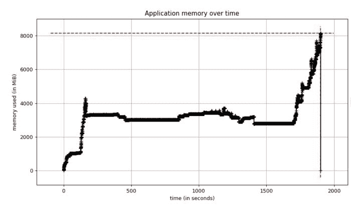
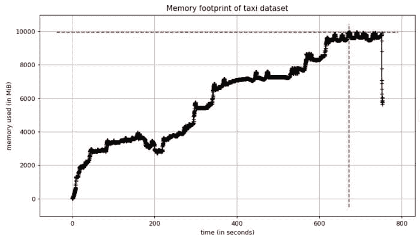
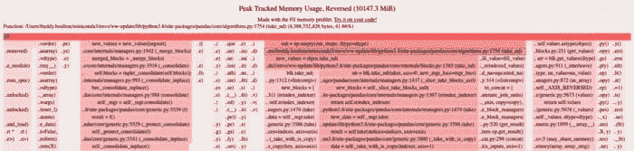
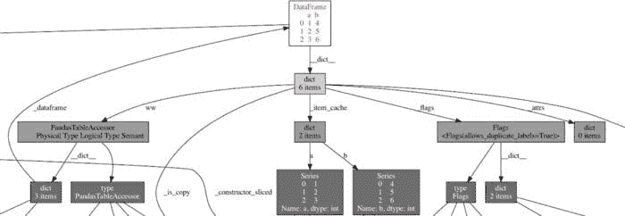
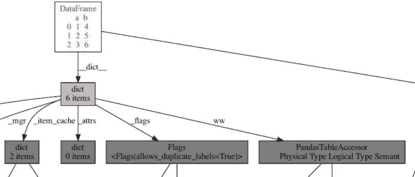
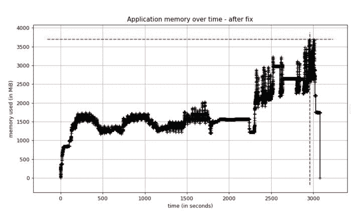

# 如何排查 Python 中的内存问题

> 原文：[`www.kdnuggets.com/2021/06/troubleshoot-memory-problems-python.html`](https://www.kdnuggets.com/2021/06/troubleshoot-memory-problems-python.html)

评论

**由 [Freddy Boulton](https://innovation.alteryx.com/author/freddy/)，Alteryx 的软件工程师**

* * *

## 我们的三大课程推荐

 1\. [谷歌网络安全证书](https://www.kdnuggets.com/google-cybersecurity) - 快速进入网络安全职业道路。

 2\. [谷歌数据分析专业证书](https://www.kdnuggets.com/google-data-analytics) - 提升你的数据分析技能

 3\. [谷歌 IT 支持专业证书](https://www.kdnuggets.com/google-itsupport) - 支持你的组织进行 IT 维护

* * *

发现应用程序内存不足是开发人员可能遇到的最糟糕的情况之一。内存问题通常很难诊断和修复，但我认为在 Python 中更是如此。Python 的自动垃圾回收机制使得语言易于上手，但它非常隐蔽，当它未按预期工作时，开发人员可能会不知道如何识别和解决问题。

在这篇博客文章中，我将展示我们是如何诊断和修复 [EvalML](https://evalml.alteryx.com/en/stable/) 中的内存问题的，这是一款由 Alteryx 创新实验室开发的开源 AutoML 库。解决内存问题没有魔法公式，但我希望开发人员，特别是 Python 开发人员，可以了解在将来遇到此类问题时可以利用的工具和最佳实践。

阅读完这篇博客后，你应该能获得以下知识：

1.  为什么发现和修复程序中的内存问题如此重要，

1.  什么是循环引用，为什么它们可能在 Python 中引起内存泄漏，以及

1.  了解 Python 的内存分析工具以及一些可以采取的步骤，以确定内存问题的原因。

### **设定背景**

EvalML 团队在发布我们包的新版本之前，会进行一系列性能测试，以捕捉任何性能回退。这些性能测试包括在各种数据集上运行我们的 AutoML 算法，测量算法的得分以及运行时间，并将这些指标与我们之前发布的版本进行比较。

一天，我在运行测试时，应用程序突然崩溃了。发生了什么事？

### **第 0 步 - 什么是内存，什么是泄漏？**

任何编程语言最重要的功能之一是其在计算机内存中存储信息的能力。每次你的程序创建一个新变量时，它都会分配一些内存来存储该变量的内容。

内核定义了一个接口，供程序访问计算机的 CPU、内存、磁盘存储等。每种编程语言都提供了请求内核为运行中的程序分配和释放内存块的方法。

内存泄漏发生在程序请求内核分配一块内存用于使用，但由于错误或崩溃，程序没有告诉内核它何时完成使用那块内存。在这种情况下，内核会继续认为被遗忘的内存块仍在被运行中的程序使用，其他程序将无法访问这些内存块。

如果在运行程序时相同的泄漏反复发生，遗忘的内存总量可能会增长到占用计算机内存的大部分！在这种情况下，如果程序尝试请求更多内存，内核将引发“内存不足”错误，程序将停止运行，换句话说，就是“崩溃”。

因此，找到并修复你编写的程序中的内存泄漏非常重要，因为如果不修复，你的程序最终可能会耗尽内存而崩溃，或者可能会导致其他程序崩溃。

### **步骤 1：确认这是一个内存问题**

应用程序崩溃可能有多种原因——也许是运行代码的服务器崩溃了，也许是代码本身存在逻辑错误——因此确定当前问题是内存问题非常重要。

EvalML 性能测试以一种异常安静的方式崩溃了。突然间，服务器停止记录进度，任务安静地完成了。服务器日志会显示由代码错误引起的任何堆栈跟踪，因此我猜测这种无声的崩溃是由于任务使用了所有可用内存。

我重新运行了性能测试，这次启用了 Python 的[memory-profiler](https://pypi.org/project/memory-profiler/)以获取内存使用情况的时间图。测试再次崩溃，当我查看内存图时，我看到了这个：

我们的内存使用保持稳定，但随后达到 8 吉字节！我知道我们的应用程序服务器有 8 吉字节的 RAM，所以这个分析确认了我们内存不足。此外，当内存稳定时，我们使用了大约 4 GB 的内存，而我们之前的 EvalML 版本使用了大约 2 GB 的内存。因此，出于某种原因，这个当前版本的内存使用量大约是正常情况的两倍。

现在我需要找出原因。

### **步骤 2：使用最小示例在本地重现内存问题**

精确找出内存问题的原因涉及大量实验和迭代，因为答案通常不明显。如果明显，你可能不会把它写到代码中！因此，我认为重要的是用尽可能少的代码行来重现问题。这个最小示例使你能够在修改代码时快速运行它以查看是否取得进展。

在我的案例中，我从经验中知道，我们的应用程序处理一个包含 150 万行数据的出租车数据集，这大约是在我看到大幅波动的时候。我将我们的应用程序简化到仅运行这个数据集的[部分](https://gist.github.com/freddyaboulton/66159137063d01f3ee9cfb84b0ac2aaa)。我看到一个类似于我上面描述的波动，但这次内存使用达到了 10GB！

看到这个之后，我知道我有一个足够好的最小示例来深入探讨。

在出租车数据集上本地重现的内存占用

### **步骤 3：找出分配最多内存的代码行**

一旦我们将问题隔离到尽可能小的代码块中，就可以查看程序在哪里分配了最多的内存。这可以是你需要的关键证据，以便能够重构代码并解决问题。

我认为[filprofiler](https://pypi.org/project/filprofiler/)是一个很棒的 Python 工具来做到这一点。它显示了应用程序中每行代码在内存使用高峰时的内存分配。这是我本地示例的输出：

fil-profile 的输出

filprofiler 根据内存分配对你应用程序中的代码行（以及依赖代码）进行排名。行越长，颜色越红，分配的内存越多。

分配最多内存的代码行正在创建 pandas 数据框（pandas/core/algorithms.py 和 pandas/core/internal/managers.py），总计达 4GB 的数据！我在这里截断了 filprofiler 的输出，但它能够跟踪创建 pandas 数据框的 EvalML 中的代码。

看到这个情况有点令人困惑。是的，EvalML 创建 pandas 数据框，但这些数据框在 AutoML 算法中是短暂存在的，并应在不再使用时立即被释放。由于情况并非如此，这些数据框在 EvalML 完成它们时仍然在内存中停留了足够长的时间，我认为最新版本可能引入了一个[内存泄漏](https://en.wikipedia.org/wiki/Memory_leak)。

### **步骤 4：识别泄漏对象**

在 Python 的上下文中，泄漏对象是指在使用完毕后没有被 Python 垃圾回收器回收的对象。由于 Python 使用 [引用计数](https://en.wikipedia.org/wiki/Reference_counting) 作为其主要垃圾回收算法之一，这些泄漏对象通常是由于对象持有对它们的引用时间过长造成的。

这类对象很难找到，但你可以利用一些 Python 工具来使搜索变得可行。第一个工具是垃圾回收器的 [gc.DEBUG_SAVEALL](https://docs.python.org/3/library/gc.html#gc.DEBUG_SAVEALL) 标志。通过设置此标志，垃圾回收器将把不可达的对象存储在 gc.garbage 列表中。这将允许你进一步调查这些对象。

第二个工具是 [objgraph](https://pypi.org/project/objgraph/) 库。一旦对象在 gc.garbage 列表中，我们可以将这个列表过滤为 pandas 数据框，然后使用 objgraph 查看其他对象如何引用这些数据框并将它们保留在内存中。我通过阅读这篇 O’Reilly [博客文章](https://www.oreilly.com/library/view/python-cookbook/0596001673/ch14s10.html)得到了这个方法的灵感。

这是我在可视化这些数据框之一时看到的对象图的一个子集：

显示 pandas 数据框使用的内存图，展示了一个导致内存泄漏的循环引用。

这就是我寻找的确凿证据！数据框通过名为 PandasTableAccessor 的东西引用自身，这会创建一个 [循环引用](https://en.wikipedia.org/wiki/Circular_reference)，因此，这会将对象保持在内存中，直到 Python 的垃圾回收器运行并能够释放它。（你可以通过 dict、PandasTableAccessor、dict、_dataframe 跟踪这个循环。）这对 EvalML 来说是一个问题，因为垃圾回收器将这些数据框保存在内存中如此之久，以至于我们内存不足！

我能够追踪 PandasTableAccessor 到 [Woodwork](https://woodwork.alteryx.com/en/stable/) 库，并向维护者报告了这个 [问题](https://github.com/alteryx/woodwork/issues/880)。他们在新版本中修复了它，并向 pandas 仓库提交了相关的 [问题](https://github.com/pandas-dev/pandas/issues/41357) — 这是开源生态系统中可能进行协作的一个很好的例子。

在 Woodwork 更新发布后，我可视化了相同数据框的对象图，循环消失了！

Woodwork 升级后的 pandas 数据框对象图。不再有循环！

### **步骤 5：验证修复是否有效**

一旦我在 EvalML 中升级了 Woodwork 版本，我测量了我们应用程序的内存占用。我很高兴地报告，现在内存使用量已经减少到原来的一半以下！

修复后的性能测试内存

### **结束语**

正如我在这篇文章开头所说的那样，解决内存问题没有魔法配方，但这个案例研究提供了一个通用框架和一套工具，你可以利用这些工具来应对未来类似的情况。我发现 memory-profiler 和 filprofiler 是调试 Python 内存泄漏的有用工具。

我还要强调的是，Python 中的循环引用可能会增加应用程序的内存占用。垃圾回收器最终会释放内存，但正如我们在这个案例中看到的，可能会等到为时已晚才释放！

在 Python 中，意外引入循环引用是令人惊讶的容易。我能够在 EvalML、[scikit-optimize](https://github.com/scikit-optimize/scikit-optimize/issues/1028) 和 [scipy](https://github.com/scipy/scipy/issues/13986) 中找到一个意外的循环引用。我鼓励你保持警惕，如果在实际工作中发现循环引用，开始讨论以了解它是否真的必要！

**简介: [Freddy Boulton](https://innovation.alteryx.com/author/freddy/)** 是 Alteryx 的软件工程师。他喜欢参与开源项目，并且喜欢在波士顿骑自行车。

[原文](https://innovation.alteryx.com/how-to-troubleshoot-memory-problems-in-python/)。经许可转载。

**相关内容:**

+   顶级编程语言及其用途

+   数据科学家，你需要学会编码

+   使用 Python 自动化的 5 个任务

### 主题更多内容

+   [Python 内存分析介绍](https://www.kdnuggets.com/introduction-to-memory-profiling-in-python)

+   [如何在 Pandas 中对大型数据集执行内存高效的操作](https://www.kdnuggets.com/how-to-perform-memory-efficient-operations-on-large-datasets-with-pandas)

+   [变压器的内存复杂性](https://www.kdnuggets.com/2022/12/memory-complexity-transformers.html)

+   [更多分类问题的性能评估指标]（https://www.kdnuggets.com/2020/04/performance-evaluation-metrics-classification.html）

+   [常见数据问题（及解决方案）](https://www.kdnuggets.com/2022/02/common-data-problems-solutions.html)

+   [识别机器学习可解决问题的 4 个因素](https://www.kdnuggets.com/2022/04/4-factors-identify-machine-learning-solvable-problems.html)
