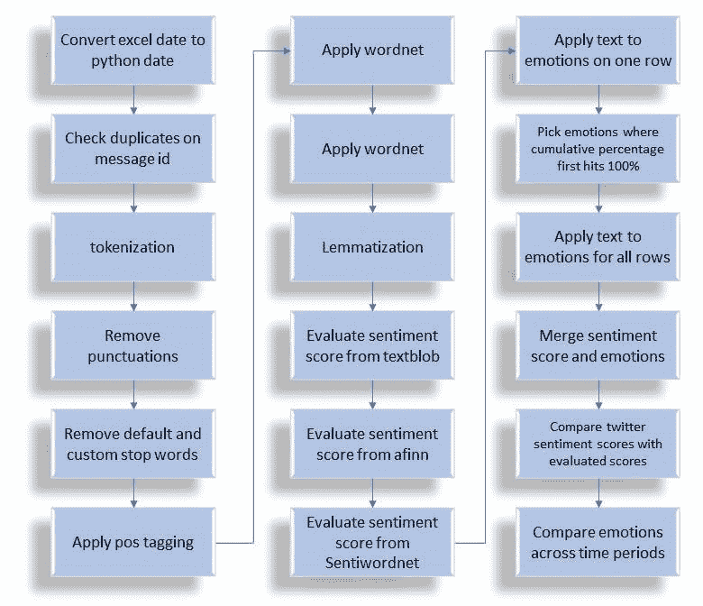
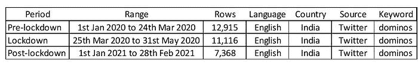
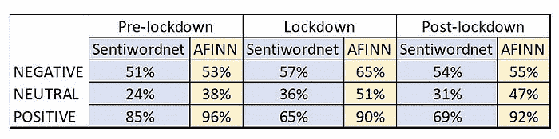
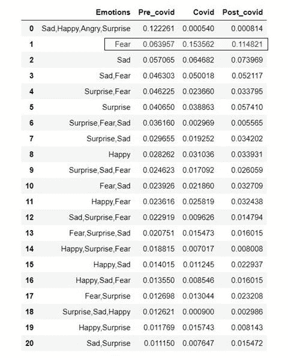
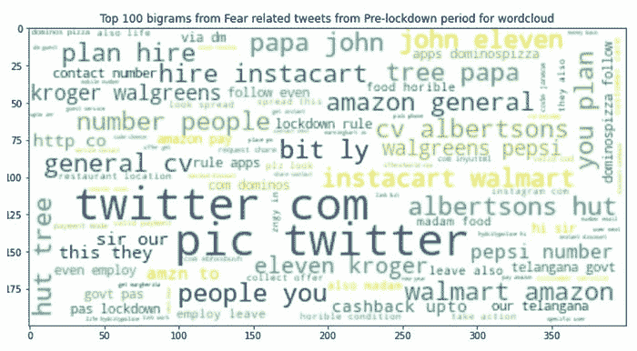
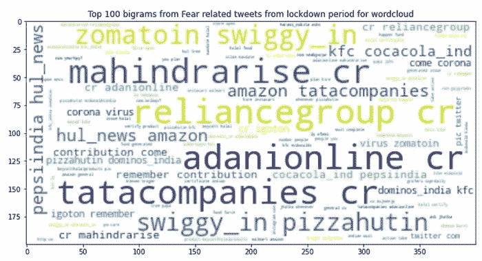
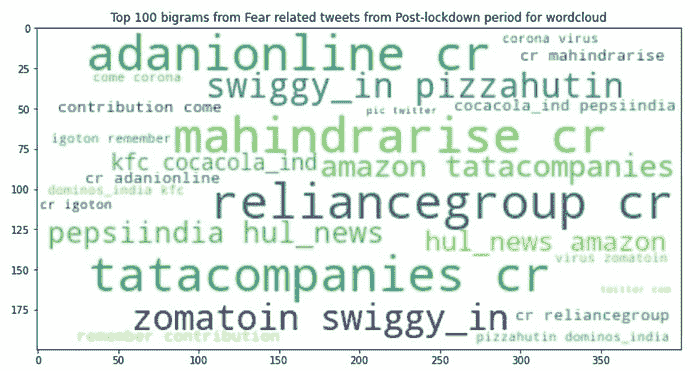

# 使用 Twitter 了解 COVID 期间披萨配送的顾虑

> 原文：[`www.kdnuggets.com/2021/08/twitter-understand-pizza-delivery-covid.html`](https://www.kdnuggets.com/2021/08/twitter-understand-pizza-delivery-covid.html)

评论

**由[Arimitra Maiti](https://www.linkedin.com/in/arimitra-maiti-330608138/)，高级分析顾问**

图片由[Aarón Blanco Tejedor](https://unsplash.com/@innernature?utm_source=medium&utm_medium=referral)提供，来源于[Unsplash](https://unsplash.com/?utm_source=medium&utm_medium=referral)

* * *

## 我们的前 3 个课程推荐

 1\. [谷歌网络安全证书](https://www.kdnuggets.com/google-cybersecurity) - 快速进入网络安全职业生涯。

 2\. [谷歌数据分析专业证书](https://www.kdnuggets.com/google-data-analytics) - 提升您的数据分析技能

 3\. [谷歌 IT 支持专业证书](https://www.kdnuggets.com/google-itsupport) - 支持您的组织 IT

* * *

> 披萨让一切成为可能。
> 
> —亨利·罗林斯

### 注意：本文及其分析结果并不意在影响任何 Domino’s 顾客。观察结果的真实性需由领域专家进一步调查，不应被解读为诽谤形式。研究中使用的数据既非个人数据，也非版权数据或隐藏在登录后的数据。

### **简介**

印度经历了自 2020 年 3 月 24 日至 2020 年 5 月 31 日的首次全国封锁，以通过限制居民的活动来遏制新型冠状病毒的传播。本文的研究旨在识别印度顾客在订购披萨时的不同情感，研究对象为一家非常受欢迎的披萨配送连锁店**Dominos**。从 2006 年的 128 家门店，到 2020 年，Domino’s India，Jubilant Foodworks 的主打品牌，报告称全国超过 1300 家门店。研究分析了三个不同时间段的 Twitter 数据。第一个时间段从*2020 年 1 月 1 日到 2020 年 3 月 24 日*，被认为是封锁前期；第二个时间段从*2020 年 3 月 25 日到 2020 年 5 月 31 日*，被认为是封锁期；最后，第三个时间段从*2021 年 1 月 1 日到 2021 年 2 月 28 日*，被认为是封锁后期。这三个不同时间段的 Twitter 数据通过*Sprinklr（由 IIM Ahmedabad 授权）*提取，*该工具专注于提供现代社交平台的实时用户对话。*Sprinklr 工具提供全球用户生成的历史 Twitter 数据的便捷访问*。

在 Sprinklr 中使用的**过滤器**是“仅英语”语言，数据生成来源为“仅 Twitter”，数据生成起源为“仅印度”。没有使用明确的 Twitter 账户或 Twitter 标签来提取时间线中的内容，因此假设关键词“*dominos*”代表了为零售店或在线平台上的客户提供披萨的公司 Dominos India。

### **方法**

图-1 分析的高级方法。（图片来源）：作者提供的图片

第 1 列和第 2 列的上半部分依赖于分析师的效率和风格。这种方法并不宣称是理想的，因为随着新概念和技术的出现，情感分析在过去 5 年中有了飞跃式的发展。然而，为了保持接近目标，本研究认为上述方法是相关的。进一步的改进和修改是不可忽视的。基本问题定义是分析客户情感，并捕捉不同时间段的情感差异。在清理和标准化用户评论后，每条评论都通过由*texblob*、*sentiwordnet* 和 *afinn* 指定的方法生成分数。如果分数小于零，则为负面；如果分数为一，则为中性；如果分数大于一，则为正面。

第 2 列的下半部分和整个第 3 列也可以在未来的研究中进一步优化。*text2emotion* 方法用于提取每条评论的情感。作为附加功能，该方法还单独给出情感类别和分数。累计分数只是试图在给定的数据集中找出某一情感类别的累计分数。研究希望验证哪些用户评论没有获得 *text2emotion* 的分数。

图-2 数据概述。（图片来源）：作者提供的图片

### **关于库**

*Sentiwordnet* 是 python nltk 包中用于情感挖掘的一个流行模块。它基于 WordNet 词典，将单词分类为正面、中性或负面。同样，*AFINN* 词典也是“Afinn”包中的一个流行模块，在情感挖掘中功能强大。*text2emotion* 是另一个在 python 中可用于将每种情感分类为独特情绪的有用工具。需要注意的是，分析师用于情感评分的任何词典都完全依赖于词典的设计。语言的最终语境或用户反应可能需要进一步转换，以体现商业语境，这可能是词典无法理解的。因此，任何用于自然语言处理领域的词典生成的输出的相关性都取决于研究的裁量，不能仅凭词典表面价值。一个特定的词在词典中可能听起来负面，但在实际语境中，这个词可能是中性或正面的。

图-3 显示 Twitter 情感评分与研究中生成的 Sentiwordnet 或 AFINN 分数匹配的百分比的表格。（图片来源）：作者提供的图片

上表显示，对于从 Twitter 生成的数据，我们可能使用 AFINN 词典会比使用 Sentiwordnet 或 Text blob（当前未显示在比较中）得到相对较好的结果。

*注意：在生成 Sentiwordnet 或 AFINN 分数之前，没有使用训练和测试集的先前拆分或交叉验证。所有三个时间线中的用户反应已逐一通过每个词典。*

### **初步发现**

图-4 显示三个时间线中捕捉到的情感百分比的表格。（图片来源）：作者提供的图片

根据我们的发现，恐惧作为文本情感从封锁前的 6%大幅上升至封锁期间的 15%和封锁后的 11%。然而，这些恐惧相关的感受可能并不是由于 Dominos 披萨在封锁期间及之后的高质量餐点所致。

*让我们查看来自三个不同时间线的一些双字组。*

图-5 仅针对恐惧相关推文的**封锁前**期的双字组。（图片来源）：作者提供的图片

图-6 仅针对恐惧相关推文的**封锁**期的双字组。（图片来源）：作者提供的图片

图-7 仅针对恐惧相关推文的**封锁后**期的双字组。（图片来源）：作者提供的图片

在三个时间线中仅涉及恐惧相关的双词组暗示了一组独立的概念。客户从送货合作伙伴如 Swiggy 和 Zomato 处报告了新冠感染案例，这些合作伙伴负责将包裹从零售商店送达客户目的地。在 2020 年 5 月，Tata Consumer Products Ltd (TPCL)与 Dominos 应用程序[合作](https://www.thehindubusinessline.com/companies/tata-consumer-products-ties-up-with-dominos-pizza-zomato-to-deliver-essential-goods/article31527327.ece)配送其必需品。因此，恐惧可能与该特定服务线有关，可能对消毒而非食品质量存在感知上的不确定性。

### **结论**

笔记本可以从[**这里**](https://github.com/arimitramaiti/notebooks/blob/master/articles/6820017_ArimitraMaiti_IA3_analysis.ipynb)访问。用于研究的停用词表见下。

预疫情（[pre-covid](https://raw.githubusercontent.com/arimitramaiti/datasets/master/articles/pre_covid.csv)）、封锁（[lockdown](https://raw.githubusercontent.com/arimitramaiti/datasets/master/articles/covid.csv)）和后疫情（[post-covid](https://raw.githubusercontent.com/arimitramaiti/datasets/master/articles/post_covid.csv)）数据下载的超链接也已附上。下面还展示了处理步骤的编程快照。

处理和评分文本的代码片段。（代码来源）：作者提供的代码

本研究的目标是确定印度比萨市场在新冠疫情前后情感的显著变化。研究并非意在贬低任何品牌或影响顾客偏好。实际情况是，封锁期间对比萨的订购恐惧增加，这与我们的后疫情心态直接相关。值得注意的是，除了“恐惧”之外，没有其他情感在比萨销售中出现如此大的增长。这可能意味着，如果没有封锁的影响，比萨订购的情感将继续保持混合或愉快，而非完全恐惧。对于制定 Dominos 销售策略的业务经理来说，本文提供的见解可能不会带来突破性的创新。另一方面，研究尝试预测意见挖掘的实际应用，这可能容易从现实世界经验中推断出来。

谢谢。

**个人简介：[Arimitra Maiti](https://www.linkedin.com/in/arimitra-maiti-330608138/)** 是一名拥有超过 10 年分析咨询、统计建模、利益相关者管理经验的分析专业人士，曾领导开发生成有关成本和收入优化见解的分析解决方案。

[原文](https://medium.com/arimitra-maiti/apprehension-to-order-pizza-546ee3eb7e4a)。已获许可转载。

**相关：**

+   COVID 对我们所有模型做了什么？

+   6 种每个数据科学家都应该知道的 NLP 技术

+   如何通过 API 创建和部署一个简单的情感分析应用

### 更多相关内容

+   [使用 SQL 了解数据科学职业趋势](https://www.kdnuggets.com/using-sql-to-understand-data-science-career-trends)

+   [24 本最佳（且免费的）书籍以理解机器学习](https://www.kdnuggets.com/2020/03/24-best-free-books-understand-machine-learning.html)

+   [图表：理解数据的自然方式](https://www.kdnuggets.com/2022/10/manning-graphs-natural-way-understand-data.html)

+   [挑选示例以理解机器学习模型](https://www.kdnuggets.com/2022/11/picking-examples-understand-machine-learning-model.html)

+   [使用 Python 自动化 Microsoft Excel 和 Word](https://www.kdnuggets.com/2021/08/automate-microsoft-excel-word-python.html)

+   [如何使用 Python 确定最佳拟合的数据分布](https://www.kdnuggets.com/2021/09/determine-best-fitting-data-distribution-python.html)
