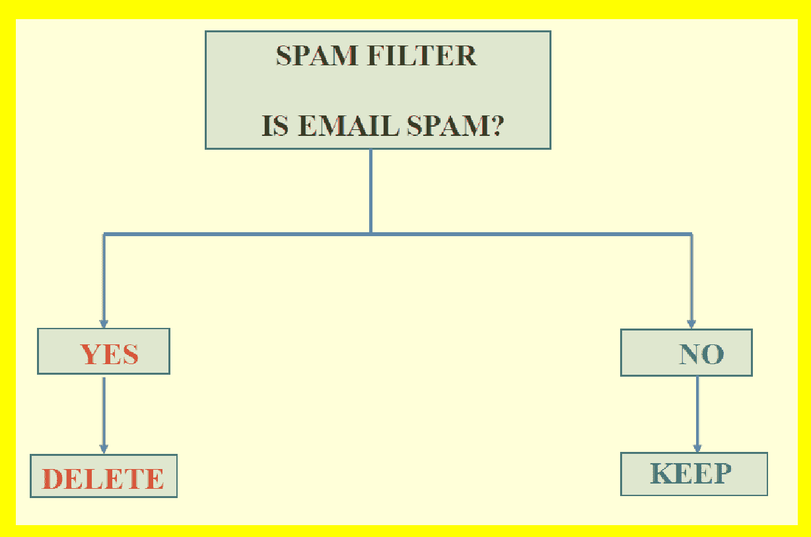
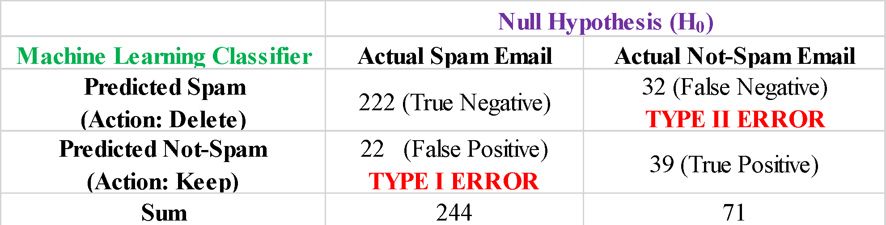
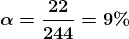
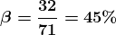
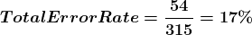

# Type I 和 Type II 错误：有什么区别？

> 原文：[`www.kdnuggets.com/2022/08/type-type-ii-errors-difference.html`](https://www.kdnuggets.com/2022/08/type-type-ii-errors-difference.html)

作者提供的图像

## 关键要点

+   Type I 和 Type II 错误在机器学习和统计学中非常常见。

+   当零假设（H0）被错误地拒绝时，就会发生 I 型错误。这也被称为假阳性错误。

+   当实际上为假但被接受的零假设时，就会发生 II 型错误。这也被称为假阴性错误。

* * *

## 我们的前三大课程推荐

 1\. [谷歌网络安全证书](https://www.kdnuggets.com/google-cybersecurity) - 快速进入网络安全职业。

 2\. [谷歌数据分析专业证书](https://www.kdnuggets.com/google-data-analytics) - 提升你的数据分析技能

 3\. [谷歌 IT 支持专业证书](https://www.kdnuggets.com/google-itsupport) - 支持你的组织 IT

* * *

让我们通过一个二分类机器学习垃圾邮件过滤器来说明 Type I 和 Type II 错误。我们假设有一个标记的数据集 N = 315 封电子邮件，其中 244 封标记为***垃圾邮件***，71 封标记为***非垃圾邮件***。假设我们已经建立了一个机器学习分类算法来从这些数据中学习。现在我们想评估机器学习模型的表现。模型在正确检测***垃圾邮件***与***非垃圾邮件***方面表现如何？我们假设每当模型预测电子邮件为***垃圾邮件***时，该邮件将被删除并保存在垃圾邮件文件夹中。我们还假设***垃圾邮件***类别是负类别，***非垃圾邮件***类别是正类别。我们假设机器学习模型的表现可以在下面的表格中说明：

**I 型错误（假阳性错误）：** 从表格中我们可以看到，在 244 封***垃圾邮件***中，模型正确预测了 222 封为***垃圾邮件***（真正阴性），而 22 封***垃圾邮件***被错误预测为***非垃圾邮件***（假阳性）。这意味着根据这个模型，22 封***垃圾邮件***将不会被删除。I 型错误率或假阳性率表示为，并给出如下：

**II 型误差（漏报误差）：** 从表中可以观察到，在 71 个***非垃圾邮件***中，模型正确预测了 39 个为***非垃圾邮件***（真正例），而 22 个***非垃圾邮件***被错误预测为垃圾邮件（漏报）。我们看到模型将删除 32 个***非垃圾邮件***。II 型误差率或漏报率表示为，并计算为

**总模型误差**：从上表中可以观察到，总共有 54 个误分类，其中 315 个标记的电子邮件数据集中，有 22 个是误报，32 个是漏报。总误差率计算为

对于二分类系统，总误差率不是一个好的度量指标。相反，重要的是关注 I 型和 II 型误差率。在这个示例中，重要的是将 I 型误差率（）保持在较低水平，以便***垃圾邮件***不会被错误地分类为正常的***非垃圾邮件***并被删除。类似地，重要的是最小化 II 型误差率，以便正常的***非垃圾邮件***不会被误认为是***垃圾邮件***。

总结一下，我们讨论了 I 型和 II 型误差之间的区别。有关 I 型和 II 型误差如何在二分类系统中使用的更多信息，请参阅这篇文章：[贝叶斯定理解释](https://benjaminobi.medium.com/bayes-theorem-in-plain-english-eeb142710475?sk=056a4e2d13a83c3305029b91326f2155)。

**[本杰明·O·泰约](https://www.linkedin.com/in/benjamin-o-tayo-ph-d-a2717511/)** 是一位物理学家、数据科学教育者和作家，同时也是 DataScienceHub 的所有者。之前，本杰明曾在中奥克拉荷马大学、大峡谷大学和匹兹堡州立大学教授工程学和物理学。

### 该主题的更多内容

+   [SQL 与对象关系映射 (ORM) 之间的区别是什么？](https://www.kdnuggets.com/2022/02/difference-sql-object-relational-mapping-orm.html)

+   [数据分析师与数据科学家之间的区别是什么？](https://www.kdnuggets.com/2022/03/difference-data-analysts-data-scientists.html)

+   [NLP、NLU 和 NLG：有什么区别？全面指南](https://www.kdnuggets.com/2022/06/nlp-nlu-nlg-difference-comprehensive-guide.html)

+   [效率决定生物神经元与…的区别](https://www.kdnuggets.com/2022/11/efficiency-spells-difference-biological-neurons-artificial-counterparts.html)

+   [L1 和 L2 正则化之间的区别](https://www.kdnuggets.com/2022/08/difference-l1-l2-regularization.html)

+   [机器学习中训练数据与测试数据的区别](https://www.kdnuggets.com/2022/08/difference-training-testing-data-machine-learning.html)
