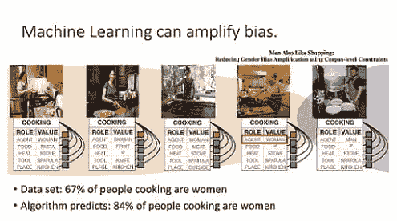

# 机器学习中的偏差类型

> 原文：[`www.kdnuggets.com/2019/08/types-bias-machine-learning.html`](https://www.kdnuggets.com/2019/08/types-bias-machine-learning.html)

 评论https://www.infoq.com/presentations/unconscious-bias-machine-learning/

在我之前的文章中，我讨论了在机器学习中可能遇到的偏差，并且这些偏差实际上可以帮助构建更好的模型。这里是后续文章，展示一些应避免的偏差。

* * *

## 我们的前三名课程推荐

 1\. [Google 网络安全证书](https://www.kdnuggets.com/google-cybersecurity) - 快速进入网络安全职业轨道。

 2\. [Google 数据分析专业证书](https://www.kdnuggets.com/google-data-analytics) - 提升你的数据分析技能

 3\. [Google IT 支持专业证书](https://www.kdnuggets.com/google-itsupport) - 支持你的组织 IT

* * *

### 1\. 样本偏差

我们必须考虑训练数据中的抽样偏差，因为这是人为输入的结果。机器学习模型是预测引擎，基于过去的大量数据进行训练。它们的预测**基于它们被训练来预测的内容**。这些预测的可靠性仅与收集和分析数据的人有关。决策者必须记住，如果在过程中的任何部分涉及到人类，那么模型中存在偏差的可能性就会更大。

用于训练的样本数据必须尽可能接近真实场景。许多因素可能从一开始就会导致样本偏差，这些原因在不同领域（如商业、安全、医疗、教育等）中各不相同。

### 2\. 偏见偏差

这再次是人为输入的原因。偏见是由于参与过程的人的文化刻板印象而产生的。社会阶层、种族、国籍、性别可能会渗透到模型中，从而完全和**不公正地**扭曲模型的结果。不幸的是，不能不相信这可能是有意为之或在整个过程中被忽视。

将这些因素中的一些纳入统计建模以进行研究或在某一时刻了解情况，与在训练数据对某些种族、性别和/或国籍的人存在偏差的情况下预测谁应该获得贷款是完全不同的。

### 3\. 确认偏差

> 确认偏差，是指通过寻找或解释与自己现有信念一致的信息来处理信息的倾向。 *来源 [`www.britannica.com/science/confirmation-bias`](https://www.britannica.com/science/confirmation-bias)*

这是一个广为人知的偏见，已在心理学领域进行了研究，并直接适用于其如何影响机器学习过程。如果预期使用者有一个预先存在的假设，并希望通过机器学习来验证这个假设*（根据上下文可能有简单的方法可以做到这一点）*，那么参与建模过程的人可能会倾向于故意操控过程以找到那个答案。我个人认为这比我们想象的更常见，因为从启发式的角度看，我们行业中的许多人可能会在开始过程之前就受到压力，要求得到某个特定的答案，而不是单纯地查看数据实际说了什么。

### 4\. 群体归因偏见

这种偏见源于当你用包含某个群体不对称观点的数据来训练模型时。例如，在某个样本数据集中，如果某个性别的成功率高于另一个性别，或者某个种族的收入高于另一个种族，你的模型将倾向于相信这些虚假信息。这些情况下存在标签偏见。实际上，这些标签不应该进入模型。用于理解和分析当前情况的样本数据不能在未经适当预处理以考虑任何潜在不公正偏见的情况下直接用作训练数据。机器学习模型在社会中变得越来越普遍，而普通人甚至未曾察觉，这使得群体归因偏见同样可能因未采取必要步骤以考虑训练数据中的偏见而不公正地惩罚某个人。

**相关**:

+   Data Literacy: Using the Socratic Method

+   All Models Are Wrong – What Does It Mean?

+   What 70% of Data Science Learners Do Wrong

### 更多相关内容

+   [Stop Learning Data Science to Find Purpose and Find Purpose to…](https://www.kdnuggets.com/2021/12/stop-learning-data-science-find-purpose.html)

+   [Top Resources for Learning Statistics for Data Science](https://www.kdnuggets.com/2021/12/springboard-top-resources-learn-data-science-statistics.html)

+   [A $9B AI Failure, Examined](https://www.kdnuggets.com/2021/12/9b-ai-failure-examined.html)

+   [The 5 Characteristics of a Successful Data Scientist](https://www.kdnuggets.com/2021/12/5-characteristics-successful-data-scientist.html)

+   [What Makes Python An Ideal Programming Language For Startups](https://www.kdnuggets.com/2021/12/makes-python-ideal-programming-language-startups.html)

+   [Three R Libraries Every Data Scientist Should Know (Even if You Use Python)](https://www.kdnuggets.com/2021/12/three-r-libraries-every-data-scientist-know-even-python.html)
