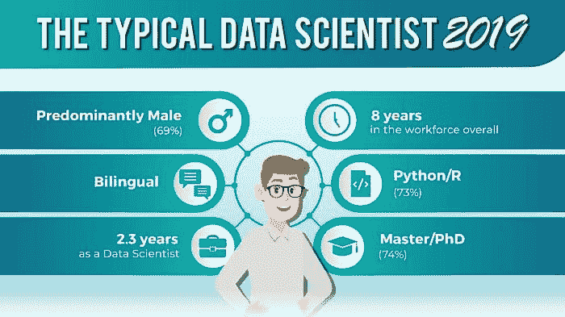
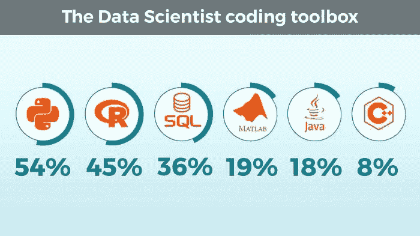
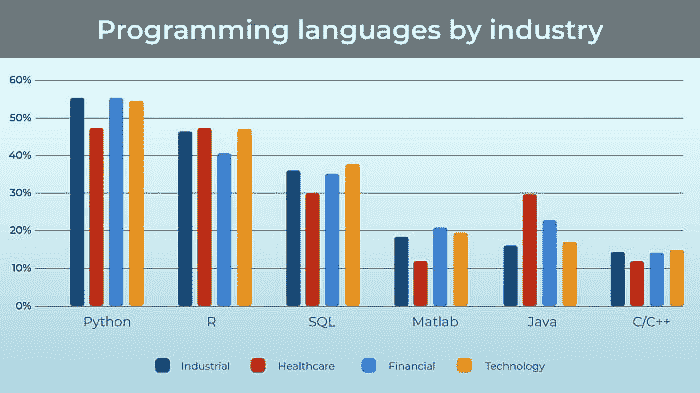
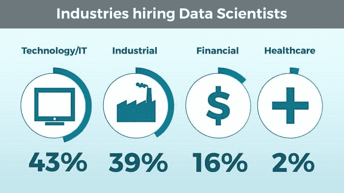
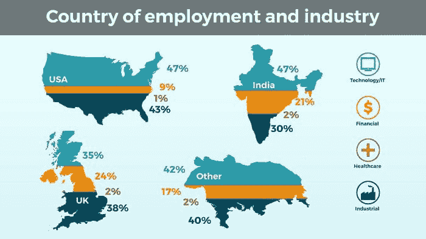

# 2019 年的典型数据科学家是谁？

> 原文：[`www.kdnuggets.com/2019/03/typical-data-scientist-2019.html`](https://www.kdnuggets.com/2019/03/typical-data-scientist-2019.html)

 评论

**由 [Iliya Valchanov](https://www.kdnuggets.com/author/iliya-valchanov "Posts by Iliya Valchanov")，365 Data Science。**

‘数据科学家’这一术语已经出现了 11 年，据信由 Jeff Hammerbacher 和 DJ Patil 于 2008 年首创。

从那时起，数据科学家已连续 4 年成为美国的热门职业（根据 [哈佛商业评论](https://hbr.org/2012/10/data-scientist-the-sexiest-job-of-the-21st-century) 和 [Glassdoor](https://www.glassdoor.com/List/Best-Jobs-in-America-LST_KQ0,20.htm) 报告）。但 KDnuggets 的读者对此非常了解。实际上，这可能是我们一直回到这里的原因之一。

即便考虑到这些因素，仍然很少有‘明确的’途径来建立所需的技能，以成为这个高薪职业的一部分。[这就是为什么去年我们对 1,001 个 LinkedIn 个人资料进行了研究，以构建‘典型’数据科学家的形象。](https://www.kdnuggets.com/2017/12/research-1001-data-scientist-profiles.html) 结果在某种程度上确认了其他研究和调查，如每年的 [KDnuggets 软件调查](https://www.kdnuggets.com/2018/05/poll-tools-analytics-data-science-machine-learning-results.html)，但也揭示了使数据科学家成为数据科学家的其他有趣方面。

这项研究的不同之处在于，虽然数据是自我报告的，但我们从求职者向雇主展示自己的方式中收集了这些数据。

### 方法论

就像去年一样，我们调查了 1,001 名数据科学家的 LinkedIn 个人资料。与招聘广告等其他数据收集方法不同，我们认为由专业人士自己发布的数据是其实际简历的良好替代。

我们必须保持相同的配额。因此，我们再次从财富 500 强公司抽取了 40%的样本，其余 60%来自其他地方。我们的国家配额也保持不变，40%来自美国，30%来自英国，15%来自印度，另 15%来自其他国家。由于数据获取的限制，我们采用了便利抽样。

### 概述

那么，今天的‘典型’数据科学家与一年前的有何不同？

乍一看似乎没有太大变化。这个领域仍由男性主导，自去年以来仅下降了 1%（2019 年为 69% – 2018 年为 70%）；我们的一半人群中有四分之三拥有硕士或博士学位（再次，微弱减少）；角色的平均经验仅从 2 年增加了 0.3 年，达到 2.3 年。

然而，一个显著的普遍变化是，去年数据科学家的平均工作年限为 4.5 年，而今天这一数字为 8 年。这意味着更多的人在年长时转行，或者我们认为更可能的情况——统计学家、‘数据挖掘者’、计量经济学家等已经进化（可能还获得了新技能），并接受了他们的新职业名称：数据科学家。事实上，我们之前也研究过这个领域的命名约定，你可以在[这里找到详细的概述](https://www.kdnuggets.com/2018/06/what-where-how-data-science.html)。

然而，这并不是唯一的发现，当我们进一步细分数据时，发现了一些关于 2019 年数据科学家的有趣见解。

### 技能集

数据科学家最重要的方面无疑是他们拥有的技能。

在探索数据科学家最重视的前三种工具后，我们发现，就像去年一样，编程语言仍然是数据科学家工具包中最常见的（而非软件，如 Tableau 或 SAS）。

目前，R 和 Python 仍然领先，但虽然两者在 2018 年平分秋色，53%的数据科学家都掌握其中一种技能，但 Python 现在已经远超 R（或者像[Gregory Piatetsky-Shapiro 所说——Python 继续蚕食 R](https://www.kdnuggets.com/2018/05/poll-tools-analytics-data-science-machine-learning-results.html)）。54%的参与者将 Python 列为他们的顶级技能之一，而只有 45%提到 R。

SQL 是我们参与者的**第三选择**（36%），比去年仅下降了 4%。前六名中的最后三种语言自 2018 年以来没有变化。MATLAB 和 Java 用户与去年持平（分别为 19%和 18%），然而，我们观察到 C/C++程序员的比例显著下降了 10%（从 18%降至 8%）。

最后，去年我们分析了按行业分类的技能集，因此现在复制这一分析也是有意义的。就语言在行业中的分布而言，我们观察到与 2018 年趋势非常相似的结果。主要结论是，即使在这种细分中，结果基本上反映了我们看到的整体偏好——Python 主导了所有行业。

### 就业行业

数据科学家的最大雇主继续是技术/信息技术行业，自去年以来增加了 1%（2019 年为 43% - 2018 年为 42%）。尽管科技行业仍然主导，但工业部门的数据科学家也在增加，从 37%上升到 39%。金融行业保持在 16%不变，而医疗行业的比例从 5%降至微不足道的 2%（值得注意的是，医疗行业相对于其他行业而言规模极小，因此这一下降可能完全归因于样本限制）。

这些结果并没有特别显示出每年在数据科学家需求领域的巨大变化，但如果我们按国家来细分这些行业呢？

与去年一样，大多数国家的结果与总体趋势相似，除了英国，该国比其他国家更倾向于金融行业。即使伦敦作为欧洲金融中心的未来不明朗，英国的金融机构似乎仍在数据科学方面投入巨资。

然而，最显著的变化来自印度，印度似乎将技术行业的数据科学家数量从巨大的 63%减少到了更为平均的 47%。其中一些人转到工业部门，该部门现在雇佣了印度 30%的数据科学家，而这一比例此前为 21.4%。但看起来印度借鉴了英国的做法，因为其金融行业的数据科学家增加了惊人的 13%（2018 年为 8.3%，2019 年为 21%）。印度在科技领域的主导地位众所周知，许多公司外包业务，数据科学也顺应这一趋势。我们当然期待继续跟踪印度在这一领域的发展。

### 结论

这项重复的研究再次强调了成为数据科学家的必要条件。所需的编程语言比以往任何时候都更为明确，Python 和 R 之间的差距持续扩大。这对有志成为数据科学家的人员来说是另一个“检查点”，帮助他们根据计划工作的国家和行业明智地选择应专注的技能。

从 2018 年到 2019 年观察到的变化可能不如研究人员所希望的那样具有革命性，但确实确认了正在发生的趋势。随着数据科学比以往任何时候都更加强大，我们预计数据科学家的个人资料将更加稳定，惊喜会更少。尽管距离成熟领域还有很远的距离，数据科学仍在发展，紧跟趋势和模式仍然至关重要。

所有发现，请通过[此链接](https://365datascience.com/data-scientist-profile-2019/)查看 2019 年的研究，或通过[此链接](https://365datascience.com/research-into-1001-data-scientist-profiles/#11)查看 2018 年的研究。

**资源：**

+   [在线和基于网络的：分析、数据挖掘、数据科学、机器学习教育](https://www.kdnuggets.com/education/online.html)

+   [分析、数据科学、数据挖掘和机器学习的软件](https://www.kdnuggets.com/software/index.html)

**相关：**

+   [作为数据科学家提问的重要性](https://www.kdnuggets.com/2019/02/asking-great-questions-data-scientist.html)

+   [数据科学家：为什么他们的聘用成本如此高？](https://www.kdnuggets.com/2019/02/data-scientists-expensive-hire.html)

+   [破解数据科学家面试](https://www.kdnuggets.com/2019/01/cracking-data-scientist-interview.html)

* * *

## 我们的前三个课程推荐

 1\. [谷歌网络安全证书](https://www.kdnuggets.com/google-cybersecurity) - 快速进入网络安全职业生涯。

 2\. [谷歌数据分析专业证书](https://www.kdnuggets.com/google-data-analytics) - 提升你的数据分析能力

 3\. [谷歌 IT 支持专业证书](https://www.kdnuggets.com/google-itsupport) - 支持你的组织在 IT 方面

* * *

### 更多相关话题

+   [成为优秀数据科学家所需的 5 项关键技能](https://www.kdnuggets.com/2021/12/5-key-skills-needed-become-great-data-scientist.html)

+   [每个初学者数据科学家应该掌握的 6 种预测模型](https://www.kdnuggets.com/2021/12/6-predictive-models-every-beginner-data-scientist-master.html)

+   [成功数据科学家的 5 个特征](https://www.kdnuggets.com/2021/12/5-characteristics-successful-data-scientist.html)

+   [每个数据科学家都应该了解的三个 R 库（即使你使用 Python）](https://www.kdnuggets.com/2021/12/three-r-libraries-every-data-scientist-know-even-python.html)

+   [2021 年最佳 ETL 工具](https://www.kdnuggets.com/2021/12/mozart-best-etl-tools-2021.html)

+   [停止学习数据科学以找到目标，然后通过找到目标来……](https://www.kdnuggets.com/2021/12/stop-learning-data-science-find-purpose.html)
