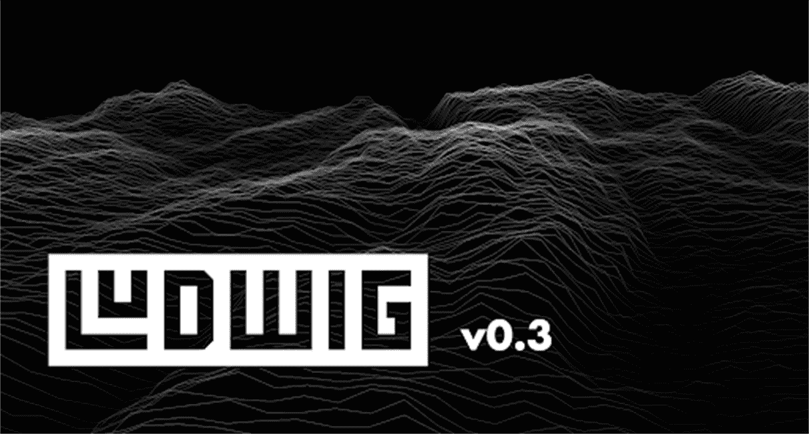
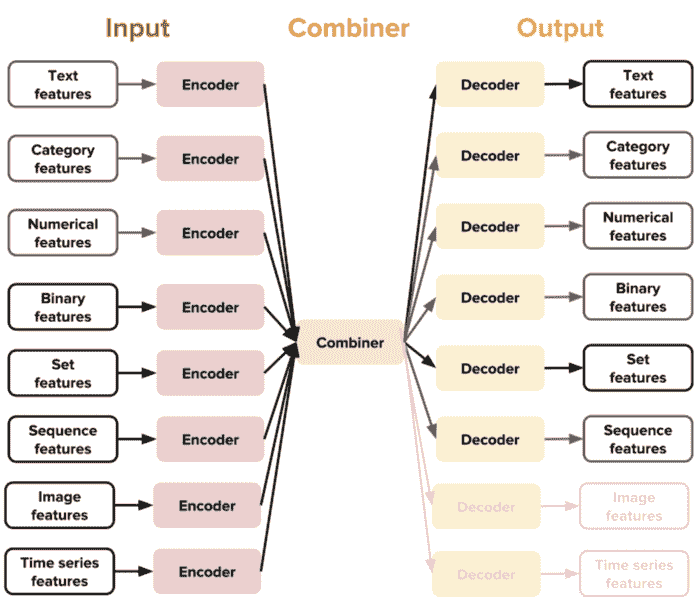
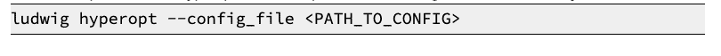
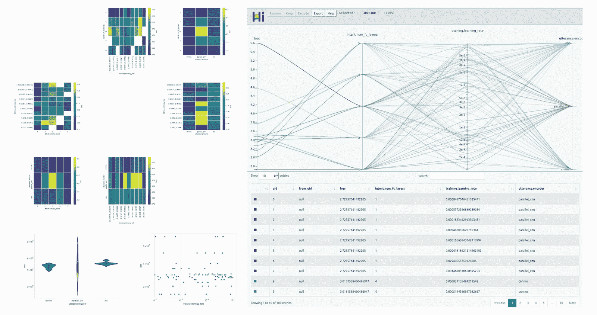
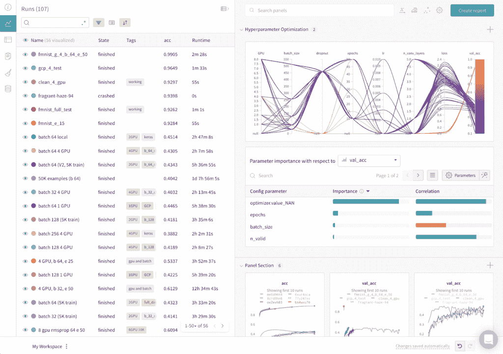

# Uber 开源了 Ludwig 第三版，它的无代码机器学习平台

> 原文：[`www.kdnuggets.com/2020/10/uber-open-source-ludwig-code-free-machine-learning-platform.html`](https://www.kdnuggets.com/2020/10/uber-open-source-ludwig-code-free-machine-learning-platform.html)

评论

来源：[`eng.uber.com/ludwig-v0-3/`](https://eng.uber.com/ludwig-v0-3/)

> 我最近开始了一份关注 AI 教育的新通讯。TheSequence 是一份无废话（即没有炒作，没有新闻等）的 AI 专注通讯，阅读时间为 5 分钟。目标是让你及时了解机器学习项目、研究论文和概念。请通过下面的订阅链接试试看：

Uber 继续对开源机器学习技术做出创新贡献。上周，这家交通巨头 [开源了 Ludwig 0.3](https://ludwig-ai.github.io/ludwig-docs/?from=%40)，这是其无代码机器学习平台的第三次更新。在过去几个月中，Ludwig 社区已经超越了 Uber，并包括了斯坦福大学等贡献者。这个新版本扩展了前版本的 AutoML 功能。让我们回顾一下 Ludwig 的先前版本，并探索这个新版本。

### Uber Ludwig 是什么？

从功能上看，Ludwig 是一个简化选择、训练和评估特定场景下机器学习模型过程的框架。Ludwig 提供了一组可以组合在一起创建针对特定需求优化的端到端模型的模型架构。从概念上讲，Ludwig 是基于一系列原则设计的：

+   **无需编码：**训练模型和使用模型进行预测不需要编码技能。

+   **通用性：**一种基于新数据类型的深度学习模型设计方法，使得该工具可用于许多不同的使用场景。

+   **灵活性：**经验丰富的用户可以对模型构建和训练进行广泛控制，而新手用户则会发现使用起来很简单。

+   **扩展性：**易于添加新的模型架构和新的特征数据类型。

+   **可理解性：**深度学习模型的内部机制通常被视为黑箱，但我们提供了标准可视化工具来理解它们的性能并比较它们的预测。

使用 Ludwig，数据科学家只需提供包含训练数据的 CSV 文件和包含模型输入输出的 YAML 文件，即可训练深度学习模型。利用这两个数据点，Ludwig 执行多任务学习例程，同时预测所有输出并评估结果。在幕后，Ludwig 提供了一系列不断评估的深度学习模型，并可以组合成最终架构。Ludwig 的主要创新基于数据类型特定的编码器和解码器。Ludwig 使用针对支持的任何数据类型的特定编码器和解码器。与其他深度学习架构一样，编码器负责将原始数据映射到张量，而解码器则将张量映射到输出。Ludwig 的架构还包括一个组合器概念，这是一个将所有输入编码器的张量组合、处理并返回给输出解码器的组件。

来源：[`eng.uber.com/introducing-ludwig/`](https://eng.uber.com/introducing-ludwig/)

### Ludwig 0.3

Ludwig 0.3 通过一致的无代码接口集成了在机器学习应用中广泛使用的新特性。让我们回顾一下 Ludwig 新版本的一些基本贡献。

### 1) 超参数优化

为特定机器学习问题找到最佳超参数组合可能会很费力。Ludwig 0.3 引入了一个新命令，[hyperopt](http://ludwig.ai/user_guide/#hyperopt)，它执行自动化的超参数搜索并返回可能的配置。Hyperopt 可以使用简单的语法调用：

来源：[`eng.uber.com/ludwig-v0-3/`](https://eng.uber.com/ludwig-v0-3/)

输出展示了超参数的不同值和尺度。

来源：[`eng.uber.com/ludwig-v0-3/`](https://eng.uber.com/ludwig-v0-3/)

### 2) 与 Weights and Biases 的集成

补充前一点，Ludwig 0.3 与 [Weights and Biases](https://www.wandb.com/)（W&B）平台集成。W&B 提供了一个非常直观的界面，用于快速实验和机器学习模型的超参数调优。要使用 W&B，Ludwig 用户可以简单地将 -wandb 参数附加到他们的命令中。

来源：[`eng.uber.com/ludwig-v0-3/`](https://eng.uber.com/ludwig-v0-3/)

来源：[`eng.uber.com/ludwig-v0-3/`](https://eng.uber.com/ludwig-v0-3/)

### 3) 无代码变换器

近年来，语言预训练模型和变换器一直是深度学习领域如自然语言处理的重大突破的核心。Ludwig 0.3 通过与 [Hugging Face](https://huggingface.co/) 的 [Transformers](https://github.com/huggingface/transformers) 仓库的集成，支持变换器。

### 4) TensorFlow 2 后端

Ludwig 的新版本基于 TensorFlow 2 进行了重大重构。虽然这种重构可能对终端用户不立即显现，但它使 Ludwig 能够利用 TensorFlow 2 的许多新功能，并引入了更模块化的设计。

### 5) 新数据源集成

Ludwig 的一个主要限制是支持作为输入的数据集结构较少。基本上，Ludwig 只支持 CSV 和 Pandas 数据框作为输入数据集。新版本通过引入与许多其他格式（如 excel、feather、fwf、hdf5、html 表格、json、jsonl、parquet、pickle、sas、spss、stata 和 tsv）的集成来解决这个挑战。新的数据集可以通过简单的命令行使用：

### 其他功能

Ludwig 0.3 引入了其他功能，例如支持弱监督的嘈杂标签的新向量数据类型、支持新向量数据类型以及用于训练的 k 折交叉验证，这些功能补充了已经令人印象深刻的发布版本。逐渐地，Ludwig 正成为市场上最令人印象深刻的开源 AutoML 堆栈之一。

[原文](https://medium.com/dataseries/uber-open-sources-the-third-release-of-ludwig-its-code-free-machine-learning-platform-b028cc68fad3). 经许可转载。

**相关：**

+   Uber 的 Ludwig 是一个低代码机器学习的开源框架

+   LinkedIn 的 Pro-ML 架构总结了构建大规模机器学习的最佳实践

+   LinkedIn 如何在其招聘推荐系统中使用机器学习

* * *

## 我们的三大课程推荐

 1\. [谷歌网络安全证书](https://www.kdnuggets.com/google-cybersecurity) - 快速进入网络安全职业生涯。

 2\. [谷歌数据分析专业证书](https://www.kdnuggets.com/google-data-analytics) - 提升你的数据分析能力

 3\. [谷歌 IT 支持专业证书](https://www.kdnuggets.com/google-itsupport) - 支持你的组织的 IT

* * *

### 更多相关信息

+   [释放 AI 的力量 - KDnuggets 和 Machine 的特别发布…](https://www.kdnuggets.com/2023/07/mlm-unlock-power-ai-special-release-kdnuggets-machine-learning-mastery.html)

+   [使用 Tableau 创建高效的综合数据源](https://www.kdnuggets.com/2022/05/create-efficient-combined-data-sources-tableau.html)

+   [适用于高级数据科学项目的 16 个顶级技术数据源](https://www.kdnuggets.com/top-16-technical-data-sources-for-advanced-data-science-projects)

+   [Qdrant: 开源向量搜索引擎与托管云平台](https://www.kdnuggets.com/2023/02/qdrant-open-source-vector-search-engine-managed-cloud-platform.html)

+   [KDnuggets™ 新闻 22:n07, 2 月 16 日: 如何为机器学习学习数学…](https://www.kdnuggets.com/2022/n07.html)

+   [停止在 ChatGPT 上这样做，超越 99%的用户](https://www.kdnuggets.com/2023/05/stop-chatgpt-get-ahead-99-users.html)
