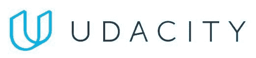

# Udacity 纳米学位课程：机器学习、数据分析师等

> 原文：[`www.kdnuggets.com/2016/06/udacity-nanodegree-programs-machine-learning-data-analyst.html`](https://www.kdnuggets.com/2016/06/udacity-nanodegree-programs-machine-learning-data-analyst.html)

通过 Udacity 的纳米学位课程，您将构建和设计惊人的项目，向硅谷顶级公司的专家学习，并在技术领域找到梦想中的工作。

报名参加纳米学位课程，12 个月内毕业，还可以获得 50%的学费退款！

**探索 Udacity 的纳米学位课程**：

[机器学习工程师纳米学位](https://www.udacity.com/course/machine-learning-engineer-nanodegree--nd009?utm_source=kdnuggets&utm_medium=ads&utm_campaign=2016-06-kdnuggets-network-machine-learning)

[数据分析师纳米学位](https://www.udacity.com/course/data-analyst-nanodegree--nd002?utm_source=kdnuggets&utm_medium=ads&utm_campaign=2016-06-kdnuggets-network-data-analyst)

[编程入门纳米学位](https://www.udacity.com/course/intro-to-programming-nanodegree--nd000?utm_source=kdnuggets&utm_medium=ads&utm_campaign=2016-06-kdnuggets-network-int-prog)

[前端 Web 开发者纳米学位](https://www.udacity.com/course/front-end-web-developer-nanodegree--nd001?utm_source=kdnuggets&utm_medium=ads&utm_campaign=2016-06-kdnuggets-network-front-end)

[安卓开发者纳米学位](https://www.udacity.com/course/beginning-android-app-development--nd803?utm_source=kdnuggets&utm_medium=ads&utm_campaign=2016-06-kdnuggets-network-android)

[iOS 开发者纳米学位](https://www.udacity.com/course/ios-developer-nanodegree--nd003?utm_source=kdnuggets&utm_medium=ads&utm_campaign=2016-06-kdnuggets-network-ios)

[高级 Web 开发者纳米学位](https://www.udacity.com/course/senior-web-developer-nanodegree--nd802?utm_source=kdnuggets&utm_medium=ads&utm_campaign=2016-06-kdnuggets-network-senior-web-dev)

[Ruby on Rails 开发者纳米学位](https://www.udacity.com/course/ruby-programming-nanodegree--nd010?utm_source=kdnuggets&utm_medium=ads&utm_campaign=2016-06-kdnuggets-network-ruby)

[全栈 Web 开发者纳米学位](https://www.udacity.com/course/full-stack-web-developer-nanodegree--nd004?utm_source=kdnuggets&utm_medium=ads&utm_campaign=2016-06-kdnuggets-network-full-stack)

[科技企业家纳米学位](https://www.udacity.com/course/tech-entrepreneur-nanodegree--nd007?utm_source=kdnuggets&utm_medium=ads&utm_campaign=2016-06-kdnuggets-network-tech-ent)

以及更多！

**找工作或退还学费！**

通过 Udacity 的 [纳米学位 Plus 计划](https://www.udacity.com/nanodegree/plus?utm_source=kdnuggets&utm_medium=ads&utm_campaign=2016-06-kdnuggets-network-nano-plus)，您将在毕业后的 6 个月内找到工作，否则我们将全额退款。

Udacity 为以下课程提供纳米学位 Plus 选项：

[机器学习工程师纳米学位](https://www.udacity.com/course/machine-learning-engineer-nanodegree--nd009?utm_source=kdnuggets&utm_medium=ads&utm_campaign=2016-06-kdnuggets-network-machine-learning)

[数据分析师纳米学位](https://www.udacity.com/course/data-analyst-nanodegree--nd002?utm_source=kdnuggets&utm_medium=ads&utm_campaign=2016-06-kdnuggets-network-data-analyst)

[Android 开发者纳米学位](https://www.udacity.com/course/beginning-android-app-development--nd803?utm_source=kdnuggets&utm_medium=ads&utm_campaign=2016-06-kdnuggets-network-android)

[iOS 开发者纳米学位](https://www.udacity.com/course/ios-developer-nanodegree--nd003?utm_source=kdnuggets&utm_medium=ads&utm_campaign=2016-06-kdnuggets-network-ios)

[高级网页开发者纳米学位](https://www.udacity.com/course/senior-web-developer-nanodegree--nd802?utm_source=kdnuggets&utm_medium=ads&utm_campaign=2016-06-kdnuggets-network-senior-web-dev)

[全栈网页开发者纳米学位](https://www.udacity.com/course/full-stack-web-developer-nanodegree--nd004?utm_source=kdnuggets&utm_medium=ads&utm_campaign=2016-06-kdnuggets-network-full-stack)

**推荐课程：机器学习工程师纳米学位项目**

深入学习机器学习和人工智能的技能，获得未来机器人、交通和医疗等领域最热门的工作。你今天会建造什么？

该项目将教你如何成为机器学习工程师，并将预测模型应用于金融、医疗、教育等领域的大型数据集。

该纳米学位由谷歌共同创建。

[立即开始为期 1 周的免费试用。](https://www.udacity.com/course/machine-learning-engineer-nanodegree--nd009?utm_source=kdnuggets&utm_medium=ads&utm_campaign=2016-06-kdnuggets-network-machine-learning)

* * *

## 我们的三大课程推荐

 1\. [谷歌网络安全证书](https://www.kdnuggets.com/google-cybersecurity) - 快速进入网络安全职业生涯。

 2\. [谷歌数据分析专业证书](https://www.kdnuggets.com/google-data-analytics) - 提升你的数据分析技能

 3\. [谷歌 IT 支持专业证书](https://www.kdnuggets.com/google-itsupport) - 支持组织的 IT 需求

* * *

### 更多相关话题

+   [托马斯·米勒博士探讨西北大学的在线…](https://www.kdnuggets.com/2024/05/nwu/thomas-miller-phd-explores-northwestern-universitys-online-graduate-programs-in-data-science)

+   [15 本免费机器学习和深度学习书籍](https://www.kdnuggets.com/2022/11/15-free-machine-learning-deep-learning-books.html)

+   [为什么越来越多的开发者在机器学习项目中使用 Python？](https://www.kdnuggets.com/2022/01/developers-python-machine-learning-projects.html)

+   [ChatGPT、GPT-4 及更多生成性人工智能新闻](https://www.kdnuggets.com/2023/02/chatgpt-gpt4-generative-ai-news.html)

+   [Octoparse 8.5: 赋能本地抓取及更多功能](https://www.kdnuggets.com/2022/02/octoparse-85-empowering-local-scraping.html)

+   [利用数据科学使清洁能源更加公平](https://www.kdnuggets.com/2022/03/data-science-make-clean-energy-equitable.html)
