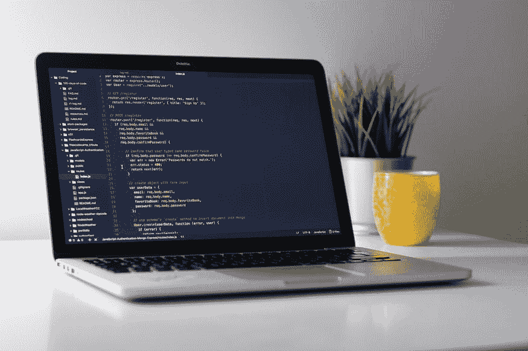

# 数据工程师面试的终极指南

> 原文：[`www.kdnuggets.com/2020/12/ultimate-guide-data-engineer-interviews.html`](https://www.kdnuggets.com/2020/12/ultimate-guide-data-engineer-interviews.html)

评论

**作者 [Xinran Waibel](https://medium.com/@xinran.waibel)，Netflix 数据工程师**。

* * *

## 我们的前三个课程推荐

 1\. [Google Cybersecurity Certificate](https://www.kdnuggets.com/google-cybersecurity) - 快速进入网络安全职业生涯。

 2\. [Google Data Analytics Professional Certificate](https://www.kdnuggets.com/google-data-analytics) - 提升你的数据分析技能

 3\. [Google IT Support Professional Certificate](https://www.kdnuggets.com/google-itsupport) - 支持你的组织的 IT

* * *

*照片由 [Christin Hume](https://unsplash.com/@christinhumephoto?utm_source=unsplash&utm_medium=referral&utm_content=creditCopyText) 提供，来自 [Unsplash](https://unsplash.com/s/photos/interview?utm_source=unsplash&utm_medium=referral&utm_content=creditCopyText)。*

尽管数据工程师（DE）是 [2019 年增长最快的科技职位](https://techhub.dice.com/Dice-2020-Tech-Job-Report.html)，但关于数据工程师面试的期望和准备的在线资源并不多。

在过去一年中，我为几家湾区的科技公司进行了数据工程师角色的面试，并帮助许多联系的成功通过了面试。在这篇博客文章中，我将解释数据工程师面试中最重要的技术话题：你的简历、编程、SQL 和系统设计。我还将教你如何准备面试的非技术部分，我认为这对成功的面试至关重要，但往往被候选人忽视。

*然而，我不会讨论任何公司的数据工程师面试中提出的具体问题，因为这篇博客文章旨在作为一个通用指南，帮助你理解成为成功数据工程师所需的基本技能。*

### 简历

你的简历不仅是引起招聘人员和招聘经理注意的垫脚石，也是你应准备好与面试官深入讨论的项目列表，以展示你的技能，包括技术能力、问题解决、团队合作、沟通和项目管理。

我在简历深度探讨环节中看到的最常见错误是，仅关注技术实现细节，而没有解释或理解系统设计中的权衡（例如，“我使用了 Kafka，因为我的经理告诉我这么做”）以及项目的整体情况。请记住，面试官不了解你以前公司的业务问题和数据基础设施，因此你需要提供足够的背景信息，帮助他们理解你的项目的技术复杂性和影响。因此，一个优秀的项目深度探讨的关键是从头到尾全面描绘你的项目，就像讲故事一样！

我强烈建议你练习讲述你最重要的数据项目（如果可能的话，找一个有工程背景的人），并确保在你的故事中回答这些问题：

+   项目的动机是什么？（即，你的项目试图解决什么数据/业务问题？）

+   你与哪些团队合作过？你是如何与他们一起工作的？

+   如果你是项目负责人，你是如何规划和推动它的？

+   系统设计中的技术权衡是什么？（即，为什么你选择了框架 X 而不是其他替代方案？）

+   你的项目的一些技术统计数据是什么？（例如，你的数据管道的吞吐量和延迟是多少？）

+   项目的影响是什么？（例如，它产生了多少收入？有多少人使用了你的应用程序？）

+   你遇到了哪些挑战？你是如何解决它们的？

数字在讲述一个伟大的项目故事中是非常重要的。与其只是说“它处理了大量数据……”，不如查找你项目的一些统计数据，并将它们包括在你的简历中。数字将展示项目的规模、影响以及你对项目的深入理解。它们还会让你的项目更具可信度。（实际上，面试官可能会觉得如果你连你的应用程序能处理多少数据都不知道，那是可疑的。）

*照片由 [Clément H](https://unsplash.com/@clemhlrdt?utm_source=unsplash&utm_medium=referral&utm_content=creditCopyText) 提供，来自 [Unsplash](https://unsplash.com/s/photos/coding?utm_source=unsplash&utm_medium=referral&utm_content=creditCopyText)。*

### 编程

好的。这是所有软件工程面试中最不愉快的部分：编码面试，在这里你需要用最有效的数据结构，在最少的代码行数中实现复杂的算法（这些算法你可能在工作中永远不会用到），并解释你的代码的时间和空间复杂度，所有这些都在 30 分钟内完成。

数据工程师岗位的编码面试通常在算法方面较轻，但在数据方面较重，面试问题通常更具实用性。例如，编写一个函数来转换输入数据并生成所需的输出数据。你仍然需要使用最优的数据结构和算法，并优雅地处理所有潜在的数据问题。由于数据工程师在实际工作中不仅使用内置库处理数据，编码面试也可能要求你使用流行的开源库，如 [Spark](https://spark.apache.org/) 和 [pandas](https://pandas.pydata.org/)。面试期间一般允许查阅文档（如有需要）。如果工作要求精通特定框架，请准备在编码面试中使用这些框架。

面试中的编码比工作中的编码要困难得多，因为你需要在非常短的时间内产出最佳代码行。（我知道面试时脑袋一片空白的感觉有多可怕。）我强烈建议在 [LeetCode](https://leetcode.com/) 或 [HackerRank](https://www.hackerrank.com/) 等编程网站上练习一些（但不要过多）编码题目，并熟悉在 [CoderPad](https://coderpad.io/) 上编写代码。

数据工程师岗位需要学习哪些编程语言和框架？请查看这篇 [博客文章](https://towardsdatascience.com/introduction-to-data-engineering-e16c9942dc2c)。

### SQL, SQL, SQL

SQL 是数据工程师非常关键的技能，因此我需要为它单独设置一个部分（而且 SQL 并不是真正的编程语言）。事实上，除了编码面试外，进行 SQL 面试也非常常见。由于数据工程师负责构建可靠且可扩展的数据处理和数据建模解决方案，你应该在 SQL 上比数据分析师和数据科学家（他们主要使用 SQL 查询生产数据）更有造诣，因此你需要了解的远不止“SELECT…FROM…”。

“什么？SQL 不就是查询语言吗？我还需要了解 SQL 的其他内容吗？”

首先，SQL 不仅仅是查询语言。它还是许多大数据框架（如 SparkSQL、pandas、KafkaSQL 等）共享的数据处理模式。因此，精通 SQL 也表明你可以高效地学习和使用这些框架。

一位优秀的数据工程师应该能够将复杂的业务问题转化为 SQL 查询和数据模型，并具有良好的性能。为了编写高效的查询，处理尽可能少的数据，你需要了解查询引擎和优化器的工作原理。例如，有时使用 CASE 语句结合聚合函数可以替代 JOIN 和 UNION，并处理更少的数据。

想了解所有的数据库魔法，可以查看 [《数据库管理系统》](https://www.amazon.com/Database-Management-Systems-Raghu-Ramakrishnan/dp/0072465638) 和 [《NoSQL 初学者指南》](https://www.amazon.com/NoSQL-Mere-Mortals-Dan-Sullivan/dp/0134023218)！

数据模型对查询结构有很大影响。例如，尽量利用表分区和索引。但数据模型也在很大程度上依赖于查询模式。为了设计一个好的数据模型，你需要将业务问题转化为最终用户将对你的表运行的 SQL 查询。这就是为什么 SQL 和数据建模面试通常并行进行。（我将在下一节详细讨论数据建模。）

如何准备 SQL 编程面试？查看这篇 [博客文章](https://towardsdatascience.com/crack-sql-interviews-6a5fc90ec763)。

### 系统设计

系统设计是数据工程技术面试中最重要且最困难的部分。在系统设计面试中，你需要从头到尾设计一个数据解决方案，这通常由三个部分组成：数据存储、数据处理和数据建模。

初始面试问题通常非常简短和抽象（例如，从头到尾设计一个数据仓库），你的任务是提出后续问题以明确需求和用例，就像解决现实生活中的数据问题一样。系统设计的主要挑战是根据这些需求和用例选择最佳的数据存储系统和数据处理框架组合，有时可能有多个最佳解决方案。成功的系统设计面试的关键是理解数据工程中的关键原则和概念，以及各种数据系统和框架的权衡。 [《设计数据密集型应用》](https://www.oreilly.com/library/view/designing-data-intensive-applications/9781491903063/) 是建立数据系统设计坚实基础的必读书籍。

数据建模通常是系统设计面试的最后一个环节，但有时它也可能是 SQL 面试的一部分。数据建模面试问题的一个例子是为兽医诊所的预约系统设计后端分析表。数据建模中最重要的原则是根据用例和查询模式设计数据模型。再次强调，你需要澄清需求和用例，以便做出更好的设计选择。

如果你对深入学习数据建模感兴趣，查看 [*数据仓库工具包*](https://www.kimballgroup.com/data-warehouse-business-intelligence-resources/books/data-warehouse-dw-toolkit/)，这是 Ralph Kimball 编写的关于数据仓库的经典之作。

*照片由 [Christina @ wocintechchat.com](https://unsplash.com/@wocintechchat?utm_source=unsplash&utm_medium=referral&utm_content=creditCopyText) 在 [Unsplash](https://unsplash.com/s/photos/conversation?utm_source=unsplash&utm_medium=referral&utm_content=creditCopyText)上提供。*

### 你（即最重要的部分）

既然我们已经覆盖了数据工程面试中的所有技术话题，接下来我们来谈谈非技术部分。面试不仅仅是考试，你需要正确的答案才能通过，而是一系列对话，目的是看看你是否能够快速学习并与团队一起解决问题。因此，在面试中做自己、保持人性是非常重要的：

+   友善。没有人愿意与讨厌的人一起工作。

+   进行对话。最好的面试通常就像对话。如果你想获取信息或反馈，可以提出问题。

+   解决问题，而不仅仅是回答。就像在现实生活中一样，你不总是能立即知道问题的正确答案。展示你如何解决问题比仅仅给出答案更重要。

+   展示你对数据工程的热情。你在工作职责之外做了什么来成为更好的数据工程师？

当面试官在面试你时，你也在面试他们。你会喜欢与他们一起工作吗？这个团队是否提供了成长的机会？你是否同意经理的观点和管理风格？找到一个好的团队是困难的，所以请明智地提问。

### 所有的压力

面试是非常有压力的。这是一个不完美的过程，陌生人仅仅基于与你的一个小时互动来判断你的专业能力，有时面试结果也不公平。当你无法继续解答面试问题时，感觉面试官在看不起你，会很沮丧。反复被拒绝可能会严重打击你的自尊心，你可能开始怀疑自己是否足够好。我也经历过：大多数工作申请没有回复，所有能拿到的编码面试都失败了。我曾以为自己永远无法成为工程师。但我很高兴我没有放弃。

如果你因为面试感到不知所措、沮丧或绝望，我想告诉你，你并不孤单。如果你被拒绝了，那是他们的损失。对自己保持耐心并保持希望，因为情况会变得更好，你只需要不断尝试！始终以自信的态度参加面试，因为你足够优秀！

[原文](https://towardsdatascience.com/the-ultimate-guide-to-data-engineer-interviews-f2443cc42ad7)。经许可转载。

**简介：** [Xinran Waibel](https://medium.com/@xinran.waibel)是旧金山湾区的一名经验丰富的数据工程师，目前在 Netflix 工作。她还是《Towards Data Science》、《Google Cloud》和《The Startup on Medium》的技术撰稿人。

**相关信息：**

+   [数据专业人士如何为简历增加更多变数](https://www.kdnuggets.com/2020/11/data-professionals-add-variation-resumes.html)

+   [数据工程简介](https://www.kdnuggets.com/2020/12/introduction-data-engineering.html)

+   [如何成功应对虚拟数据面试](https://www.kdnuggets.com/2020/05/pragmatic-rock-virtual-data-interview.html)

### 更多相关内容

+   [破解机器学习工程师面试所需的条件](https://www.kdnuggets.com/2022/10/interview-kickstart-crack-machine-learning-engineer-interviews.html)

+   [一年内掌握数据科学：终极指南，经济实惠的自学方案](https://www.kdnuggets.com/master-data-science-in-a-year-the-ultimate-guide-to-affordable-self-paced-learning)

+   [终极指南：NLP 中不同的词嵌入技术](https://www.kdnuggets.com/2021/11/guide-word-embedding-techniques-nlp.html)

+   [你的终极指南：Chat GPT 和其他缩写词](https://www.kdnuggets.com/2023/06/ultimate-guide-chat-gpt-abbreviations.html)

+   [终极指南：掌握季节性和提升业务成果](https://www.kdnuggets.com/2023/08/media-mix-modeling-ultimate-guide-mastering-seasonality-boosting-business-results.html)

+   [终极指南：如何应对大型语言模型](https://www.kdnuggets.com/the-ultimate-guide-to-approach-llms)
