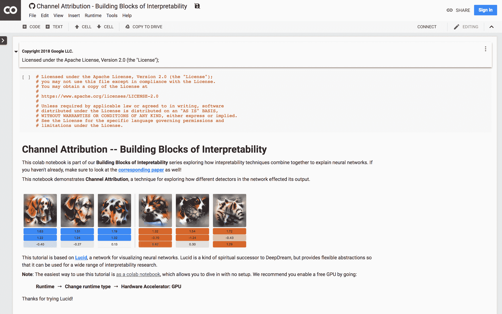

# **TensorFlow 入门终极指南**

> 原文：[`www.kdnuggets.com/2018/09/ultimate-guide-tensorflow.html`](https://www.kdnuggets.com/2018/09/ultimate-guide-tensorflow.html)

 评论

**由[Brian Zhang](https://www.linkedin.com/in/atav32/)，ByteGain**。

TensorFlow 是机器学习中的新热门。你可以使用他们的[入门指南](https://www.tensorflow.org/get_started/)，或者通过查看下面的资源更快更轻松地学习！

### 教程

**“Tensorflow 与深度学习 - 无需博士学位”**由 Martin Görner

或者扩展的 3 小时版本：[`www.youtube.com/watch?v=vq2nnJ4g6N0`](https://www.youtube.com/watch?v=vq2nnJ4g6N0)))

如果你已经理解线性代数，这是一个很好的起点。它会解释几个高级概念，例如：

+   什么是“神经元”

+   不同类型的激活函数以及为什么使用 ReLu

+   如何通过 dropout 提高模型准确性

+   如何评估模型并调整超参数

**"Tensorflow: 令人困惑的部分（1）"**由 Jacob Buckman

[`jacobbuckman.com/post/tensorflow-the-confusing-parts-1/`](https://jacobbuckman.com/post/tensorflow-the-confusing-parts-1/)

**"TensorFlow 入门：机器学习教程"**由 Dino Causevic

[`www.toptal.com/machine-learning/tensorflow-machine-learning-tutorial`](https://www.toptal.com/machine-learning/tensorflow-machine-learning-tutorial)

**"Python TensorFlow 教程 – 构建神经网络"**

[`adventuresinmachinelearning.com/python-tensorflow-tutorial`](http://adventuresinmachinelearning.com/python-tensorflow-tutorial)

**TensorFlow 教程**

**"机器学习精通"**由 Jason Brownlee

[`machinelearningmastery.com/start-here/`](https://machinelearningmastery.com/start-here/)

### 示例

**代码示例**

[`github.com/aymericdamien/TensorFlow-Examples`](https://github.com/aymericdamien/TensorFlow-Examples)[`github.com/MorvanZhou/Tensorflow-Tutorial`](https://github.com/MorvanZhou/Tensorflow-Tutorial)

### 工具

**Google Colaboratory (Colab)**

[`colab.research.google.com/notebooks/welcome.ipynb#scrollTo=9wi5kfGdhK0R`](https://colab.research.google.com/notebooks/welcome.ipynb#scrollTo=9wi5kfGdhK0R)

COLAB 笔记本

Colab 提供了一个基于 Jupyter 的交互式 Python 笔记本，但有两个巨大优势。

1.  1.  1.  你可以用它生成 HTML/CSS 的可视化

        1.  免费 GPU 计算时间

这是一个免费工具，旨在分享研究和学习新工具，请勿滥用。

### Tensorboard

1.  [`www.tensorflow.org/programmers_guide/summaries_and_tensorboard`](https://www.tensorflow.org/programmers_guide/summaries_and_tensorboard)

1.  [`github.com/tensorflow/tensorboard`](https://github.com/tensorflow/tensorboard)

TENSORBOARD 显示交叉熵图！TENSORBOARD 3D 图 Tensorboard 是一个用于可视化机器学习模型的工具。其目标是解决黑箱问题。它对以下内容非常有用：

+   设计模型结构

+   调试

+   可视化性能

+   生成结果图

### 技巧

**在 Colab 中使用 TensorBoard**

[`stackoverflow.com/questions/47818822/can-i-use-tensorboard-with-google-colab`](https://stackoverflow.com/questions/47818822/can-i-use-tensorboard-with-google-colab)

如果你看到 Colab（互动在线笔记本）和 Tensorboard（可视化/调试工具）的价值，那么花时间让它们协同工作绝对值得。

### 社区

**公告与笑话**

[`www.reddit.com/r/MachineLearning/`](https://www.reddit.com/r/MachineLearning/)

**Slack**

[`slofile.com/slack/ai-researchers`](https://slofile.com/slack/ai-researchers)

**Discord**

[`discordlist.me/join/167811324590424065/`](https://discordlist.me/join/167811324590424065/)

### 书籍

*神经网络与深度学习*（免费在线书籍）: [`neuralnetworksanddeeplearning.com/`](http://neuralnetworksanddeeplearning.com/)

*深度学习*（在线书籍）: [`www.deeplearningbook.org/`](http://www.deeplearningbook.org/)

Goodreads 上流行的数据科学书籍: [`www.goodreads.com/shelf/show/data-science`](https://www.goodreads.com/shelf/show/data-science)

### 更多资源

**机器学习研究**

[`distill.pub/`](https://distill.pub/)

**arXiv**

+   人工智能: [`arxiv.org/list/cs.AI/new`](https://arxiv.org/list/cs.AI/new)

+   计算机视觉与模式识别: [`arxiv.org/list/cs.CV/new`](https://arxiv.org/list/cs.CV/new)

+   机器学习: [`arxiv.org/list/cs.LG/new`](https://arxiv.org/list/cs.LG/new)

### 职业

“如何成为数据科学家”：[`www.datasciencecentral.com/profiles/blogs/how-to-become-a-data-scientist-for-free`](https://www.datasciencecentral.com/profiles/blogs/how-to-become-a-data-scientist-for-free)

**求职**

LinkedIn: [`www.linkedin.com/jobs/machine-learning-jobs/`](https://www.linkedin.com/jobs/machine-learning-jobs/)

AngelList: [`angel.co/machine-learning/jobs`](https://angel.co/machine-learning/jobs)

### 加入 ByteGain 工作

如果你已经擅长机器学习，我们在 ByteGain 招聘！

+   机器学习工程师: [申请这里](https://bytegain.com/machine-learning-engineer)

+   机器学习实习生: [申请这里](https://bytegain.com/machine-learning-intern)

**简介: [Brian Zhang](https://www.linkedin.com/in/atav32/)** 是 ByteGain 的软件工程师，致力于寻找更多解决方案于 {技术 + 教育 + 游戏 = ?}。

[原文](https://bytegain.com/blog/getting-started-with-tensorflow-guide)。经许可转载。

**相关内容:**

+   [你应该了解的 9 件关于 TensorFlow 的事](https://www.kdnuggets.com/2018/08/9-things-tensorflow.html)

+   [使用 TensorFlow 进行机器学习](https://www.kdnuggets.com/2018/08/activestate-machine-learning-tensorflow-webinar.html)

+   [在 5 分钟内设置你的 AI 开发环境](https://www.kdnuggets.com/2018/08/ai-dev-environment.html)

* * *

## 我们的前三个课程推荐

 1\. [谷歌网络安全证书](https://www.kdnuggets.com/google-cybersecurity) - 快速开启网络安全职业生涯

 2\. [谷歌数据分析专业证书](https://www.kdnuggets.com/google-data-analytics) - 提升你的数据分析能力

 3\. [谷歌 IT 支持专业证书](https://www.kdnuggets.com/google-itsupport) - 支持你的组织 IT

* * *

### 了解更多相关主题

+   [停止学习数据科学，寻找目标，然后再寻找目标……](https://www.kdnuggets.com/2021/12/stop-learning-data-science-find-purpose.html)

+   [一个 90 亿美元的 AI 失败，经过审视](https://www.kdnuggets.com/2021/12/9b-ai-failure-examined.html)

+   [学习数据科学统计学的最佳资源](https://www.kdnuggets.com/2021/12/springboard-top-resources-learn-data-science-statistics.html)

+   [成功数据科学家的 5 个特征](https://www.kdnuggets.com/2021/12/5-characteristics-successful-data-scientist.html)

+   [是什么让 Python 成为初创企业理想的编程语言](https://www.kdnuggets.com/2021/12/makes-python-ideal-programming-language-startups.html)

+   [每个数据科学家都应该了解的三个 R 库（即使你使用 Python）](https://www.kdnuggets.com/2021/12/three-r-libraries-every-data-scientist-know-even-python.html)
