# 终极 Scikit-Learn 机器学习备忘单

> 原文：[`www.kdnuggets.com/2021/01/ultimate-scikit-learn-machine-learning-cheatsheet.html`](https://www.kdnuggets.com/2021/01/ultimate-scikit-learn-machine-learning-cheatsheet.html)

评论

**由 [Andre Ye](https://www.linkedin.com/in/andre-ye-501746150/)，Critiq 联合创始人，Medium 编辑与顶级作者**。

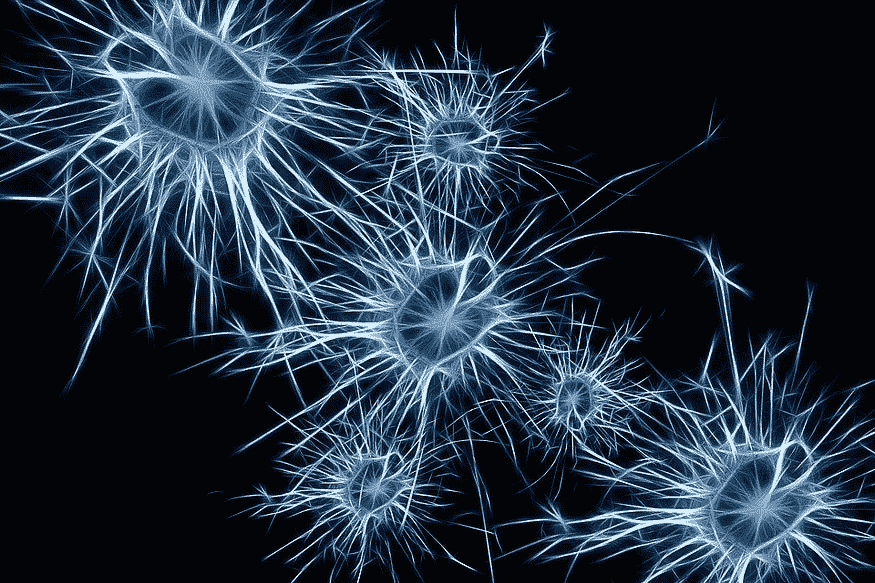

* * *

## 我们的前三个课程推荐

 1. [Google 网络安全证书](https://www.kdnuggets.com/google-cybersecurity) - 快速入门网络安全职业。

 2. [Google 数据分析专业证书](https://www.kdnuggets.com/google-data-analytics) - 提升你的数据分析技能。

 3. [Google IT 支持专业证书](https://www.kdnuggets.com/google-itsupport) - 支持你所在组织的 IT。

* * *

*来源: [Pixabay](https://pixabay.com/illustrations/neurons-brain-cells-brain-structure-1773922/)。*

本备忘单将涵盖数据挖掘和机器学习的多个领域：

+   **预测建模。** 监督学习（预测）的回归和分类算法，以及评估模型性能的指标。

+   将数据分组为簇的方法：K-Means，基于目标指标选择簇数量。

+   **降维。** 降低数据和属性维度的方法及其方法：PCA 和 LDA。

+   **特征重要性。** 查找数据集中最重要特征的方法：置换重要性、SHAP 值、部分依赖图。

+   **数据转换。** 用于提升数据预测能力、便于分析或揭示隐藏关系和模式的方法：标准化、归一化、Box-Cox 转换。

*所有图片均由作者创建，除非另有明确说明。*

### 预测建模

**训练-测试分割** 是通过在指定的训练数据上训练模型并在指定的测试数据上测试模型性能的重要部分。通过这种方式，可以衡量模型对新数据的泛化能力。在 *sklearn* 中，*X* 和 *y* 参数可以接受列表、pandas 数据框或 NumPy 数组。

```py
from sklearn.model_selection import train_test_split
X_train,X_test,y_train,y_test = train_test_split(X,y,test_size=0.3)

```

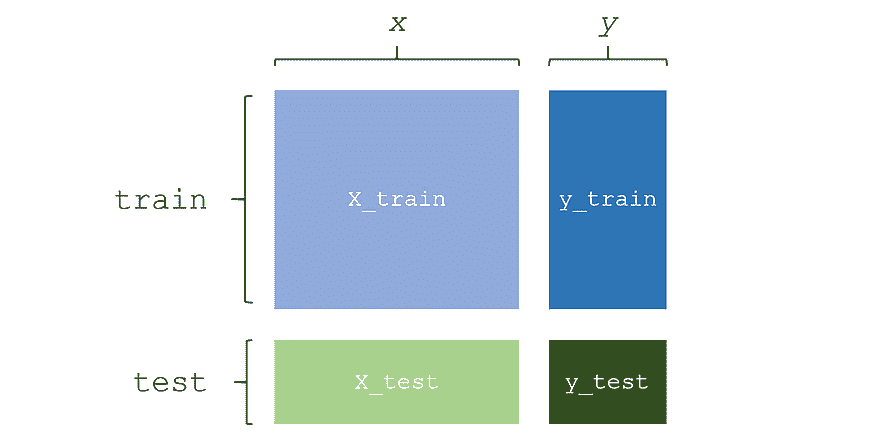

**训练一个标准的监督学习模型** 包括导入、创建实例和拟合模型。

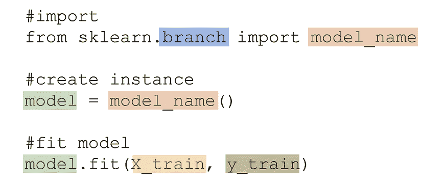

***sklearn**** 分类模型** 列在下方，蓝色突出显示分支，橙色显示模型名称。

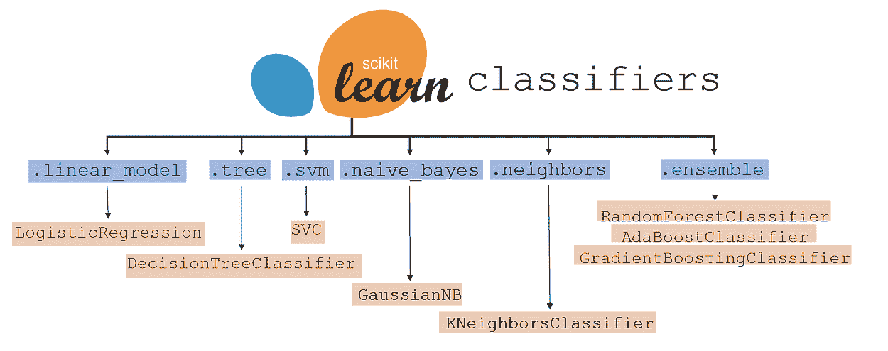

***sklearn**** 回归模型** 列在下方，蓝色突出显示分支，橙色显示模型名称。

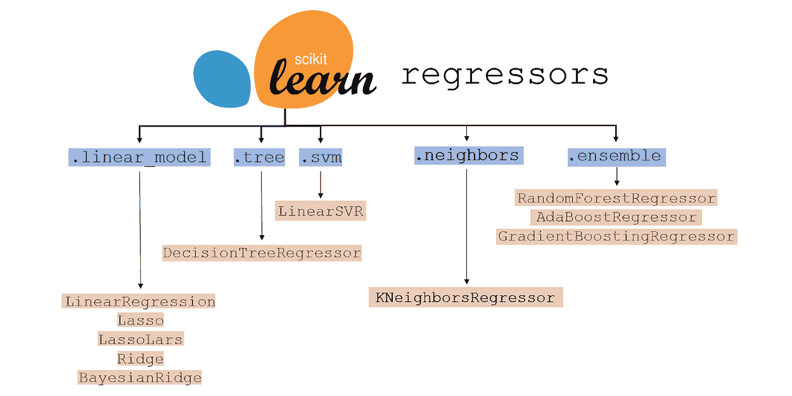

**评估模型性能**是使用这种形式的训练-测试数据完成的：

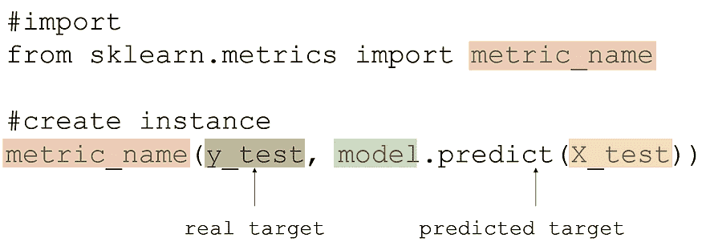

***sklearn*****metrics**用于分类和回归，下面列出了这些指标，最常用的指标标记为绿色。许多灰色指标在某些情况下比绿色标记的指标更为适用。每个指标都有其优缺点，需要平衡优先级比较、可解释性和其他因素。

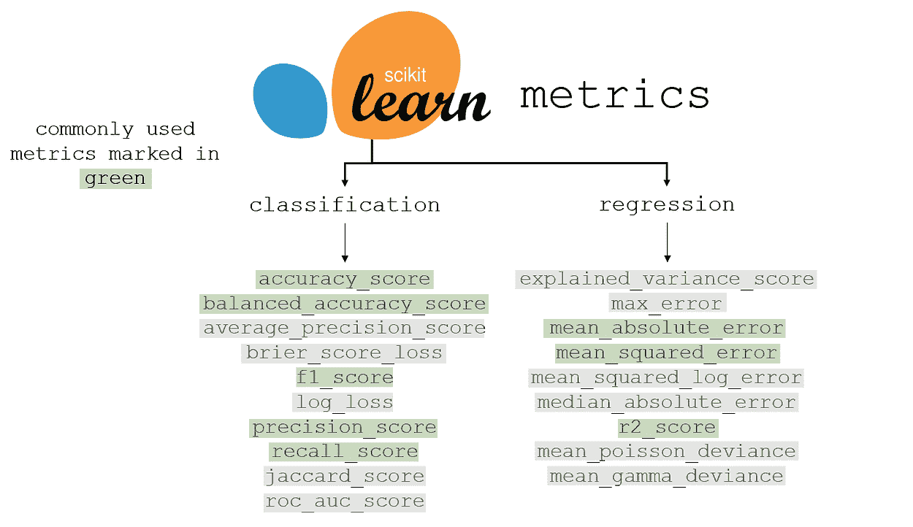

### 聚类

在进行聚类之前，数据需要被标准化（相关信息可以在数据转换部分找到）。聚类是根据点距离创建集群的过程。

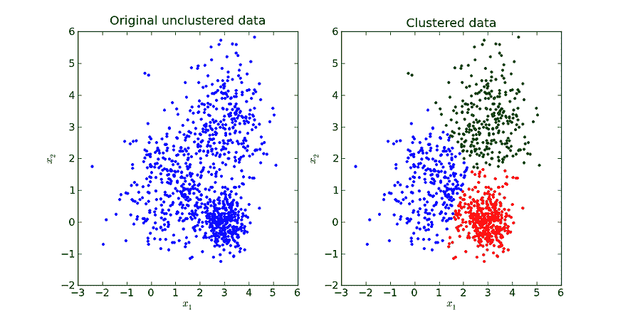

*[来源](https://i.imgur.com/S65Sk9c.jpg)。图片可自由分享。*

**训练和创建 K-Means 聚类模型**会创建一个能够聚类并检索有关聚类数据的信息的模型。

```py
from sklearn.cluster import KMeans
model = KMeans(n_clusters = number_of_clusters)
model.fit(X)

```

**访问数据中每个数据点的标签**可以通过以下方式完成：

```py
model.labels_

```

类似地，每个数据点的标签可以存储在数据的一个列中，方法如下：

```py
data['Label'] = model.labels_

```

**访问新数据的集群标签**可以使用以下命令。*new_data*可以是数组、列表或数据框的形式。

```py
data.predict(new_data)

```

**访问每个集群的集群中心**以二维数组的形式返回，方法如下：

```py
data.cluster_centers_

```

要**找到最佳的集群数量**，请使用轮廓系数，它是衡量某一集群数量如何适合数据的指标。对于预定义范围内的每个集群数量，训练 K-Means 聚类算法，并将其轮廓系数保存到列表中（*scores*）。*data*是模型训练的数据。

```py
from sklearn.metrics import silhouette_score
scores = []
for cluster_num in range(lower_bound, upper_bound):
     model = KMeans(n_clusters=cluster_num)
     model.fit(data)
     score = silhouette_score(data, model.predict(data))

```

在分数保存到列表*scores*后，可以将其绘制出来或进行计算搜索以找到最高分。

### 降维

降维是将高维数据以减少的维度表示的过程，以便每个维度包含最多的信息。降维可以用于高维数据的可视化或通过去除低信息量或相关的特征来加速机器学习模型。

**主成分分析**（PCA）是一种通过在特征空间中绘制几个正交（垂直）向量来减少数据维度的流行方法，以表示减少后的维度数量。变量*number*表示减少后的数据将拥有的维度数量。例如，在可视化的情况下，它将是两个维度。

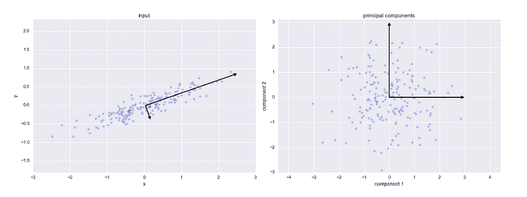

*PCA 工作原理的可视化演示。[来源](https://jakevdp.github.io/PythonDataScienceHandbook/figures/05.09-PCA-rotation.png).*

**拟合 PCA 模型**：*.fit_transform*函数自动将模型拟合到数据并将其转换为减少后的维度。

```py
from sklearn.decomposition import PCA
model = PCA(n_components=number)
data = model.fit_transform(data)

```

**解释方差比**：调用*model.explained_variance_ratio_* 将得到一个列表，其中每项对应于该维度的“解释方差比”，这基本上意味着该维度在原始数据中所表示的信息百分比。解释方差比的总和是降维数据中保留的信息的总百分比。

**PCA 特征权重**：在 PCA 中，每个新创建的特征都是前一个数据特征的线性组合。这些线性权重可以通过*model.components_* 访问，它们是特征重要性的良好指标（较高的线性权重表示该特征中包含的信息更多）。

**线性判别分析**（LDA，不要与潜在狄利克雷分配混淆）是另一种降维方法。LDA 与 PCA 的主要区别在于 LDA 是一个有监督的算法，意味着它同时考虑了*x* 和 *y*。主成分分析仅考虑*x*，因此是一个无监督的算法。

PCA 试图基于点之间的距离纯粹保持数据的结构（方差），而 LDA 则优先考虑类别的清晰分离。

```py
from sklearn.decomposition import LatentDirichletAllocation
lda = LatentDirichletAllocation(n_components = number)
transformed = lda.fit_transform(X, y)

```

### 特征重要性

特征重要性是找到对目标最重要特征的过程。通过 PCA，可以找到包含最多信息的特征，但特征重要性关注的是特征对目标的影响。一个“重要”的特征的变化会对*y*变量产生大的影响，而一个“不重要”的特征的变化对*y*变量几乎没有影响。

**置换重要性** 是一种评估特征重要性的方法。训练多个模型，每个模型缺少一列数据。由于缺少数据导致的模型准确率下降表示该列对模型预测能力的重要性。*eli5* 库用于置换重要性。

```py
import eli5
from eli5.sklearn import PermutationImportance
model = PermutationImportance(model)
model.fit(X,y)
eli5.show_weights(model, feature_names = X.columns.tolist())

```


在这个置换重要性模型训练的数据中，列 *lat* 对目标变量（在这个例子中是房价）有最大的影响。置换重要性是决定哪些特征（相关或冗余的特征，实际混淆模型，标记为负置换重要性值）应当移除时最好的特征选择方法。

**SHAP** 是另一种评估特征重要性的方法，借鉴了 21 点游戏理论中的原则来估计一个玩家能贡献多少价值。与置换重要性不同，**SH**apley **A**dditive Ex**P**lanations 使用一种更具公式化和计算基础的方法来评估特征重要性。SHAP 需要基于树的模型（决策树，随机森林），并且适用于回归和分类问题。

```py
import shap
explainer = shap.TreeExplainer(model)
shap_values = explainer.shap_values(X)
shap.summary_plot(shap_values, X, plot_type="bar")

```

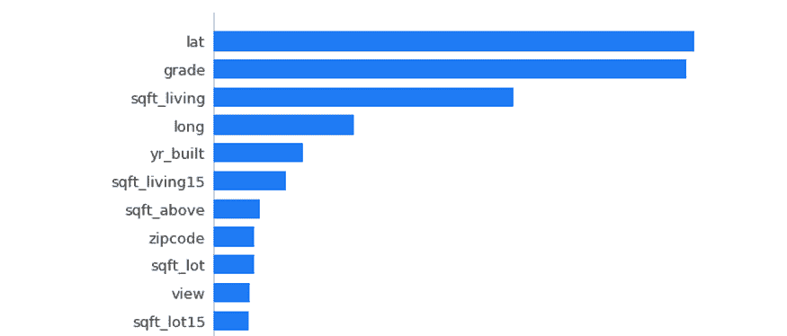

**PD(P)图**，或部分依赖图，是数据挖掘和分析中的重要工具，展示了一个特征的某些值如何影响目标变量的变化。所需的导入包括*pdpbox*用于依赖图和*matplotlib*用于显示图。

```py
from pdpbox import pdp, info_plots
import matplotlib.pyplot as plt

```

**隔离 PDPs**：以下代码显示了部分依赖图，其中*feat_name*是*X*中要隔离并与目标变量进行比较的特征。第二行代码保存数据，而第三行构建了显示图的画布。

```py
feat_name = 'sqft_living'
pdp_dist = pdp.pdp_isolate(model=model, 
                           dataset=X, 
                           model_features=X.columns,
                           feature=feat_name)
pdp.pdp_plot(pdp_dist, feat_name)
plt.show()

```

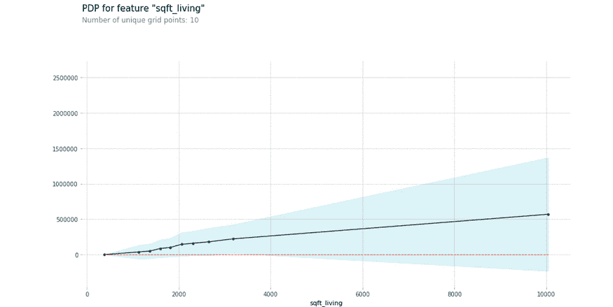

部分依赖图展示了某些值和生活空间平方英尺数的变化对房价的影响。阴影区域表示置信区间。

**等高线 PDPs**：部分依赖图也可以呈现为等高线图，它们比较的不是一个隔离变量，而是两个隔离变量之间的关系。要比较的两个特征存储在变量*compared_features*中。

```py
compared_features = ['sqft_living', 'grade']
inter = pdp.pdp_interact(model=model, 
                          dataset=X, 
                          model_features=X.columns, 
                          features=compared_features)
pdp.pdp_interact_plot(pdp_interact_out=inter,
                      feature_names=compared_features),
                      plot_type='contour')
plt.show()

```

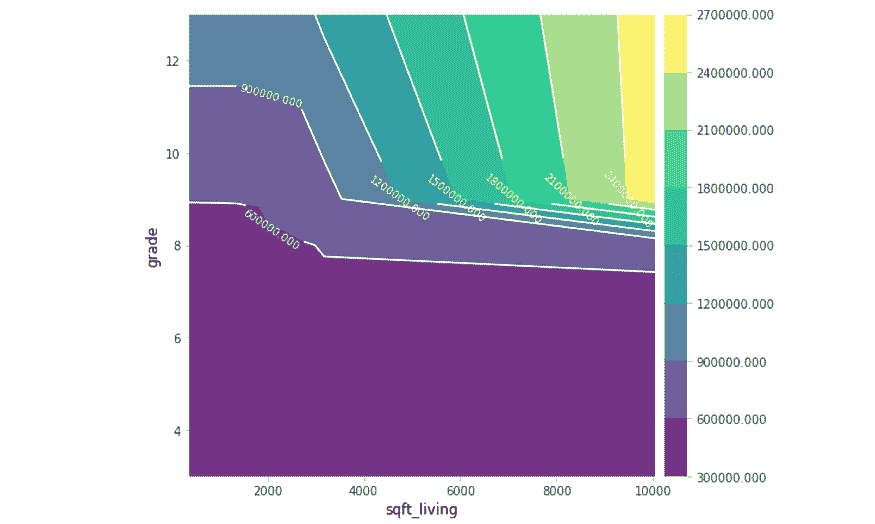

两个特征之间的关系显示了在仅考虑这两个特征时的相应价格。部分依赖图包含大量的数据分析和发现，但要注意大的置信区间。

### 数据转换

**标准化或缩放**是将数据‘重塑’的过程，使其包含相同的信息但均值为 0，方差为 1。通过缩放数据，算法的数学性质通常可以更好地处理数据。

```py
from sklearn.preprocessing import StandardScaler
scaler = StandardScaler()
scaler.fit(data)
transformed_data = scaler.transform(data)

```

*转换后的数据*是标准化的，可以用于许多基于距离的算法，如支持向量机和 K 近邻算法。使用标准化数据的算法结果需要进行‘去标准化’，以便进行正确的解释。*.inverse_transform()*可以用来执行标准变换的相反操作。

```py
data = scaler.inverse_transform(output_data)

```

**归一化数据**将数据调整到 0 到 1 的范围，这与标准化数据类似，使得数据在数学上更容易被模型使用。

```py
from sklearn.preprocessing import Normalizer
normalize = Normalizer()
transformed_data = normalize.fit_transform(data)

```

虽然归一化不会像标准化那样改变数据的形状，但它限制了数据的边界。是否对数据进行归一化或标准化取决于算法和上下文。

**Box-cox 变换**涉及将数据提升到不同的幂次进行转换。Box-cox 变换可以归一化数据，使其更线性，或减少复杂性。这些变换不仅涉及将数据提升到幂次，还包括分数幂（开方）和对数。

例如，考虑沿函数*g*(*x*)分布的数据点。通过应用对数 Box-cox 变换，数据可以更容易地用线性回归进行建模。

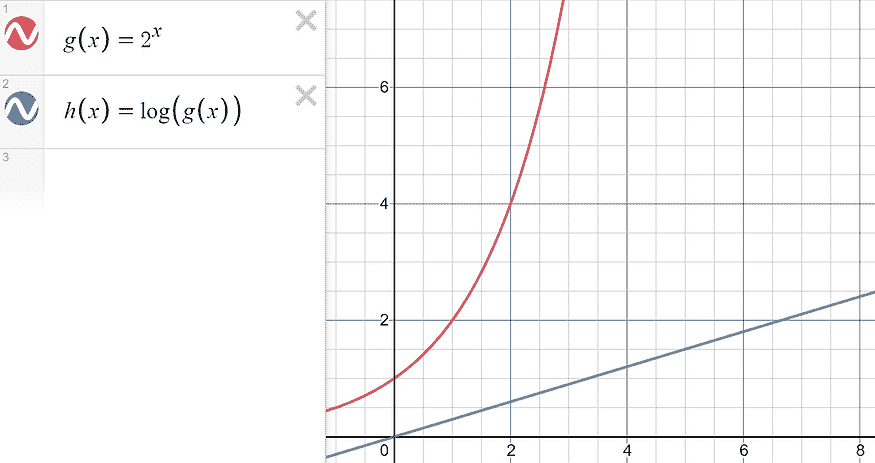

*由 Desmos 创建。*

*sklearn* 自动确定最佳的 box-cox 变换系列，以使数据更好地符合正态分布。

```py
from sklearn.preprocessing import PowerTransformer
transformer = PowerTransformer(method='box-cox')
transformed_data = transformer.fit_transform(data)

```

由于 box-cox 变换的平方根特性，box-cox 变换后的数据必须严格为正（预先标准化数据可以解决这个问题）。对于同时包含负值和正值的数据，设置*method = ‘yeo-johnson’*以采用类似的方法使数据更接近正态分布。

[原文](https://towardsdatascience.com/your-ultimate-data-mining-machine-learning-cheat-sheet-9fce3fa16)。已获转载许可。

**相关：**

+   [10 个你不知道的 Scikit-Learn 技巧](https://www.kdnuggets.com/2020/09/10-things-know-scikit-learn.html)

+   [如何扩展 Scikit-learn 并为你的机器学习工作流带来理智](https://www.kdnuggets.com/2019/10/extend-scikit-learn-bring-sanity-machine-learning-workflow.html)

+   [机器学习备忘单](https://www.kdnuggets.com/2018/09/machine-learning-cheat-sheets.html)

### 更多相关主题

+   [成为伟大的数据科学家所需的 5 项关键技能](https://www.kdnuggets.com/2021/12/5-key-skills-needed-become-great-data-scientist.html)

+   [每个初学者数据科学家应掌握的 6 种预测模型](https://www.kdnuggets.com/2021/12/6-predictive-models-every-beginner-data-scientist-master.html)

+   [2021 年最佳 ETL 工具](https://www.kdnuggets.com/2021/12/mozart-best-etl-tools-2021.html)

+   [停止学习数据科学以寻找目标，并以寻找目标来...](https://www.kdnuggets.com/2021/12/stop-learning-data-science-find-purpose.html)

+   [学习数据科学统计的顶级资源](https://www.kdnuggets.com/2021/12/springboard-top-resources-learn-data-science-statistics.html)

+   [成功数据科学家的 5 个特征](https://www.kdnuggets.com/2021/12/5-characteristics-successful-data-scientist.html)
