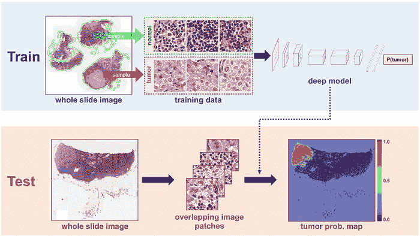
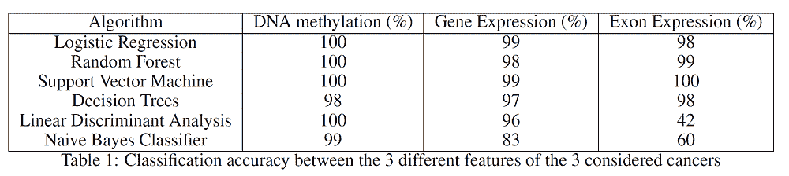
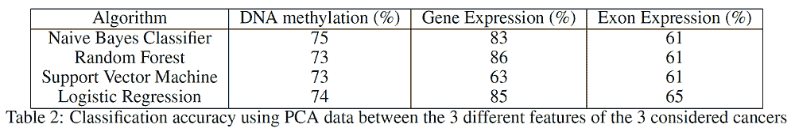
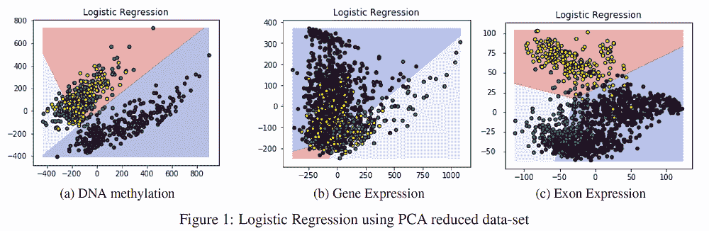
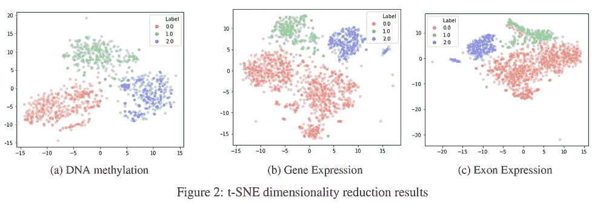
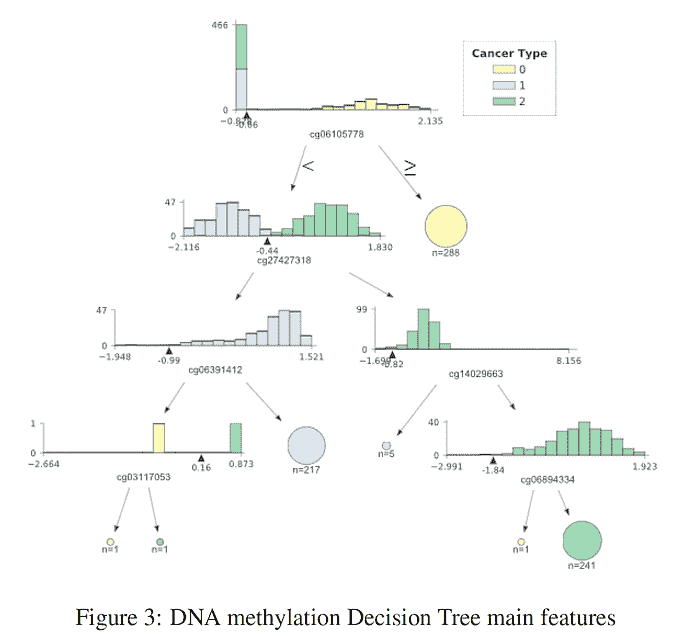
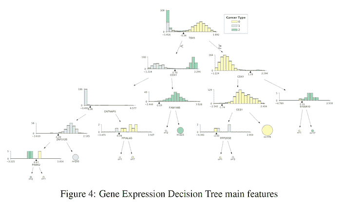
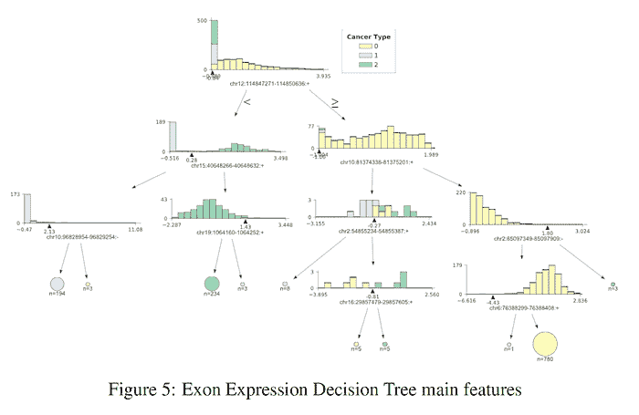
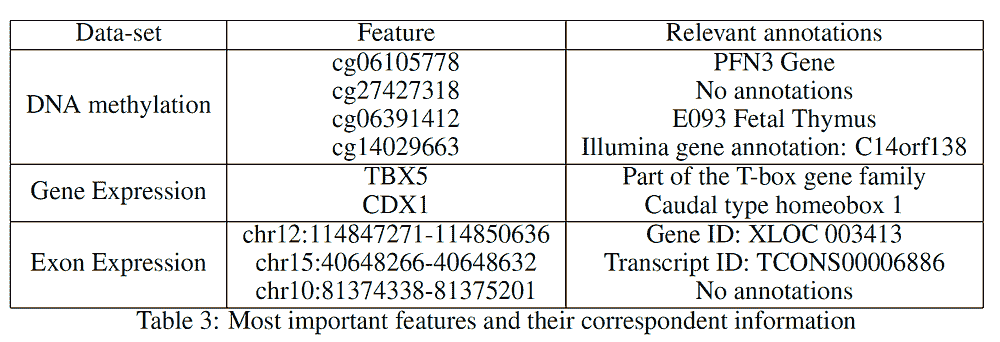
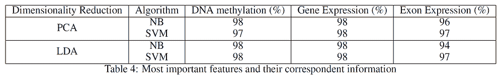

# 使用机器学习理解癌症

> 原文：[`www.kdnuggets.com/2019/08/understanding-cancer-machine-learning.html`](https://www.kdnuggets.com/2019/08/understanding-cancer-machine-learning.html)

 评论

(来源: [`news.developer.nvidia.com/wp-content/uploads/2016/06/DL-Breast-Cancer-Detection-Image.png`](https://news.developer.nvidia.com/wp-content/uploads/2016/06/DL-Breast-Cancer-Detection-Image.png))

* * *

## 我们的前三大课程推荐

 1\. [谷歌网络安全证书](https://www.kdnuggets.com/google-cybersecurity) - 快速进入网络安全职业生涯。

 2\. [谷歌数据分析专业证书](https://www.kdnuggets.com/google-data-analytics) - 提升你的数据分析技能

 3\. [谷歌 IT 支持专业证书](https://www.kdnuggets.com/google-itsupport) - 支持你的组织的 IT 需求

* * *

### 介绍

正如许多研究者所示[1, 2]，机器学习（ML）在医学中的应用日益重要。研究者们现在在诸如脑电图分析和癌症检测/分析等应用中使用 ML。例如，通过检查生物数据，如 DNA 甲基化和 RNA 测序，可以推断出哪些基因可能引发癌症，哪些基因则可能抑制癌症的表达。在这篇文章中，我将带你了解我如何分析关于 TCGA 肝癌、宫颈癌和结肠癌的 9 个不同数据集。所有数据集均由 UCSC Xena（加州大学圣克鲁斯分校网站）提供。对于这三种不同类型的癌症，每种使用了三个数据集，包括 DNA 甲基化（Methylation450k）、基因表达 RNAseq（IlluminaHiSeq）和外显子表达 RNAseq（IlluminaHiSeq）。这些数据集按信息类型而非癌症分类。选择这些数据集是因为它们具有共同的特征，并且样本数量相似。此外，我选择这些癌症类型，因为它们提供了关于人体基因和染色体特征的多样视角，因为不同的癌症位于身体的不同部位。这样，本文获得的分类结果可以推广到其他形式的癌症。DNA 甲基化在基因表达调控中发挥重要作用，其变化可能导致癌细胞的产生或抑制[3]。

### 分类

每个数据集都必须进行转置和预处理。在形成最终的三个数据集后，进行了不同类型癌症的分类。为了产生这些结果，使用了 70%的训练和 30%的测试分割比例。如表 1 所示，考虑了许多分类算法。这些结果是利用整个数据集获得的，分类器旨在正确区分三种不同类型的癌症。

### 特征提取

我对这 3 个给定的数据集进行了主成分分析（PCA），以观察仅使用前两个主成分（表 2）如何影响分类准确率结果。PCA 旨在降低数据集的维度，同时尽可能保留方差。从表 2 可以看出，将数据维度减少到仅两个特征并没有导致准确率的急剧下降。

图 1 提供了使用逻辑回归的 PCA 分类结果，两个坐标轴表示 PCA 创建的两个主成分。外显子表达数据集似乎受到 PCA 的影响最大，准确率最高为 65%。这一结果的原因是不同类别之间的主要重叠，这在图 1(c)中展示了出来。

最后，我决定应用另一种特征提取技术，如 t-SNE。这项技术可以将高维数据可视化为低维空间，从而最大限度地分隔不同类别。结果显示在图 2 中，两个坐标轴代表 t-SNE 生成的两个主要组件。三种不同类型的癌症分别用不同颜色标记（TCGA Liver = 0, Cervical = 1, Colon = 2）。如图 2 所示，t-SNE 创建了两个特征，能够较好地分隔这三种不同的类别。

### 特征选择

前面的章节显示，使用整个数据集可以取得非常好的分类结果。使用 PCA 和 t-SNE 等特征提取技术，已经证明可以在减少维度的同时仍然获得令人满意的分类分数。鉴于这些结果，我决定绘制一个决策树，表示分类中使用的主要特征（权重最大的特征），以便更详细地查看最重要的特征。我决定使用决策树进行分析，因为它在所有三个数据集中的分类性能都很好。结果可以在图 3（DNA 甲基化）、图 4（基因表达）和图 5（外显子表达）中看到。

在这些图形中，不同的癌症类型用不同的颜色表示（TCGA Liver = 0, Cervical = 1, Colon = 2）。所有三种癌症的特征分布在树的起始节点中表示。只要我们沿着每个分支向下移动，算法就会尝试使用每个节点图下方描述的特征来最佳地分离不同的分布。与分布一起生成的圆圈表示在跟随某个节点之后正确分类的元素数量，元素数量越多，圆圈的大小也越大。

为了生成这些图形，我使用了 Terence Parr 和 Prince Grover 创建的 dtreeviz.trees 库。我决定使用这个库，因为它使我能够可视化树中每个分支的特征分布。这在生物学领域尤其重要，尤其是在分析类别差异和观察算法如何做出分类决策时。

### 评估

表 3 总结了三棵不同树顶端（前两层）使用的特征。在仔细研究和查阅在线数据库后，为每个特征添加了一系列相关注释（表 3）。对于 cg27427318 和 chr10:81374338–81375201，则无法找到任何相关信息。

从分析的特征中推断出的最有趣的一些结果是：

1.  PFN3 已被确认是与 cg06105778 最接近的基因。根据 Li Zou、Zhijie Ding 等人在 2010 年进行的研究，Profilins（Pfns）可能被归类为乳腺癌中的肿瘤抑制蛋白[4]。

1.  根据 Noel J. Aherne、Guhan Rangaswamy 等人的《Holt-Oram 综合征男性前列腺癌：TBX5 突变的首次临床关联》，TBX5 基因“在突变时被认为会上调肿瘤细胞增殖和转移”[5]。另一项由 Yu J、Ma X 等人进行的研究则表明，TBX5 突变的结肠癌患者生存率要低得多[6]。

1.  Alexa Hryniuk、Stephanie Grainger 等人进行的研究强调，“Cdx1 丧失导致远端结肠肿瘤发生率显著增加”[7]。

使用仅在表 3 中列出的特征，我最终决定使用主成分分析（PCA）和线性判别分析（LDA）将数据降到仅两个维度，并进行朴素贝叶斯（NB）和支持向量机（SVM）分类，以查看数据的方差覆盖了多少。结果见表 4，表明使用仅来自数据集的最重要特征得到了出色的分类结果（感谢降噪）。在所有考虑的情况下，原始数据方差的 83%至 99%被保留。

### 结论

总体而言，这个项目取得了非常好的结果。作为进一步的开发，尝试递归特征选择（RFS）或支持向量机（SVM）（如我另一篇文章中所述）等替代特征选择技术将是有趣的，以查看是否可以识别出其他类型的基因/染色体。另一个可能的改进是使用包含健康受试者数据的数据集进行交叉验证，以验证获得的结果。

我想感谢*Adam Prugel-Bennett 教授*给予我进行这个项目的机会。

### 联系方式

如果你想了解我最新的文章和项目，*请在 Medium 上关注我* [follow me on Medium](https://medium.com/@pierpaoloippolito28?source=post_page---------------------------) 并订阅我的 [邮件列表](http://eepurl.com/gwO-Dr?source=post_page---------------------------)。以下是我的一些联系方式：

+   [Linkedin](https://uk.linkedin.com/in/pier-paolo-ippolito-202917146?source=post_page---------------------------)

+   [个人博客](https://pierpaolo28.github.io/blog/?source=post_page---------------------------)

+   [个人网站](https://pierpaolo28.github.io/?source=post_page---------------------------)

+   [Medium 个人主页](https://towardsdatascience.com/@pierpaoloippolito28?source=post_page---------------------------)

+   [GitHub](https://github.com/pierpaolo28?source=post_page---------------------------)

+   [Kaggle](https://www.kaggle.com/pierpaolo28?source=post_page---------------------------)

### 参考文献

[1] Viridiana Romero Martinez。《使用深度学习检测乳腺癌的组织病理图像》。访问地址： https://medium.com/datadriveninvestor/detecting-breast-cancer-in-histopathological-images-using-deeplearning-a66552aef98, 2019 年 4 月。

[2] Hu Zilonga, Tang Jinshan, 等人。《基于图像的癌症检测与诊断的深度学习：综述》。访问地址： https://www.sciencedirect.com/science/article/abs/pii/S0031320318301845, 2019 年 5 月。

[3] Luczak MW, Jagodzi´nski PP。《DNA 甲基化在癌症发展中的作用》。访问地址： https://www.ncbi.nlm.nih.gov/pubmed/16977793, 2019 年 5 月。

[4] Li Zou, Zhijie Ding, 和 Partha Roy。Profilin-1 的过度表达通过部分上调 p27kip1 抑制 MDA-MB-231 乳腺癌细胞的增殖，访问地址： [`www.ncbi.nlm.nih.gov/pmc/articles/PMC2872929/pdf/nihms-202017.pdf`](https://www.ncbi.nlm.nih.gov/pmc/articles/PMC2872929/pdf/nihms-202017.pdf)，2019 年 5 月。

[5] Noel J. Aherne, Guhan Rangaswamy 和 Pierre Thirion。Holt-Oram 综合症男性中的前列腺癌：TBX5 突变的首次临床关联，访问地址： [`www.hindawi.com/journals/criu/2013/405343/`](https://www.hindawi.com/journals/criu/2013/405343/)，2019 年 5 月。

[6] Yu J, Ma X 等。T-box 转录因子 5 的表观遗传失活，这是一种新的肿瘤抑制基因，与结肠癌相关。访问地址： https://www.ncbi.nlm.nih.gov/pubmed/20802524，2019 年 5 月。

[7] Alexa Hryniuk, Stephanie Grainger 等。Cdx1 和 Cdx2 作为肿瘤抑制因子。访问地址： https://www.ncbi.nlm.nih.gov/pmc/articles/PMC4246091/，2019 年 5 月。

**感谢 Ludovic Benistant。**

**简介： [Pier Paolo Ippolito](https://www.linkedin.com/in/pierpaolo28/)** 是一名数据科学家，获得南安普顿大学人工智能硕士学位。他对 AI 进展和机器学习应用（如金融和医学）有着浓厚的兴趣。可以通过 [Linkedin](https://www.linkedin.com/in/pierpaolo28/) 与他联系。

[原文](https://towardsdatascience.com/understanding-cancer-using-machine-learning-84087258ee18)。经许可转载。

**相关：**

+   使用深度学习检测乳腺癌

+   医疗数据的长尾

+   使用 K-近邻分类心脏病

### 更多相关话题

+   [停止学习数据科学以寻找目标，并找到目标去……](https://www.kdnuggets.com/2021/12/stop-learning-data-science-find-purpose.html)

+   [学习数据科学的统计学顶级资源](https://www.kdnuggets.com/2021/12/springboard-top-resources-learn-data-science-statistics.html)

+   [90 亿美元的 AI 失败，探讨](https://www.kdnuggets.com/2021/12/9b-ai-failure-examined.html)

+   [成功数据科学家的 5 个特征](https://www.kdnuggets.com/2021/12/5-characteristics-successful-data-scientist.html)

+   [是什么让 Python 成为初创公司理想的编程语言](https://www.kdnuggets.com/2021/12/makes-python-ideal-programming-language-startups.html)

+   [每个数据科学家都应该知道的三个 R 库（即使你使用 Python）](https://www.kdnuggets.com/2021/12/three-r-libraries-every-data-scientist-know-even-python.html)
