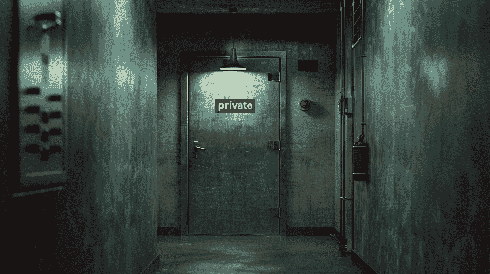
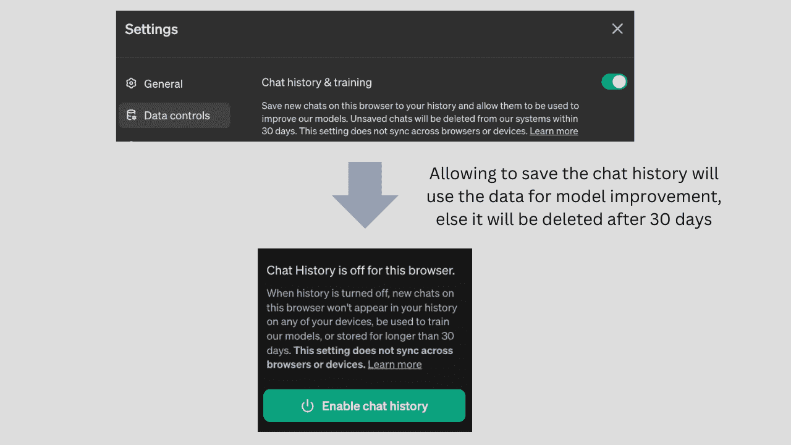

# 理解 AI 时代的数据隐私

> 原文：[`www.kdnuggets.com/understanding-data-privacy-in-the-age-of-ai`](https://www.kdnuggets.com/understanding-data-privacy-in-the-age-of-ai)

图片作者 | Midjourney & Canva

关于 AI 伦理和负责任发展的讨论近年来得到了显著关注，原因是正当的。这些讨论旨在应对各种风险，包括偏见、误信息、公平性等。

虽然这些挑战有些并不完全新鲜，但对 AI 应用的需求激增无疑加剧了这些挑战。数据隐私这一长期存在的问题，随着生成性 AI 的出现，变得更加重要。

[哈雷赛·伯根德](https://mitsloan.mit.edu/ideas-made-to-matter/deepfakes-explained)——麻省理工学院开放纪录片实验室的研究员——的这一声明突显了形势的严峻性。——“应该把你在互联网上自由发布的所有信息都当作是可能被某人用于某些用途的训练数据。”

时代在变化，需要相应的措施。因此，让我们理解这些影响，并认识到如何处理数据隐私带来的风险。

## 该提高警惕的时刻到了

每一个处理用户数据的公司，无论是以收集和存储数据的形式，还是执行数据操作和处理数据以建立模型等，都必须注意各种数据方面，例如：

+   数据来自哪里，去向何处？

+   这些挑战是如何被操控的？

+   谁在使用这些数据，如何使用？

简而言之，关键在于数据如何交换以及与谁交换。

每个分享数据并同意使用数据的用户必须注意他们愿意分享的信息。例如，如果用户希望收到个性化推荐，他们需要愿意分享相关数据。

## GDPR 是金标准!!!

当涉及到个人可识别信息（PII）时，管理数据的风险就变得非常重要。根据美国劳动部的数据，PII 通常包括直接识别个人的信息，如姓名、地址、任何识别号码或代码、电话号码、电子邮件地址等。关于 PII 的更详细定义和指导请参见 [这里](https://www.dol.gov/general/ppii)。

为了保护个人数据，欧盟颁布了通用数据保护条例（GDPR），为存储和收集欧盟公民数据的公司设定了严格的问责标准。

## 发展速度快于规章制度

实证表明，任何技术创新和突破的发展速度总是快于有关部门预见其问题并及时监管的速度。

那么，在规章制度跟上快速发展的步伐之前，人们应该怎么做呢？让我们来了解一下。

### 自我监管

解决这一差距的一种方法是建立内部治理措施，类似于公司治理和数据治理。这等同于按照你所知的行业标准和最佳实践尽可能地承担你的模型。

自我监管的这些措施是保持高标准的诚信和以客户为中心的强有力指标，这可以在这个高度竞争的世界中成为一个区别因素。采纳自我监管章程的组织可以将其作为荣誉的徽章，并赢得客户的信任和忠诚——考虑到用户在众多选项中转换成本低，这是一个很大的成就。

建立内部人工智能治理措施的一个方面是，它使组织保持在负责任的人工智能框架的道路上，因此当法律法规到位时，他们可以做好轻松采纳的准备。

### 规则必须对每个人都一样

理论上设立先例是好的。从技术上讲，没有任何组织能够完全预见一切并保护自己。

另一个反对自我监管的论点是，每个人都应该遵循相同的规则。没有人希望通过过度自我监管来预期即将到来的监管，从而自我破坏增长，阻碍业务发展。

## 隐私的另一面

许多参与者可以在维护高隐私标准方面发挥作用，例如组织及其员工。然而，用户也有同样重要的角色——是时候提高警惕，培养意识了。下面我们将详细讨论：

### 组织和员工的角色

这些组织已经创建了一个责任框架，以使他们的团队敏感于正确提示模型的方式，并提高对这些方法的认识。对于医疗和金融等领域，通过输入提示共享的任何敏感信息也算作隐私泄露——这次是无意的，但通过员工而不是模型开发者。

### 用户的角色

本质上，如果我们自己向这些模型提供这样的数据，隐私就不能成为问题。

作者提供的图片

大多数基础模型（类似于上图所示的例子）强调聊天记录可能会被用来改进模型，因此用户必须仔细检查设置控制，以允许适当的访问以促进数据隐私。

### 人工智能的规模

用户必须在每个设备的每个浏览器中访问并修改同意控制，以阻止这些泄漏。然而，现在想想大型模型，这些模型正在扫描几乎所有的互联网数据，基本上包括每个人。

那个规模成为了一个问题！

大型语言模型之所以有优势，正是因为它们可以访问比传统模型高几个数量级的训练数据，这种规模也会带来巨大的隐私问题。

## 深度伪造——一种伪装的隐私侵犯形式

最近出现了一起事件，一名公司高管指示其员工向某个账户转账数百万美元。由于存疑，员工建议安排一次电话讨论，然后他进行了转账——结果后来才发现电话会议上的所有人都是深度伪造的。

对于不了解的人，[政府问责办公室](https://www.gao.gov/assets/gao-20-379sp.pdf) 将其解释为——“一个看似真实但已被人工智能操控的视频、照片或音频录制。其基础技术可以替换面孔、操控面部表情、合成面孔和合成语音。深度伪造技术可以表现出某人说过或做过他们从未说过或做过的事情。”

从修辞学的角度来看，深度伪造技术也是一种隐私侵犯，相当于身份盗窃，其中的不法分子假装成他们不是的人。

利用这些被盗身份，他们可以推动决策和行动，否则这些决策和行动本不会发生。

这提醒我们，不法分子通常比防御方的好人领先一步。好人仍在努力进行损害控制，同时确保采取稳健的措施以防止未来的事故。

****[Vidhi Chugh](https://vidhi-chugh.medium.com/)**** 是一位人工智能战略家和数字化转型领导者，致力于在产品、科学和工程的交汇点构建可扩展的机器学习系统。她是获奖的创新领导者、作者和国际演讲者。她的使命是使机器学习民主化，并破除行话，使每个人都能参与这一转型。

### 更多相关主题

+   [通过数据隐私学习如何实施技术隐私解决方案…](https://www.kdnuggets.com/2022/04/manning-data-privacy-learn-implement-technical-privacy-solutions-tools-scale.html)

+   [在生成式 AI 时代，数据科学家仍然需要吗？](https://www.kdnuggets.com/2023/06/data-scientists-still-needed-age-generative-ai.html)

+   [在 ChatGPT 时代建立深科技初创公司的 10 大难题](https://www.kdnuggets.com/2023/04/10-hurdles-building-deep-tech-startup-age-chatgpt.html)

+   [庆祝对数据隐私重要性的认识](https://www.kdnuggets.com/2022/01/celebrating-awareness-importance-data-privacy.html)

+   [关于可信图神经网络的全面调查：…](https://www.kdnuggets.com/2022/05/comprehensive-survey-trustworthy-graph-neural-networks-privacy-robustness-fairness-explainability.html)

+   [理解贝叶斯定理的三种方式将提升你的数据科学技能](https://www.kdnuggets.com/2022/06/3-ways-understanding-bayes-theorem-improve-data-science.html)
