# 理解 Python 中的决策树分类

> 原文：[`www.kdnuggets.com/2019/08/understanding-decision-trees-classification-python.html`](https://www.kdnuggets.com/2019/08/understanding-decision-trees-classification-python.html)

 评论

**作者：[Michael Galarnyk](https://www.linkedin.com/in/michaelgalarnyk/)，数据科学家**

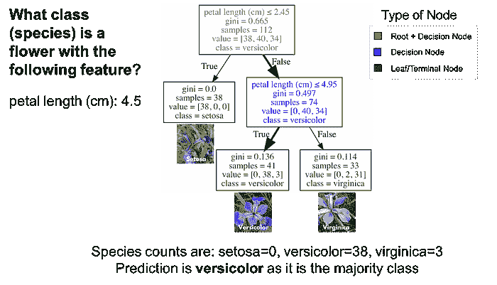

本教程将详细讲解决策树的工作原理。

决策树是一种受欢迎的监督学习方法，原因有很多。决策树的优点包括可以用于回归和分类，易于解释，不需要特征缩放。然而，它们也有一些缺陷，包括容易过拟合。本文涵盖了用于分类的决策树，也称为分类树。

此外，本教程还将涵盖：

+   分类树的结构（树的深度、根节点、决策节点、叶节点/终端节点）。

+   分类树如何进行预测

+   如何使用 scikit-learn (Python) 制作分类树

+   超参数调整

一如既往，本教程中使用的代码可以在我的 [github](https://github.com/mGalarnyk/Python_Tutorials/blob/master/Statistics/boxplot/box_plot.ipynb) 上找到（[结构](https://github.com/mGalarnyk/Python_Tutorials/blob/master/Sklearn/CART/Dt_Classification/ClassificationTreeAnatomy.ipynb)，[预测](https://github.com/mGalarnyk/Python_Tutorials/blob/master/Sklearn/CART/Dt_Classification/ClassificationTreesUsingPython.ipynb)）。好了，让我们开始吧！

### 什么是分类树？

**C**lassification **a**nd **R**egression **T**rees (CART) 是 Leo Breiman 提出的术语，指可以用于分类或回归预测建模问题的决策树算法。本文讨论分类树。

### 分类树

分类树本质上是一系列问题，用于分配分类。下图是一个在 IRIS 数据集（花卉种类）上训练的分类树。根节点（棕色）和决策节点（蓝色）包含的问题会分裂成子节点。根节点就是最顶层的决策节点。换句话说，它是你开始遍历分类树的地方。叶节点（绿色），也称为终端节点，是不会再分裂成更多节点的节点。叶节点是通过多数投票来分配类别的地方。

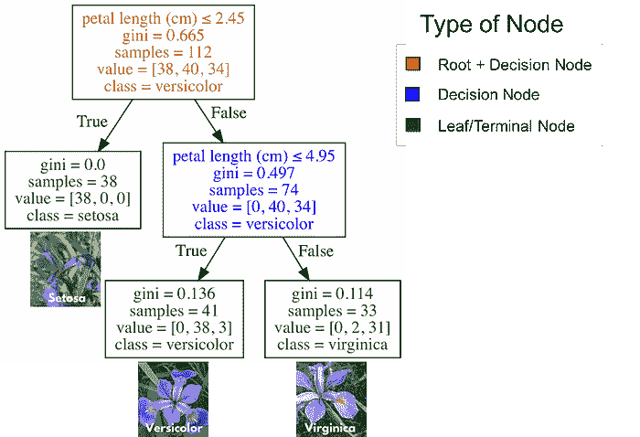

分类树对三种花卉种类（IRIS 数据集）的分类

**如何使用分类树**

使用分类树时，从根节点（棕色）开始，遍历树直到到达叶子（终端）节点。使用下面图中的分类树，假设你有一朵花，花瓣长度为 4.5 cm，你想对其进行分类。从根节点开始，你首先会问“花瓣长度（cm）≤ 2.45”？长度大于 2.45，因此这个问题为假。继续到下一个决策节点，问“花瓣长度（cm）≤ 4.95”？这是对的，所以你可以预测花的种类为 versicolor。这只是一个例子。


**分类树是如何生长的？（非数学版本）**

分类树学习的是一系列的“如果…那么…”问题，每个问题涉及一个特征和一个拆分点。看看下面的部分树（A），问题“花瓣长度（cm）≤ 2.45”根据某个值（在此例中为 2.45）将数据拆分为两个分支。节点之间的值称为拆分点。一个好的拆分点值（即产生最大信息增益的值）是能够很好地将一个类别与其他类别分开的值。看下面的图 B，拆分点左侧的所有点被分类为 setosa，而拆分点右侧的所有点被分类为 versicolor。

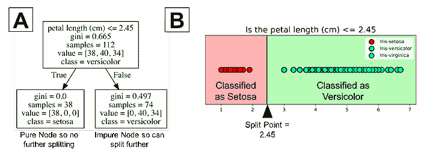

图中显示所有 38 个点的 setosa 分类都正确。它是一个纯节点。分类树不会在纯节点上进行拆分。这会导致没有进一步的信息增益。然而，非纯节点可以进一步拆分。注意图 B 的右侧显示许多点被错误分类为 versicolor。换句话说，它包含了两种不同类别的点（virginica 和 versicolor）。分类树是一个贪婪算法，这意味着它默认会继续拆分直到得到一个纯节点。算法再次为非纯节点选择最佳的拆分点（我们将在下一节中深入探讨数学方法）。

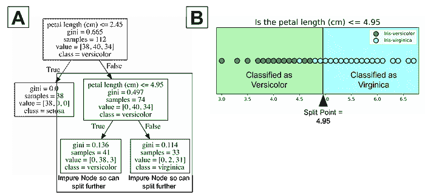

上面的图像中，树的最大深度为 2。树的深度是衡量一棵树在做出预测之前能进行多少次拆分的指标。这个过程可以继续进行更多的拆分，直到树尽可能纯净。许多重复这一过程的问题是，这可能会导致一棵非常深的分类树，拥有许多节点。这通常会导致对训练数据集的过拟合。幸运的是，大多数分类树实现允许你控制树的最大深度，从而减少过拟合。例如，Python 的 scikit-learn 允许你预剪枝决策树。换句话说，你可以设置最大深度来停止决策树超过某个深度。要直观理解最大深度，你可以查看下面的图像。

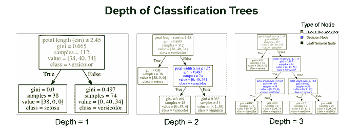

不同深度的分类树在 IRIS 数据集上的拟合情况。

### 选择标准

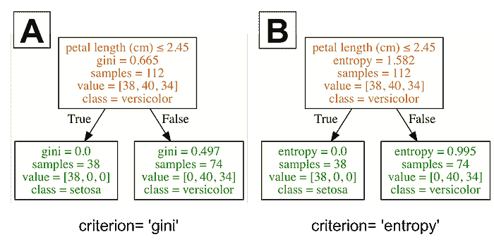

本节回答了信息增益以及 Gini 和熵这两个标准的计算方法。

本节的重点是理解在分类树上对根节点/决策节点的良好分割点。决策树会在特征和相应的分割点上进行分裂，以获得给定标准（本例中的 Gini 或熵）的最大信息增益（IG）。大致上，我们可以将信息增益定义为

```py
IG = information before splitting (parent) — information after splitting (children)
```

为了更清楚地理解父节点和子节点，请查看下方的决策树。

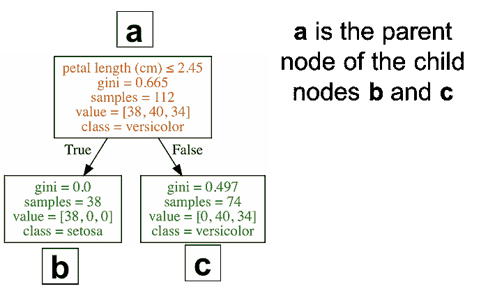

更为恰当的信息增益公式如下。

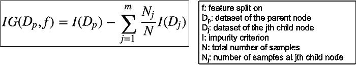

由于分类树有二元分裂，因此公式可以简化为如下公式。

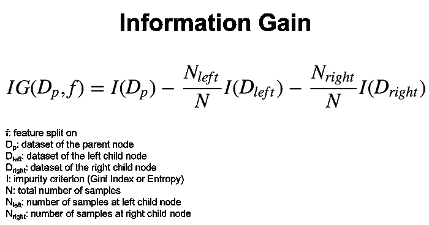

两个常见的`I`标准，用于测量节点的 impurity 是 Gini 指数和熵。

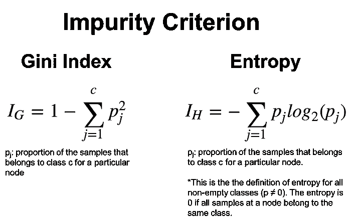

为了更好地理解这些公式，下图展示了如何使用 Gini 标准计算决策树的信息增益。

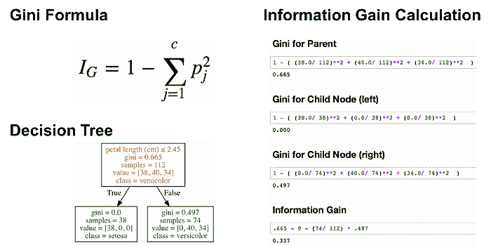

下图展示了如何计算决策树的熵信息增益。


我不打算深入探讨这一点，因为需要指出的是，不同的 impurity 测量（Gini 指数和熵）[通常会产生相似的结果](https://www.unine.ch/files/live/sites/imi/files/shared/documents/papers/Gini_index_fulltext.pdf)。下图展示了 Gini 指数和熵是非常相似的 impurity 标准。我猜测 Gini 作为 Scikit-learn 中的默认值之一的原因可能是熵的计算可能稍慢（因为它使用了对数）。

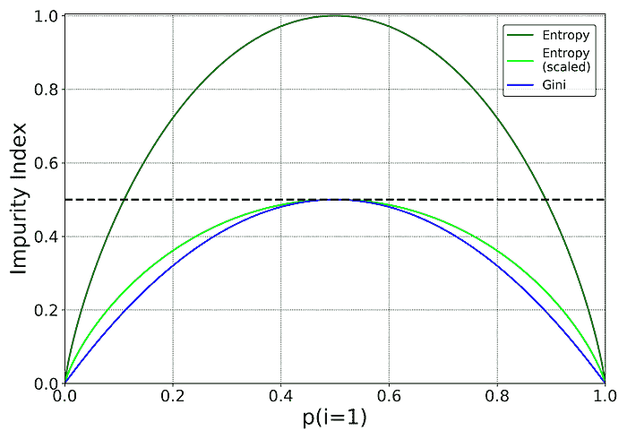

不同的 impurity 测量（Gini 指数和熵）[通常会产生相似的结果](https://www.unine.ch/files/live/sites/imi/files/shared/documents/papers/Gini_index_fulltext.pdf)。感谢[Data Science StackExchange](https://datascience.stackexchange.com/questions/10228/gini-impurity-vs-entropy)和[Sebastian Raschka](https://twitter.com/rasbt)对本图的启发。

在完成本节之前，我需要指出，存在各种不同的决策树算法，它们彼此有所不同。一些更受欢迎的算法包括 ID3、C4.5 和 CART。Scikit-learn 使用了[CART 算法的优化版本](http://scikit-learn.org/stable/modules/tree.html#tree-algorithms-id3-c4-5-c5-0-and-cart)。你可以在[这里](http://scikit-learn.org/stable/modules/tree.html#complexity)了解其时间复杂度。

### 使用 Python 的分类树

之前的部分讲述了分类树的理论。学习如何在编程语言中制作决策树的一个原因是，处理数据可以帮助理解算法。

### 加载数据集

Iris 数据集是 scikit-learn 提供的一个数据集，无需从外部网站下载任何文件。下面的代码加载了 iris 数据集。

```py
import pandas as pd
from sklearn.datasets import load_irisdata = load_iris()
df = pd.DataFrame(data.data, columns=data.feature_names)
df['target'] = data.target
```

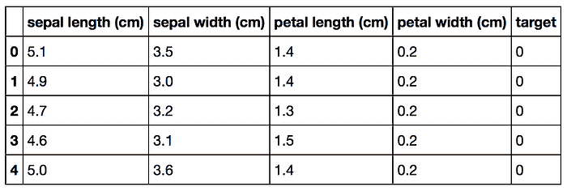

原始 Pandas df（特征 + 目标）

### 将数据拆分为训练集和测试集

下面的代码将 75% 的数据放入训练集，将 25% 的数据放入测试集。

```py
X_train, X_test, Y_train, Y_test = train_test_split(df[data.feature_names], df['target'], random_state=0)
```


图片中的颜色表示数据框 df 的数据在这个特定的训练测试分割中属于哪个变量（X_train, X_test, Y_train, Y_test）。

请注意，决策树的一个好处是你无需像[PCA](https://towardsdatascience.com/pca-using-python-scikit-learn-e653f8989e60)和逻辑回归那样对数据进行标准化，因为这两者对[数据未标准化的影响比较敏感](http://scikit-learn.org/stable/auto_examples/preprocessing/plot_scaling_importance.html#sphx-glr-auto-examples-preprocessing-plot-scaling-importance-py)。

### Scikit-learn 四步建模模式

**步骤 1:**  导入你想要使用的模型

在 scikit-learn 中，所有机器学习模型都是作为 Python 类实现的。

```py
from sklearn.tree import DecisionTreeClassifier
```

**步骤 2:**  创建模型实例

在下面的代码中，我将 `max_depth = 2` 设置为提前修剪我的树，以确保它的深度不超过 2。我应该指出教程的下一部分将介绍如何为你的树选择最佳的 `max_depth`。

还要注意，在我下面的代码中，我设置了 `random_state = 0`，这样你可以得到和我一样的结果。

```py
clf = DecisionTreeClassifier(max_depth = 2, 
                             random_state = 0)
```

**步骤 3:**  在数据上训练模型

模型正在学习 X（萼片长度、萼片宽度、花瓣长度和花瓣宽度）和 Y（鸢尾花的种类）之间的关系

```py
clf.fit(X_train, Y_train)
```

**步骤 4:**  预测未见（测试）数据的标签

```py
# Predict for 1 observation
clf.predict(X_test.iloc[0].values.reshape(1, -1))# Predict for multiple observations
clf.predict(X_test[0:10])
```

记住，预测仅仅是叶节点中实例的多数类别。

### 测量模型性能

尽管还有其他测量模型性能的方法（如精确率、召回率、F1 分数，[ROC 曲线](https://towardsdatascience.com/receiver-operating-characteristic-curves-demystified-in-python-bd531a4364d0)等），我们将保持简单，使用准确率作为我们的指标。

准确率定义为：

（正确预测的比例）：正确预测数 / 数据点总数

```py
# The score method returns the accuracy of the model
score = clf.score(X_test, Y_test)
print(score)
```

### 调整树的深度

找到 `max_depth` 的最佳值是一种调整模型的方法。下面的代码输出了具有不同 `max_depth` 值的决策树的准确率。

```py
# List of values to try for max_depth:
max_depth_range = list(range(1, 6))# List to store the average RMSE for each value of max_depth:
accuracy = []for depth in max_depth_range:

    clf = DecisionTreeClassifier(max_depth = depth, 
                             random_state = 0)
    clf.fit(X_train, Y_train)    score = clf.score(X_test, Y_test)
    accuracy.append(score)
```

由于下面的图表显示，当参数 `max_depth` 大于或等于 3 时，模型的准确率最佳，因此选择 `max_depth = 3` 的最简单模型可能是最好的选择。


我选择`max_depth =3`，因为它似乎是一个准确的模型且不是最复杂的。

需要记住的是，`max_depth`并不等于决策树的深度。`max_depth`是对决策树进行预剪枝的一种方法。换句话说，如果树在某个深度已经尽可能纯净，它将不会继续分裂。下图显示了`max_depth`为 3、4 和 5 的决策树。请注意，`max_depth`为 4 和 5 的树是相同的。它们的深度都是 4。

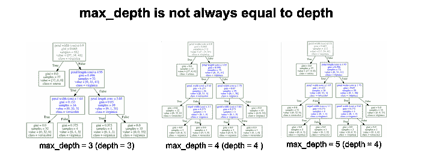

请注意，我们有两个完全相同的树。

如果你想知道你训练的决策树的深度，可以使用`get_depth`方法。此外，你还可以使用`get_n_leaves`方法获取训练决策树的叶节点数量。

虽然本教程涵盖了更改选择标准（Gini 指数、熵等）和树的`max_depth`，但请记住，你还可以调整节点分裂的最小样本数（`min_samples_leaf`）、最大叶节点数（`max_leaf_nodes`）等。

### 特征重要性

分类树的一个优点是相对容易解释。scikit-learn 中的分类树允许你计算特征重要性，即由于特征分裂而使 gini 指数或熵减少的总量。scikit-learn 为每个特征输出一个 0 到 1 之间的数字。所有特征的重要性值都被归一化为总和为 1。以下代码显示了决策树模型中每个特征的重要性。

```py
importances = pd.DataFrame({'feature':X_train.columns,'importance':np.round(clf.feature_importances_,3)})
importances = importances.sort_values('importance',ascending=False)
```

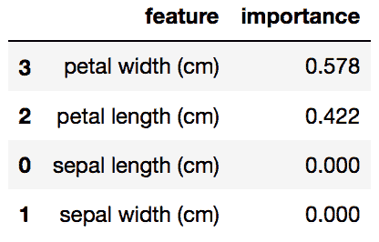

在上面的例子中（针对某个特定的鸢尾花训练测试分割），花瓣宽度具有最高的特征重要性权重。我们可以通过查看相应的决策树来确认这一点。

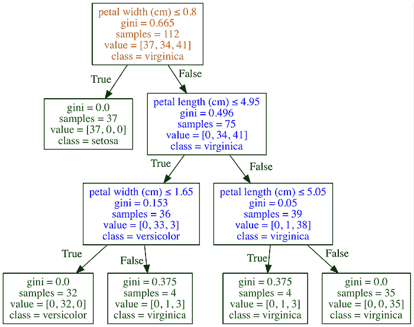

该决策树分裂的只有两个特征，即花瓣宽度（cm）和花瓣长度（cm），

请记住，如果一个特征的重要性值较低，这并不一定意味着该特征对预测不重要，它只是说明该特征没有在树的较早层级被选择。也可能是该特征与另一个信息量大的特征相同或高度相关。特征重要性值也不能告诉你这些特征对哪个类别的预测非常重要，或特征之间的关系如何影响预测。值得注意的是，在进行交叉验证或类似操作时，可以使用多个训练测试分割的特征重要性值的平均值。

### 总结

尽管这篇文章只讨论了用于分类的决策树，但你可以查看我另一篇文章《决策树用于回归（Python）》。**C**lassification **a**nd **R**egression **T**rees (CART) 是一种相对较旧的技术（1984 年），是更复杂技术的基础。决策树的主要弱点之一是它们通常不是最准确的算法。这部分是因为决策树是一种高方差算法，这意味着训练数据中的不同分裂可以导致非常不同的树。如果你对教程有任何问题或想法，请随时在下面的评论中或通过 [Twitter](https://twitter.com/GalarnykMichael) 联系我。

**简介: [迈克尔·加拉尼克](https://www.linkedin.com/in/michaelgalarnyk/)** 是一名数据科学家和企业培训师。他目前在斯克里普斯转化研究所工作。你可以在 Twitter (https://twitter.com/GalarnykMichael)、Medium (https://medium.com/@GalarnykMichael) 和 GitHub (https://github.com/mGalarnyk) 上找到他。

[原文](https://towardsdatascience.com/understanding-decision-trees-for-classification-python-9663d683c952)。已获得许可转载。

**相关:**

+   决策树——直观介绍

+   如何建立数据科学作品集

+   随机森林与神经网络：哪个更好，何时使用？

* * *

## 我们的前三大课程推荐

 1\. [谷歌网络安全证书](https://www.kdnuggets.com/google-cybersecurity) - 快速进入网络安全职业生涯。

 2\. [谷歌数据分析专业证书](https://www.kdnuggets.com/google-data-analytics) - 提升你的数据分析技能

 3\. [谷歌 IT 支持专业证书](https://www.kdnuggets.com/google-itsupport) - 支持你的组织进行 IT 管理

* * *

### 更多相关主题

+   [从零开始的机器学习：决策树](https://www.kdnuggets.com/2022/11/machine-learning-scratch-decision-trees.html)

+   [决策树与随机森林的解释](https://www.kdnuggets.com/2022/08/decision-trees-random-forests-explained.html)

+   [广义和可扩展的最优稀疏决策树（GOSDT）](https://www.kdnuggets.com/2023/02/generalized-scalable-optimal-sparse-decision-treesgosdt.html)

+   [揭开现实世界决策树的面纱](https://www.kdnuggets.com/demystifying-decision-trees-for-the-real-world)

+   [理解分类指标：评估模型的指南](https://www.kdnuggets.com/understanding-classification-metrics-your-guide-to-assessing-model-accuracy)

+   [通过实现理解：决策树](https://www.kdnuggets.com/2023/02/understanding-implementing-decision-tree.html)
