# 通过实现理解：决策树

> 原文：[`www.kdnuggets.com/2023/02/understanding-implementing-decision-tree.html`](https://www.kdnuggets.com/2023/02/understanding-implementing-decision-tree.html)

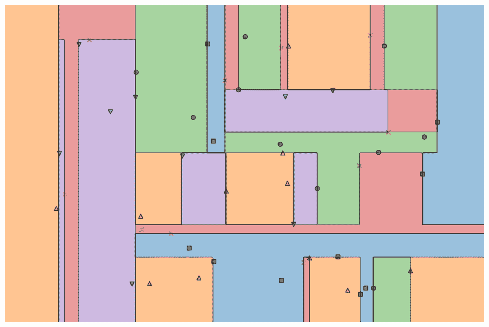

作者提供的图片

许多高级机器学习模型，例如随机森林或梯度提升算法，如 XGBoost、CatBoost 或 LightGBM（甚至[自编码器](https://medium.com/towards-data-science/building-a-simple-auto-encoder-via-decision-trees-28ba9342a349)！）都依赖于一个重要的共同成分：**决策树**！

* * *

## 我们的前三个课程推荐

 1\. [Google 网络安全证书](https://www.kdnuggets.com/google-cybersecurity) - 快速进入网络安全职业生涯。

 2\. [Google 数据分析专业证书](https://www.kdnuggets.com/google-data-analytics) - 提升您的数据分析能力

 3\. [Google IT 支持专业证书](https://www.kdnuggets.com/google-itsupport) - 支持您的组织进行 IT 管理

* * *

如果不理解决策树，也无法理解上述高级的袋装算法或梯度提升算法，这对任何数据科学家来说都是一个耻辱！所以，让我们通过在 Python 中实现一个决策树来揭开它的神秘面纱。

在本文中，您将学习

+   为什么以及如何决策树分裂数据，

+   信息增益，以及

+   如何使用 NumPy 在 Python 中实现决策树。

> 您可以在[我的 Github](https://github.com/Garve/Towards-Data-Science---Notebooks/blob/main/TDS%20-%20Decision%20Tree.ipynb)上找到代码。

# 理论

为了进行预测，决策树依赖于**将**数据集递归地**分裂**成更小的部分。

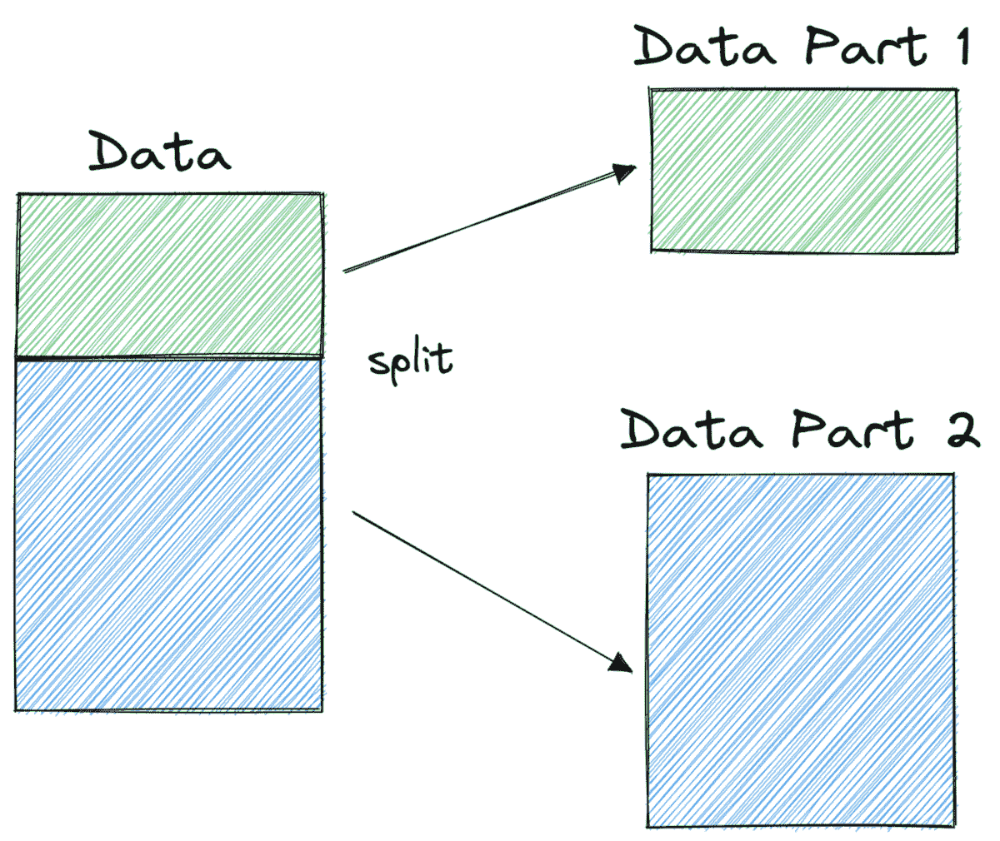

作者提供的图片

在上面的图片中，您可以看到一个分裂的示例——原始数据集被分成了两个部分。在下一步中，这两个部分又被进一步分裂，以此类推。这会一直持续，直到满足某种停止准则，例如，

+   如果分裂导致某部分为空

+   如果达到了一定的递归深度

+   如果（在之前的分裂后）数据集只包含几个元素，使得进一步的分裂不再必要。

我们如何找到这些分裂？我们为什么要关心这些？让我们来了解一下。

## 动机

假设我们现在要解决一个**二分类问题**：

```py
import numpy as np
np.random.seed(0)

X = np.random.randn(100, 2) # features
y = ((X[:, 0] > 0) * (X[:, 1] < 0)) # labels (0 and 1)
```

二维数据如下所示：

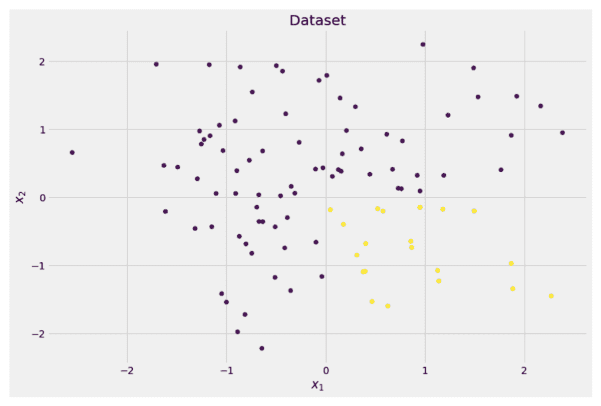

作者提供的图片

我们可以看到有两个不同的类别——紫色约占 75%，黄色约占 25%。如果你将这些数据输入到决策树**分类器**中，这棵树最初会有以下想法：

> “有两个不同的标签，这对我来说太混乱了。我想通过将数据分成两个部分来清理这些混乱——这些部分应该比之前的完整数据更干净。”——获得意识的树

树就是这样做的。

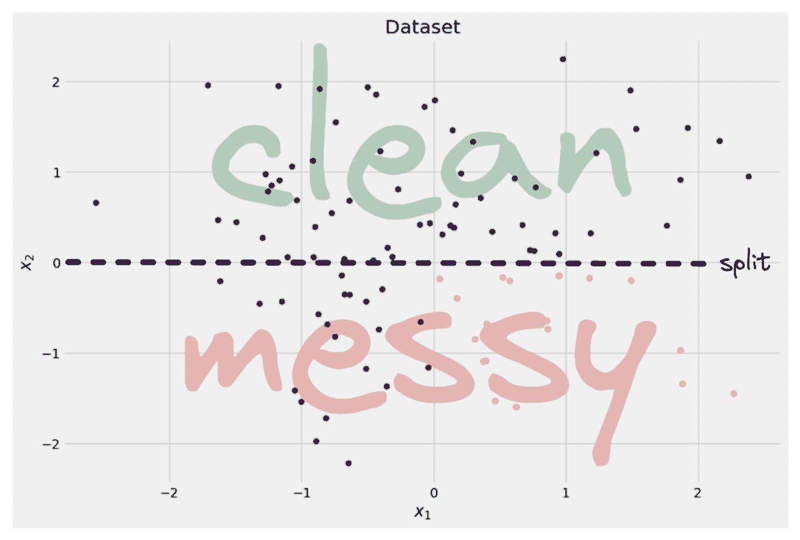

图片来源：作者

树决定沿 *x* 轴大致进行一次分裂。这使得数据的顶部部分现在完全*干净*，***这意味着你在那里只找到*一个类别*（在这种情况下是紫色）。**

然而，底部部分仍然是*混乱的*，从某种意义上来说，比之前更加混乱。整个数据集中的类别比率曾经是约 75:25，但在这个较小的部分中，它是大约 50:50，这已经是最混杂的状态了。

> * ***注意：****在这里，紫色和黄色在图片中是否分开并不重要。只有两部分中不同标签的**原始数量**才是关键。**

*

图片来源：作者

尽管如此，这仍然是树的第一步，因此它继续前进。虽然它不会再在顶部的*干净*部分创建另一个分裂，但它可以在底部部分创建另一个分裂来进行清理。

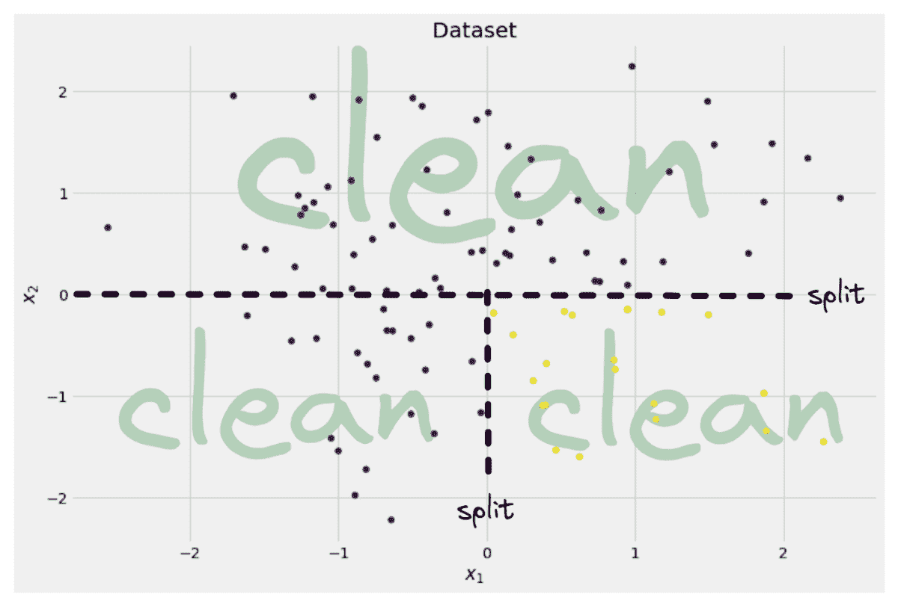

图片来源：作者

Voilà，三个独立的部分完全干净，因为我们每个部分只找到一种颜色（标签）。

现在做预测非常简单：如果一个新的数据点出现，你只需检查它位于哪一个**三个部分**中，然后给它相应的颜色。现在之所以效果如此好，是因为每个部分都是*干净的*。简单吧？

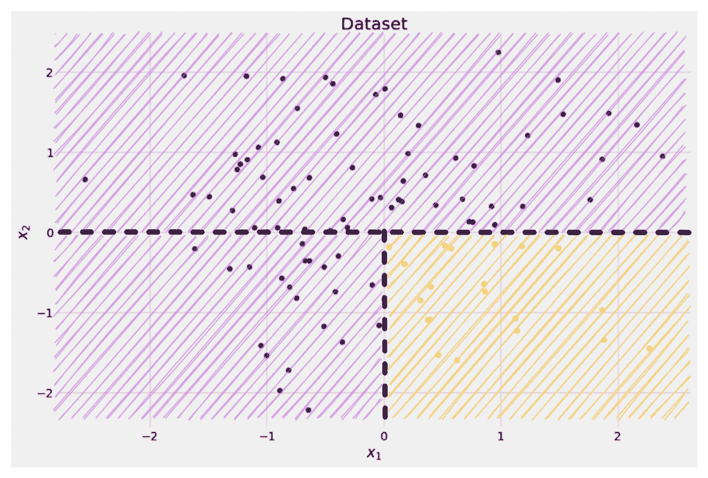

图片来源：作者

好了，我们谈论了*干净*和*混乱*的数据，但到目前为止，这些词只是代表了一些模糊的概念。为了实现任何东西，我们必须找到定义*清洁度*的方法。

## 清洁度的措施

假设我们有一些标签，例如

```py
y_1 = [0, 0, 0, 0, 0, 0, 0, 0]

y_2 = [1, 0, 0, 0, 0, 0, 1, 0]
y_3 = [1, 0, 1, 1, 0, 0, 1, 0]
```

直观地说，*y₁* 是最干净的标签集，其次是 *y₂*，然后是 *y₃*。到目前为止还不错，但我们如何用数字来表示这种行为呢？也许最容易想到的方法是：

> 只需计算零的数量和一的数量。计算它们的绝对差异。为了使其更美观，通过除以数组的长度进行归一化。

例如，*y₂* 总共有 8 个条目——6 个零和 2 个一。因此，我们自定义的**清洁度得分**将是 |6 - 2| / 8 = 0.5。很容易计算出 *y₁* 和 *y₃* 的清洁度得分分别为 1.0 和 0.0。在这里，我们可以看到通用公式：


图片来源：作者

这里，*n₀* 和 *n₁* 分别是零和一的数量，*n = n₀ + n₁* 是数组的长度，而 *p₁ = n₁ / n* 是标签为 1 的比例。

这个公式的问题在于它**专门针对两个类别的情况**，但我们很常见的是多类别分类。一个效果相当好的公式是**Gini 不纯度度量**：

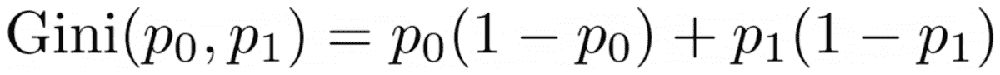

图片来源：作者

或者一般情况：

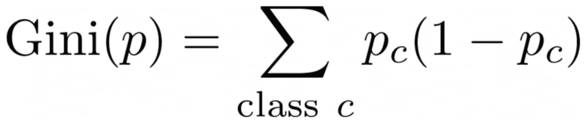

图片来源：作者

它效果非常好，以至于 scikit-learn [将其作为默认度量](https://scikit-learn.org/stable/modules/generated/sklearn.tree.DecisionTreeClassifier.html)用于其`DecisionTreeClassifier`类。

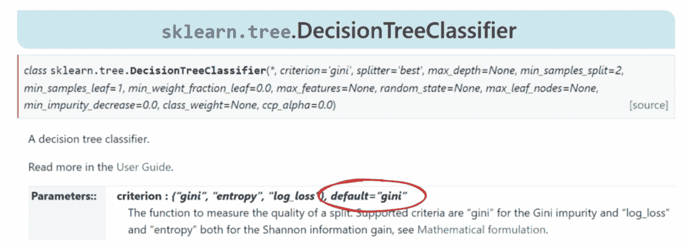

图片来源：作者

> * ***注意：****Gini 度量的是****杂乱程度****而不是清洁程度。示例：如果一个列表只包含单一类别（=非常干净的数据！），则总和中的所有项都是零，因此总和为零。最糟糕的情况是所有类别出现的次数完全一样，这种情况下 Gini 为 1–1/*C*，其中 *C* 是类别的数量。**

*现在我们有了清洁度/杂乱度的度量，让我们看看它如何用于找到好的分裂。

## 查找分裂

我们有很多分裂选择，但哪个是好的呢？让我们再次使用我们的初始数据集，结合 Gini 不纯度度量。


图片来源：作者

我们现在不会计算点数，但假设 75% 是紫色的，25% 是黄色的。根据 Gini 的定义，整个数据集的不纯度是


图片来源：作者

如果我们像之前那样沿 *x* 轴分裂数据集：

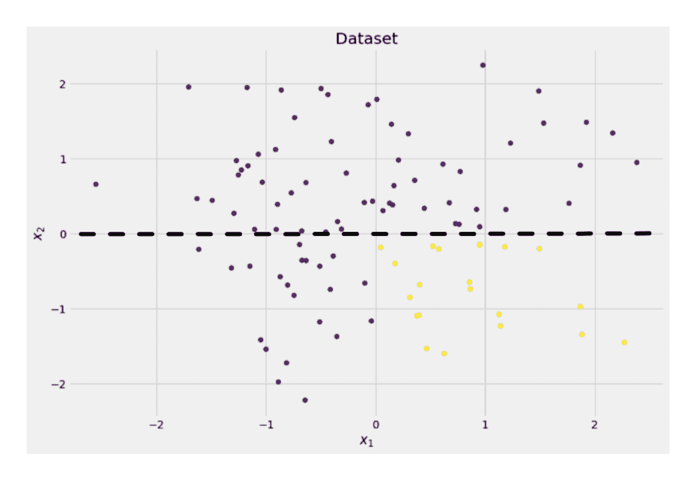

图片来源：作者

**顶部部分的 Gini 不纯度是 0.0**，而底部部分

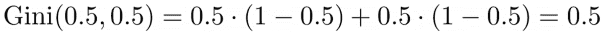

图片来源：作者

平均而言，这两个部分的 Gini 不纯度为 (0.0 + 0.5) / 2 = 0.25，比之前整个数据集的 0.375 更好。我们还可以用所谓的**信息增益**来表示：

> 这个分裂的信息增益是 0.375 – 0.25 = 0.125。

就这么简单。信息增益越高（即 Gini 不纯度越低），效果越好。

> **注意：** 另一个同样好的初始分裂是沿 y 轴。

需要记住的一件重要事情是，**通过部分的大小来权衡 Gini 不纯度**是有用的。例如，假设

+   第一部分包含 50 个数据点，Gini 不纯度为 0.0，并且

+   第二部分包含 450 个数据点，Gini 不纯度为 0.5，

然后，平均 Gini 不纯度应该不是 (0.0 + 0.5) / 2 = 0.25，而是 50 / (50 + 450) * 0.0 + 450 / (50 + 450) * 0.5 = **0.45**。

好的，我们如何找到最佳分割？简单但令人清醒的答案是：

> 只需尝试所有分割并选择信息增益最高的一个。这基本上是一种暴力方法。

更准确地说，标准决策树使用**沿坐标轴的分割**，即*xᵢ = c*，其中*i*是某个特征，*c*是阈值。这意味着

+   分割数据的另一部分包含所有数据点*x*，其中*xᵢ < c*。

+   分割数据的一部分包含所有数据点*x*，其中*xᵢ ≥ c*。

这些简单的分割规则在实践中已经证明足够有效，但你当然可以扩展这种逻辑来创建其他分割（例如，像*xᵢ + 2xⱼ = 3*这样的对角线）。

很好，这些就是我们现在需要的一切材料！

# 实现

我们现在将实现决策树。由于它由节点组成，因此我们首先定义一个`Node`类。

```py
from dataclasses import dataclass

@dataclass
class Node:
    feature: int = None # feature for the split
    value: float = None # split threshold OR final prediction
    left: np.array = None # store one part of the data
    right: np.array = None # store the other part of the data
```

一个节点知道用于分割的特征（`feature`）以及分割值（`value`）。`value` 还被用作决策树最终预测的存储。由于我们将构建一棵二叉树，每个节点需要知道它的左子节点和右子节点，分别存储在`left`和`right`中。

现在，让我们进行实际的决策树实现。我将其与 scikit-learn 兼容，因此我使用了来自`sklearn.base`的一些类。如果你不熟悉，可以查看我的文章[如何构建兼容 scikit-learn 的模型](https://towardsdatascience.com/build-your-own-custom-scikit-learn-regression-5d0d718f289)。

让我们实现吧！

```py
import numpy as np
from sklearn.base import BaseEstimator, ClassifierMixin

class DecisionTreeClassifier(BaseEstimator, ClassifierMixin):
    def __init__(self):
        self.root = Node()

    @staticmethod
    def _gini(y):
        """Gini impurity."""
        counts = np.bincount(y)
        p = counts / counts.sum()

        return (p * (1 - p)).sum()

    def _split(self, X, y):
        """Bruteforce search over all features and splitting points."""
        best_information_gain = float("-inf")
        best_feature = None
        best_split = None

        for feature in range(X.shape[1]):
            split_candidates = np.unique(X[:, feature])
            for split in split_candidates:
                left_mask = X[:, feature] < split
                X_left, y_left = X[left_mask], y[left_mask]
                X_right, y_right = X[~left_mask], y[~left_mask]

                information_gain = self._gini(y) - (
                    len(X_left) / len(X) * self._gini(y_left)
                    + len(X_right) / len(X) * self._gini(y_right)
                )

                if information_gain > best_information_gain:
                    best_information_gain = information_gain
                    best_feature = feature
                    best_split = split

        return best_feature, best_split

    def _build_tree(self, X, y):
        """The heavy lifting."""
        feature, split = self._split(X, y)

        left_mask = X[:, feature] < split

        X_left, y_left = X[left_mask], y[left_mask]
        X_right, y_right = X[~left_mask], y[~left_mask]

        if len(X_left) == 0 or len(X_right) == 0:
            return Node(value=np.argmax(np.bincount(y)))
        else:
            return Node(
                feature,
                split,
                self._build_tree(X_left, y_left),
                self._build_tree(X_right, y_right),
            )

    def _find_path(self, x, node):
        """Given a data point x, walk from the root to the corresponding leaf node. Output its value."""
        if node.feature == None:
            return node.value
        else:
            if x[node.feature] < node.value:
                return self._find_path(x, node.left)
            else:
                return self._find_path(x, node.right)

    def fit(self, X, y):
        self.root = self._build_tree(X, y)
        return self

    def predict(self, X):
        return np.array([self._find_path(x, self.root) for x in X])
```

就这样！你现在可以做你喜欢的所有 scikit-learn 的事情了：

```py
dt = DecisionTreeClassifier().fit(X, y)
print(dt.score(X, y)) # accuracy

# Output
# 1.0
```

由于树没有正则化，过拟合严重，因此训练得分完美。未见数据上的准确度会更差。我们还可以通过以下方式查看树的外观

```py
print(dt.root)

# Output (prettified manually):
# Node(
#   feature=1,
#   value=-0.14963454032767076,
#   left=Node(
#          feature=0,
#          value=0.04575851730144607,
#          left=Node(
#                 feature=None,
#                 value=0,
#                 left=None,
#                 right=None
#          ),
#          right=Node(
#                  feature=None,
#                  value=1,
#                  left=None,
#                  right=None
#          )
#        ),
#   right=Node(
#           feature=None,
#           value=0,
#           left=None,
#           right=None
#   )
# )
```

作为图示，它将是这样的：

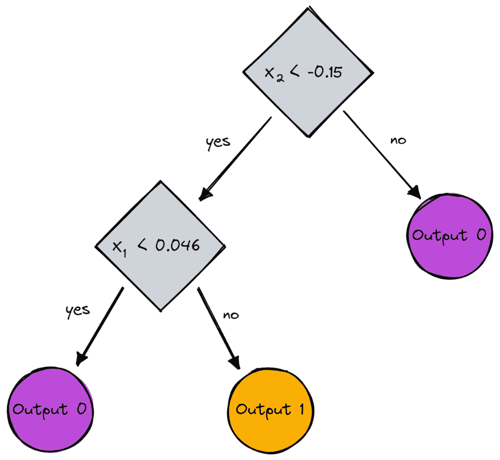

图片由作者提供

# 结论

在这篇文章中，我们详细了解了决策树的工作原理。我们从一些模糊但直观的想法开始，将它们转化为公式和算法。最后，我们能够从头实现一棵决策树。

不过需要提醒的是：我们的决策树尚未正则化。通常，我们希望指定像

+   最大深度

+   叶子大小

+   和最小信息增益

以及许多其他内容。幸运的是，这些实现起来并不难，这使得它成为你完美的作业。例如，如果你将`leaf_size=10`作为参数，那么包含超过 10 个样本的节点就不再拆分。此外，这种实现是**不高效的**。通常，你不希望将数据集的部分内容存储在节点中，而只存储索引。因此，你（可能很大的）数据集只在内存中存在一次。

好消息是你现在可以尽情使用这个决策树模板。你可以：

+   实现对角线拆分，即*xᵢ + 2xⱼ = 3* 而不是仅仅 *xᵢ = 3*，

+   更改叶子内部发生的逻辑，即你可以在每个叶子中运行逻辑回归，而不仅仅是做多数投票，这将给你一个[线性树](https://github.com/cerlymarco/linear-tree)。

+   更改拆分过程，即尝试一些随机组合并选择最佳组合，而不是使用暴力破解，这将给你一个[额外树分类器](https://scikit-learn.org/stable/modules/generated/sklearn.tree.ExtraTreeClassifier.html#sklearn.tree.ExtraTreeClassifier)。

+   等等。

**[罗伯特·库布勒博士](https://www.linkedin.com/in/robert-kuebler/)** 是 METRO.digital 的高级数据科学家，同时也是 Towards Data Science 的作者。

[原文](https://towardsdatascience.com/understanding-by-implementing-decision-tree-dd395867af7e)。转载时获得许可。

### 更多相关话题

+   [用 Python 和 Scikit-learn 简化决策树解释性](https://www.kdnuggets.com/2017/05/simplifying-decision-tree-interpretation-decision-rules-python.html)

+   [决策树算法解析](https://www.kdnuggets.com/2020/01/decision-tree-algorithm-explained.html)

+   [讲述一个伟大的数据故事：一个可视化决策树](https://www.kdnuggets.com/2021/02/telling-great-data-story-visualization-decision-tree.html)

+   [随机森林与决策树：关键区别](https://www.kdnuggets.com/2022/02/random-forest-decision-tree-key-differences.html)

+   [KDnuggets™ 新闻 22:n09, 3 月 2 日: 讲述一个伟大的数据故事：A…](https://www.kdnuggets.com/2022/n09.html)

+   [决策树软件的完整指南](https://www.kdnuggets.com/2022/08/complete-guide-decision-tree-software.html)**
