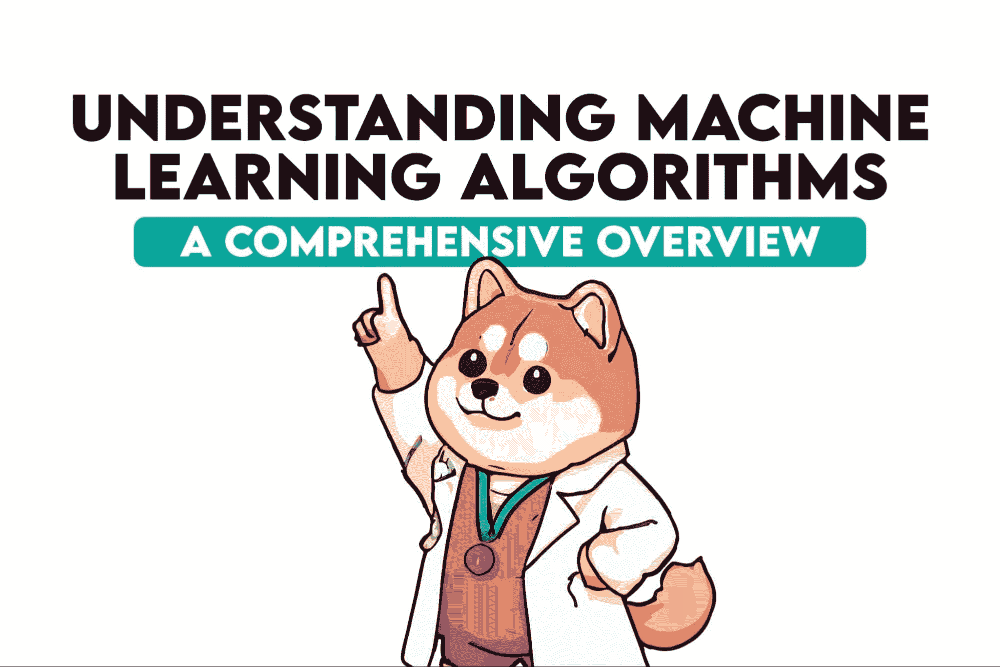
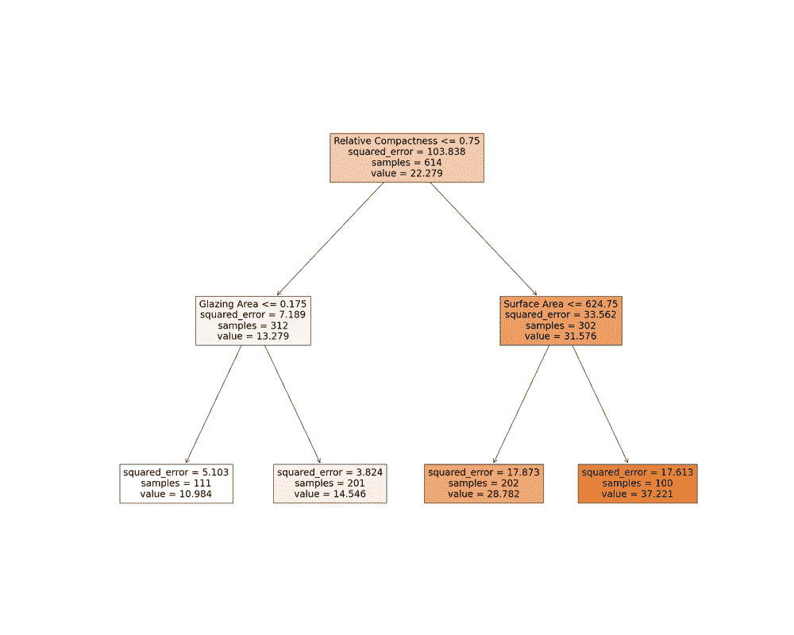
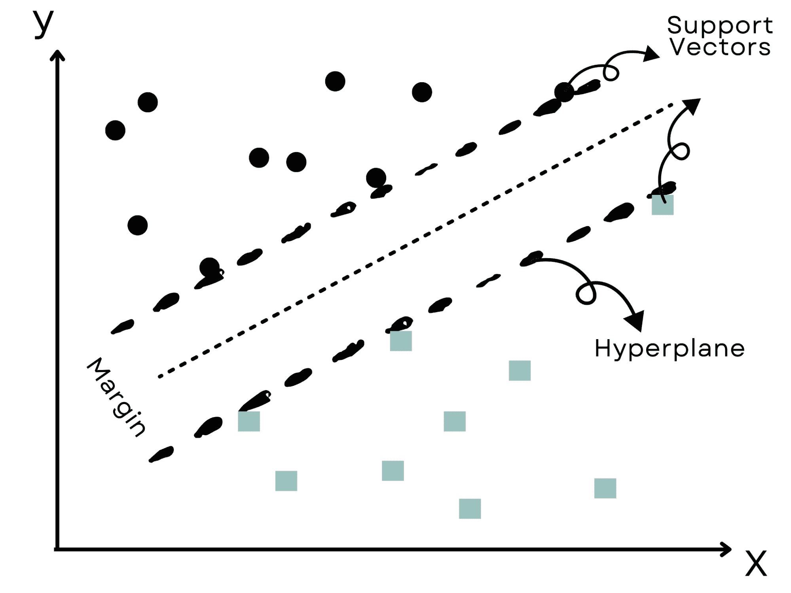
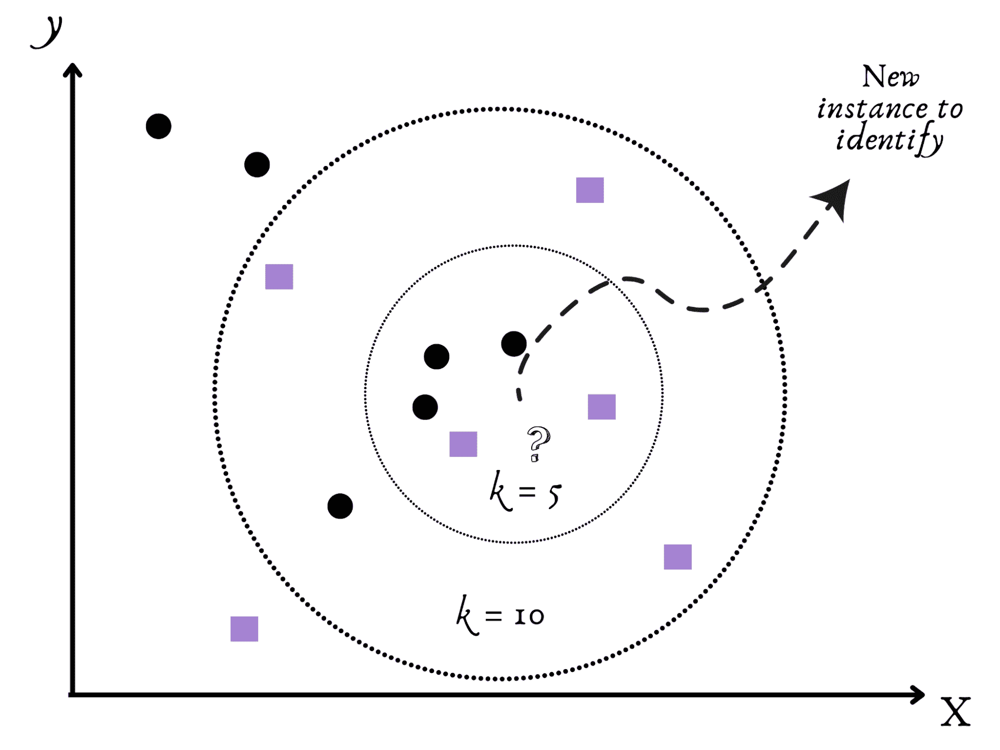
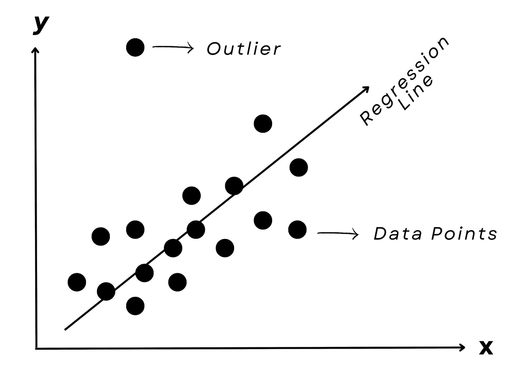

# 了解机器学习算法：深度概述

> 原文：[`www.kdnuggets.com/understanding-machine-learning-algorithms-an-indepth-overview`](https://www.kdnuggets.com/understanding-machine-learning-algorithms-an-indepth-overview)

图片由作者提供

机器学习。相当令人印象深刻的词汇，对吧？由于 AI 及其工具，如`ChatGPT`和 Bard，目前正在蓬勃发展，是时候深入学习基础知识了。

* * *

## 我们的前 3 个课程推荐

 1\. [谷歌网络安全证书](https://www.kdnuggets.com/google-cybersecurity) - 快速进入网络安全职业的捷径。

 2\. [谷歌数据分析专业证书](https://www.kdnuggets.com/google-data-analytics) - 提升你的数据分析能力

 3\. [谷歌 IT 支持专业证书](https://www.kdnuggets.com/google-itsupport) - 支持你所在组织的 IT 需求。

* * *

这些基本概念可能不会立即启发你，但如果你对这些概念感兴趣，你将会有更多的链接可以深入了解。

机器学习的力量来自于其复杂的算法，这些算法是每个机器学习项目的核心。有时，这些算法甚至受到人类认知的启发，如语音识别或面部识别。

在这篇文章中，我们将首先讲解机器学习的类别，如监督学习、无监督学习和强化学习。

然后，我们将讨论机器学习处理的任务，名称是分类、回归和聚类。

之后，我们将深入探讨决策树、支持向量机、K-近邻和线性回归的可视化和定义。

当然，你如何选择最符合你需求的最佳算法呢？当然，理解“理解数据”或“定义你的问题”等概念将帮助你应对项目中的挑战和障碍。

让我们开始机器学习的旅程吧！

# 机器学习的分类

在我们探索机器学习时，可以看到有三个主要类别塑造了其框架。

+   监督学习

+   无监督学习

+   强化学习。

在监督学习中，你想预测的标签在数据集中。

在这种情况下，算法像一个细心的学习者，将特征与相应的输出关联起来。在学习阶段结束后，它可以为新的数据和测试数据预测输出。考虑一下标记垃圾邮件或预测房价的场景。

想象一下没有导师的学习，这一定很令人畏惧。[无监督学习方法](https://www.stratascratch.com/blog/overview-of-machine-learning-algorithms-unsupervised-learning/?utm_source=blog&utm_medium=click&utm_campaign=kdn+ml+algorithms)特别适用于这种情况，它们在没有标签的情况下进行预测。

它们勇敢地进入未知领域，发现未标记数据中的隐藏模式和结构，类似于探险家发现失落的文物。

理解生物学中的基因结构和市场营销中的客户细分是无监督学习的例子。

最后，我们来到了强化学习，在这里，算法通过犯错来学习，类似于小狗。想象一下训练一只宠物：不良行为会被抑制，而良好行为则会得到奖励。

类似地，算法采取行动，体验奖励或惩罚，并最终弄清楚如何优化。这种策略在机器人技术和视频游戏等行业中被频繁使用。

# 机器学习的类型

在这里，我们将机器算法分为三个子部分。这些子部分是分类、回归和聚类。

## 分类

正如名称所示，[分类](https://www.stratascratch.com/blog/overview-of-machine-learning-algorithms-classification/?utm_source=blog&utm_medium=click&utm_campaign=kdn+ml+algorithms)专注于将项目分组或分类的过程。想象一下你是一个植物学家，需要根据各种特征将植物分类为良性或危险类别。这就像根据糖果的颜色将其分类到不同的罐子中一样。

## 回归

[回归](https://www.stratascratch.com/blog/overview-of-machine-learning-algorithms-regression/?utm_source=blog&utm_medium=click&utm_campaign=kdn+ml+algorithms)是下一步；可以将其视为尝试预测数值变量。

在这种情况下的目标是预测某个变量，例如在考虑其特征（房间数量、位置等）时估算房产的成本。

这类似于根据水果的尺寸来估算其大致数量，因为没有明确的分类，而是一个连续的范围。

## 聚类

我们现在进入[聚类](https://www.stratascratch.com/blog/machine-learning-algorithms-explained-clustering/?utm_source=blog&utm_medium=click&utm_campaign=kdn+ml+algorithms)，这类似于整理杂乱的衣物。即使你没有预设的类别（或标签），你仍然将相关的物体放在一起。

想象一个算法，在没有事先了解涉及主题的情况下，根据这些主题对新闻故事进行分类。这里显然是*聚类*！

让我们分析一些执行这些任务的流行算法，因为仍然有很多内容值得**深入探索**！

# 流行的机器学习算法

在这里，我们将深入探讨流行的[机器学习算法](https://www.stratascratch.com/blog/machine-learning-algorithms-you-should-know-for-data-science/?utm_source=blog&utm_medium=click&utm_campaign=kdn+ml+algorithms)，如决策树、支持向量机、K-最近邻和线性回归。

## A. 决策树

图片来源：作者

想象一下计划一个户外活动，并需要根据天气决定是否继续进行或取消。决策树可以用来表示这个决策过程。

机器学习（ML）领域中的决策树方法会对数据提出一系列的二元问题（例如，“是否正在降水？”），直到做出决定（继续收集或停止）。这种方法在我们需要理解预测背后的推理时非常有用。

如果你想了解更多关于决策树的内容，可以阅读[决策树和随机森林算法](https://www.stratascratch.com/blog/decision-tree-and-random-forest-algorithm-explained/?utm_source=blog&utm_medium=click&utm_campaign=kdn+ml+algorithms)（基本上是升级版的决策树）。

## B. 支持向量机（SVM）

图片来源：作者

想象一个类似于荒野西部的场景，目标是分开两个对立的群体。

为了避免任何冲突，我们会选择最大的实际边界；这正是支持向量机（SVM）所做的。

它们找出最有效的“超平面”或边界，将数据分成不同的簇，同时保持与最近的数据点的最大距离。

[这里](https://www.stratascratch.com/blog/machine-learning-algorithms-explained-support-vector-machine/?utm_source=blog&utm_medium=click&utm_campaign=kdn+ml+algorithms)你可以找到更多关于 SVM 的信息。

## C. K-最近邻（KNN）

图片来源：作者

接下来是 K-最近邻（KNN），一个友好且社交的算法。

想象一下搬到一个新城市，并尝试弄清楚它是安静的还是忙碌的。

监控你最近的邻居以获取理解似乎是合乎逻辑的行动。

类似地，KNN 根据数据集中其近邻的参数（如 k）对新数据进行分类。

[这里](https://www.stratascratch.com/blog/machine-learning-algorithms-you-should-know-for-data-science/?utm_source=blog&utm_medium=click&utm_campaign=kdn+ml+algorithms)你可以了解更多关于 KNN 的信息。

## D. 线性回归

图片来源：作者

最后，想象一下尝试根据朋友学习的小时数预测他们的考试结果。你可能会注意到一个模式：花更多时间学习通常会取得更好的结果。

线性回归模型，如其名称所示，表示输入（学习小时数）和输出（考试分数）之间的线性关系，可以捕捉这种相关性。

这是预测数值（如房地产价格或股市值）的常用方法。

想了解更多关于线性回归的内容，你可以阅读这篇[文章](https://www.stratascratch.com/blog/overview-of-machine-learning-algorithms-regression/?utm_source=blog&utm_medium=click&utm_campaign=kdn+ml+algorithms)。

# 选择合适的机器学习模型

从所有可用的选项中选择正确的算法可能感觉像是在寻找一个非常大的干草堆中的针。但别担心！让我们通过一些重要的考虑因素来澄清这个过程。

## A. 了解你的数据

将你的数据视作一张藏宝图，其中包含了找到最佳算法的线索。

+   你的数据上有标签吗？（[监督学习与无监督学习](https://www.stratascratch.com/blog/supervised-vs-unsupervised-learning/?utm_source=blog&utm_medium=click&utm_campaign=kdn+ml+algorithms)）

+   它包括多少个特征？（我们是否需要[降维](https://scikit-learn.org/stable/modules/decomposition.html#decompositions)？）

+   它是分类的还是数值的？（[分类](https://scikit-learn.org/stable/supervised_learning.html#supervised-learning)还是[回归](https://scikit-learn.org/stable/supervised_learning.html#supervised-learning)？）

这些问题的答案可能会指引你正确的方向。相比之下，无标签数据可能会促进无监督学习算法如聚类的使用。例如，有标签的数据会促使使用监督学习算法，如决策树。

## B. 定义你的问题

想象一下用螺丝刀来钉钉子；效果不是很好，对吧？

通过明确问题来选择合适的“工具”或算法。你的目标是识别隐藏的模式（[聚类](https://scikit-learn.org/stable/modules/clustering.html#clustering)）、预测一个类别（[分类](https://scikit-learn.org/stable/auto_examples/index.html#classification)）还是一个指标（[回归](https://scikit-learn.org/stable/auto_examples/index.html#examples)）？

每种任务类型都有适用的算法。

## C. 考虑实际方面

理想的算法有时在实际应用中可能表现不如理论中的表现。你拥有的数据量、可用的计算资源和对结果的需求都起着重要作用。

记住某些算法，如 KNN，在处理大数据集时可能表现不佳，而其他算法，如朴素贝叶斯，可能在复杂数据上表现良好。

## D. 切勿低估评估

最后，评估和验证模型的性能至关重要。你需要确保算法能有效处理你的数据，就像在购买之前试穿衣物一样。

这种“契合度”可以通过各种度量来衡量，例如分类任务的 [准确度](https://scikit-learn.org/stable/modules/generated/sklearn.metrics.accuracy_score.html) 或回归任务的 [均方误差](https://scikit-learn.org/stable/modules/generated/sklearn.metrics.mean_squared_error.html)。

# 结论

我们是不是已经走了很远？

就像将图书馆分成不同的类型一样，我们开始将机器学习领域划分为监督学习、无监督学习和强化学习。然后，为了了解这些类别内的书籍多样性，我们进一步探讨了分类、回归和聚类等任务。

我们首先了解了一些机器学习算法，包括决策树、支持向量机、K-最近邻、朴素贝叶斯和线性回归。这些算法各有其特殊性和优势。

我们还意识到，选择正确的算法就像为一个角色挑选理想的演员，要考虑数据、问题的性质、实际应用和性能评估。

每个 [机器学习项目](https://www.stratascratch.com/blog/30-project-ideas-to-showcase-your-machine-learning-skills/?utm_source=blog&utm_medium=click&utm_campaign=kdn+ml+algorithms) 提供了不同的旅程，就如每本书都带来新的叙事。

请记住，学习、实验和改进比第一次就做对更为重要。

所以，做好准备，戴上你的数据科学家帽子，开始你自己的机器学习冒险吧！

**[内特·罗西迪](https://www.stratascratch.com)** 是一名数据科学家及产品战略专家。他还是一名兼职教授，教授分析课程，并且是 [StrataScratch](https://www.stratascratch.com/) 的创始人，该平台帮助数据科学家通过来自顶级公司的真实面试问题准备面试。可以通过 [Twitter: StrataScratch](https://twitter.com/StrataScratch) 或 [LinkedIn](https://www.linkedin.com/in/nathanrosidi/) 与他联系。

### 更多相关主题

+   [线性机器学习算法：概述](https://www.kdnuggets.com/2022/07/linear-machine-learning-algorithms-overview.html)

+   [提升机器学习算法：概述](https://www.kdnuggets.com/2022/07/boosting-machine-learning-algorithms-overview.html)

+   [理解监督学习：理论与概述](https://www.kdnuggets.com/understanding-supervised-learning-theory-and-overview)

+   [Pythia：16 个大型语言模型的套件用于深入研究](https://www.kdnuggets.com/2023/08/pythia-suite-16-llms-indepth-research.html)

+   [功能数据中异常检测的密度核深度](https://www.kdnuggets.com/density-kernel-depth-for-outlier-detection-in-functional-data)

+   [理解和实现 Python 中的遗传算法](https://www.kdnuggets.com/understanding-and-implementing-genetic-algorithms-in-python)
