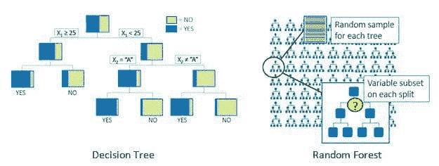
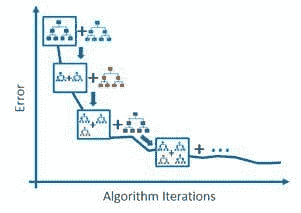
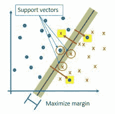
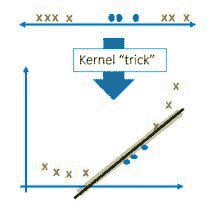
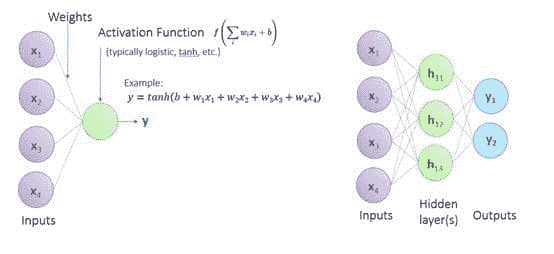

# 理解机器学习算法

> 原文：[`www.kdnuggets.com/2017/10/understanding-machine-learning-algorithms.html`](https://www.kdnuggets.com/2017/10/understanding-machine_learning_algorithms.html)

**作者：布雷特·伍杰克，SAS。**

机器学习现在已成为主流。鉴于公司从大量可用数据中获得价值的成功，每个人都想参与其中。虽然机器学习的想法可能令人感到压倒，但这并非魔法，基本概念相当简单。

在这里，我将为你提供理解一些最流行的机器学习算法背后思想的基础。

### 随机森林

随机森林是由 [Leo Breiman 于 2001 年](https://www.stat.berkeley.edu/~breiman/randomforest2001.pdf) 提出的，这是一种简单而强大的算法，由独立训练的决策树集合（或集合）组成。

在决策树中，整个观察数据集沿着不同的分支递归地划分为子集，以便相似的观察结果在终端叶子处聚集在一起。最优增加树“纯度”的变量在每个分割点指导分割，分组具有相似目标值的观察结果。对于任何新的观察，你可以沿着树中的分割规则路径来预测目标。

但决策树是不稳定的。训练数据的微小变化可能导致完全不同的树。训练一组树并“集成”它们以创建一个“随机森林”模型可以实现更稳健的预测。

在随机森林中：

+   用于训练每棵树的数据集是完整数据集的随机样本（带替代），这一过程称为“袋装”（bootstrap aggregating）。

+   考虑用于分割每个节点的输入变量是所有变量的*随机子集*，这减少了对最具影响力因素的偏倚，并允许次要因素在模型中发挥作用。

+   通过让树成长到较大的深度和较小的叶子大小来过拟合。对大量过拟合树的预测概率进行平均比使用单棵调整过的决策树更稳健。

集成，或在许多树上对新观察进行评分，使你能够通过更稳健和具有普遍性模型的共识来获得预测目标值（分类投票，区间目标预测的平均）。

由于随机森林的高效性，研究人员发展了诸如 [“相似性森林”](http://www.kdd.org/kdd2017/papers/view/similarity-forests) 和 [“深度嵌入森林”](https://dl.acm.org/citation.cfm?id=3098059) 的变体。

### 梯度提升机器

一种梯度提升机器，如 [XGBoost](http://www.kdd.org/kdd2016/papers/files/rfp0697-chenAemb.pdf)，是另一种源于决策树的机器学习算法。

在 90 年代末，Breiman 观察到，一个表现出一定错误水平的模型可以作为基础学习器，通过迭代添加补偿错误的模型来改进——这一过程称为“提升”。每个新增模型都通过在负梯度方向上搜索来最小化错误（因此称为“梯度”提升）。提升是一个顺序过程，因为新模型是基于之前模型的结果添加的。

Jerome Friedman 在 2001 年将梯度提升概念应用于决策树，创建了 [Gradient Boosting Machines](https://statweb.stanford.edu/~jhf/ftp/trebst.pdf)。Freund 和 Shapire (2001) 的流行且有效的 Adaboost，使用指数损失函数，是这种方法的一种变体。

最近几年，Tiangi Chen 研究了梯度提升机算法的各个方面及修订，以进一步增强在 XGBoost 实现中的性能，XGBoost 代表“极端梯度提升”。他的修改包括在决策树训练中使用分位数分箱，将正则化项添加到目标函数中以改善泛化能力，并支持多种损失函数。最终，XGBoost 的“极端”特性可以归因于 Chen 特意实现它，以利用分布式多线程处理的计算能力，从而提升速度和效率。

### 支持向量机

支持向量机（SVM）是机器学习从业者工具箱中的另一种“机器”，已有几十年的历史。SVM 由 Vladimir Vapnik 和 Alexey Chervonenkis 于 1963 年发明，是一种二分类模型，通过构造超平面将观察值分为两个类别。

下图是一个简单的示例，观察值的目标值用点和叉表示，可以如图所示进行分割。由于无限多个方向的这条线（在多维空间中的超平面）可以分隔这些点，我们在这条线上定义一个缓冲区，并制定一个优化问题以最大化这个边际。我们能够分离这两个类别的越多，我们的模型在对新数据评分时就会越准确。定义边际的点被称为“支持向量”。

实际上，大多数多维实际数据集并不是完全可分的。很少会有所有来自一个类别的观察值都在一侧，而来自另一个类别的观察值都在另一侧。SVM 通过引入对落在边际错误一侧的观察值的惩罚（用红色箭头表示），来构造最佳的分隔超平面。

图. SVM 中分隔类别的超平面

注意到边距大小在正确分类训练数据和对未来数据进行泛化之间存在权衡。较大的边距意味着更多的训练点被误分类，但泛化效果更好——始终记住目标是将模型应用于未来数据，而不是在现有数据上获得最佳拟合。

另一个将数据分为两类的障碍是数据很少能*线性*分隔，必须以某种方式考虑更高的维度。下图描述了一个一维问题，其中一个类别包含在一个区间内，另一个类别则分布在左侧和右侧。直线无法有效地分隔这些点，因此 SVM 使用核函数将数据映射到更高维空间。

惩罚项和“核技巧”使 SVM 成为一个强大的分类器。这项技术也用于一种称为支持向量数据描述的算法，用于异常检测。

图：应用核函数以便于分隔

### 神经网络

神经网络在 1950 年代发展起来，是机器学习特别是“深度学习”的典型代表。它们是复杂应用程序的基础，如语音转文本、图像分类和对象检测。如果你直接跳到用于深度学习的更复杂形式，可能会感到不知所措；但神经网络的基本功能并不难以理解。

神经网络只是将数学变换应用于输入数据的一个集合，数据在一个由互联节点（称为神经元）组织的网络中传递。每个输入由一个输入节点表示。这些节点连接到下一层的节点，每个连接上分配一个权重，粗略表示该输入的一般重要性。当值从一个节点传递到另一个节点时，它们会被乘以连接的权重，并应用激活函数。每个节点的结果值随后会传递到网络中的下一层节点。最终，输出节点中的激活函数分配一个值来提供预测。

训练神经网络的核心是找到权重的正确值。数据首次通过网络时，初始权重设置产生的输出值与训练数据中的已知输出值不匹配。反向传播过程使用梯度信息（量化权重值变化如何影响每个节点的输出）来调整权重，并在网络中反复循环，直到权重收敛到具有可接受误差的值，即预测值与实际值之间的误差。

由于隐藏层数量、每层神经元数量和所用激活函数的超灵活组合，神经网络可以为高度非线性系统提供极其准确的预测。我最喜欢用来说明神经网络的工具之一是这个由谷歌研究人员开发的[有趣的互动示例](https://playground.tensorflow.org/)。 快去看看吧…你不会失望的。

有了这个简单的神经网络解释作为基础，你现在可以深入研究更高级的变体，如卷积神经网络、递归神经网络和去噪自编码器。

### 魔法已逝

这就是四种最受欢迎的机器学习算法背后的理念。虽然这些算法构建了高度预测的模型，但它们并不是魔法。对基础概念的掌握将帮助你理解这些算法——以及以新颖方式扩展它们的算法。

**简介： [布雷特·伍杰克](https://www.linkedin.com/in/brettwujek/)** 是 SAS 高级分析部门的高级数据科学家。他帮助推广和指导 SAS 高级分析的发展方向，特别是在机器学习和数据挖掘领域。在加入 SAS 之前，布雷特在达索系统公司领导了过程集成和设计探索技术的开发，帮助设计和实施了行业领先的计算机辅助优化软件。他的正式背景是设计优化方法论，他在圣母大学获得了博士学位，研究了用于多学科设计优化的高效算法。

**相关：**

+   **二十年老算法的突破重新定义了大数据基准**

+   **数据科学基础：初学者的基本概念**

+   **必须了解：集成学习的理念是什么？**`

* * *

## 我们的前三大课程推荐

 1\. [谷歌网络安全证书](https://www.kdnuggets.com/google-cybersecurity) - 快速进入网络安全职业。

 2\. [谷歌数据分析专业证书](https://www.kdnuggets.com/google-data-analytics) - 提升你的数据分析技能

 3\. [谷歌 IT 支持专业证书](https://www.kdnuggets.com/google-itsupport) - 支持你的组织 IT 需求

* * *

### 更多相关内容

+   [成为优秀数据科学家所需的 5 项关键技能](https://www.kdnuggets.com/2021/12/5-key-skills-needed-become-great-data-scientist.html)

+   [每位初学者数据科学家都应该掌握的 6 个预测模型](https://www.kdnuggets.com/2021/12/6-predictive-models-every-beginner-data-scientist-master.html)

+   [2021 年最佳 ETL 工具](https://www.kdnuggets.com/2021/12/mozart-best-etl-tools-2021.html)

+   [停止学习数据科学以寻找目的，并寻找目的以…](https://www.kdnuggets.com/2021/12/stop-learning-data-science-find-purpose.html)

+   [学习数据科学统计的顶级资源](https://www.kdnuggets.com/2021/12/springboard-top-resources-learn-data-science-statistics.html)

+   [是什么使得 Python 成为初创公司理想的编程语言](https://www.kdnuggets.com/2021/12/makes-python-ideal-programming-language-startups.html)
