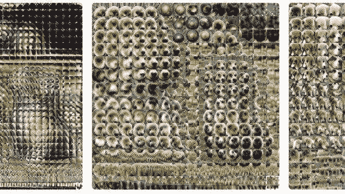
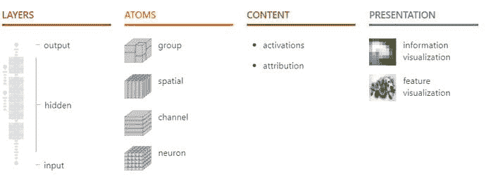

# 理解神经网络的思维方式

> 原文：[`www.kdnuggets.com/2020/07/understanding-neural-networks-think.html`](https://www.kdnuggets.com/2020/07/understanding-neural-networks-think.html)

评论

来源：[`distill.pub/2018/building-blocks/`](https://distill.pub/2018/building-blocks/)

> * * *
> 
> ## 我们的前 3 个课程推荐
> ## 
>  1\. [谷歌网络安全证书](https://www.kdnuggets.com/google-cybersecurity) - 快速进入网络安全职业轨道。
> 
>  2\. [谷歌数据分析专业证书](https://www.kdnuggets.com/google-data-analytics) - 提升你的数据分析技能
> 
>  3\. [谷歌 IT 支持专业证书](https://www.kdnuggets.com/google-itsupport) - 支持你的组织进行 IT 工作
> 
> * * *
> 
> 我最近开始了一份专注于 AI 教育的新通讯。《TheSequence》是一份无废话（即无炒作、无新闻等）的 AI 重点通讯，阅读时间仅需 5 分钟。目标是让你了解机器学习项目、研究论文和概念。请通过下面的订阅尝试一下：

任何深度学习解决方案中的一个挑战性元素是理解深度神经网络做出的知识和决策。尽管神经网络决策的解释一直很困难，但随着深度学习的兴起以及操作多维数据集的大规模神经网络的普及，这一问题变得更加棘手。毫不奇怪，神经网络的解释已成为深度学习生态系统中最活跃的研究领域之一。

尝试想象一个拥有数亿个神经元的大型神经网络，它正在执行诸如图像识别之类的深度学习任务。通常，你希望了解网络如何得出特定的决策。当前大多数研究集中在检测网络中哪些神经元被激活上。知道神经元-12345 激活了五次是相关的，但在整个网络的规模中并不是特别有用。关于理解神经网络决策的研究主要集中在三个领域：特征可视化、归因和降维。Google，特别是在特征可视化领域做了大量工作，发布了一些[杰出的研究和工具](https://distill.pub/2017/feature-visualization/)。一年多前，Google 研究人员发布了一篇题为[“可解释性的构建块”](https://distill.pub/2018/building-blocks/)的论文，成为了机器学习可解释性领域的开创性论文。该论文提出了一些新思路，以理解深度神经网络如何做出决策。

Google 研究的主要见解是不要将不同的可解释性技术孤立看待，而是将它们视为理解神经网络行为的大型模型的可组合构建块。例如，特征可视化是一种非常有效的技术，可以理解单个神经元处理的信息，但不能将该洞察力与神经网络做出的整体决策关联起来。归因是解释不同神经元之间关系的更可靠技术，但在理解单个神经元做出的决策时则不那么有效。通过结合这些构建块，Google 创建了一个不仅仅*解释了神经网络检测了什么*的可解释性模型，还回答了*网络如何将这些单独的部分组装起来*以得出后续决策，以及*为何*做出这些决策。

Google 的新可解释性模型具体是如何工作的？在我看来，主要的创新点在于，它分析了神经网络不同组件在不同层次上的决策：个别神经元、连接的神经元组和完整的层。Google 还使用了一种新颖的研究技术——矩阵分解，以分析任意神经元组对最终决策的影响。

来源: [`distill.pub/2018/building-blocks/`](https://distill.pub/2018/building-blocks/)

将 Google 的可解释性模块视为一个模型，该模型检测神经网络在不同抽象层次上，从基础计算图到最终决策的洞察力，是一种很好的思考方式。

来源: [`distill.pub/2018/building-blocks/`](https://distill.pub/2018/building-blocks/)

谷歌对深度神经网络可解释性的研究不仅仅是一个理论练习。研究小组在发布论文时，还推出了[Lucid](https://github.com/tensorflow/lucid)，这是一个神经网络可视化库，允许开发者创建清晰的特征可视化，以展示神经网络各个部分所做出的决策。谷歌还发布了[colab notebooks](https://github.com/tensorflow/lucid#notebooks)。这些笔记本使得在交互环境中使用 Lucid 创建 Lucid 可视化变得非常容易。

[原文](https://medium.com/ai-in-plain-english/understanding-how-neural-networks-think-ca7d9c1f079)。经授权转载。

**相关：**

+   通过遗忘学习：深度神经网络与詹妮弗·安妮斯顿神经元

+   Uber 的 Ludwig 是一个用于低代码机器学习的开源框架

+   谷歌推出 TAPAS：一种基于 BERT 的神经网络，用于使用自然语言查询表格

### 更多相关话题

+   [在使用神经网络之前尝试的 10 个简单方法](https://www.kdnuggets.com/2021/12/10-simple-things-try-neural-networks.html)

+   [使用 PyTorch 的可解释神经网络](https://www.kdnuggets.com/2022/01/interpretable-neural-networks-pytorch.html)

+   [深度神经网络并未将我们引向通用人工智能（AGI）](https://www.kdnuggets.com/2021/12/deep-neural-networks-not-toward-agi.html)

+   [最先进的深度学习模型的可解释预测与即时预测](https://www.kdnuggets.com/2021/12/sota-explainable-forecasting-and-nowcasting.html)

+   [卷积神经网络（CNN）图像分类](https://www.kdnuggets.com/2022/05/image-classification-convolutional-neural-networks-cnns.html)

+   [关于值得信赖的图神经网络的综合调查：…](https://www.kdnuggets.com/2022/05/comprehensive-survey-trustworthy-graph-neural-networks-privacy-robustness-fairness-explainability.html)
