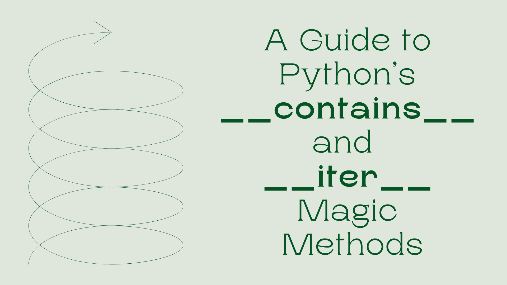

# 理解 Python 的迭代和成员资格：__contains__ 和 __iter__ 魔法方法指南

> 原文：[`www.kdnuggets.com/understanding-pythons-iteration-and-membership-a-guide-to-__contains__-and-__iter__-magic-methods`](https://www.kdnuggets.com/understanding-pythons-iteration-and-membership-a-guide-to-__contains__-and-__iter__-magic-methods)



作者提供的图像

如果你是 Python 新手，你可能遇到过 **"iteration"** 和 **"membership"** 这些术语，可能会想知道它们的意思。这些概念对于理解 Python 如何处理数据集合（如列表、元组和字典）是基础的。Python 使用特殊的 dunder 方法来实现这些功能。

* * *

## 我们的前 3 个课程推荐

 1\. [Google 网络安全证书](https://www.kdnuggets.com/google-cybersecurity) - 快速进入网络安全职业道路。

 2\. [Google 数据分析专业证书](https://www.kdnuggets.com/google-data-analytics) - 提升你的数据分析技能

 3\. [Google IT 支持专业证书](https://www.kdnuggets.com/google-itsupport) - 支持你的组织 IT

* * *

那么，什么是 dunder 方法呢？Dunder/魔法方法是 Python 中以双下划线开始和结束的特殊方法，因此得名“dunder”。它们用于实现各种协议，并可以执行广泛的任务，如检查成员资格、迭代元素等。在本文中，我们将重点关注两个最重要的 dunder 方法：**__contains__** 和 **__iter__**。那么，开始吧。

## 使用 Iter 方法理解 Pythonic 循环

考虑使用 Python 类实现的文件目录的基本示例：

```py
class File:
	def __init__(self, file_path: str) -> None:
    	    self.file_path = file_path

class Directory:
	def __init__(self, files: List[File]) -> None:
    	    self._files = files 
```

一个简单的代码示例，其中目录有一个包含 File 对象列表的实例参数。如果我们想遍历目录对象，我们应该能够使用如下的 for 循环：

```py
directory = Directory(
	files=[File(f"file_{i}") for i in range(10)]
)
for _file in directory:
	print(_file) 
```

我们用十个随机命名的文件初始化一个目录对象，并使用 for 循环遍历每个项目。很简单，但哎呀！你会收到一个错误信息：**TypeError: 'Directory' object is not iterable**。

问题出在哪里了？我们的 Directory 类没有设置为可遍历。在 Python 中，要使类对象变为可迭代对象，它必须实现 **__iter__** dunder 方法。Python 中的所有可迭代对象，如列表、字典和集合，都实现了这一功能，因此我们可以在循环中使用它们。

因此，为了使我们的目录对象可迭代，我们需要创建一个迭代器。可以将迭代器看作是一个助手，当我们要求它时，它会一个一个地给我们项。例如，当我们遍历一个列表时，迭代器对象会在每次迭代时提供下一个元素，直到我们到达循环的末尾。这就是迭代器在 Python 中的定义和实现方式。

在 Python 中，迭代器必须知道如何提供序列中的下一个项。它通过一个名为**__next__**的方法来实现。当没有更多项可提供时，它会引发一个名为**StopIteration**的特殊信号，表示“嘿，我们完成了。”在无限迭代的情况下，我们不会引发**StopIteration**异常。

让我们为目录创建一个迭代器类。它将接受文件列表作为参数，并实现 `next` 方法来给我们序列中的下一个文件。它使用索引跟踪当前位置。实现如下：

```py
class FileIterator:
    def __init__(self, files: List[File]) -> None:
        self.files = files
        self._index = 0

    def __next__(self):
        if self._index >= len(self.files):
        	raise StopIteration
        value = self.files[self._index]
        self._index += 1
        return value
```

我们初始化一个索引值为 0，并接受文件作为初始化参数。**__next__** 方法检查索引是否溢出。如果是，它会引发**StopIteration**异常以表示迭代结束。否则，它返回当前索引的文件，并通过递增索引移动到下一个文件。这个过程会持续直到所有文件都被迭代过。

不过，我们还没有完成！我们仍然没有实现 `iter` 方法。`iter` 方法必须返回一个迭代器对象。现在我们已经实现了 `FileIterator` 类，我们可以最终转向 `iter` 方法。

```py
class Directory:
    def __init__(self, files: List[File]) -> None:
        self._files = files

    def __iter__(self):
        return FileIterator(self._files)
```

`iter` 方法只是用其文件列表初始化了一个 `FileIterator` 对象，并返回该迭代器对象。就这么简单！通过这个实现，我们现在可以使用 Python 的循环遍历我们的目录结构。让我们看看实际效果：

```py
 directory = Directory(
	files=[File(f"file_{i}") for i in range(10)]
)
for _file in directory:
	print(_file, end=", ")

# Output: file_0, file_1, file_2, file_3, file_4, file_5, file_6, file_7, file_8, file_9,
```

`for` 循环内部调用**__iter__**方法来显示结果。虽然这样做有效，但你可能仍然对 Python 中迭代器的底层工作机制感到困惑。为了更好地理解它，我们可以使用 `while` 循环手动实现相同的机制。

```py
directory = Directory(
	files=[File(f"file_{i}") for i in range(10)]
)

iterator = iter(directory)
while True:
    try:
        # Get the next item if available. Will raise StopIteration error if no item is left.
        item = next(iterator)   
        print(item, end=', ')
    except StopIteration as e:
        break   # Catch error and exit the while loop

# Output: file_0, file_1, file_2, file_3, file_4, file_5, file_6, file_7, file_8, file_9,
```

我们对目录对象调用 `iter` 函数以获取 `FileIterator`。然后，我们手动使用 `next` 操作符来调用 `FileIterator` 对象上的下一个 dunder 方法。我们处理 **StopIteration** 异常，以便在所有项耗尽后优雅地终止 `while` 循环。正如预期的那样，我们得到了与之前相同的输出！

## 使用包含方法测试成员资格

在一个对象集合中检查某项是否存在是一个相当常见的用例。例如，在我们上面的例子中，我们经常需要检查一个文件是否存在于目录中。因此，Python 通过使用 "in" 操作符在语法上简化了这一过程。

```py
print(0 in [1,2,3,4,5]) # False
print(1 in [1,2,3,4,5]) # True
```

这些通常与条件表达式和评估一起使用。但是如果我们用我们的目录示例尝试这样做会发生什么？

```py
print("file_1" in directory)  # False
print("file_12" in directory) # False
```

两者都给出 False，这是不正确的！为什么？要检查成员资格，我们需要实现 **__contains__** dunder 方法。当它没有实现时，Python 会回退到使用 **__iter__** 方法，并使用 == 运算符评估每个项目。在我们的例子中，它将迭代每个项目，并检查 **“file_1”** 字符串是否与列表中的任何 File 对象匹配。由于我们比较的是字符串与自定义的 File 对象，因此没有对象匹配，结果是 False 评估。

为了解决这个问题，我们需要在我们的 Directory 类中实现 **__contains__** dunder 方法。

```py
class Directory:
    def __init__(self, files: List[File]) -> None:
        self._files = files

    def __iter__(self):
        return FileIterator(self._files)

    def __contains__(self, item):
        for _file in self._files:
        	# Check if file_path matches the item being checked
        	if item == _file.file_path:
            	return True
    	return False
```

在这里，我们将功能更改为迭代每个对象，并将 File 对象中的 file_path 与传递给函数的字符串进行匹配。现在，如果我们运行相同的代码来检查存在性，我们会得到正确的输出！

```py
directory = Directory(
	files=[File(f"file_{i}") for i in range(10)]
)

print("file_1" in directory)	# True
print("file_12" in directory) # False 
```

## 总结

就这样！通过我们的简单目录结构示例，我们构建了一个简单的迭代器和成员检查器，以理解 Pythonic 循环的内部工作原理。我们在生产级代码中相当常见这种设计决策和实现，通过这个现实世界的例子，我们探讨了 **__iter__** 和 **__contains__** 方法背后的基本概念。继续练习这些技巧，以增强理解并成为更熟练的 Python 程序员！

**[](https://www.linkedin.com/in/kanwal-mehreen1/)**[Kanwal Mehreen](https://www.linkedin.com/in/kanwal-mehreen1/)**** Kanwal 是一位机器学习工程师和技术作家，对数据科学以及 AI 与医学的交叉领域充满热情。她共同撰写了电子书《用 ChatGPT 最大化生产力》。作为 2022 年 APAC 区域的 Google Generation Scholar，她倡导多样性和学术卓越。她还被认可为 Teradata 多样性技术奖学者、Mitacs Globalink 研究学者和哈佛 WeCode 学者。Kanwal 是变革的热情倡导者，她创办了 FEMCodes，以赋能 STEM 领域的女性。

### 更多相关主题

+   [每个程序员都应该知道的 11 个 Python 魔法方法](https://www.kdnuggets.com/11-python-magic-methods-every-programmer-should-know)

+   [Jupyter Notebook 魔法方法速查表](https://www.kdnuggets.com/jupyter-notebook-magic-methods-cheat-sheet)

+   [介绍 **__getitem__**：Python 中的魔法方法](https://www.kdnuggets.com/2023/03/introduction-getitem-magic-method-python.html)

+   [Python f-Strings 魔法：每个编码者需要了解的 5 个颠覆性技巧](https://www.kdnuggets.com/python-fstrings-magic-5-gamechanging-tricks-every-coder-needs-to-know)

+   [深入池塘：揭示 CNN 池化层的魔力](https://www.kdnuggets.com/diving-into-the-pool-unraveling-the-magic-of-cnn-pooling-layers)

+   [揭示神经魔法：深入激活函数](https://www.kdnuggets.com/unveiling-neural-magic-a-dive-into-activation-functions)
