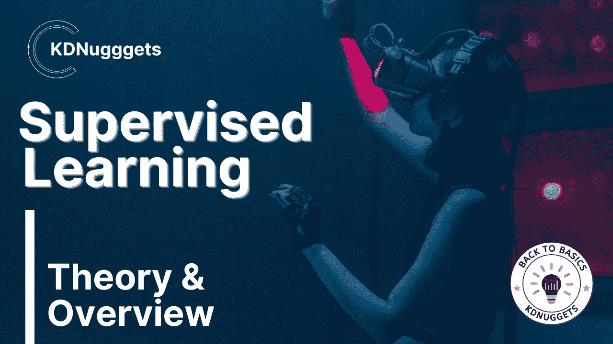
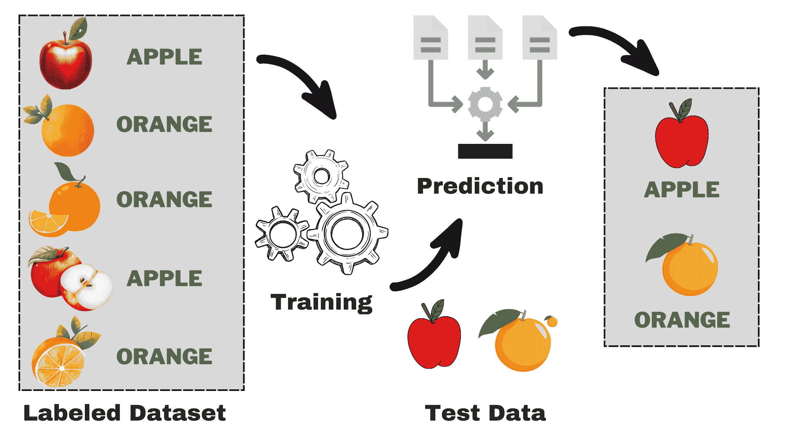
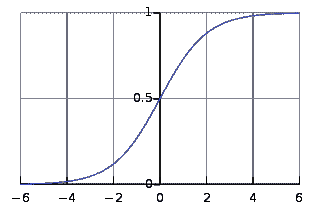
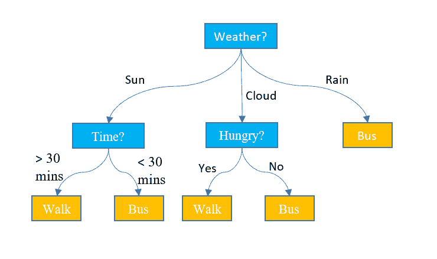
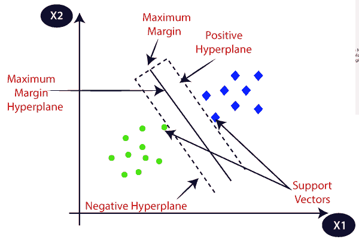
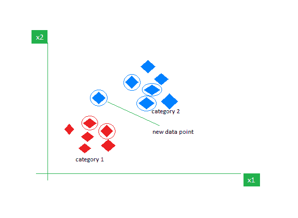

# 理解监督学习：理论与概述

> 原文：[`www.kdnuggets.com/understanding-supervised-learning-theory-and-overview`](https://www.kdnuggets.com/understanding-supervised-learning-theory-and-overview)

图片来源：作者

监督学习是机器学习的一个子类别，其中计算机从包含输入和正确输出的标记数据集中学习。它试图找出将输入（x）与输出（y）相关联的映射函数。你可以把它想象成教你的弟弟或妹妹如何识别不同的动物。你会给他们看一些图片（x），并告诉他们每种动物的名称（y）。经过一段时间，他们将学习到这些差异，并能够正确识别新的图片。这就是监督学习的基本直觉。在继续之前，让我们深入了解一下它的工作原理。

* * *

## 我们的 top 3 课程推荐

 1\. [谷歌网络安全证书](https://www.kdnuggets.com/google-cybersecurity) - 快速进入网络安全职业生涯。

 2\. [谷歌数据分析专业证书](https://www.kdnuggets.com/google-data-analytics) - 提升你的数据分析技能

 3\. [谷歌 IT 支持专业证书](https://www.kdnuggets.com/google-itsupport) - 支持您的组织在 IT 方面

* * *

监督学习是如何工作的？

图片来源：作者

假设你想建立一个模型，根据一些特征区分苹果和橙子。我们可以将这个过程分解为以下任务：

+   **数据收集：** 收集一个包含苹果和橙子的图片的数据集，并将每张图片标记为“苹果”或“橙子”。

+   **模型选择**：我们必须选择合适的分类器，通常被称为适合您任务的监督机器学习算法。这就像选择合适的眼镜来帮助你看得更清楚。

+   **训练模型：** 现在，你将带标签的苹果和橙子的图片输入算法。算法查看这些图片，学习识别它们之间的差异，如颜色、形状和大小。

+   **评估与测试：** 为了检查你的模型是否工作正常，我们将输入一些未见过的图片，并将预测结果与实际结果进行比较。

# 监督学习的类型

监督学习可以分为两种主要类型：

## 分类

在分类任务中，主要目标是将数据点分配到从离散类别集合中的特定类别。当只有两个可能的结果，例如“是”或“否”、“垃圾邮件”或“非垃圾邮件”、“接受”或“拒绝”时，这被称为二分类。然而，当涉及到多个类别或类时，例如根据成绩对学生进行评分（例如，A、B、C、D、F），它就成为多分类问题的一个例子。

## 回归

对于回归问题，你试图预测一个连续的数值。例如，你可能希望根据你在课堂上的过去表现预测你的期末考试成绩。预测的成绩可以在特定范围内的任何值，通常在我们的例子中是从 0 到 100。

# 流行监督学习算法概述

现在，我们对整体过程有了基本了解。我们将探索流行的监督学习算法，它们的使用以及它们是如何工作的：

## 1\. 线性回归

正如其名字所示，它用于回归任务，如预测股票价格、预测温度、估计疾病进展的可能性等。我们尝试使用一组标签（自变量）来预测目标（因变量）。它假设输入特征与标签之间存在线性关系。核心思想是通过最小化实际值与预测值之间的误差来预测数据点的最佳拟合直线。该直线由以下方程表示：

其中，

+   **Y**   预测输出。

+   **X** = 多元线性回归中的输入特征或特征矩阵

+   **b0** = 截距（直线与 Y 轴交点）。

+   **b1** = 确定直线陡峭度的斜率或系数。

它估计了直线的斜率（权重）和截距（偏差）。这条直线可以进一步用于进行预测。尽管它是开发基准的最简单且有用的模型，但它对可能影响直线位置的离群值非常敏感。

Gif 在 [Primo.ai](https://cdn-images-1.medium.com/max/640/1*eeIvlwkMNG1wSmj3FR6M2g.gif)

## 2\. 逻辑回归

尽管它的名字中包含回归，但本质上用于二分类问题。它预测一个正向结果的概率（因变量），该概率范围在 0 到 1 之间。通过设置阈值（通常为 0.5），我们对数据点进行分类：那些概率大于阈值的数据点属于正类，反之亦然。逻辑回归使用应用于输入特征的线性组合的 Sigmoid 函数来计算这个概率，具体如下：

=\frac{1}{1+e^{-(b_0+b_1X_1+b_2X_2+\ldots+b_nX_n)}}")

其中，

+   P(Y=1) = 数据点属于正类的概率

+   X1 ,... ,Xn = 输入特征

+   b0,....,bn = 算法在训练过程中学习的输入权重

这个 Sigmoid 函数呈 S 形曲线，将任何数据点转换为 0-1 范围内的概率分数。你可以查看下面的图表以获得更好的理解。

图片来自于[维基百科](https://upload.wikimedia.org/wikipedia/commons/thumb/8/88/Logistic-curve.svg/320px-Logistic-curve.svg.png)

值越接近 1，表示模型对其预测的信心越高。与线性回归一样，它以其简单性而闻名，但我们不能在不对原算法进行修改的情况下执行多类别分类。

## 3\. 决策树

与上述两种算法不同，决策树可以用于分类和回归任务。它具有层次结构，类似于流程图。在每个节点，根据某些特征值做出路径决策。该过程继续，直到我们到达表示最终决策的最后一个节点。以下是一些你必须了解的基本术语：

+   **根节点：** 包含整个数据集的顶部节点称为根节点。然后，我们使用某些算法选择最佳特征，将数据集分成两个或更多子树。

+   **内部节点：** 每个内部节点表示一个特定的特征和一个决策规则，以决定数据点的下一步方向。

+   **叶节点：** 代表类别标签的结束节点称为叶节点。

它预测回归任务中的连续数值。随着数据集的大小增加，它会捕捉到噪声，从而导致过拟合。这可以通过修剪决策树来处理。我们去除那些不会显著提高决策准确性的分支。这有助于保持树的关注点在最重要的因素上，防止它在细节中迷失。

图片来自于[Jake Hoare](https://cdn-dfnaj.nitrocdn.com/xxeFXDnBIOflfPsgwjDLywIQwPChAOzV/assets/images/optimized/rev-4a6533c/www.displayr.com/wp-content/uploads/2018/07/what-is-a-decision-tree.png) 在 Displayr 上

## 4\. 随机森林

随机森林也可以用于分类和回归任务。它是多个决策树共同工作以做出最终预测的集合。你可以把它看作是专家委员会做出的集体决策。它的工作原理如下：

+   **数据采样：** 不是一次性处理整个数据集，而是通过称为自助法或袋装法的过程获取随机样本。

+   **特征选择：** 在随机森林中的每个决策树中，仅考虑随机特征子集进行决策，而不是完整的特征集。

+   **投票：** 对于分类问题，随机森林中的每个决策树都会投票，选票最多的类别被选择。对于回归问题，我们对所有树得到的值进行平均。

尽管它减少了个别决策树引起的过拟合效应，但计算成本较高。文献中常出现的一句话是，随机森林是一种集成学习方法，意味着它结合了多个模型以提高整体性能。

## 5\. 支持向量机 (SVM)

它主要用于分类问题，但也可以处理回归任务。它尝试通过统计方法找到最佳的超平面，以分隔不同的类别，这与逻辑回归的概率方法不同。我们可以使用线性 SVM 来处理线性可分的数据。然而，大多数实际数据是非线性的，我们使用核技巧来分隔类别。让我们深入探讨它的工作原理：

+   **超平面选择：** 在二分类中，SVM 寻找最佳的超平面（2D 线）来分隔类别，同时最大化边际。边际是超平面与离超平面最近的数据点之间的距离。

+   **核技巧：** 对于线性不可分的数据，我们采用核技巧，将原始数据空间映射到高维空间，在那里可以线性分隔。常见的核包括线性核、多项式核、径向基函数（RBF）核和 sigmoid 核。

+   **边际最大化：** SVM 还通过增加最大化边际来提高模型的泛化能力。

+   **分类：** 一旦模型训练完成，可以根据数据相对于超平面的位置进行预测。

SVM 还有一个参数叫做 C，用于控制最大化边际和保持分类误差最小之间的权衡。尽管它们可以很好地处理高维和非线性数据，但选择正确的核和超参数并不像看起来那么简单。

图片来自 [Javatpoint](https://static.javatpoint.com/tutorial/machine-learning/images/support-vector-machine-algorithm.png)

## 6\. k-最近邻 (k-NN)

K-NN 是最简单的监督学习算法，主要用于分类任务。它对数据没有任何假设，并根据与现有数据点的相似性为新数据点分配一个类别。在训练阶段，它将整个数据集作为参考点。然后，它使用距离度量（例如欧几里得距离）计算新数据点与所有现有点之间的距离。根据这些距离，它识别出与这些数据点最接近的 K 个邻居。我们统计 K 个邻居中每个类别的出现次数，并将出现频率最高的类别作为最终预测。

图片来源于 [GeeksforGeeks](https://media.geeksforgeeks.org/wp-content/uploads/20200616145419/Untitled2781.png)

选择合适的 K 值需要实验。虽然它对噪声数据具有鲁棒性，但不适用于高维数据集，并且由于需要计算所有数据点之间的距离，成本较高。

# 总结

在总结这篇文章时，我鼓励读者探索更多的算法，并尝试从零开始实现它们。这将增强你对底层工作原理的理解。以下是一些额外资源，帮助你入门：

+   [掌握机器学习算法 - 第二版](https://www.oreilly.com/library/view/mastering-machine-learning/9781838820299/)

+   机器学习课程 - [Javatpoint](https://www.javatpoint.com/machine-learning)

+   机器学习专业化 - [Coursera](https://www.coursera.org/specializations/machine-learning-introduction)

**[Kanwal Mehreen](https://www.linkedin.com/in/kanwal-mehreen1)** 是一位有志的软件开发人员，对数据科学和 AI 在医学中的应用充满兴趣。Kanwal 被选为 2022 年 APAC 地区的 Google Generation Scholar。Kanwal 喜欢通过撰写关于热门话题的文章分享技术知识，并且热衷于提升女性在技术行业中的代表性。

### 更多相关话题

+   [机器学习评估指标：理论与概述](https://www.kdnuggets.com/machine-learning-evaluation-metrics-theory-and-overview)

+   [数据科学中的统计学：理论与概述](https://www.kdnuggets.com/statistics-in-data-science-theory-and-overview)

+   [机器学习中使用的主要监督学习算法](https://www.kdnuggets.com/2022/06/primary-supervised-learning-algorithms-used-machine-learning.html)

+   [KDnuggets 新闻，6 月 22 日：主要监督学习算法…](https://www.kdnuggets.com/2022/n25.html)

+   [理解机器学习算法：深入概述](https://www.kdnuggets.com/understanding-machine-learning-algorithms-an-indepth-overview)

+   [动手实践监督学习：线性回归](https://www.kdnuggets.com/handson-with-supervised-learning-linear-regression)
