# 以数据科学的方式理解变换器

> 原文：[`www.kdnuggets.com/2020/10/understanding-transformers-data-science-way.html`](https://www.kdnuggets.com/2020/10/understanding-transformers-data-science-way.html)

评论

变换器现在已经成为任何 NLP 任务的事实标准。不仅如此，它们现在还被用于计算机视觉和音乐生成。我相信大家都听说过 GPT3 变换器及其应用。***但除了这些，它们仍然像以前一样难以理解。***

我花了多次阅读谷歌研究的[论文](https://arxiv.org/pdf/1706.03762.pdf)，它首次介绍了变换器，并阅读了大量博客文章，才真正理解了变换器是如何工作的。

* * *

## 我们的前三个课程推荐

 1\. [谷歌网络安全证书](https://www.kdnuggets.com/google-cybersecurity) - 快速进入网络安全职业。

 2\. [谷歌数据分析专业证书](https://www.kdnuggets.com/google-data-analytics) - 提升你的数据分析能力。

 3\. [谷歌 IT 支持专业证书](https://www.kdnuggets.com/google-itsupport) - 支持你的组织的 IT。

* * *

所以，我想尽可能用简单的语言把整个概念阐述出来，加上一些非常基础的数学和一些双关语，因为我是一个在学习过程中享受乐趣的倡导者。我会尽量将术语和技术性降到最低，但这是一个复杂的话题，我只能做到这么多。我的目标是让读者在阅读完这篇文章后，甚至理解变换器中最复杂的细节。

***此外，这篇文章也是我写作时间最长、篇幅最长的文章。因此，我建议你拿一杯咖啡。*☕️**

那么，接下来——这篇文章将会是非常对话式的，主题是“***解码变换器***”。

***问：那么，为什么我应该理解变换器？***

过去，LSTM 和 GRU 架构（在我之前的[文章](https://towardsdatascience.com/nlp-learning-series-part-3-attention-cnn-and-what-not-for-text-classification-4313930ed566)中解释过）以及注意力机制曾是语言建模问题（简单来说，就是预测下一个词）和翻译系统的最先进方法。但是，这些架构的主要问题是它们是递归性质的，随着序列长度的增加，运行时间也会增加。也就是说，这些架构以***顺序***的方式处理句子中的每个词，因此随着句子长度的增加，整体运行时间也会增加。

变压器，一种在论文《Attention is all you need》中首次解释的模型架构，放弃了递归，而完全依赖注意力机制来捕捉输入和输出之间的全局依赖关系。这使得它非常快速。

[来源](https://arxiv.org/pdf/1706.03762.pdf)

这是论文中展示的完整变压器的图片。它确实很让人畏惧。因此，我将在这篇文章中通过逐一解析每个部分来揭开它的神秘面纱。所以请继续阅读。

### 大致情况

***问：这听起来很有趣。那么，变压器到底做了什么？***

本质上，变压器几乎可以执行任何 NLP 任务。它可以用于语言建模、翻译或分类，并通过去除问题的序列性质快速完成任务。因此，在机器翻译应用中，变压器将一种语言转换为另一种语言，或者在分类问题中将使用适当的输出层提供类别概率。

一切将取决于网络的最终输出层，但变压器的基本结构在任何任务中都将保持相当一致。对于这篇文章，我将继续使用机器翻译的例子。

从非常高的角度来看，这就是变压器在翻译任务中的样子。它以英文句子为输入，并返回德文句子。

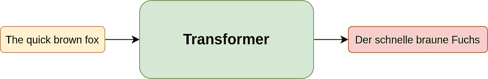

变压器用于翻译 (*作者图片*)

### 构建模块

***问：这太基础了。*????* 能详细讲解一下吗？***

好吧，请记住最后你要求的。让我们深入了解一下变压器的组成。

所以，变压器本质上由一系列编码器层和解码器层组成。编码器层的作用是利用注意力机制将英文句子编码成数值形式，而解码器则旨在使用编码器层编码的信息来给出特定英文句子的德文翻译。

在下图中，变压器以英文句子为输入，通过 6 个编码器层进行编码。最终编码器层的输出然后传递到每个解码器层，以将英文翻译成德文。

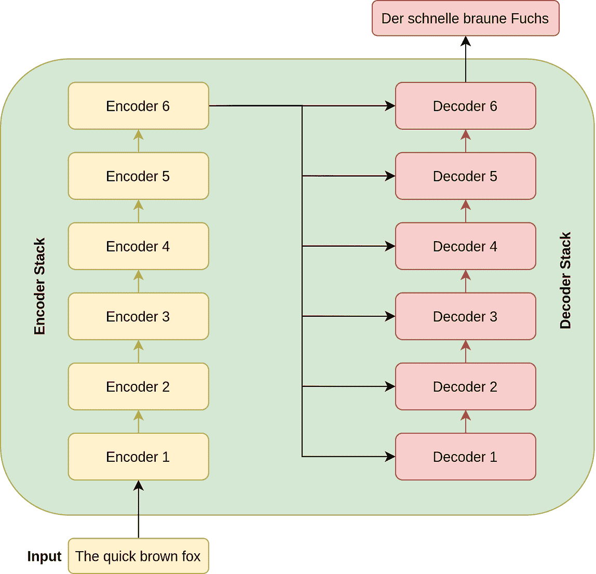

变压器中的数据流 (*作者图片*)

### 1\. 编码器架构

***问：这很好，但编码器堆栈是如何精确地编码英文句子的？***

请耐心等待，我正在进行中。正如我所说，编码器堆栈包含六个编码器层（如论文中所述，但未来版本的变压器将使用更多层）。每个堆栈中的编码器本质上有两个主要层：

+   **一个多头自注意力层，以及**

+   **一个位置级的全连接前馈网络**

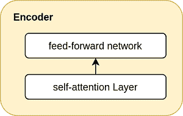

非常基础的编码器层 (*作者图片*)

这些概念可能有点复杂。对吧？不要着急，我将在接下来的部分中解释它们。现在只需记住，编码器层包含注意力机制和逐位置的前馈网络。

***问：那么，这一层期望它的输入是什么样的呢？***

这一层期望其输入的形状为`SxD`（如下面的图所示），其中`S`是源句子（英文句子）的长度，`D`是嵌入的维度，其权重可以与网络一起训练。在这篇文章中，我们将默认使用`D`为 512。`S`则是一个批次中句子的最大长度，因此它会随着批次的不同而变化。

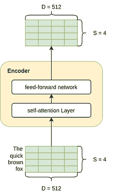

编码器——输入和输出的形状相同 (*作者提供的图像*)

那么这一层的输出如何呢？请记住，编码器层是堆叠在一起的。因此，我们希望输出的维度与输入相同，以便输出可以顺利传递到下一个编码器。所以输出的形状也是`SxD`。

***问：关于尺寸的讨论够了，我了解了输入和输出的情况，但实际上在编码器层发生了什么？***

好的，让我们逐一了解注意力层和前馈层：

### A) 自注意力层

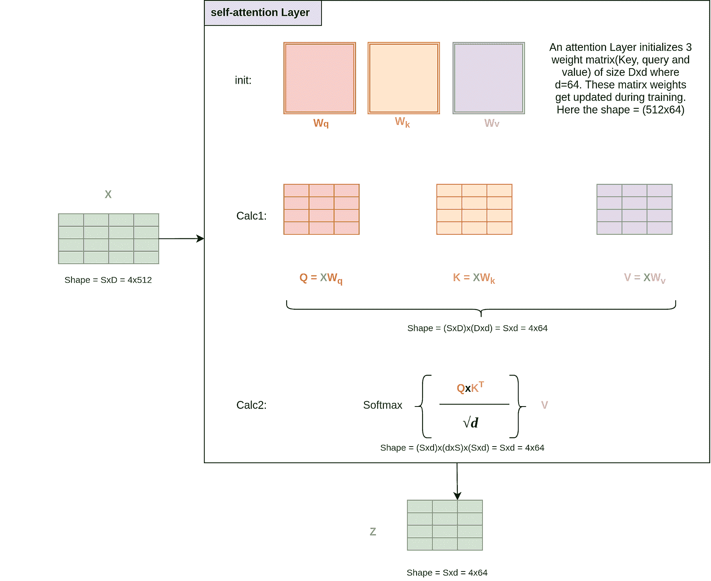

自注意力机制的工作原理 (*作者提供的图像*)

上面的图看起来可能很吓人，但其实很容易理解。所以，请继续跟随我。

深度学习本质上就是大量的矩阵计算，而我们在这一层所做的就是智能地进行大量的矩阵计算。自注意力层初始化时使用了 3 个权重矩阵——Query（W_q）、Key（W_k）和 Value（W_v）。这些矩阵的大小为（`Dxd`），其中 d 在论文中取为 64。训练模型时，这些矩阵的权重将被训练。

在第一次计算（图中的计算 1）中，我们通过将输入与各自的查询、键和值矩阵相乘来创建 Q、K 和 V 矩阵。

到目前为止，可能还很简单，没什么意义，但在第二次计算时，事情变得有趣了。我们来尝试理解 softmax 函数的输出。我们首先将 Q 和 Kᵀ矩阵相乘，得到一个`SxS`的矩阵，然后除以标量√d。接着我们进行 softmax，使得每一行的和为 1。

直观地，我们可以将结果的`SxS`矩阵看作每个词对其他词的贡献。例如，它可能看起来像这样：

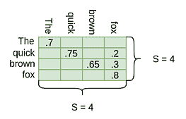

Softmax(QxKt/sqrt(d)) (*作者提供的图像*)

正如你所见，对角线条目的值很大。这是因为词语对自身的贡献很高。这是合理的。但我们可以在这里看到，“quick”这个词分解成了“quick”和“fox”，“brown”这个词也分解成了“brown”和“fox”。这直观地帮助我们说两个词——“quick”和“brown”都指向“fox”。

一旦我们得到这个 SxS 矩阵及其贡献，我们将此矩阵与句子的值矩阵(Sxd)相乘，得到一个形状为 Sxd(4x64)的矩阵。所以，这个操作实际上是用比如 0.75 x（quick embedding）和 0.2x（fox embedding）来替代“quick”这个词的嵌入向量，因此现在“quick”这个词的结果输出中嵌入了注意力。

请注意，这一层的输出具有维度（Sxd），在完成整个编码器之前，我们需要将其更改为 D=512，因为我们需要将这个编码器的输出作为另一个编码器的输入。

***Q: 但是，你称这个层为多头自注意力层。什么是多头？***

好吧，我的错，但为了辩解，我刚刚开始讲到这一点。

它被称为多头，因为我们并行使用了许多这样的自注意力层。也就是说，我们有许多自注意力层堆叠在一起。论文中将注意力层的数量 h 保持为 8。因此，输入 X 经过多个自注意力层并行处理，每个层输出一个形状为(Sxd) = 4x64 的 z 矩阵。我们将这 8(h)个矩阵连接起来，再应用一个最终的输出线性层 Wo，大小为 DxD。

我们得到什么尺寸？对于连接操作，我们得到 SxD（4x（64x8）= 4x512）。将这个输出乘以 Wo，我们得到形状为 SxD（4x512）的最终输出 Z，如预期的。

同时，请注意 h、d 和 D 之间的关系，即 h x d = D。

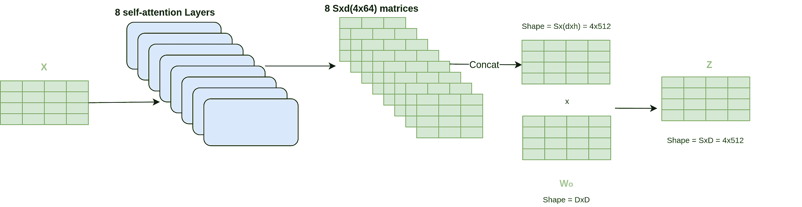

完整的多头自注意力层 (*图片来源：作者*)

因此，我们最终得到了形状为 4x512 的输出 Z，正如预期的。但在进入另一个编码器之前，我们将其通过一个前馈网络。

### B) 位置-wise 前馈网络

一旦我们理解了多头注意力层，前馈网络实际上是相当容易理解的。它只是对输出 Z 进行各种线性和 dropout 层的组合。因此，这里再次只是大量的矩阵乘法。

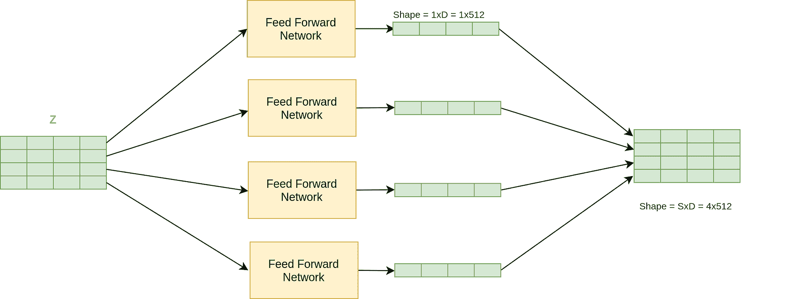

每个词都进入前馈网络。 (*图片来源：作者*)

前馈网络并行地应用于输出 Z 中的每个位置（每个位置可以看作是一个词），因此得名位置-wise 前馈网络。前馈网络也共享权重，因此源句子的长度无关紧要（此外，如果它不共享权重，我们将不得不根据最大源句子长度初始化很多这样的网络，这样做是不可行的）。

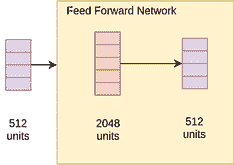

实际上，它只是一个线性层，应用于每个位置（或单词） (*作者提供的图片*)

有了这些，我们对 Transformer 编码器部分有了一个基本的理解。

***问：嘿，我刚刚查看了论文中的图片，编码器堆栈中有一个叫做“位置编码”和“Add & Norm”的东西。这些是什么？***

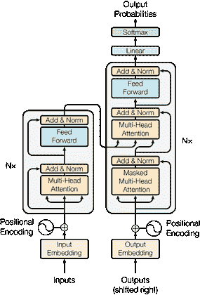

我再次回到这里，所以你不需要滚动 [源](https://arxiv.org/pdf/1706.03762.pdf)

好的，这两个概念对于这种特定架构是非常重要的。我很高兴你问了这个问题。因此，在继续解码器堆栈之前，我们会讨论这些步骤。

### C. 位置编码

由于我们的模型既没有递归也没有卷积，为了使模型能够利用序列的顺序，我们必须注入一些关于序列中令牌的相对或绝对位置的信息。为此，我们在编码器和解码器堆栈的底部（如后面所见）向输入嵌入添加了“位置编码”。位置编码需要与嵌入具有相同的维度 D，以便可以将两者相加。

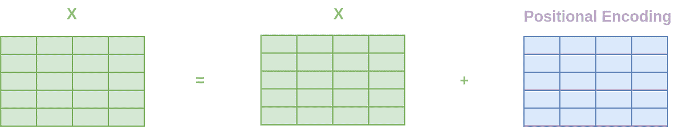

向 X 添加一个静态位置模式 (*作者提供的图片*)

在论文中，作者使用正弦和余弦函数来创建不同位置的位置编码。

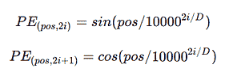

[源](https://arxiv.org/pdf/1706.03762.pdf)

这个特定的数学方法实际上生成了一个二维矩阵，该矩阵被添加到输入到第一个编码器步骤的嵌入向量中。

简而言之，这只是一个常量矩阵，我们将其添加到句子中，以便网络能够获取单词的位置。

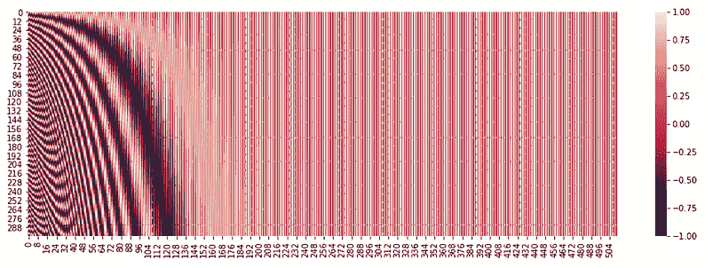  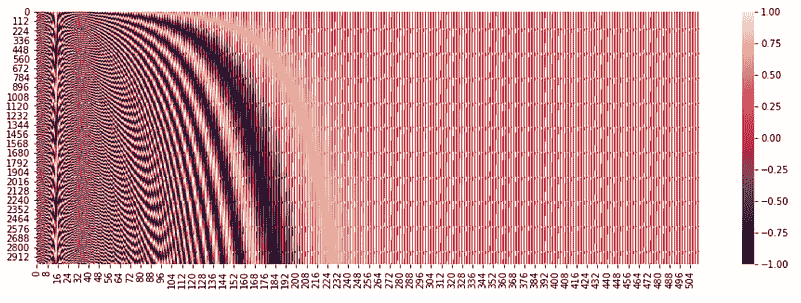

前 300 个和 3000 个位置的位置编码矩阵 (*作者提供的图片*)

上图是我们将添加到输入中的位置编码矩阵的热图，输入将提供给第一个编码器。我展示了前 300 个位置和前 3000 个位置的热图。我们可以看到，我们为 Transformer 提供了一个独特的模式，以便它理解每个单词的位置。由于我们使用了由正弦和余弦组成的函数，我们能够很好地嵌入非常高位置的编码，如第二张图片所示。

**有趣的事实：** 作者们还让 Transformer 学习这些编码，但并没有看到性能上的任何差异。因此，他们选择了上述方法，因为它不依赖于句子长度，因此即使测试句子比训练样本更长，我们也会没问题。

### D. 添加和归一化

另一个在解释编码器时为了简便而未提及的事情是，编码器（解码器架构也是）具有跳跃级别残差连接（类似于 resnet50）。所以，论文中的确切编码器架构如下。简单来说，它有助于在深度神经网络中传递更长的信息。这可以直观地理解为在组织中传递信息的方式，你可以同时访问你的经理以及你经理的上级。

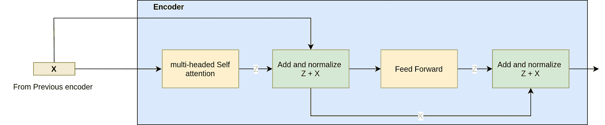

跳跃级别连接有助于网络中的信息流动（*图像作者提供*）

### 2\. 解码器架构

***问：好吧，到目前为止，我们已经了解到编码器接收输入句子并将其信息编码为 SxD（4x512）大小的矩阵。这很好，但它如何帮助解码器将其解码为德语？***

好事多磨。因此，在理解解码器如何实现之前，让我们先了解解码器堆栈。

解码器堆栈包含 6 个解码器层（如论文中所述），每个解码器堆栈包括以下三个主要层：

+   **掩码多头自注意力层**

+   **多头自注意力层，以及**

+   **位置级全连接前馈网络**

它还具有相同的位置信息编码和跳跃级别连接。我们已经知道多头注意力和前馈网络层的工作原理，因此我们将直接探讨解码器与编码器的不同之处。

解码器架构（*图像作者提供*）

***问：等一下，但我看到我们需要的输出作为输入流入解码器？什么？为什么？*????**

我注意到你提问的能力越来越强了。这是一个很好的问题，我自己也思考过很多次，希望在你读完这篇文章时会更清楚。

但为了直观理解，我们可以将变换器视作一种条件语言模型。在这种情况下，模型在给定一个输入词和一个英语句子的条件下预测下一个词。

这种模型本质上是顺序的，比如你如何训练这样的模型？你开始时给定开始标记（`<s>`），模型根据英语句子预测第一个词。你根据预测是否正确来调整权重。然后你给定开始标记和第一个词（`<s> der`），模型预测第二个词。你再次调整权重。依此类推。

变压器解码器以相同的方式学习，但美妙之处在于，它不是以顺序的方式进行的。它使用掩码来进行计算，从而在训练时处理整个输出句子（虽然通过在前面添加 ` <s> ` 令牌向右偏移）。另外，请注意，在预测时我们不会将输出提供给网络。

***问：但是，这个掩码到底是如何工作的？***

### A) 掩码多头自注意力层

它照常工作，你戴上它，我是说 **????**。开玩笑的，正如你所见，这次我们在解码器中有一个 **掩码** 多头注意力层。这意味着我们会对偏移的输出（即解码器的输入）进行掩码，以便网络永远看不到后续的词，否则它在训练时可以轻松复制那个词。

那么，掩码在掩码注意力层中是如何准确工作的？如果你记得，在注意力层中，我们将查询（Q）和键（K）相乘，并在进行 softmax 之前将它们除以 sqrt(d)。

在掩码注意力层中，我们将结果矩阵（在 softmax 之前的形状为 (TxT)）加到掩码矩阵中。

因此，在掩码层中，函数从：

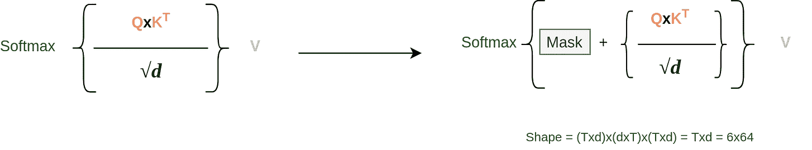

(*作者提供的图像*)

***问：我还是不明白，如果我们这样做会发生什么？***

这其实可以理解。让我分步骤说明。因此，我们的结果矩阵（QxK/sqrt(d)，形状为 (TxT)）可能如下所示：（由于尚未应用 softmax，数字可能较大）

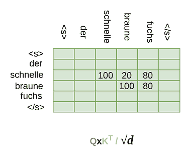

Schnelle 目前同时关注 Braune 和 Fuchs (*作者提供的图像*)

如果我们取上面矩阵的 softmax 并将其与值矩阵 V 相乘，词 Schnelle 现在将由 Braune 和 Fuchs 组成。但我们不想这样做，因此我们添加掩码矩阵来得到：

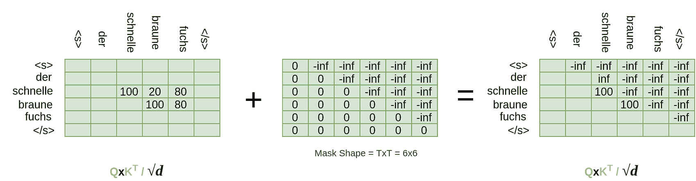

对矩阵应用了掩码操作。(*作者提供的图像*)

那么，softmax 步骤之后会发生什么呢？

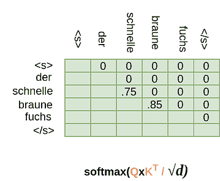

Schnelle 从未关注 Schnelle 之后的任何词。(*作者提供的图像*)

由于 e^{-inf} = 0，Schnelle 后续的所有位置都被转换为 0。现在，如果我们将这个矩阵与值矩阵 V 相乘，Z 矩阵中经过解码器的 Schnelle 位置对应的向量将不包含后续词 Braune 和 Fuchs 的任何信息，就像我们想要的那样。

这就是变压器如何一次性处理整个偏移的输出句子，而不是以顺序的方式学习。可以说相当整洁。

***问：你是在开玩笑吗？这实际上很棒。***

很高兴你仍然跟着我，并且欣赏它。现在，回到解码器。解码器中的下一层是：

### B) 多头注意力层

如你在解码器架构中所见，一个 Z 向量（编码器的输出）从编码器流向解码器中的多头注意力层。这个来自最后一个编码器的 Z 输出有一个特别的名字，通常称为内存。注意力层将编码器输出和来自下方（移位输出）的数据作为输入，并使用注意力机制。查询向量 Q 是从解码器中流动的数据创建的，而键（K）和值（V）向量则来自编码器输出。

***问：这里没有掩码吗？***

不，这里没有掩码。来自下方的输出已经被掩码，这允许解码器中的每个位置关注值向量中的所有位置。因此，为了生成每个单词位置，解码器可以访问整个英文句子。

这是一个单一的注意力层（它将是多头注意力的一部分，就像之前一样）：

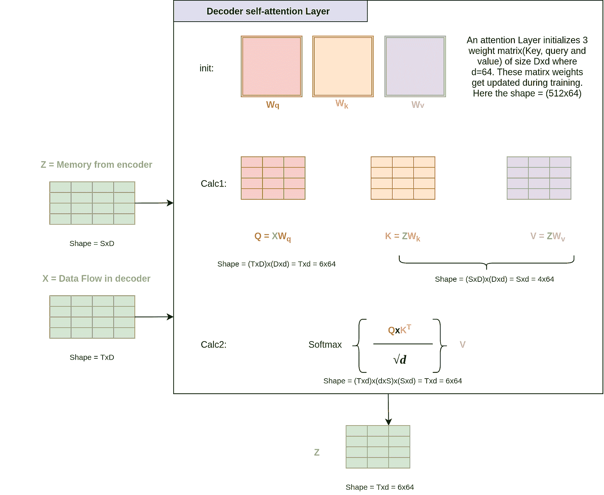

(*作者提供的图像*)

***问：但 Q、K 和 V 的形状这次会不同吗？***

你可以查看我计算所有权重的图示。我还建议你查看结果 Z 向量的形状，以及我们迄今为止的权重矩阵如何在其任何维度中从未使用目标或源句子的长度。通常，形状在我们所有的矩阵计算中会被取消。例如，见上面计算 2 中 S 维度如何取消。这就是为什么在训练期间选择批次时，作者谈到紧凑的批次。也就是说，在一个批次中，所有源句子具有相似的长度。不同的批次可以有不同的源长度。

我现在将讨论跳过级别连接和前馈层。它们实际上与……中的相同。

***问：明白了。我们有跳过级别的连接和 FF 层，并且在整个解码操作后得到形状为 TxD 的矩阵。* *但德语翻译在哪里？***

### 3\. 输出头部

朋友，我们现在实际上已经很接近了。一旦完成了 transformer，下一步是在解码器输出上添加一个任务特定的输出头。这可以通过在顶部添加一些线性层和 softmax 来实现，以获得*跨所有德语词汇的概率*。我们可以这样做：

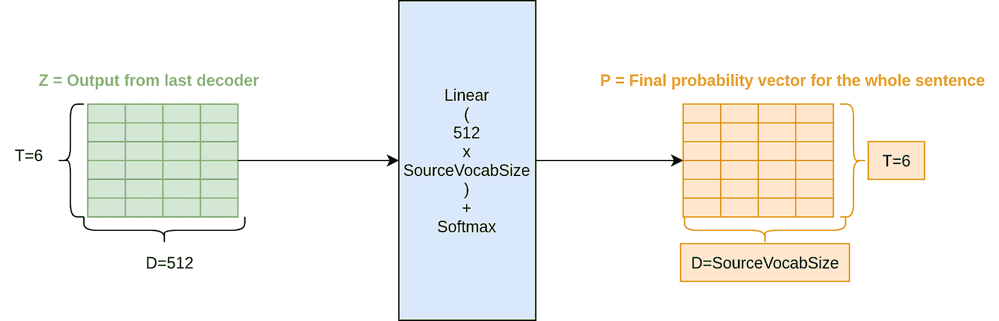

(*作者提供的图像*)

如你所见，我们能够生成概率。到目前为止，我们知道如何在这个 Transformer 架构中进行前向传递。让我们看看如何训练这样的神经网络架构。

### 训练：

迄今为止，如果我们从全局视角来看结构，我们得到的东西类似于：

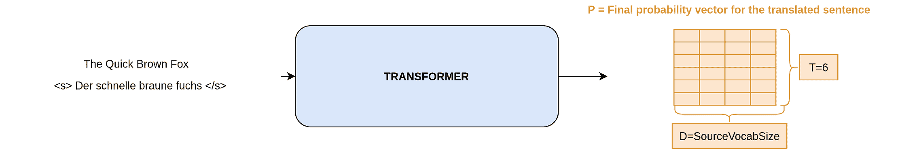

(*作者提供的图像*)

我们可以给出一个英文句子和相应的输出句子，进行前向传播，得到德语词汇上的概率。因此，我们应该能够使用像交叉熵这样的损失函数，其中目标可以是我们想要的德语单词，并使用 Adam 优化器训练神经网络。就像任何分类示例一样。这就是你的德语。

在论文中，尽管作者使用了优化器和损失函数的细微变化。如果你愿意，可以跳过下面的两个关于 KL 散度损失和 Adam 学习率调度的部分，因为这些只是为了从模型中挤出更多性能，而不是 Transformer 架构的固有部分。

***问：我在这里待了这么长时间，我有没有抱怨？ *????**

好的，好了。我明白了。那就这么做吧。

### A) 带标签平滑的 KL 散度：

KL 散度是当分布 P 被分布 Q 近似时发生的信息丧失。当我们使用 KL 散度损失时，我们尝试使用从模型中生成的概率（Q）来估计目标分布（P）。我们试图在训练中最小化这种信息丧失。

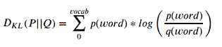

(*图片由作者提供*)

如果你注意到，在这种形式（没有标签平滑，我们会讨论的）下，这与交叉熵完全相同。给定如下两个分布。

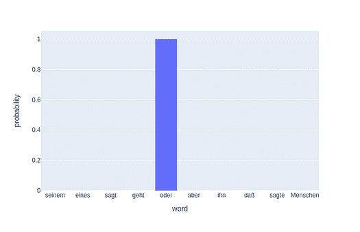  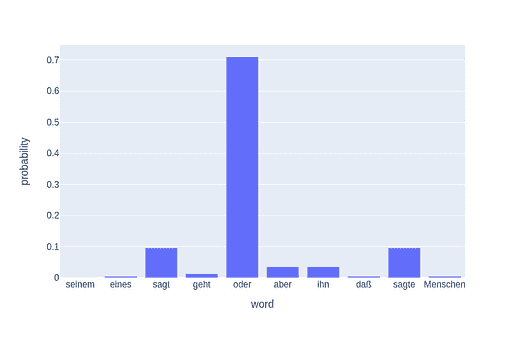

单词（token）的目标分布和概率分布 (*图片由作者提供*)

KL 散度公式简单地给出了 `-logq(oder)`，这就是交叉熵损失。

在论文中，尽管作者使用了 α = 0.1 的标签平滑，因此 KL 散度损失不是交叉熵。这意味着在目标分布中，输出值被 (1-α) 替代，剩余的 0.1 分布在所有单词中。作者表示这样做是为了使模型不那么自信。

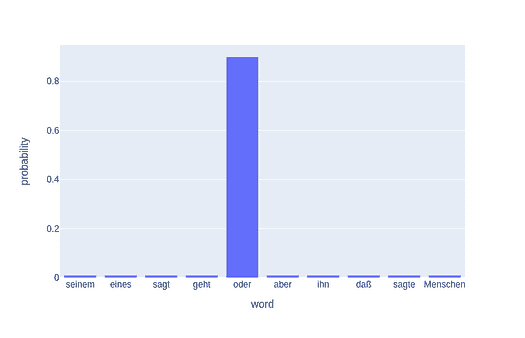  

(*图片由作者提供*)

***问：但为什么我们让模型不那么自信呢？这似乎很荒谬。***

是的，确实如此，但直观上，你可以把它理解为当我们将目标设为 1 时，我们对真正的标签为 True 和其他标签不为 True 没有疑虑。但词汇本质上是一个非标准化的目标。例如，谁能说你不能用 good 替代 great？所以我们在标签中加入一些混淆，以使模型不那么僵化。

### B) Adam 的特定学习率调度

作者使用了一个学习率调度器，在预热步骤之前逐渐增加学习率，然后使用下面的函数减少学习率。他们使用了 Adam 优化器，β¹ = 0.9，β² = 0.98。这里没有特别有趣的，只是一些学习选择。

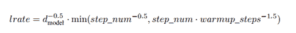

来源：[论文](https://arxiv.org/pdf/1706.03762.pdf)

***问：等等，我刚刚想到预测时不会有偏移输出，对吧？那我们怎么做预测呢？***

如果你明白了，我们现在有一个生成模型，我们需要以生成的方式进行预测，因为在进行预测时我们不知道输出目标向量。因此，预测仍然是顺序的。

### 预测时间

使用贪婪搜索进行预测的 Transformer（*作者提供的图像*）

该模型进行逐步预测。在原始论文中，他们使用束搜索进行预测。但贪婪搜索也足以解释这一过程。在上面的示例中，我展示了贪婪搜索的具体操作。贪婪搜索将从以下步骤开始：

+   将整个英文句子作为编码器输入，仅将起始标记`<st>`作为偏移输出（解码器的输入）传递给模型并进行前向传递。

+   模型将预测下一个词汇——`der`

+   然后，我们将整个英文句子作为编码器输入，将最后预测的词汇添加到偏移输出（解码器的输入 = `<st> der`）中，并进行前向传递。

+   模型将预测下一个词汇——`schnelle`

+   将整个英文句子作为编码器输入，将`<st> der schnelle`作为偏移输出（解码器的输入）传递给模型并进行前向传递。

+   等等，直到模型预测出结束标记`</s>`，或者我们生成一些最大数量的标记（我们可以定义的东西），以便翻译不会在任何情况下无限运行。

### **束搜索：**

***问：现在我有点贪心，能告诉我关于束搜索的内容吗？***

好的，束搜索的思想本质上与上述想法非常相似。在束搜索中，我们不仅查看生成的最高概率词汇，还查看前两个词汇。

比如，当我们将整个英文句子作为编码器输入，仅将起始标记作为偏移输出时，我们得到两个最佳词汇，即`i`（p=0.6）和`der`（p=0.3）。我们现在将为两个输出序列`<s> i`和`<s> der`生成输出模型，并查看生成的下一个最佳词汇的概率。例如，如果`<s> i`为下一个词汇提供了（p=0.05）的概率，而`<s> der`为下一个预测词汇提供了（p=0.5）的概率，我们将舍弃序列`<s> i`，选择`<s> der`，因为句子的概率总和被最大化了（`<s> der next_word_to_der` p = 0.3+0.5，相比之下`<s> i next_word_to_i` p = 0.6+0.05）。然后我们重复这一过程，以获得概率最高的句子。

由于我们使用了前两个词汇，因此此束搜索的束大小为 2。在论文中，他们使用了束搜索大小为 4。

**附注**：我展示了每一步传递整个英文句子以便简洁，但实际上，编码器的输出被保存，只有偏移输出在每个时间步传递给解码器。

***问: 还有什么你忘了告诉我的吗？我让你有你的时刻。***

是的。既然你问了。这是：

### BPE，权重共享和检查点

在论文中，作者使用了字节对编码（Byte pair encoding）来创建一个通用的英语-德语词汇表。然后，他们在英语和德语嵌入以及预软最大线性变换中使用了共享权重，因为嵌入权重矩阵的形状（词汇长度 X D）是适用的。

此外，作者将最后的 k 个检查点进行平均，以创建一种集成效应来提升性能*。* 这是一种非常常见的技术，我们在模型的最后几个周期中平均权重，创建一个新的模型，类似于一个集成模型。

***问: 你能给我展示一些代码吗？***

这篇文章已经很长了，所以我会在下一篇文章中进行介绍。敬请关注。

***现在，终于轮到我提问了：你明白变换器是如何工作的吗？是，还是否，你可以在评论中回答。:)***

**参考文献**

+   [注意力是你所需的一切](https://arxiv.org/abs/1706.03762): 这篇论文开启了一切。

+   [注释 Transformer](https://nlp.seas.harvard.edu/2018/04/03/attention.html): 这篇文章包含了所有代码。虽然我也会在下一篇文章中编写一个简单的变换器。

+   [插图 Transformer](http://jalammar.github.io/illustrated-transformer/): 这是关于变换器的最佳文章之一。

在这篇文章中，我从细节导向和直观的角度讲解了 Transformer 架构的工作原理。

如果你想了解更多关于 NLP 的内容，我想推荐一个来自高级机器学习专业化的优秀课程，[**自然语言处理**](https://click.linksynergy.com/link?id=lVarvwc5BD0&offerid=467035.11503135394&type=2&murl=https%3A%2F%2Fwww.coursera.org%2Flearn%2Flanguage-processing)。请查看一下。

我也会在未来撰写更多类似的文章。告诉我你对这些文章的看法。我应该写一些技术性很强的主题还是更多的入门级文章？评论区是你的朋友。使用它。同时，关注我的[**Medium**](https://medium.com/@rahul_agarwal)或订阅我的[**博客**](https://mlwhiz.ck.page/a9b8bda70c)。

最后一个小免责声明——这篇文章中可能会包含一些相关资源的附属链接，因为分享知识从来不是坏事。

这个故事首次发布于[**这里**](https://lionbridge.ai/articles/what-are-transformer-models-in-machine-learning/)。

**简历: [Rahul Agarwal](https://www.linkedin.com/in/rahulagwl/)** 是 WalmartLabs 的高级统计分析师。在 Twitter 上关注他[@mlwhiz](https://twitter.com/MLWhiz)。

[原文](https://towardsdatascience.com/understanding-transformers-the-data-science-way-e4670a4ee076)。获得许可后重新发布。

**相关:**

+   深入了解 Transformer 架构 – Transformer 模型的发展

+   特征提取的搭车指南

+   深度学习的最重要理念

### 更多相关主题

+   [利用 AI 与分析引擎更快地准备时间序列数据](https://www.kdnuggets.com/2021/12/piexchange-faster-way-prepare-timeseries-data-ai-analytics-engine.html)

+   [图表：理解数据的自然方式](https://www.kdnuggets.com/2022/10/manning-graphs-natural-way-understand-data.html)

+   [一本将彻底改变你组织数据处理方式的新书…](https://www.kdnuggets.com/2022/02/manning-new-book-revolutionize-way-organization-approaches-data.html)

+   [使用 Pandas fillna() 输入缺失数据的最佳方式](https://www.kdnuggets.com/2023/02/optimal-way-input-missing-data-pandas-fillna.html)

+   [用 Pandas 制作美丽互动可视化的最简单方法](https://www.kdnuggets.com/2021/12/easiest-way-make-beautiful-interactive-visualizations-pandas.html)

+   [一种管理深度学习数据集的新方法](https://www.kdnuggets.com/2022/03/new-way-managing-deep-learning-datasets.html)
