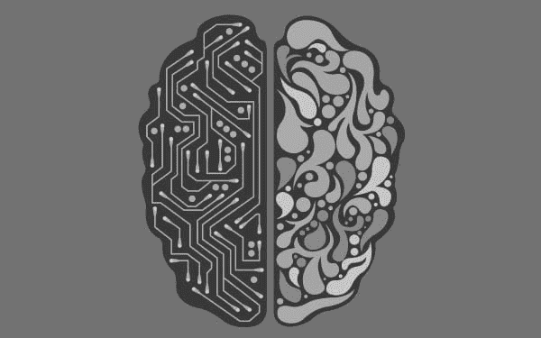

# 机器学习的意外后果

> 原文：[`www.kdnuggets.com/2017/06/unintended-consequences-machine-learning.html`](https://www.kdnuggets.com/2017/06/unintended-consequences-machine-learning.html)

 评论

**作者：弗兰克·凯恩，Sundog 教育。**

这是机器学习和人工智能的激动人心的时代；新的算法、TensorFlow 以及强大的 GPU 集群正在结合起来，产生能够做一些如[击败世界最佳围棋选手](https://www.wired.com/2017/05/googles-alphago-continues-dominance-second-win-china/)这样的强大系统。

但巨大的力量带来巨大的责任。让我讲一个关于善意的机器学习研究意外后果的故事。

那一年是 2010 年。我在亚马逊的个性化技术领域已经工作了七年。你知道的，推荐系统会根据你的过去兴趣和购买记录向你推荐你从未知道的东西，并且生成亚马逊收入的很大一部分。

那一年是[Eli Pariser 首次创造了“过滤泡沫”这一术语。](https://www.youtube.com/watch?v=SG4BA7b6ORo) 他警告我们，过度个性化可能会使人们陷入一个不断强化相同兴趣和信念的泡沫中。这个演讲证明了预言的准确性；今天关于社交媒体中的过滤泡沫在使我们现代社会极化中的作用，以及它在政治中的作用，有着很多争论。

在 2010 年，我完全忽视了 Eli 的警告。我认为，旨在帮助你发现新书籍和音乐的算法不可能对社会产生那种影响。但我错了。我仍然能安然入睡，因为 Eli 的担忧是针对 Facebook 和 Google 的个性化，而不是亚马逊——但我仍然感到有些参与其中，因为亚马逊在这个领域是先锋。

快进到 2017 年，你会看到对人工智能的忧虑与我们曾经对个性化的忧虑相似。我们在打造实际可用的自动驾驶汽车，或在游戏中超越人类时，充满了兴奋。但这些技术也带来了意想不到的后果。抛开关于“奇点”的猜测——今天，如果一个网络恐怖分子获得了你正在构建的系统会发生什么？你的神经网络是否可能被训练来，例如，侵入武器控制系统或电网？就像我从未预见到为我推荐新的科幻书籍的算法会影响世界政治一样，你也可能未曾预见到你正在创造的技术会在威胁文明的攻击中发挥作用。

这是否意味着我们都应该去成为网页开发人员以求更大的利益呢？其实不是。停止技术进步也是不对的。但我们可以做出一些决策，尽量将我们开发的技术保持在正确的手中。即使我现在的业务是[便宜的在线机器学习培训](http://www.sundog-education.com/)，我也曾考虑过不制作有关人工智能的课程，因为或许这种知识不应该让坏人轻易获得。也许你应该三思自己在会议上或以开源形式提供多少信息。你正在构建的那个酷炫的图形工具，让任何人都能在集群上设置神经网络并随心所欲地使用？也许这真的不应该轻易地公之于众。

有一种合理化的说法是：“人工智能不杀人，使用人工智能的人才杀人。”但是，你真的想在几年后为自己在下一次大规模的人工智能网络攻击中所扮演的角色而自我怀疑吗？在某种程度上，我曾经历过这种情况，这并不好受。

**简介：[Frank Kane](http://www.sundog-education.com/)** 是 Sundog Education 的创始人，该公司在其便宜的在线视频培训课程中，已在全球招收了 100,000 名学生，课程涵盖大数据、机器学习和数据科学。在创办 Sundog 之前，Frank 在 Amazon.com 和 IMDb.com 的工程和管理职位上工作了 9 年，专注于个性化和推荐系统技术。

**相关：**

+   机器学习中的信任挑战

+   回归分析真的算是机器学习吗？

+   大数据迫切需要透明度

* * *

## 我们的前三大课程推荐

 1\. [Google 网络安全证书](https://www.kdnuggets.com/google-cybersecurity) - 快速入门网络安全职业生涯。

 2\. [Google 数据分析专业证书](https://www.kdnuggets.com/google-data-analytics) - 提升你的数据分析技能

 3\. [Google IT 支持专业证书](https://www.kdnuggets.com/google-itsupport) - 支持你所在组织的 IT

* * *

### 更多相关话题

+   [消失梯度问题：原因、后果及解决方案](https://www.kdnuggets.com/2022/02/vanishing-gradient-problem.html)

+   [KDnuggets 新闻，12 月 14 日：3 门免费机器学习课程…](https://www.kdnuggets.com/2022/n48.html)

+   [每个机器学习工程师都应该掌握的 5 项机器学习技能…](https://www.kdnuggets.com/2023/03/5-machine-learning-skills-every-machine-learning-engineer-know-2023.html)

+   [学习数据科学、机器学习和深度学习的可靠计划](https://www.kdnuggets.com/2023/01/mwiti-solid-plan-learning-data-science-machine-learning-deep-learning.html)

+   [AI、分析、机器学习、数据科学、深度学习……](https://www.kdnuggets.com/2021/12/developments-predictions-ai-machine-learning-data-science-research.html)

+   [打破数据壁垒：零样本、单样本和少样本学习如何改变机器学习](https://www.kdnuggets.com/2023/08/breaking-data-barrier-zeroshot-oneshot-fewshot-learning-transforming-machine-learning.html)
