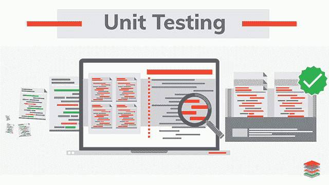

# 单元测试你的数据管道，你会感谢自己

> 原文：[`www.kdnuggets.com/2020/08/unit-test-data-pipeline-thank-yourself-later.html`](https://www.kdnuggets.com/2020/08/unit-test-data-pipeline-thank-yourself-later.html)

评论

**由 [诺曼·尼默](https://www.linkedin.com/in/normanniemer/)，首席数据科学家**

数据科学家，尤其是初学者，常犯的一个错误是没有编写单元测试。数据科学家有时会争辩说，单元测试不适用，因为没有可以预先知道或测试的正确答案。然而，大多数数据科学项目从数据转换开始。虽然你不能测试模型输出，但至少你应该测试输入是否正确。相比于编写单元测试投入的时间，良好的简单测试将会为你节省更多时间，尤其是在处理大型项目或大数据时。

* * *

## 我们的三大课程推荐

 1\. [谷歌网络安全证书](https://www.kdnuggets.com/google-cybersecurity) - 快速进入网络安全职业生涯。

 2\. [谷歌数据分析专业证书](https://www.kdnuggets.com/google-data-analytics) - 提升你的数据分析技能

 3\. [谷歌 IT 支持专业证书](https://www.kdnuggets.com/google-itsupport) - 支持你组织的 IT

* * *

与 [海景·李](https://www.linkedin.com/in/haijing-li-7b50a11b2/)，金融服务数据分析师，哥伦比亚大学 MS 商业分析，共著。



图片来源：[Xenonstack](https://www.xenonstack.com/insights/what-is-unit-testing/)

### 单元测试的好处

+   更早发现错误：运行大数据项目耗时。你不希望在运行三小时后得到意外的输出，而你本可以轻松避免这种情况。

+   更容易更新代码：你将不再害怕更改代码，因为你知道期望的结果，并且如果出现问题，你可以轻松发现。

+   促使你编写更结构化的代码：当你考虑到需要用孤立的片段测试代码时，你会写出更清晰的代码，并更倾向于以 DAG 的方式编写，而不是线性链式函数。（使用 [d6tflow](https://github.com/d6t/d6tflow) 来轻松构建数据科学工作流）

+   让你对输出结果有信心：错误的数据会导致错误的决策。运行单元测试可以让你对数据质量有信心。你知道你的代码输出了你想要的结果。

### Pytest

为了提高测试效率，使用 Pytest。如果你在寻找 Pytest 的教程，我推荐 Dane Hillard 的文章 [有效的 Python 测试与 Pytest](https://realpython.com/pytest-python-testing/)。在他的文章中，你会发现如何利用 Pytest 的基本和高级功能。

### 单元测试用于数据科学

根据你的项目需求，你希望通过单元测试检查的内容会有所不同。但有一些常见的测试是你可能希望为数据科学解决方案运行的。

**1\. 缺失值**

```py
#catch missing values
assert df['column'].isna().sum()<1 
```

**2\. 复制项**

```py
# check there is no duplicate
assert len(df['id'].unique())==df.shape[0]
assert df.groupby(['date','id']).size().max()==1 
```

**3\. 形状**

```py
# have data for all ids?
assert df['id'].unique().shape[0] == len(ids)

# function returns have shapes as expected
assert all([some_funtion(df).shape == df[0].shape for df in dfs]) 
```

**4\. 值范围**

```py
assert df.groupby('date')['percentage'].sum()==1 
assert all (df['percentage']<=1)
assert df.groupby('name')['budget'].max()<=1000 
```

**5\. 连接质量**

[d6tjoin](https://github.com/d6t/d6tjoin) 具有连接质量的检查。

```py
assert d6tjoin.Prejoin([df1,df2],['date','id']).is_all_matched() 
```

**6\. 预处理函数**

```py
assert preprocess_function("name\t10019\n")==["name",10019]
assert preprocess_missing_name("10019\n") is None
assert preprocess_text("Do you Realize those are genetically modified food?" ) == ["you","realize","gene","modify","food"]
```

**简介: [诺曼·尼默](https://www.linkedin.com/in/normanniemer/)** 是一家大型资产管理公司的首席数据科学家，他提供基于数据的投资洞察。他持有哥伦比亚大学金融工程硕士学位和卡斯商学院（伦敦）银行与金融学学士学位。

[原文](https://github.com/HaijingLi94/d6t-python/blob/Haijing/blogs/unit-test-your-data-solution.md)。经许可转载。

**相关:**

+   Python 中的模糊连接与 d6tjoin

+   数据科学家常犯的 10 大编码错误

+   解释“黑箱”机器学习模型：SHAP 的实际应用

### 更多相关话题

+   [忘记 PIP、Conda 和 requirements.txt！使用 Poetry 吧，感谢你以后…](https://www.kdnuggets.com/2023/07/forget-pip-conda-requirementstxt-poetry-instead-thank-later.html)

+   [每个数据科学家都应该知道的三个 R 库（即使你使用 Python）](https://www.kdnuggets.com/2021/12/three-r-libraries-every-data-scientist-know-even-python.html)

+   [停止学习数据科学以寻找目标，找到目标再…](https://www.kdnuggets.com/2021/12/stop-learning-data-science-find-purpose.html)

+   [学习数据科学统计学的最佳资源](https://www.kdnuggets.com/2021/12/springboard-top-resources-learn-data-science-statistics.html)

+   [成功数据科学家的 5 个特征](https://www.kdnuggets.com/2021/12/5-characteristics-successful-data-scientist.html)

+   [一个 90 亿美元的 AI 失败，解析](https://www.kdnuggets.com/2021/12/9b-ai-failure-examined.html)
