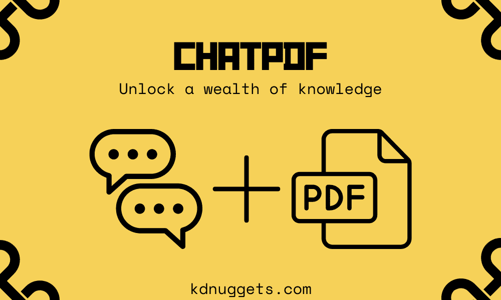
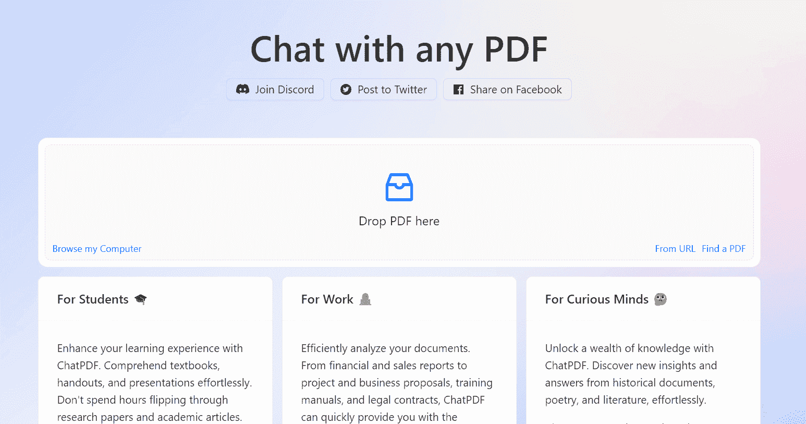
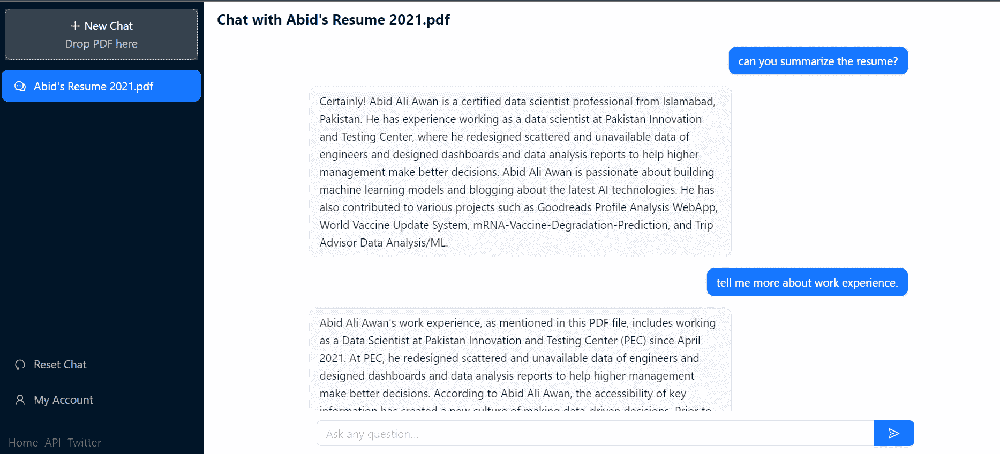
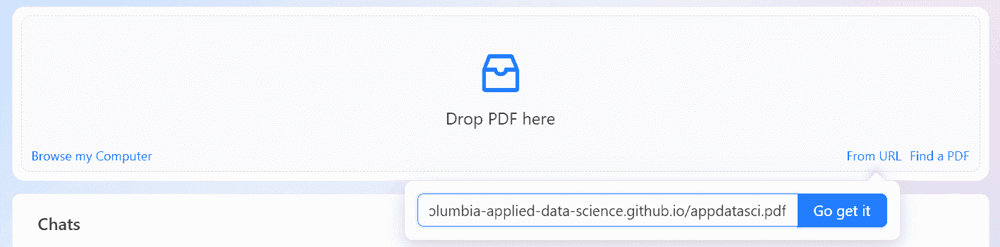
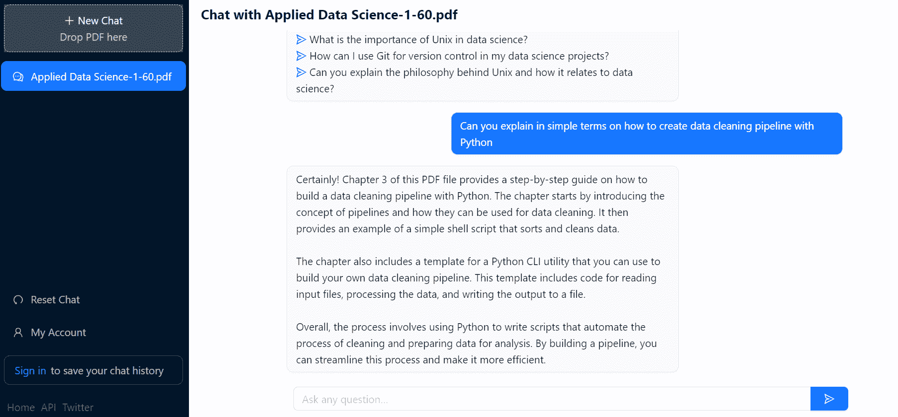
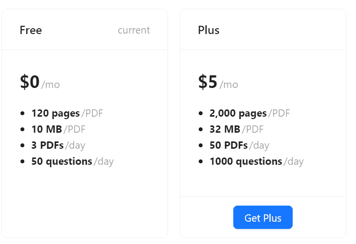

# 通过 ChatPDF 解锁知识宝库

> 原文：[`www.kdnuggets.com/2023/04/unlock-wealth-knowledge-chatpdf.html`](https://www.kdnuggets.com/2023/04/unlock-wealth-knowledge-chatpdf.html)

作者提供的图片

ChatPDF 为学生和专业人士打开了一个全新的世界。你可以在 5 分钟内总结并理解整本书，或者甚至用它来理解高度技术性的法律合同。就像 ChatGPT 一样，你可以从书中提问，它将帮助你学习某个概念或故事。

* * *

## 我们的前三大课程推荐

 1\. [谷歌网络安全证书](https://www.kdnuggets.com/google-cybersecurity) - 快速进入网络安全职业生涯。

 2\. [谷歌数据分析专业证书](https://www.kdnuggets.com/google-data-analytics) - 提升你的数据分析技能

 3\. [谷歌 IT 支持专业证书](https://www.kdnuggets.com/google-itsupport) - 支持你组织的 IT

* * *

# ChatPDF 是如何工作的？

上传 PDF 文件后，ChatPDF 通过创建语义索引并将相关段落与文本生成 AI 共享来分析 PDF 文件。之后，你可以使用它从文件中提取信息。ChatPDF 能够顺畅处理大型文件，如手册、法律合同、书籍和研究论文。

# ChatPDF 示例

招聘人员可以使用 ChatPDF API 创建一个系统，帮助他们通过简历向候选人提问。这将有助于改善招聘过程，因为预筛选将由 AI 完成。

在这个案例中，我上传了 2021 年的旧简历，以了解更多关于过去的自己。通过访问**chatpdf.com**，你会看到主页上解释了它的使用场景，并提供了 3 种添加 PDF 文件的选项。你可以直接提供链接、上传文件或搜索 PDF。

图片来源于[ChatPDF](https://www.chatpdf.com/)

上传简历后，我让 ChatPDF 总结简历，然后进一步了解我的工作经验。

界面与 ChatGPT 非常相似。

图片来源于[ChatPDF](https://www.chatpdf.com/)

让我们使用[链接](https://columbia-applied-data-science.github.io/appdatasci.pdf)上传由 Ian Langmore 和 Daniel Krasner 编写的免费[应用数据科学](https://columbia-applied-data-science.github.io/appdatasci.pdf)书籍。

图片来源于[ChatPDF](https://www.chatpdf.com/)

我选择了解书中提到的数据清洗管道，而不是总结内容。答案很好，但不如 ChatGPT。可能缺少代码块。

图片来自[ChatPDF](https://www.chatpdf.com/)

你可以使用 ChatPDF 在不到 5 分钟内阅读整本书，甚至如果忘记了某些内容，还可以提出问题。这就像与书对话，一起解决谜题。

# 限制

通过创建账户，你可以查看之前的聊天记录，但有一些限制。如果你习惯了免费的 ChatGPT 体验，你可能会因每天 3 个 PDF 和 50 个问题而感到烦恼。你可以通过购买 Plus 会员来克服这些烦恼。

图片来自[ChatPDF](https://www.chatpdf.com/)

我认为开发者在后台使用的是 GPT-3 或类似的开源模型。ChatPDF 在许多情况下无法理解上下文并给出错误的解释。其他限制与技术内容有关，如代码块、表格等。你仍然可以要求机器人编写 Python 代码，它会显示代码，但与 ChatGPT 相比效果不佳。

# 总结

我们有了一个新工具，我喜欢用它来理解我的合同、书籍和研究论文。它处于早期阶段，未来可以看到性能上的改进。

希望你喜欢这项新技术，如果你想让我在未来涵盖更多 AI 工具，请在评论中告诉我。

**[Abid Ali Awan](https://www.polywork.com/kingabzpro)**（[@1abidaliawan](https://twitter.com/1abidaliawan)）是一位认证的数据科学专业人士，热爱构建机器学习模型。目前，他专注于内容创作和撰写有关机器学习和数据科学技术的技术博客。Abid 拥有技术管理硕士学位和电信工程学士学位。他的愿景是使用图神经网络为面临心理健康问题的学生开发 AI 产品。

### 更多相关话题

+   [解锁选择完美机器学习算法的秘密！](https://www.kdnuggets.com/2023/07/ml-algorithm-choose.html)

+   [解锁 AI 的力量 - KDnuggets 和 Machine 的特别发布…](https://www.kdnuggets.com/2023/07/mlm-unlock-power-ai-special-release-kdnuggets-machine-learning-mastery.html)

+   [通过这个免费的 DevOps 速成课程解锁你的潜力](https://www.kdnuggets.com/2023/03/corise-unlock-potential-with-this-free-devops-crash-course.html)

+   [ChatGPT 驱动的数据探索：解锁数据集中的隐藏洞察](https://www.kdnuggets.com/2023/07/chatgptpowered-data-exploration-unlock-hidden-insights-dataset.html)

+   [在 60 分钟内解锁 LLM 的秘密，与 Andrej Karpathy](https://www.kdnuggets.com/unlock-the-secrets-of-llms-in-a-60-minute-with-andrej-karpathy)

+   [解锁你的下一步行动：在热门数据技能提升课程上节省高达 67%](https://www.kdnuggets.com/2023/03/datacamp-unlock-next-move-save-67-indemand-data-upskilling.html)
