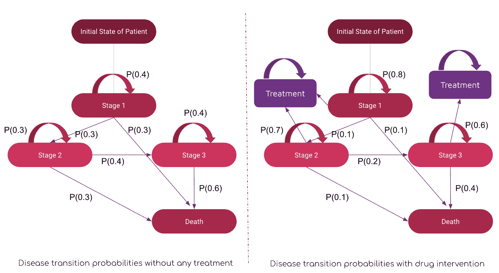

# 解锁健康经济学和结果研究中的数字力量

> 原文：[`www.kdnuggets.com/2023/07/unlocking-power-numbers-health-economics-outcomes-research.html`](https://www.kdnuggets.com/2023/07/unlocking-power-numbers-health-economics-outcomes-research.html)

在健康经济学和结果研究中，数据的可用性是一个关键挑战，因为获得适当的数据，尤其是长期结果和成本统计数据，可能很困难。此外，不同来源的数据的质量和一致性可能会变化，使得确认结果的可信度变得不可能。HEOR 研究中经常使用复杂的设计和程序来回答特定的研究问题。选择正确的研究设计，如观察研究、随机对照试验或建模方法，需要深思熟虑。

选择适当的统计方法、样本大小和终点引入了额外的障碍，这可能影响结果的有效性。经济建模在 HEOR 中至关重要，因为它估算长期成本、结果和成本效益。然而，开发稳健的经济模型需要做出假设和简化，这可能会导致不确定性和偏差。在建模假设的透明性和用真实数据测试模型输出方面至关重要，但也很困难。为了应对 HEOR 中的这些定量问题，经济学家、统计学家、流行病学家、医生以及其他相关专业人员必须共同合作。提高 HEOR 研究的严谨性和可信度还需要持续的方法学突破、数据标准化工作和稳健的统计研究。

* * *

## 我们的前三大课程推荐

 1\. [谷歌网络安全证书](https://www.kdnuggets.com/google-cybersecurity) - 快速进入网络安全职业生涯。

 2\. [谷歌数据分析专业证书](https://www.kdnuggets.com/google-data-analytics) - 提升你的数据分析技能

 3\. [谷歌 IT 支持专业证书](https://www.kdnuggets.com/google-itsupport) - 支持你的组织在 IT 方面。

* * *

# 通过统计学应对挑战

在健康经济学和结果研究中，量化挑战可以通过统计学有效解决。统计学可以通过分析和解释数据提供对医疗保健多个方面的重要见解，包括患者结果、治疗效果和成本效益。

为了更好地提供决策支持并提升医疗服务，研究人员可能会使用统计方法来发现大数据集中的模式、趋势和联系。统计学对健康经济学和结果研究的进步至关重要，无论是用于评估新治疗的效果还是医疗干预的有效性。在解决健康经济学和结果研究（HEOR）中的定量问题时，统计方法绝对不可或缺。

研究人员可以通过这些工具进行复杂的数据分析，评估治疗效果，并做出明智的判断。统计方法如回归分析、生存分析、倾向评分匹配和贝叶斯建模对于确定关联、控制混杂因素和估计治疗效果非常有帮助。其他统计方法包括生存分析和贝叶斯建模。

此外，高级建模技术如成本效益分析和决策树有助于简化经济分析和资源分配决策。HEOR 研究通过利用强大的统计工具，有潜力提高研究结果的准确性、可靠性和推广性。这将**最终**改善医疗政策和实践。

下面我们探讨两种在从经济角度评估医疗干预影响时至关重要的方法。

# Markov 链

Markov 链在创建成本效益模型时可能是一种极好的技术。Markov 链通过模拟不同状态间的变化，能够揭示不同变量如何影响系统的总成本。例如，Markov 链可以帮助估计治疗特定疾病的长期成本，通过模拟患者在不同健康阶段之间的转变。

在图 1 中，我们比较了有无治疗干预的疾病转归概率图。最初，我们可以观察到从阶段 1 到阶段 2 的转归概率为 0.3，从阶段 2 到阶段 3 为 0.4，依此类推。然而，当治疗在阶段 1 后引入时，我们可以观察到从阶段 1 到阶段 2 的转归概率降低到 0.1，如果治疗继续到阶段 2，则从阶段 2 到阶段 3 的转归概率也降至 0.1，从而确认了治疗/药物的有效性。因此，我们可以得出结论，治疗帮助减少了疾病进展到最新阶段的概率 1/3，并可能提高了患者的质量调整生命年（QALY），从而帮助我们估算治疗成本的减少。

图 1：基于 Markov 过程的转归图

此外，干预的时机或治疗选择是与资源分配相关的两个决策，这些决策可以通过使用马尔可夫链进行优化。马尔可夫链有助于提高成本效益模型的准确性和可靠性，这将*最终*通过提供对影响成本效益的因素的更全面的理解，带来更好的医疗决策及其他行业的决策。

# 贝叶斯推断

在从财务角度评估医疗干预的价值时，贝叶斯推断是有帮助的。贝叶斯推断通过将先前的知识和信息考虑在内，使研究人员能够更准确地预测结果并评估可能干预的效果和成本效益。由于允许研究人员用已有的知识填补数据空白，这种方法在数据稀缺或不足时尤为有用。通过采用贝叶斯推断，研究人员可以提高成本效益评估的精确度和可靠性，从而改进医疗决策和患者结果。通常，贝叶斯定理如下所示：

贝叶斯推断是一种在医疗行业中越来越受欢迎的统计方法，用于评估干预的效果。贝叶斯推断通过考虑先前的信息并结合新的证据进行更新，使得对特定治疗或干预成功的可能性进行更精确的估计。它是一位教学教授，任教于波士顿东北大学的数据科学硕士课程。他在多机器人系统和强化学习方面的研究已发表于人工智能领域的顶级期刊和会议上。他还是 Medium 社交平台的顶级作者，经常发布关于数据科学和机器学习的文章。

例如，在研究一种新药的效果时，贝叶斯推断不仅可以考虑原始数据，还可以结合关于药物作用机制、潜在副作用以及与其他药物的相互作用的先验知识。这种方法可以提供更具信息性和准确性的药物疗效与安全性评估，从而帮助指导临床决策。

研究遗传数据以寻找潜在的疾病风险因素是贝叶斯推断在医疗保健中的另一个应用。通过结合关于影响疾病风险的遗传和环境因素的先验知识，贝叶斯推断可以帮助识别新的干预目标，并提高我们对疾病基本机制的理解。

另一个例子是评估医疗保健政策和干预措施。通过整合类似政策和干预措施的有效性先前数据，政策制定者可以做出更明智的决定，确定实施哪些政策以及避免哪些政策。总体而言，贝叶斯推断是评估医疗保健干预措施的强大工具，允许进行更准确和信息丰富的决策。

此外，预测建模如线性回归是贝叶斯推断在医疗保健中使用的各种方式之一。贝叶斯推断可以通过考虑患者的病史、症状和其他风险因素，帮助做出更准确的健康结果预测。

总的来说，贝叶斯推断是一种有效的技术，用于评估医疗保健干预措施，能够通过提供关于健康结果的更精确和详细的预测，帮助患者获得更好的结果，并做出更好的临床决策。

**[Mayukh Maitra](https://www.linkedin.com/in/mayukh-maitra-72525528/)** 是沃尔玛的数据显示科学家，专注于媒体混合建模领域，拥有超过 5 年的行业经验。从构建基于马尔科夫过程的医疗保健结果研究模型，到进行基于遗传算法的媒体混合建模，我不仅对人们的生活产生了影响，还通过有意义的洞察力将企业提升到新的水平。在加入沃尔玛之前，我曾有机会在 GroupM 担任数据科学经理，专注于广告技术领域，在 Axtria 担任决策科学高级助理，涉及健康经济学和结果研究领域，并在 ZS Associates 担任技术分析师。除了我的专业角色外，我还曾参与多个同行评审会议的评审和技术委员会，有机会担任多个技术奖项和黑客马拉松的评审。

### 更多相关话题

+   [合成数据平台：发掘生成式 AI 在……中的力量](https://www.kdnuggets.com/2023/07/synthetic-data-platforms-unlocking-power-generative-ai-structured-data.html)

+   [学习现代预测技术以帮助预测未来业务……](https://www.kdnuggets.com/2022/12/sphere-learn-modern-forecasting-techniques-help-predict-future-business-outcomes.html)

+   [超越 Numpy 和 Pandas：发掘鲜为人知的……](https://www.kdnuggets.com/2023/08/beyond-numpy-pandas-unlocking-potential-lesserknown-python-libraries.html)

+   [探索 GPT-4 的力量和局限性](https://www.kdnuggets.com/2023/07/exploring-power-limitations-gpt4.html)

+   [解锁 AI 的力量 - KDnuggets 与 Machine Learning Mastery 的特别发布](https://www.kdnuggets.com/2023/07/mlm-unlock-power-ai-special-release-kdnuggets-machine-learning-mastery.html)

+   [21 份数据科学面试必备的备忘单：揭示……](https://www.kdnuggets.com/2022/06/21-cheat-sheets-data-science-interviews.html)
