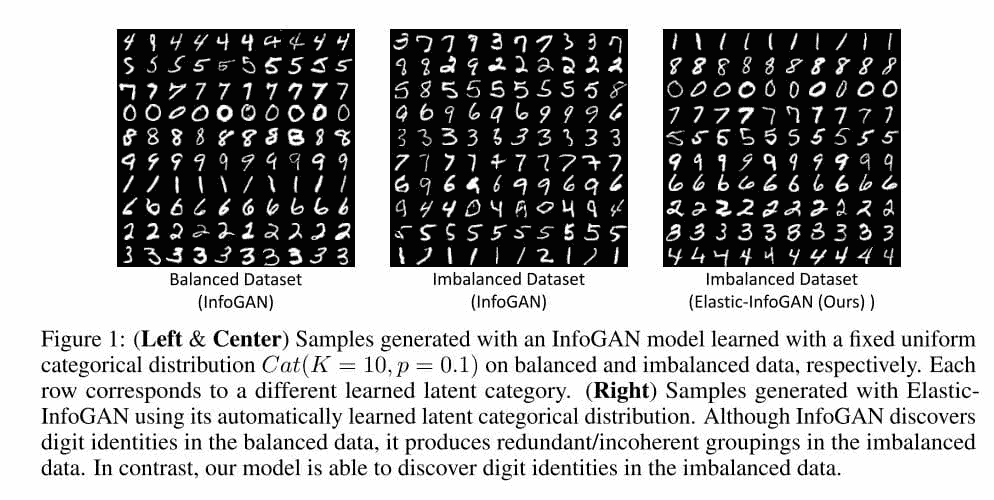
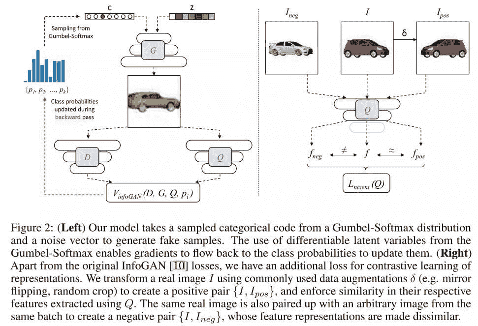
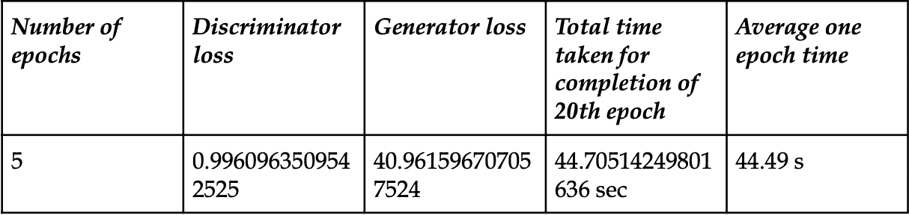
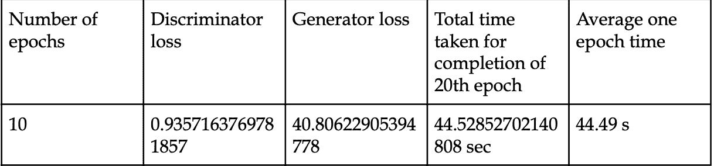
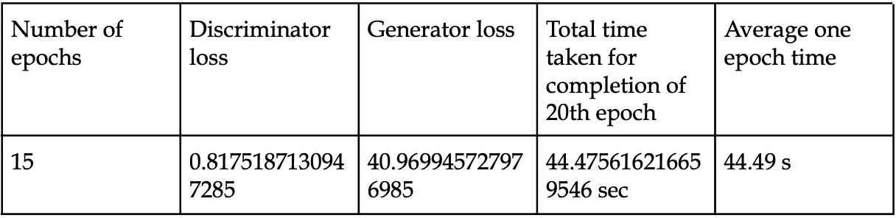
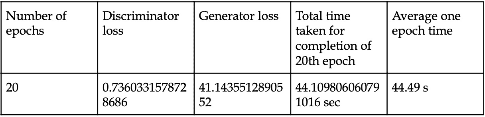
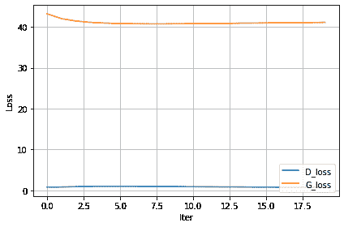

# 在类别不平衡数据集上使用弹性 Info-GAN 的无监督解耦表示学习

> 原文：[`www.kdnuggets.com/2023/01/unsupervised-disentangled-representation-learning-class-imbalanced-dataset-elastic-infogan.html`](https://www.kdnuggets.com/2023/01/unsupervised-disentangled-representation-learning-class-imbalanced-dataset-elastic-infogan.html)

# 介绍

在本文中，我们将讨论一篇与弹性 Info-GAN 相关的论文，该论文尝试解决传统 GAN 无法克服的缺陷。让我们讨论一下论文的目标或摘要，描述了主要贡献：

本文尝试利用 Info-GAN 论文中的两个主要缺陷，同时保留其他优点/改进。

这些是两个缺陷：

**缺陷-1：** 我们讨论了 Info-GAN，它主要关注通过操作潜在代码向量 `c` 来生成解耦表示。我们可以看到，它考虑到这个潜在代码向量是由连续和离散潜在变量组成的事实。

他们做出的一个假设是离散潜在变量具有均匀分布。

**观察：** 这意味着他们提供的类别分布是平衡的。然而，现实世界中的数据集可能没有平衡的类别分布。不平衡的数据将尝试使生成器生成更多来自主导类别的图像。

图像来源：[弹性 Info-GAN 论文](https://arxiv.org/pdf/1910.01112.pdf)

**缺陷-2：** 尽管 Info-GAN 在给定一致的类别分布时能生成高质量的图像，但在给定不平衡数据集时，它很难从同一类别中生成一致的图像。第 1 行、第 2 行、第 4 行、第 7 行等在中心图像中显示出来。他们的推理是，模型在对图像进行分类时考虑了其他低级因素（如旋转和厚度）。

# 提到的缺陷的解决方案

## 第一个问题的解决方案

**核心思想：**

他们重新设计了使用潜在分布来检索潜在变量的方式。他们移除了对潜在类别分布的任何先验知识的假设，而是决定并提前固定这些潜在变量。

**实现思想中的数学术语：**

他们认为类别概率是可以学习的优化过程参数。他们使用 Gumbel-Softmax 分布来允许梯度流回类别概率。在 InfoGAN 中，用 Gumbel-Softmax 分布（一个可以被解码为类别分布的连续分布）替代固定的类别分布，这样可以进行可微分样本的采样。

让我们看看这个 softmax 温度表示了什么：

+   它控制 Gumbel-Softmax 样本与类别分布的相似程度。

+   这个参数的低值会使样本具有类似于单一类别样本的属性。

## 第二个问题的解决方案

这里他们尝试通过对比损失帮助 Q 学习表示。

**核心思想（直观解决方案）：**

这个想法是基于对象身份生成正样本对（例如，一辆车及其镜像翻转的对照）和负样本对（例如，一个红色的哈士奇帽和一辆白色轿车），并且 Q 应为它们生成相似和不相似的表示（上图表示了相同的事物）。

**数学意义：**

+   从数学角度来看，对于一批 N 个真实图像，

+   通过构建其增强版本，利用身份保留变换对每个图像进行处理，最终生成总计 2N 张图像。

+   对于批次中的每个图像，我们还定义了相应的变换图像 Ipos 和所有其他 2(N-1)张图像作为 Ineg。

图片来源: [论文链接](https://arxiv.org/pdf/1910.01112.pdf)

# 在其中一个数据库上重现的结果

在这里，我们将使用 MNIST 数据集来训练这种类型的模型：

**关于 MNIST 数据集：**

MNIST 默认是一个平衡数据集，有 70k 张图像以及每个类别的训练样本数相似。我们人工引入了 50 个随机分割的不平衡，并报告了平均结果。

MNIST 数据集中有很多手写数字。AI/ML/数据科学社区的成员钟爱这个数据集，用于验证他们的算法。事实上，MNIST 经常是研究人员首先尝试的数据集。“如果在 MNIST 上不起作用，那就完全没用，”他们说。“即使在 MNIST 上有效，也可能在其他数据集上无效。”

# GitHub 仓库中的不同文件

***evаl_metriсs.рy:*** 这个文件包含打印评估指标的代码，包括与入口和 NMI 相关的均值和标准差。

***mnist-trаin.рy:*** 这个文件包含在 MNIST 数据集上运行给定模型的代码。

***dаtаlоаder.рy:*** 这个文件包含数据加载程序，说明如何将数据加载到环境中。如果我们需要在不同的数据集上运行相同的模型，需要更改这个文件。

## 评估指标

我们的评估应具体捕捉在不平衡数据集中将类别特定信息与其他因素分离的能力。由于前述指标，包括 Gumbel-Softmax 等，并未捕捉到这一属性，因此我们提议使用以下指标：

1.  **入口：** 这个指标评估两个属性：

（i）为给定分类代码生成的图像是否属于相同的真实类别，即，为每个分类代码生成的图像的真实类别直方图是否具有较低的熵。

（ii）每个真实类别是否与一个唯一的分类代码相关联。

1.  **NMI：** NMI 代表归一化互信息。我们将生成的虚假图像的潜在类别分配（我们为每个分类代码生成 1000 张虚假图像）视为一个聚类，将预训练分类器对虚假图像的类别分配视为另一个聚类。NMI 测量这两个聚类之间的相关性。NMI 的值介于 0 到 1 之间；NMI 越高，相关性越强。

## 结果

**完成 5 个时期后的结果：**

**完成 10 个时期后的结果：**

**完成 15 个时期后的结果：**

**完成 20 个时期后的结果：**

总共 20 个时期时间：896.10 秒

**最终结论结果：**

实验数量为 19

+   熵均值 - 0.52500474

+   熵标准差 - 0.30017176

+   NMI 均值 - 0.750077

+   NMI 标准差 - 0.134824

**损失与迭代次数的曲线：**

# 结论

在不了解类不平衡的情况下，我们提出了一种无监督生成模型，该模型更好地将对象身份作为变异因素进行解缠。尽管存在一些限制（例如，在高度偏斜的数据中的适用性），我们相信我们已经解决了一个重要的、之前未曾探讨的问题。我们希望这项工作能为无监督学习方法在类不平衡数据中的发展铺平道路，就像有监督机器学习领域随着时间的发展以应对实际数据中的类不平衡一样。

**本文的主要观点：**

1.  在本文中，我们讨论了与弹性 Info-GAN 相关的一篇论文，该论文尝试解决传统 GAN 无法克服的缺陷。

1.  以上对两个问题的主要数学解决方案已用适当的数据分布假设进行说明。

1.  我们在论文中使用的一个数据库上训练了我们的弹性 info-GAN 模型，并观察了生成器和判别器的损失和准确率曲线。

1.  我们使用了两种不同的评估指标，即 NMI 和熵，这些指标已在理论和实际方面进行了说明，并且还说明了我们选择这些指标的原因。

1.  最终，我们得到了结果，并基于这些结果，我们可以进一步调整我们的模型，以优化其在任何数据集上的性能。

**[Aryan Garg](https://www.linkedin.com/in/aryan-garg-1bbb791a3/)** 是一名 B.Tech. 电气工程学生，目前在本科最后一年。他对网络开发和机器学习领域感兴趣。他已经追求了这一兴趣，并渴望在这些方向上做更多的工作。

* * *

## 我们的前 3 个课程推荐

 1\. [谷歌网络安全证书](https://www.kdnuggets.com/google-cybersecurity) - 快速进入网络安全职业生涯。

 2\. [谷歌数据分析专业证书](https://www.kdnuggets.com/google-data-analytics) - 提升你的数据分析水平

 3\. [谷歌 IT 支持专业证书](https://www.kdnuggets.com/google-itsupport) - 支持您的组织 IT

* * *

### 更多相关话题

+   [Python 中的稀疏矩阵表示](https://www.kdnuggets.com/2020/05/sparse-matrix-representation-python.html)

+   [自然语言处理任务的数据表示](https://www.kdnuggets.com/2018/11/data-representation-natural-language-processing.html)

+   [处理不平衡数据的 7 种技术](https://www.kdnuggets.com/2017/06/7-techniques-handle-imbalanced-data.html)

+   [克服现实世界场景中的数据不平衡挑战](https://www.kdnuggets.com/2023/07/overcoming-imbalanced-data-challenges-realworld-scenarios.html)

+   [KDnuggets 新闻，8 月 31 日：完整的数据科学学习路线图…](https://www.kdnuggets.com/2022/n35.html)

+   [通过 DataCamp 以 25% 折扣获取世界级的数据科学学习](https://www.kdnuggets.com/2023/03/datacamp-world-class-data-science-learning.html)
