# 揭示隐藏模式：层次聚类介绍

> 原文：[`www.kdnuggets.com/unveiling-hidden-patterns-an-introduction-to-hierarchical-clustering`](https://www.kdnuggets.com/unveiling-hidden-patterns-an-introduction-to-hierarchical-clustering)

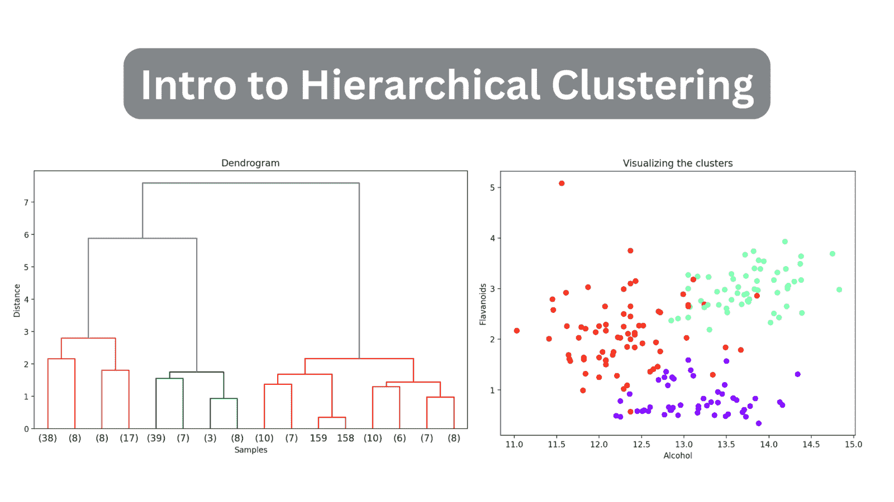

作者提供的图像

当你熟悉无监督学习范式时，你将学习到聚类算法。

* * *

## 我们的前三大课程推荐

 1\. [谷歌网络安全证书](https://www.kdnuggets.com/google-cybersecurity) - 快速进入网络安全职业生涯。

 2\. [谷歌数据分析专业证书](https://www.kdnuggets.com/google-data-analytics) - 提升你的数据分析技能

 3\. [谷歌 IT 支持专业证书](https://www.kdnuggets.com/google-itsupport) - 支持你的组织的 IT 工作

* * *

聚类的目标通常是理解给定未标记数据集中的模式。或者可以是*寻找*数据集中的组并对其进行标记，以便我们可以在现在标记的数据集上执行监督学习。本文将涵盖层次聚类的基础知识。

# 什么是层次聚类？

**层次聚类**算法旨在找到实例之间的相似性——通过距离度量来量化——以将它们分组为称为簇的段。

算法的目标是找到簇，使得簇中的数据点彼此*更相似*，而与其他簇中的数据点的相似度较低。

有两种常见的层次聚类算法，每种算法都有其独特的方法：

+   凝聚聚类

+   分裂聚类

## 凝聚聚类

假设数据集中有 n 个不同的数据点。凝聚聚类的工作方式如下：

1.  从 n 个簇开始；每个数据点本身就是一个簇。

1.  根据数据点之间的*相似性*将数据点组合在一起。这意味着相似的簇会根据距离进行合并。

1.  重复步骤 2 直到只剩下*一个*簇。

## 分裂聚类

如名字所示，分裂聚类尝试执行凝聚聚类的逆过程：

1.  所有 n 个数据点都在一个簇中。

1.  将这个单一的大簇划分为更小的组。请注意，凝聚聚类中数据点的组合是基于相似性的，但将它们划分到不同的簇中是基于不相似性；不同簇中的数据点彼此不相似。

1.  重复直到每个数据点本身都是一个簇。

# 距离度量

如前所述，数据点之间的*相似性*是通过*距离*来量化的。常用的距离度量包括欧几里得距离和曼哈顿距离。

对于 n 维特征空间中的任意两个数据点，它们之间的欧氏距离由下式给出：

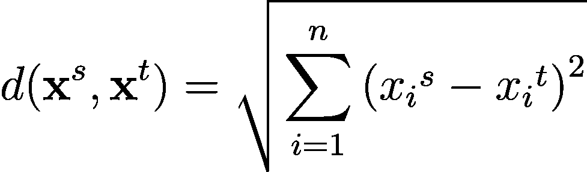

另一种常用的距离度量是曼哈顿距离，计算公式为：

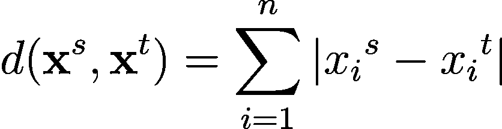

闵可夫斯基距离是对这些距离度量在 n 维空间中的一般化——适用于一般 p >= 1：

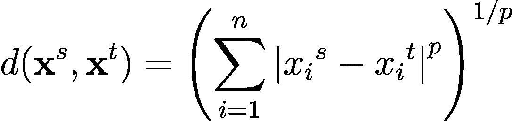

# 聚类间的距离：理解连接标准

使用距离度量，我们可以计算数据集中任意两个数据点之间的距离。但你还需要定义一种距离来确定每一步如何将聚类组合在一起。

记住，在每一步的凝聚型聚类中，我们选择*两个最接近的组*进行合并。这由**连接**标准来捕捉。常用的连接标准包括：

+   单链接

+   完全链接

+   平均连接

+   Ward’s linkage

## 单链接

在**单链接**或单链接聚类中，两组/聚类之间的距离被视为两聚类中所有数据点对之间的*最小*距离。

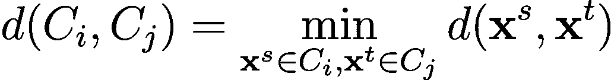

## 完全链接

在**完全链接**或**完全链接聚类**中，两聚类之间的距离被选为两聚类中所有点对之间的*最大*距离。

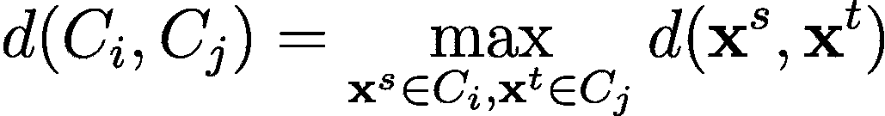

## 平均链接

有时使用**平均链接**，它使用两聚类中所有数据点对之间距离的平均值。

## Ward’s Linkage

Ward’s linkage 旨在*最小化合并后聚类内的方差*：合并聚类应尽量减少合并后的方差总增加。这会导致更紧凑且分隔良好的聚类。

两个聚类之间的距离通过考虑合并聚类的均值的总平方偏差（方差）*增加*来计算。其目的是测量*合并后聚类方差增加了多少*，与合并前的各个聚类的方差相比。

当我们在 Python 中编写层次聚类代码时，我们也会使用 Ward’s linkage。

# 什么是树状图？

我们可以将聚类的结果可视化为一个**树状图**。它是一个**层次树结构**，帮助我们理解数据点——以及随后形成的聚类——是如何随着算法的进行被分组或合并在一起的。

在层次树结构中，**叶子**表示数据集中的*实例*或*数据点*。可以从 y 轴推断出合并或分组发生的相应距离。

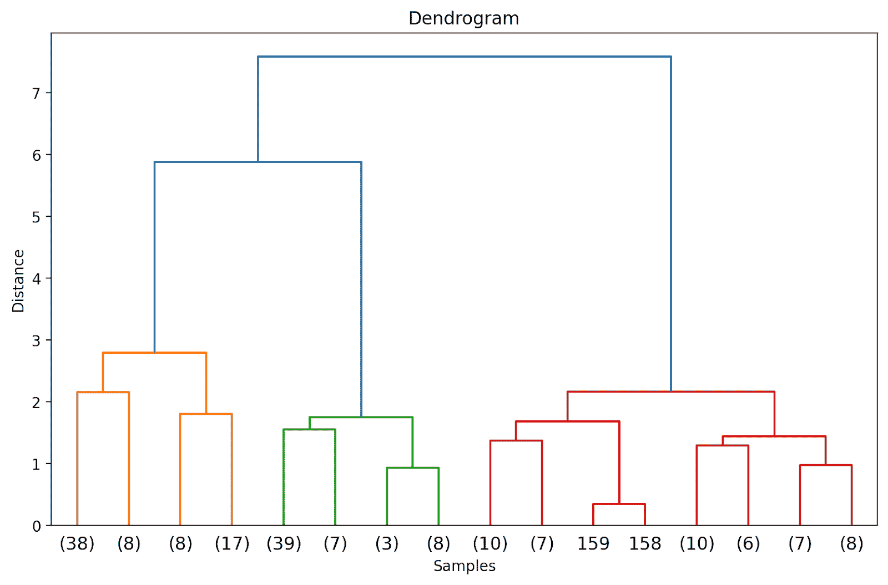

示例树状图 | 作者提供的图片

由于连接类型决定了*如何*将数据点分组在一起，不同的连接准则会产生不同的树状图。

根据距离，我们可以使用树状图—在特定点切割或分割—以获取所需数量的簇。

与一些聚类算法如 K-Means 聚类不同，层次聚类不需要你事先指定簇的数量。然而，进行聚合聚类时，处理大型数据集可能非常耗费计算资源。

# 使用 SciPy 进行 Python 中的层次聚类

接下来，我们将在内置的 [酒数据集](https://scikit-learn.org/stable/modules/generated/sklearn.datasets.load_wine.html) 上逐步进行层次聚类。为此，我们将利用 [聚类包](https://docs.scipy.org/doc/scipy/reference/cluster.html)—**scipy.cluster**—来自 SciPy。

## 第 1 步 – 导入必要的库

首先，让我们导入必要的库和来自 scikit-learn 及 SciPy 库的模块：

```py
# imports
import pandas as pd
import matplotlib.pyplot as plt
from sklearn.datasets import load_wine
from sklearn.preprocessing import MinMaxScaler
from scipy.cluster.hierarchy import dendrogram, linkage
```

## 第 2 步 – 加载和预处理数据集

接下来，我们将*酒数据集*加载到 pandas 数据框中。这是一个简单的数据集，属于 scikit-learn 的`datasets`的一部分，对探索层次聚类很有帮助。

```py
# Load the dataset
data = load_wine()
X = data.data

# Convert to DataFrame
wine_df = pd.DataFrame(X, columns=data.feature_names)
```

让我们查看数据框的前几行：

```py
wine_df.head()
```

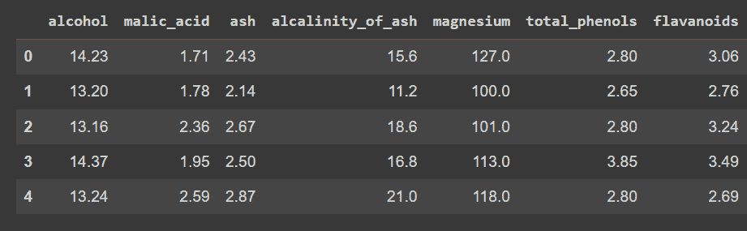

wine_df.head()的截断输出

注意，我们仅加载了特征—而不是输出标签—以便我们可以执行聚类以发现数据集中的组。

让我们检查数据框的形状：

```py
print(wine_df.shape)
```

数据集中有 178 条记录和 14 个特征：

```py
Output >>> (178, 14)
```

由于数据集包含跨不同范围的数值，接下来让我们预处理数据集。我们将使用`MinMaxScaler`将每个特征转换到范围[0, 1]。

```py
# Scale the features using MinMaxScaler
scaler = MinMaxScaler()
X_scaled = scaler.fit_transform(X)
```

## 第 3 步 – 执行层次聚类并绘制树状图

让我们计算链接矩阵，执行聚类，并绘制树状图。我们可以使用来自 [层次](https://docs.scipy.org/doc/scipy/reference/cluster.hierarchy.html#module-scipy.cluster.hierarchy) 模块的`linkage`来计算基于 Ward 链接法的链接矩阵（将`method`设置为'ward'）。

如前所述，Ward 的链接法最小化每个簇内的方差。然后我们绘制树状图以可视化层次聚类过程。

```py
# Calculate linkage matrix
linked = linkage(X_scaled, method='ward')

# Plot dendrogram
plt.figure(figsize=(10, 6),dpi=200)
dendrogram(linked, orientation='top', distance_sort='descending', show_leaf_counts=True)
plt.title('Dendrogram')
plt.xlabel('Samples')
plt.ylabel('Distance')
plt.show()
```

因为我们还没有（尚未）截断树状图，我们可以可视化 178 个数据点如何被分组到一个簇中。虽然这似乎很难解释，但我们仍然可以看到有*三个*不同的簇。

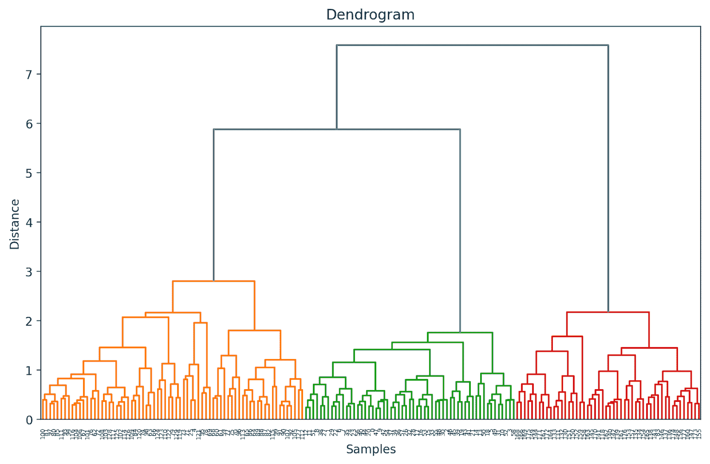

## 截断树状图以便于可视化

实际上，我们可以可视化一个更容易解释和理解的截断版本，而不是整个树状图。

要截断树状图，我们可以将`truncate_mode`设置为'level'并将`p`设置为 3。

```py
# Calculate linkage matrix
linked = linkage(X_scaled, method='ward')

# Plot dendrogram
plt.figure(figsize=(10, 6),dpi=200)
dendrogram(linked, orientation='top', distance_sort='descending', truncate_mode='level', p=3, show_leaf_counts=True)
plt.title('Dendrogram')
plt.xlabel('Samples')
plt.ylabel('Distance')
plt.show()
```

这样会截断树状图，只包含那些*在最终合并的 3 个级别内*的簇。


在上述树状图中，你可以看到一些数据点，如 158 和 159，是单独表示的。其他一些数据点在括号中提到；这些*不是*单独的数据点，而是簇中的*数据点数量*。（k）表示一个包含 k 个样本的簇。

## 第 4 步 – 确定最佳簇数

树状图帮助我们选择最佳的簇数。

我们可以观察到 y 轴上的距离*急剧增加*，选择在那个点截断树状图——并使用该距离作为形成簇的阈值。

对于这个例子，最佳的簇数是 3。

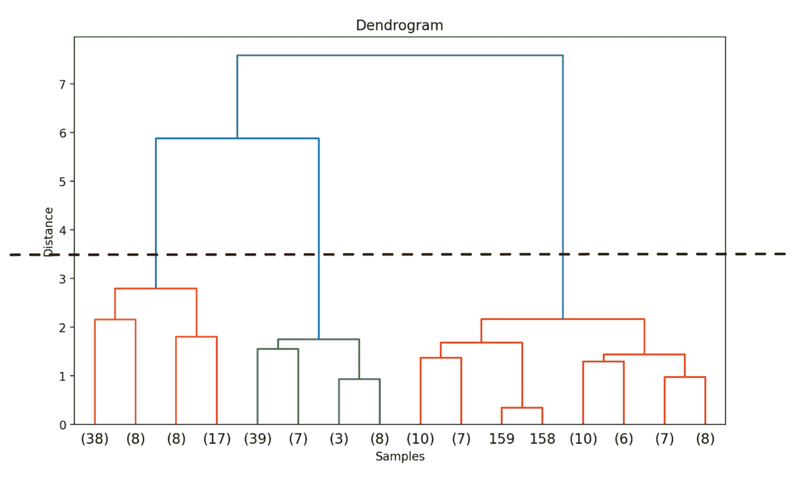

## 第 5 步 – 形成簇

一旦我们决定了最佳的簇数，我们可以使用 y 轴上的相应距离——一个阈值距离。这确保了在阈值距离以上，簇不再合并。我们选择一个`threshold_distance`为 3.5（从树状图中推断得出）。

然后我们使用`fcluster`，将`criterion`设置为'distance'，以获取所有数据点的簇分配。

```py
from scipy.cluster.hierarchy import fcluster

# Choose a threshold distance based on the dendrogram
threshold_distance = 3.5  

# Cut the dendrogram to get cluster labels
cluster_labels = fcluster(linked, threshold_distance, criterion='distance')

# Assign cluster labels to the DataFrame
wine_df['cluster'] = cluster_labels
```

你现在应该能看到所有数据点的簇标签（{1, 2, 3}中的一个）：

```py
print(wine_df['cluster'])
```

```py
Output >>>
0      2
1      2
2      2
3      2
4      3
      ..
173    1
174    1
175    1
176    1
177    1
Name: cluster, Length: 178, dtype: int32
```

## 第 6 步 – 可视化簇

现在每个数据点都已分配到一个簇，你可以可视化特征的子集及其簇分配。以下是两个这样的特征的散点图及其簇映射：

```py
plt.figure(figsize=(8, 6))

scatter = plt.scatter(wine_df['alcohol'], wine_df['flavanoids'], c=wine_df['cluster'], cmap='rainbow')
plt.xlabel('Alcohol')
plt.ylabel('Flavonoids')
plt.title('Visualizing the clusters')

# Add legend
legend_labels = [f'Cluster {i + 1}' for i in range(n_clusters)]
plt.legend(handles=scatter.legend_elements()[0], labels=legend_labels)

plt.show()
```

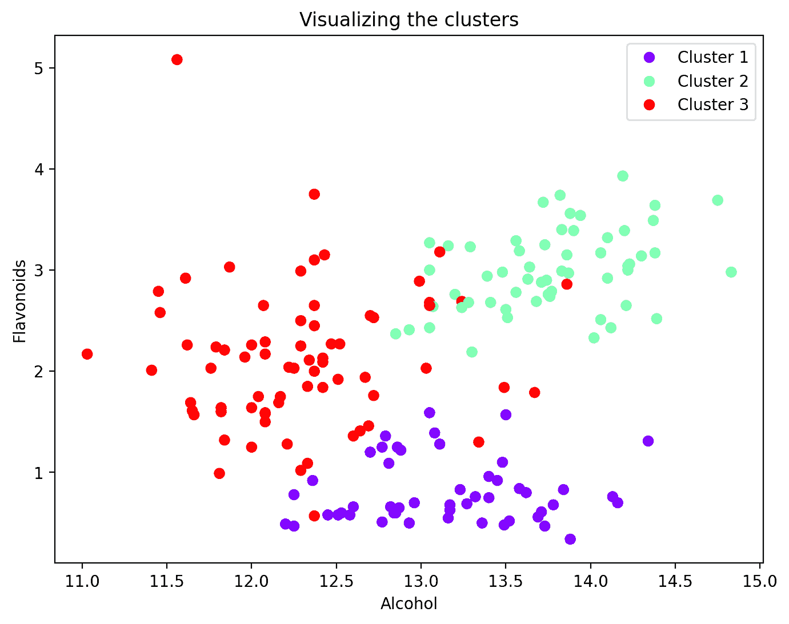

# 总结

就这样！在本教程中，我们使用 SciPy 执行层次聚类，以便更详细地涵盖涉及的步骤。或者，你也可以使用来自 scikit-learn 的[AgglomerativeClustering](https://scikit-learn.org/stable/modules/generated/sklearn.cluster.AgglomerativeClustering.html)类。祝编程愉快！

# 参考资料

[1] [机器学习导论](https://mitpress.mit.edu/9780262043793/introduction-to-machine-learning/)

[2] [统计学习导论 (ISLR)](https://www.statlearning.com/)

**[Bala Priya C](https://www.linkedin.com/in/bala-priya/)** 是来自印度的开发者和技术作家。她喜欢在数学、编程、数据科学和内容创作的交汇处工作。她的兴趣和专长领域包括 DevOps、数据科学和自然语言处理。她喜欢阅读、写作、编程和咖啡！目前，她正致力于学习和与开发者社区分享她的知识，通过编写教程、操作指南、观点文章等来实现。

### 了解更多相关主题

+   [聚类解密：理解 K-Means 聚类](https://www.kdnuggets.com/2023/07/clustering-unleashed-understanding-kmeans-clustering.html)

+   [如何在 Pandas 中使用 MultiIndex 进行层次数据组织](https://www.kdnuggets.com/how-to-use-multiindex-for-hierarchical-data-organization-in-pandas)

+   [使用 PyCaret 进行 Python 聚类导论](https://www.kdnuggets.com/2021/12/introduction-clustering-python-pycaret.html)

+   [揭示 Midjourney 5.2：AI 图像生成的飞跃](https://www.kdnuggets.com/2023/06/unveiling-midjourney-52-leap-forward.html)

+   [揭示 CTGAN 的潜力：利用生成 AI 生成合成数据](https://www.kdnuggets.com/2023/04/unveiling-potential-ctgan-harnessing-generative-ai-synthetic-data.html)

+   [揭示无监督学习](https://www.kdnuggets.com/unveiling-unsupervised-learning)
