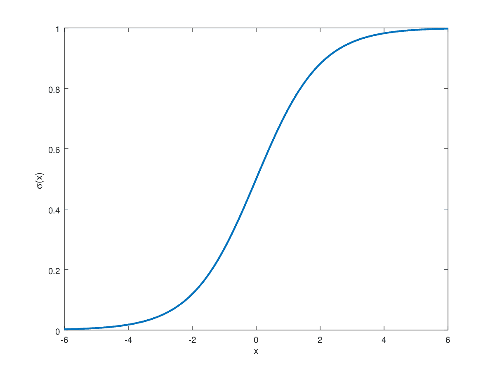
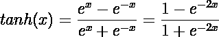
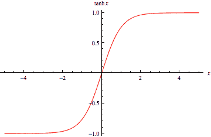
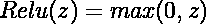
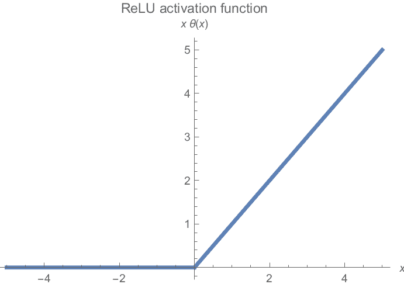

# 揭开神经魔法：深入激活函数

> 原文：[`www.kdnuggets.com/unveiling-neural-magic-a-dive-into-activation-functions`](https://www.kdnuggets.com/unveiling-neural-magic-a-dive-into-activation-functions)

作者提供的图片

# 为什么使用激活函数

深度学习和神经网络由互连的节点组成，其中数据顺序地通过每个隐藏层传递。然而，线性函数的组合不可避免地仍然是线性函数。当我们需要在数据中学习复杂和非线性的模式时，激活函数变得重要。

使用激活函数的两个主要好处是：

## 引入非线性

线性关系在现实世界中很少见。大多数现实世界场景是复杂的，并遵循各种不同的趋势。使用线性算法如线性和逻辑回归无法学习这样的模式。激活函数为模型添加了非线性，使其能够学习数据中的复杂模式和变异。这使得深度学习模型能够执行复杂的任务，包括图像和语言领域。

## 允许深层神经网络

如上所述，*当我们顺序应用多个线性函数时，输出仍然是输入的线性组合。* 在每一层之间引入非线性函数可以让它们学习输入数据的不同特征。如果没有激活函数，深度连接的神经网络架构将与使用基本的线性或逻辑回归算法没有区别。

激活函数使深度学习架构能够学习复杂的模式，使其比简单的机器学习算法更强大。

让我们来看看一些在深度学习中常用的激活函数。

# Sigmoid

在二分类任务中常用的 Sigmoid 函数将实数值映射到 0 和 1 之间。

上述方程如下所示：

图片由[Hvidberrrg](https://hvidberrrg.github.io/deep_learning/activation_functions/sigmoid_function_and_derivative.html)提供

**Sigmoid 函数主要用于二分类任务的输出层，其中目标标签是 0 或 1。** 这使得 Sigmoid 函数在这种任务中更受青睐，因为其输出限制在这个范围内。对于接近无穷大的高值，sigmoid 函数将其映射到接近 1。相反，它将接近负无穷大的值映射到 0。在这些值之间的所有实数值都映射到 0 到 1 的范围内，呈 S 形趋势。

## 缺点

### 饱和点

Sigmoid 函数在反向传播过程中对梯度下降算法会带来问题。除了接近 S 形曲线中心的值，梯度非常接近零，这会导致训练问题。在渐近线附近，它可能会导致梯度消失问题，因为小梯度可能显著减慢收敛速度。

### 非零中心

*经实验证明，具有零中心的非线性函数可以确保均值激活值接近 0*。具有这种归一化值可以确保梯度下降更快地收敛到最小值。虽然不是必要的，但具有零中心的激活可以加速训练。当输入为 0 时，Sigmoid 函数的中心在 0.5。这是使用 Sigmoid 在隐藏层中的一个缺点。

# Tanh

双曲正切函数是对 Sigmoid 函数的改进。与[0,1]范围不同，TanH 函数将实数值映射到-1 和 1 之间。

TanH 函数如下所示：

图片由[Wolfram](https://mathworld.wolfram.com/HyperbolicTangent.html)提供

TanH 函数遵循与 Sigmoid 相同的 S 形曲线，但现在是零中心的。这允许在训练过程中更快的收敛，因为它改进了 Sigmoid 函数的一个缺点。**这使得它在神经网络架构中的隐藏层中更为适用。**

## 缺点

### 饱和点

TanH 函数遵循与 Sigmoid 相同的 S 形曲线，但现在是零中心的。这允许在训练过程中更快的收敛，改进了 Sigmoid 函数的表现。这使得它在神经网络架构中的隐藏层中更为适用。

### 计算开销

尽管现代计算中并非主要问题，但指数计算比其他常见的替代方法更为昂贵。

# ReLU

实践中最常用的激活函数，修正线性单元激活（ReLU），是最简单但最有效的非线性函数。

它保留所有非负值并将所有负值钳制为 0。可视化时，ReLU 函数如下所示：

图片由[**Michiel Straat**](https://michielstraat.com/)提供

## 缺点

### 死亡 ReLU

梯度在图的一端趋于平坦。所有负值的梯度为零，因此一半的神经元可能对训练贡献很小。

### 无界激活

在图的右侧，可能的梯度没有限制。如果梯度值过高，这可能导致梯度爆炸问题。通常通过梯度裁剪和权重初始化技术来纠正这个问题。

### 不是零中心

类似于 Sigmoid，ReLU 激活函数也不是零中心的。同样，这会导致收敛问题并可能减慢训练速度。

**尽管存在所有缺陷，但它仍然是神经网络架构中所有隐藏层的默认选择，并且在实践中被经验验证为高效。**

# 关键要点

既然我们了解了三种最常见的激活函数，我们如何知道什么是我们场景中最佳的选择呢？

尽管这在很大程度上依赖于数据分布和具体问题陈述，但在实践中仍有一些基本的起点被广泛使用。

+   Sigmoid 只适用于目标标签为 0 或 1 的二分类问题的输出激活。

+   Tanh 现在主要被 ReLU 和类似函数取代。然而，它仍然在 RNN 的隐藏层中使用。

+   在所有其他场景中，ReLU 是深度学习架构中隐藏层的默认选择。

**[穆罕默德·阿赫姆](https://www.linkedin.com/in/muhammad-arham-a5b1b1237/)** 是一位从事计算机视觉和自然语言处理的深度学习工程师。他曾参与多个生成式 AI 应用的部署和优化，这些应用在 Vyro.AI 达到了全球排行榜的前列。他对构建和优化智能系统的机器学习模型充满兴趣，并相信持续改进。

* * *

## 我们的前三大课程推荐

 1\. [Google 网络安全证书](https://www.kdnuggets.com/google-cybersecurity) - 快速进入网络安全职业生涯。

 2\. [Google 数据分析专业证书](https://www.kdnuggets.com/google-data-analytics) - 提升你的数据分析技能

 3\. [Google IT 支持专业证书](https://www.kdnuggets.com/google-itsupport) - 支持你的组织 IT

* * *

### 更多相关主题

+   [深度学习中的激活函数如何工作](https://www.kdnuggets.com/2022/06/activation-functions-work-deep-learning.html)

+   [深入了解池化层：揭示 CNN 池化层的魔力](https://www.kdnuggets.com/diving-into-the-pool-unraveling-the-magic-of-cnn-pooling-layers)

+   [优化 Python 代码性能：深入了解 Python 性能分析器](https://www.kdnuggets.com/2023/02/optimizing-python-code-performance-deep-dive-python-profilers.html)

+   [深入探讨 GPT 模型：演变与性能比较](https://www.kdnuggets.com/2023/05/deep-dive-gpt-models.html)

+   [深入了解 Kaggle 的 AI 报告 2023 – 了解最新趋势](https://www.kdnuggets.com/dive-into-the-future-with-kaggle-ai-report-2023-see-what-hot)

+   [揭示 CTGAN 的潜力：利用生成式 AI 生成合成数据](https://www.kdnuggets.com/2023/04/unveiling-potential-ctgan-harnessing-generative-ai-synthetic-data.html)
