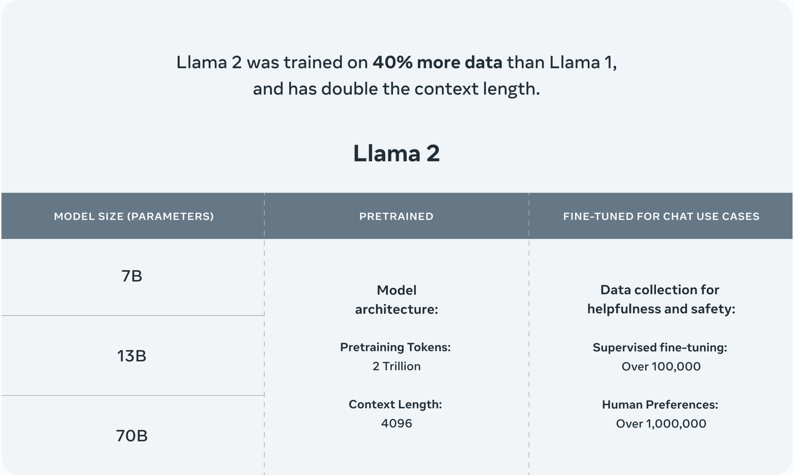
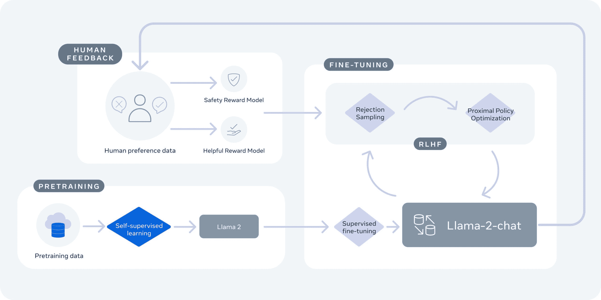

# 揭示 Meta 的 Llama 2 的力量：生成式 AI 的跃进？

> 原文：[`www.kdnuggets.com/2023/07/unveiling-power-metas-llama-2-leap-forward-generative-ai.html`](https://www.kdnuggets.com/2023/07/unveiling-power-metas-llama-2-leap-forward-generative-ai.html)

图像由作者使用 Midjourney 创建

# 介绍

* * *

## 我们的前三个课程推荐

 1\. [谷歌网络安全证书](https://www.kdnuggets.com/google-cybersecurity) - 快速进入网络安全职业道路。

 2\. [谷歌数据分析专业证书](https://www.kdnuggets.com/google-data-analytics) - 提升你的数据分析能力

 3\. [谷歌 IT 支持专业证书](https://www.kdnuggets.com/google-itsupport) - 支持你组织的 IT 需求

* * *

最近在人工智能（AI）领域，尤其是在生成式 AI 方面的突破，引起了公众的广泛关注，并展示了这些技术推动新时代经济和社会机会的潜力。其中一个突破是[Meta 的 Llama 2](https://ai.meta.com/llama/)，它是其开源大型语言模型的下一代产品。

Meta 的 Llama 2 是在混合的公开数据上进行训练的，旨在推动诸如 OpenAI 的 ChatGPT、Bing Chat 及其他现代聊天机器人等应用。Meta 声称，Llama 2 的性能相比于以前的 Llama 模型有了显著提升。该模型以预训练形式可在 AWS、Azure 和 Hugging Face 的 AI 模型托管平台上进行微调，使其更易于访问和运行。你还可以[在这里下载模型](https://ai.meta.com/resources/models-and-libraries/llama-downloads/)。

那么，是什么让 Llama 2 与其前身以及其他大型语言模型有所不同呢？让我们深入探讨其技术细节和影响。

# 技术细节和性能

Llama 2 有两种版本：Llama 2 和 Llama-2-Chat。Llama-2-Chat 经过了针对双向对话的微调。这两个版本都进一步细分为不同复杂度的模型：70 亿参数、130 亿参数和 700 亿参数模型。这些模型在两万亿个令牌上进行训练，比第一个 Llama 模型多 40%，包括超过 100 万个人工注释。

Llama 2 的上下文长度为 4096，并特别在 Llama-Chat-2 的训练中使用了来自人类反馈的强化学习，以确保安全性和有用性。根据 Meta 的说法，Llama 2 在推理、编码、能力和知识测试方面超过了包括 Falcon 和 MPT 在内的其他 LLM。

Llama 2 技术概述

（图片来源：[Meta](https://ai.meta.com/llama/)）

此外，Llama 2 已针对 Windows 以及配备 [高通 Snapdragon 设备内技术](https://www.qualcomm.com/snapdragon) 的智能手机和 PC 进行了优化，这意味着我们可以预计从 2024 年开始出现不依赖于云服务的 AI 驱动应用程序。

> “这些由 Snapdragon 提供支持的新型设备内 AI 体验，可以在没有连接的区域甚至飞机模式下工作。”
> 
> — 高通（来源：[CNET](https://www.cnet.com/tech/meta-teams-up-with-microsoft-qualcomm-on-llama-2-ai-large-language-model/)）

# 开源与安全

Llama 2 的一个关键方面是其开源性质。Meta 认为，通过公开 AI 模型，可以使每个人受益。这一发展使得商业和研究领域可以访问那些自己构建和扩展起来会变得不可承受的工具，从而为研究、实验和开发开辟了众多机会。

Meta 还强调安全性和透明度。Llama 2 已经过“红队测试”，因此通过生成对抗性提示进行安全性测试，以便对模型进行微调，无论是内部还是外部。Meta 公开了模型如何被评估和调整，促进了开发过程中的透明度。

在 Llama-2-Chat 模型训练过程中，使用了来自人类反馈的强化学习，以确保安全性和有用性

（图片来源：[Meta](https://ai.meta.com/resources/models-and-libraries/llama/)）

# 结论

Llama 2 尽力延续 Meta 在生成性 AI 领域的视角。其改进的性能、开源性质以及对安全性和透明度的承诺，使 Llama 2 成为广泛应用的有前途的模型。随着更多开发者和研究人员的参与，我们可以预期会看到创新的 AI 驱动解决方案的激增。

随着我们前进，继续解决 AI 模型中固有的挑战和偏见将至关重要。然而，Meta 对安全性和透明度的承诺为行业树立了积极的先例。随着 Llama 2 的发布，我们现在有了另一个可用的生成性 AI 工具，并且这一工具使开放访问成为持续的承诺。

**[Matthew Mayo](https://www.linkedin.com/in/mattmayo13/)** ([**@mattmayo13**](https://twitter.com/mattmayo13)) 是数据科学家和 KDnuggets 的总编辑，KDnuggets 是开创性的在线数据科学和机器学习资源。他的兴趣包括自然语言处理、算法设计与优化、无监督学习、神经网络以及机器学习的自动化方法。Matthew 拥有计算机科学硕士学位和数据挖掘研究生文凭。他的联系方式是 editor1 at kdnuggets[dot]com。

### 更多相关话题

+   [揭开 Midjourney 5.2 的面纱：AI 图像生成的跃进](https://www.kdnuggets.com/2023/06/unveiling-midjourney-52-leap-forward.html)

+   [Llama, Llama, Llama：使用你的内容进行本地 RAG 的 3 个简单步骤](https://www.kdnuggets.com/3-simple-steps-to-local-rag-with-your-content)

+   [LLaMA 3：Meta 迄今为止最强大的开源模型](https://www.kdnuggets.com/llama-3-metas-most-powerful-open-source-model-yet)

+   [揭示 CTGAN 的潜力：利用生成式 AI 来…](https://www.kdnuggets.com/2023/04/unveiling-potential-ctgan-harnessing-generative-ai-synthetic-data.html)

+   [合成数据平台：释放生成式 AI 的力量以应对…](https://www.kdnuggets.com/2023/07/synthetic-data-platforms-unlocking-power-generative-ai-structured-data.html)

+   [通过验证链解锁可靠的生成：一个…](https://www.kdnuggets.com/unlocking-reliable-generations-through-chain-of-verification)
