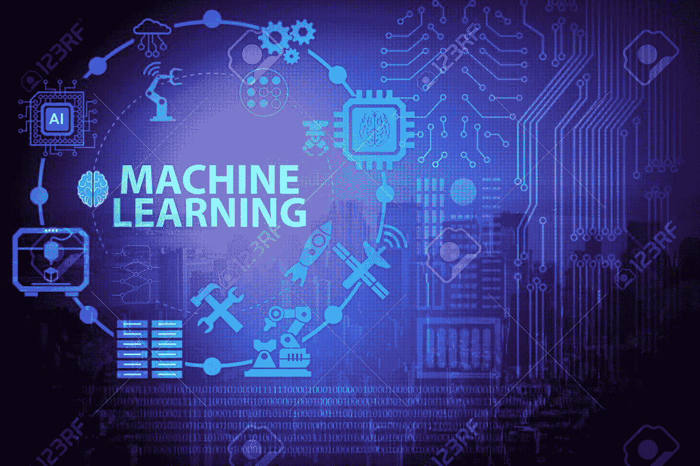
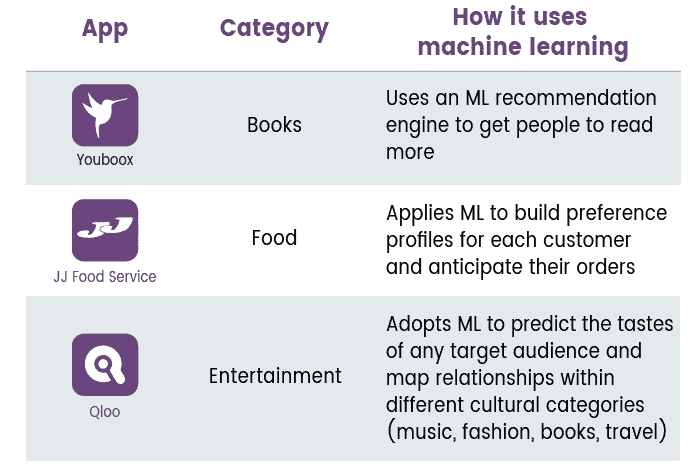
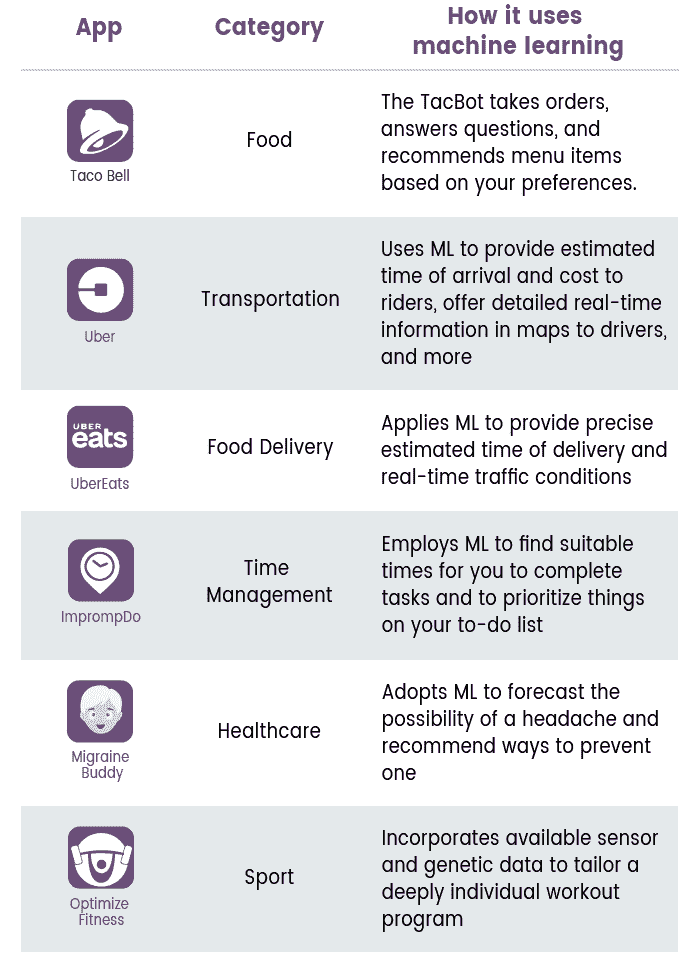

# 使用机器学习升级品牌移动应用

> 原文：[`www.kdnuggets.com/2020/06/upgrading-brand-mobile-app-machine-learning.html`](https://www.kdnuggets.com/2020/06/upgrading-brand-mobile-app-machine-learning.html)

评论

**由 [Joanna Baretto](https://twitter.com/BarettoJoanna) 提供，来自 [Tatvasoft Australia](https://www.tatvasoft.com.au/)**

版权：123rf.com

许多目前处理大量数据的品牌都认可[机器学习](https://en.wikipedia.org/wiki/Machine_learning)的相关性。得益于机器学习技术，商业组织通常能够实时更高效地工作，获得竞争优势。

[移动应用开发的技术进步](https://www.tatvasoft.com.au/blog/mobile-application-development-methodology/)以及数字化增强为品牌创造了吸引和留住客户的新机会。 然而，真正的个性化和定制之间仍然存在巨大差距。没有显著特点或充满烦人的弹出广告的移动应用，品牌无法激发目标受众的兴趣。

在弥补个性化差距方面，机器学习大显身手。认知技术应用开发使企业能够建立理解人类并帮助他们完成任务甚至娱乐他们的机器和算法。在全球范围内，机器学习使移动平台更具用户友好性，保持客户的忠诚度，提升客户体验，并帮助创建一致的全渠道体验。

### **机器学习重塑移动应用**

**1\. 个性化体验：** 机器学习可以实现持续学习过程。算法可以分析各种信息来源，从信用评级到社交媒体活动，并将推荐直接推送到客户设备上。用户可以根据兴趣进行区分，收集用户信息，并通过机器学习决定应用程序的外观。此外，机器学习是一个很好的工具来了解：

+   客户是谁

+   他们能够承担的费用

+   他们想要什么

+   客户用来谈论品牌产品的词汇

+   偏好、爱好及其痛点

根据收集的信息，机器学习帮助对客户进行分类和结构化，寻找对每个客户群体的个性化方法，并调整内容的语调。简而言之，机器学习帮助为用户提供最相关和吸引人的内容，并营造出应用程序确实在与客户交流的印象。

这些是一些示例：

版权：Rubygarage.org

**2\. 用户行为预测：** 机器学习应用帮助营销人员通过分析各种数据理解用户的偏好和行为模式：

+   年龄

+   性别

+   位置

+   搜索请求

+   应用使用频率

+   以及更多

为什么需要这些数据？这些数据至关重要，因为它可以用来保持不同客户群体对应用程序的兴趣，并提升效果和营销努力。机器学习还帮助建立个性化推荐，提升客户的参与度以及在应用程序上花费的时间。

一些机器学习应用的示例

版权：Rubygarage.org

**3\. 高级搜索：** 带有机器学习的解决方案允许优化应用程序中的搜索，提供更多更好的上下文结果。此外，它使客户的搜索更直观、少受阻碍。机器学习算法从客户查询中学习，并优先考虑对某个人真正重要的结果。

认知技术有助于将文章、脚本、DIY 视频、常见问题解答以及文档分类到知识图谱中，以提供即时回答和更智能的自助服务。现代应用程序允许你收集所有关于客户的数据，包括搜索历史和典型行为。这些数据可以与搜索请求和行为数据一起用于排名产品和服务，并展示最佳匹配结果。

**4\. 增强的安全性：** 机器学习除了是一个有效的营销工具外，还能保护和简化应用程序身份验证。客户可以使用生物识别数据，如面部或指纹进行音频、视频和语音识别认证。此外，机器学习有助于确定客户的访问权限。

除了安全快捷的登录，更多的应用程序可用于机器学习。机器学习中的算法能够检测和禁止可疑活动。与只能抵御已知威胁的传统应用程序相比，机器学习系统能够实时保护客户免受未识别的恶意软件攻击。这项技术提供了令人印象深刻的功能，包括：

+   运输成本估算

+   图像识别

+   钱包管理

+   产品标记自动化

+   优化物流

+   商业智能

上述功能以及更多功能使品牌能够更有效地预测金融崩溃、未来趋势和泡沫。

**5\. 相关广告：** 在广告领域，最困难的部分是向观众展示正确的广告。随着品牌继续争夺资金，通过个性化获胜已成定局。机器学习技术帮助更准确地定向展示广告和个性化消息，因为广告变得越来越个性化。

机器学习允许你预测特定客户对促销活动的反应，因此你只需向最有可能对展示的产品或服务感兴趣的客户展示某些广告，从而节省时间和金钱，并提升品牌声誉。

**6. 深度用户参与：** [ML 工具](https://developers.googleblog.com/2018/05/introducing-ml-kit.html) 使品牌能够提供强大的客户支持、一系列受欢迎的功能以及提供激励的娱乐，使客户每天使用该应用程序。有些人对打电话、等待回应以及写冗长的电子邮件感到不安。智能友好的数字助手可能是客户支持的合适选择。

**7. 提供娱乐：** 除了可以在凌晨三点让客户开心并进行对话的健谈 AI 助手，还有更多的机器学习示例用于客户娱乐。应用的摄像头检测到客户的面部，定位面部特征，并添加滤镜。

### **摘要**

机器学习技术可以赋能任何移动应用，提供前沿的搜索机制、高效的个性化引擎、欺诈保护以及安全快速的认证。

**个人简介：[Joanna Baretto](https://twitter.com/BarettoJoanna)** 是 [Tatvasoft Australia](https://www.tatvasoft.com.au/) 的技术分析师，这是一家领先的移动应用开发公司。她在技术领域工作了五年，她在多个学科中的工作广泛涉及技术体验的叙事。你可以在 Twitter 上找到她，[ @BarettoJoanna](https://twitter.com/BarettoJoanna)。

**相关：**

+   学习和实践数据科学的前 9 款移动应用

+   12 小时机器学习挑战：使用 Streamlit 和 DevOps 工具构建和部署应用

+   每位数据科学家必备的前 10 款数据可视化工具

* * *

## 我们的前三大课程推荐

 1. [Google 网络安全证书](https://www.kdnuggets.com/google-cybersecurity) - 快速进入网络安全职业生涯。

 2. [Google 数据分析专业证书](https://www.kdnuggets.com/google-data-analytics) - 提升你的数据分析技能

 3. [Google IT 支持专业证书](https://www.kdnuggets.com/google-itsupport) - 支持你的组织的 IT 工作

* * *

### 更多相关话题

+   [数据科学如何改变移动应用开发？](https://www.kdnuggets.com/2023/03/data-science-transform-mobile-app-development.html)

+   [5 分钟内构建机器学习 Web 应用](https://www.kdnuggets.com/2022/03/build-machine-learning-web-app-5-minutes.html)

+   [KDnuggets 新闻 2022 年 3 月 9 日：5 分钟内构建机器学习 Web 应用…](https://www.kdnuggets.com/2022/n10.html)

+   [在 Heroku 上部署机器学习 Web 应用](https://www.kdnuggets.com/2022/04/deploy-machine-learning-web-app-heroku.html)

+   [人工智能将如何改变移动应用](https://www.kdnuggets.com/2022/12/artificial-intelligence-change-mobile-apps.html)

+   [用 Python 在 7 个简单步骤中构建命令行应用](https://www.kdnuggets.com/build-a-command-line-app-with-python-in-7-easy-steps)
